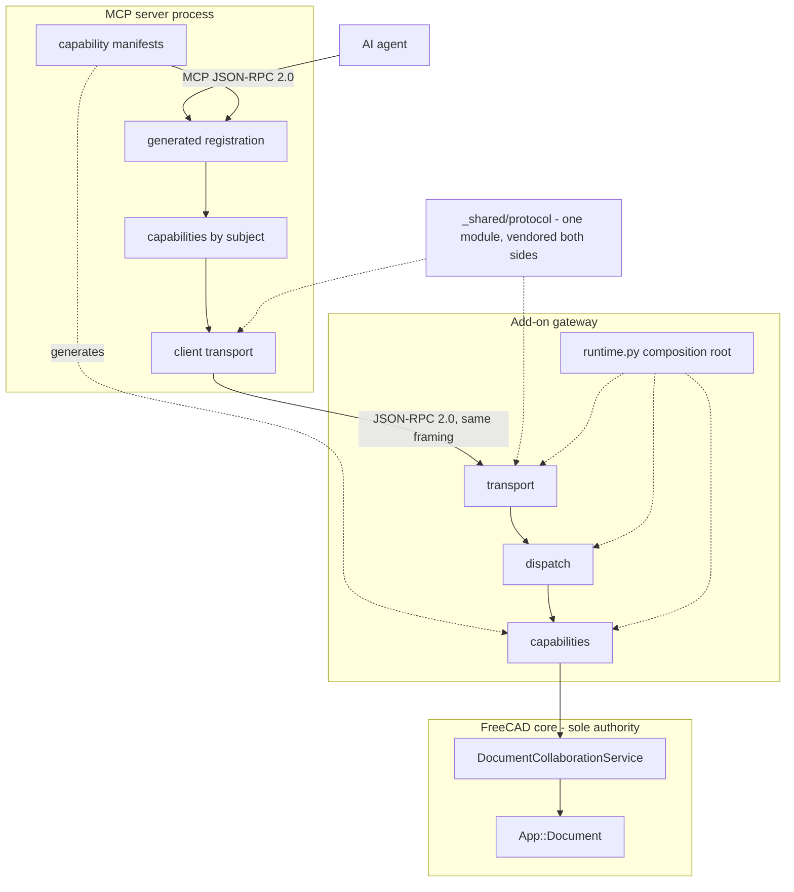
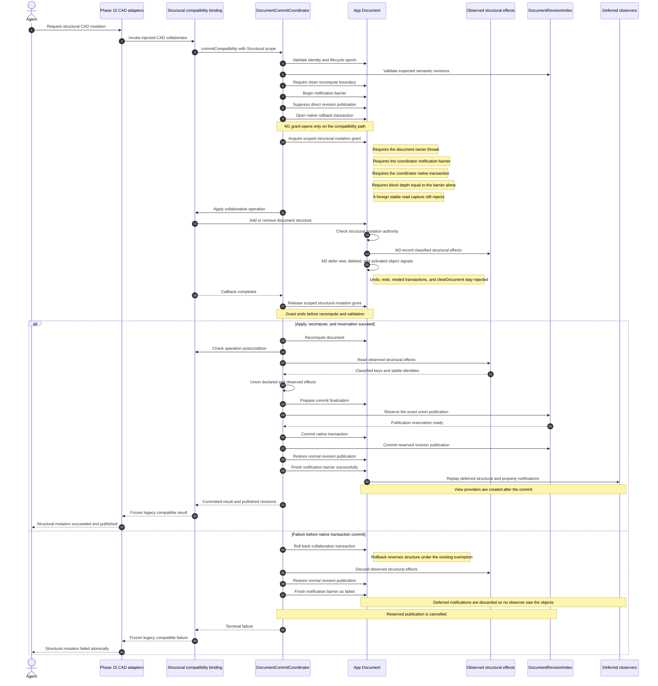

# FreeCAD MCP architecture refactor plan

Plan to reshape `feature/dirty-document-adoption` into a **thin two-process
adapter**: an MCP server free to use any dependency, and an add-on that is a
pure-stdlib gateway inside FreeCAD. One protocol implementation, one wire
encoding, one place to declare a capability.

This plan starts after native Phases 1–6 of the repository-root
[`freecad_document_collaboration_plan.md`](../../../../doc/freecad_document_collaboration_plan.md)
are complete. The collaboration plan's former standalone Phase 7 is absorbed
here: this plan first reorganizes and routes the MCP adapter, then performs the
authoritative collaboration cutover in Phase 18. After that gate, FreeCAD alone
owns collaboration, document lifecycle, persistence, recovery, and conflict
decisions. No phase may extend the temporary Python lease authority while it is
being retired.

The completed [`module-size-refactor-plan.md`](module-size-refactor-plan.md) is
the structural baseline. Its thin façades, explicit exports, compatibility
shims, and contract snapshots are inputs. Its ARCH001/ARCH002 size rules are
**not** — this plan retires them in Stage 0, because they are what produced the
31 modules currently split by line count rather than by subject.

**In scope**

- `addon/FreeCADMCP/` gateway layering, runtime ownership, and startup/shutdown
- `src/freecad_mcp/` client, capability packages, and tool registration
- the wire encoding and the single shared protocol module
- capability manifests and generated registration
- `addon/FreeCADMCP/document_lease/` compatibility and deprecation surfaces
- architecture policy replacing the module-size rules

**Out of scope**

- Redesigning the native collaboration model delivered by Phases 1–6 of the prerequisite plan
- Reintroducing MCP-owned sidecars, heartbeats, credentials, document ownership,
  save/recovery authority, or FCStd-difference conflict policy
- Renaming public **MCP tool** names, parameters, descriptions, or result envelopes
- Collapsing the two processes into one (see §3.2 for why)
- Moving off loopback TCP to a permissioned socket (see §3.4 — separate spike)
- Removing compatibility import shims; that is a later deprecation plan

**Success criteria**

- Public MCP tool names, parameters, descriptions, registration order, and
  returned envelopes remain contract-identical.
- Native FreeCAD remains the only owner of collaboration sessions, lifecycle
  epochs, dirty/persisted state, save, Save As, recovery, and mutation authority.
- The add-on imports nothing outside the Python standard library and FreeCAD.
- Exactly one protocol implementation exists, vendored into both processes and
  gated by a byte-equality check.
- The wire is JSON-RPC 2.0 end to end; failures travel as errors, not as
  success-shaped envelopes.
- Each capability is declared in exactly one manifest entry; registration is
  generated and asserted byte-equal to the frozen registry snapshot.
- One bootstrap composition root owns the only mutable process runtime singleton.
- No application code performs a `_rpc_mod()` runtime lookup.
- Architecture policy measures capability ownership, dependency direction, public
  surface, and complexity — never physical line count.

---

## 1. Goals and non-goals

### Goals

- Make the add-on a gateway, not a second application.
- Remove the encoding mismatch between the MCP hop and the RPC hop.
- Delete the protocol twins rather than synchronizing them.
- Declare each capability once and generate the rest.
- Construct runtime services explicitly and dispose them deterministically.
- Preserve every public MCP contract and existing import shim throughout.
- Keep every phase commit coherent, testable, revertible, and working.

### Non-goals

- Designing a second collaboration or lease state machine in Python.
- Moving native lifecycle, persistence, recovery, or rollback policy back to MCP.
- Building a ports-and-adapters layer where there is no policy left to protect.
- Introducing a dependency-injection framework.
- Removing old import paths because in-tree callers have migrated.
- Splitting or merging files to satisfy a line-count target.

---

## 2. Hard constraints

| Constraint | Implication |
|------------|-------------|
| Native foundation first | No phase starts until native collaboration Phases 1–6 are complete and verified against the actual tree. The former Phase 7 is executed through this plan. |
| Native authority target | Only FreeCAD may authorize document mutation or decide lifecycle, save, recovery, persistence, and conflict outcomes after Phase 18. Until then, existing lease machinery is frozen compatibility debt: it may keep the branch working but may not be expanded or become a dependency of new code. |
| Add-on dependency purity | The add-on imports only the Python standard library and FreeCAD. A compiled or third-party dependency in the add-on is blocking. |
| Compatibility lease records | New decoder/shim surfaces may decode historic data but may not rotate authority, fence a live document, or advance native lifecycle state. Existing live records remain only as named Phase 18 allowances until their callers are routed. |
| Public MCP surface | Tool names, parameters, descriptions, registration order, returned envelopes, and exported tool objects remain frozen by the registry snapshot. |
| Semantic RPC contract | The RPC contract is frozen as method name → parameters → result schema, **independent of encoding**, so it validates both listeners during migration. |
| Import compatibility | Every moved symbol keeps an explicit re-export at its old path. Shim removal is outside this plan. |
| GUI-thread safety | FreeCAD and Qt work remains behind the GUI dispatcher; capability code never bypasses it. |
| Typed authorization target | New and migrated internal code receives immutable authorization evidence, never a new unrestricted `local_confirmation=True` boolean; existing boolean paths are named allowances until their owning routing phase removes them. |
| Layer direction | `transport` → `dispatch` → `capabilities` → FreeCAD. No layer imports upward; `runtime` constructs the graph and is imported by none of them. |
| Runtime ownership target | By Phase 17, mutable process-wide services and registries exist only inside `AddonRuntime`, with at most one bootstrap-owned reference. |
| Generated registration | Generated output is asserted byte-equal to the frozen registry snapshot. A hand edit to generated code is blocking. |
| Manifest ownership | One manifest file per capability subject. A single global manifest is blocking — it destroys exclusive worker ownership. |
| Atomic phase commits | Every phase commit includes its focused regressions, leaves the branch working, and can be reverted independently. No stage squash, merge, or validation-only commits. |
| Docker-only evidence | Host-side test runs do not count. All evidence is produced in Docker. |

Related design inputs:

- [`freecad_document_collaboration_plan.md`](../../../../doc/freecad_document_collaboration_plan.md)
- [`module-size-refactor-plan.md`](module-size-refactor-plan.md)
- [`document-leases.md`](document-leases.md), [`lease-recovery.md`](lease-recovery.md), [`lease-security.md`](lease-security.md)
- [`request-lifecycle.md`](request-lifecycle.md), [`runtime-identity.md`](runtime-identity.md), [`structured-results.md`](structured-results.md)

When an older lease document conflicts with the native collaboration model or the
Phase 18 cutover contract, the collaboration plan wins. Preserve the old public
result or return its frozen deprecation result; do not extend or restore the old
authority implementation.

---

## 3. Target architecture

### 3.1 Collaboration authority target

The completed native foundation changes what several MCP lease concepts mean.
This plan preserves their public compatibility while routing every ingress to the
native boundary, then removes their old authority in Phase 18.

| Legacy concept | Post-cutover owner | MCP responsibility |
|---|---|---|
| Lease owner, token, generation, heartbeat | Removed; native edit sessions and epochs replace it | Decode old payloads, redact secrets, return the frozen compatibility result |
| Dirty adoption and `LOCKED_ERROR` handoff | Native collaboration session APIs | Gather typed GUI evidence, translate request and result |
| Local and foreign orphan recovery | Native lifecycle and recovery APIs | Invoke or query native recovery, or return the documented deprecation result |
| Save, Save As, finalize, release | Native FreeCAD lifecycle | Route one typed request, translate the response |
| Sidecar state and FCStd baseline comparison | Removed from MCP correctness | Read old formats only where migration or deprecation requires it |
| Close/reopen, persisted marker, lifecycle epoch | Native FreeCAD | Expose read-only status |

Phase 18 must prove that an MCP restart, replacement, or authentication-session loss
does not transfer, revoke, or corrupt document authority. Compatibility shims cannot
make a native operation legal and cannot mutate native session state.

### 3.2 Two processes, three layers

The process split stays. Three properties pay for it:

1. **Crash isolation.** A failed adapter leaves the CAD session and its unsaved
   document intact.
2. **Dependency freedom.** The MCP process uses any Python and any dependency;
   the add-on stays stdlib-only, so nothing compiled must be installed into four
   different FreeCAD bundle formats.
3. **The isolation model.** Headless `FreeCADCmd` workers and multi-instance
   scenarios require the MCP process to be separable from any one FreeCAD.

Inside the add-on, three layers and one composition root:

```text
addon/FreeCADMCP/
  transport/        listener, authentication, replay          (no FreeCAD import)
  dispatch/         GUI-thread marshalling, cancellation,
                    inflight and continuation registries      (no FreeCAD import)
  capabilities/     one package per subject; thin typed calls (FreeCAD here only)
  runtime.py        the single composition root
  _shared/protocol/ vendored; identical to the client copy
```

`transport` and `dispatch` are FreeCAD-free and therefore genuinely unit-testable
without FreeCAD. That is where a port abstraction earns its keep. It is **not**
introduced anywhere else: after the cutover the policy lives in C++, so a handler
per lifecycle verb would wrap exactly one typed native call and add nothing.



### 3.3 One protocol, one encoding

MCP **is** JSON-RPC 2.0. Today the client speaks JSON-RPC to the agent, re-encodes
to XML-RPC, and decodes back — an impedance mismatch between two halves of one
product. It has three concrete costs:

- **Errors.** XML-RPC gives `Fault(int, string)`. Anything richer must travel
  inside a *successful* response carrying a failure envelope. The collaboration
  design requires conflict results to return changed semantic keys with expected
  and current revisions (`freecad_document_collaboration_plan.md` §7); that maps
  onto `error.data` and nowhere good in XML-RPC.
- **Cancellation.** Advisory cancellation is fire-and-forget by nature. XML-RPC
  forces a full request/response cycle; JSON-RPC notifications do not.
- **Values.** XML-RPC has no `null` without a non-standard extension, and its
  standard integer is 32-bit signed — so the monotonic 64-bit revision counters
  must be smuggled as strings or doubles.

The two protocol implementations (`lease_protocol*` in the add-on, `rpc_auth*` in
the client) exist only because the boundary exists. Canonicalization, HMAC,
nonce, and bounds checking are pure stdlib. They become **one** module vendored
into both sides with a byte-equality check in CI. The existing conformance
vectors survive as ordinary tests of that module, not as a permanent
cross-process synchronization apparatus.

### 3.4 Encoding and channel are separate decisions

JSON-RPC 2.0 is the **encoding** and is platform-neutral; it proceeds in Stage 1.

Moving off loopback TCP to a permissioned channel — Unix domain socket or named
pipe — is the larger security win, because much of the signing layer exists to
defend a port reachable by any local process. It is **not** in this plan. CPython's
`AF_UNIX` support on Windows is patchy and the fallback is a named pipe or a token
file; that needs its own spike on the primary development platform. Stage 2 keeps
the listener swappable so the channel can change later without touching dispatch.

### 3.5 Capability manifests and generation

Every CAD capability currently lives in four hand-maintained places: the MCP tool
module, the client operation, the code template, and the add-on RPC method. That
is the cost worth removing, and the codebase already generates code — the
`templates/*.py.txt` files are generated FreeCAD scripts.

A capability is declared once, in a manifest owned by its subject:

```text
src/freecad_mcp/capabilities/<subject>/manifest.py
    name, description, parameter schema, result schema,
    execution mode (typed gateway call | generated script),
    GUI-thread requirement, mutation classification
```

The generator emits the MCP tool registration, the client call stub, and the
gateway dispatch entry. The manifest is **bootstrapped from** the existing frozen
registry snapshot, and generated output is then asserted byte-equal to it — a
mechanically stronger guarantee than review-verified relocation.

Generation must prove itself against the awkward subjects before the tree
commits: sketch constraints, FEM, and assembly joints. A subject that resists the
schema uses an escape hatch — the manifest entry points at a hand-written
implementation — but if all three need one, Stage 5 does not collapse as planned
and the phase list is revised under §5.5.

### 3.6 Moved-symbol compatibility

Every symbol moved by this plan remains importable from its old defining module.
Origin modules keep explicit re-exports and declare an explicit `__all__`; they do
not rebuild exports from `globals()`.

- Shims are import-only or documented deprecation adapters.
- Shims own no mutable state, registration, runtime lookup, authority, or policy.
- Internal modules import the defining module, never the old shim or a barrel.
- Module-to-package conversions retain the original path via `__init__.py`.
- A removed re-export is blocking and is restored in the same phase.
- Shim removal belongs to a later deprecation plan.

### 3.7 Architecture policy

ARCH001 (300 lines) and ARCH002 (one class per file) are retired in **Stage 0**,
not at the end. They are what produced `tools_sketch_curves_a2.py` and
`bind_part_2.py`; keeping them through the migration would distort every
intermediate state and force files to be moved twice. Their replacement lands in
the same phase:

- capability ownership — one subject per production module;
- layer direction — `transport` → `dispatch` → `capabilities`, never upward;
- no `_rpc_mod()` or equivalent runtime locator in any layer;
- no internal imports through package barrels;
- explicit, declarative, side-effect-free compatibility shims;
- public-symbol budget per package;
- per-function complexity, retaining Ruff `C901`; and
- a generous mixed-responsibility backstop so giant grab-bags still fail.

Cohesive modules holding several closely related value types are accepted. Giant
façades, mixed-capability grab-bags, and boundary-crossing imports fail.

### 3.8 Native structural compatibility boundary

Phase 15 needs one native capability that Phases 1–6 deliberately did not build:
a legacy callback that **adds or removes document structure** and is still atomic,
rollback-safe, and revision-published. The Phase 12 binding cannot do this, and the
rejection is correct rather than accidental — `Document::ensureCollaborationStructuralMutationAllowed()`
protects four separate invariants, only one of which is an admission flag:

| # | Invariant | Why a bare flag flip breaks it |
|---|---|---|
| N1 | **Notification atomicity** — an observer sees the old or the new committed state, never an intermediate one | `signalNewObject`, `signalDeletedObject`, `signalActivatedObject`, and `signalTransaction{Append,Remove}` are emitted immediately in `_addObject()`/`_removeObject()` and are not in `CollaborationDeferredNotificationKind`. Structure created inside the barrier would reach `Gui::Document`, `Application`, and every `DocumentObserver` before commit, and a rollback would show observers a create/delete pair for an object that never existed. |
| N2 | **Publication exactness** — every committed mutation publishes its exact semantic keys | Inside the barrier `collaborationRevisionPublicationSuppressed()` is true, so the `publishObjectBoundary()` calls in `_addObject()`/`_removeObject()` are silently dropped. The prepared effect set is also frozen *before* `apply()`, while the new object's name and stable identity are allocated *during* it, so `effectsExactlyCoverWrites()` can never be satisfied by a declared-ahead structural edit. A granted structural mutation would commit unrevisioned — the one outcome the reservation design exists to prevent. |
| N3 | **Stable-read isolation** | `collaborationLifecycleMutationBlockDepth` is raised both by the commit barrier and by `beginCollaborationStableReadCapture()`. Exempting the flag wholesale would also let structure change under a GUI or prepared-edit reader holding a stable capture. |
| N4 | **Rollback provability** | Object addition is reversible only through `Transaction::addObjectDel()` recorded under an active transaction, and `removeObject()` silently defers to `d->pendingRemove` for a `PendingRecompute` object — an escape from the coordinator's transaction. |

The resolution therefore extends the native compatibility path with **four mechanisms
delivered together**, not with a relaxed guard.

**M1 — scoped structural mutation grant.** A private RAII `Document` scope, friended
to `DocumentCommitCoordinator` and issued only by `commitCompatibility()`. It admits
structure only while every precondition holds: the document owner thread, the
coordinator's own notification barrier, the coordinator's own open native transaction,
a lifecycle block depth equal to the barrier's single contribution (so a foreign stable
read still rejects, per N3), no active atomic-presentation audit, no poisoned commit,
and no reentry. `ensureCollaborationStructuralMutationAllowed()` then admits exactly
two cases — the existing `d->rollback` exemption and an active grant. Undo, redo,
nested transaction control, and `clearDocument()` remain rejected unchanged, and
`removeObject()` fails closed instead of deferring a `PendingRecompute` object (N4).
Ordinary prepared operations never receive the grant, so `structuralAndSchemaMutationRejectBeforeVisibility`
keeps passing verbatim.

**M2 — deferred structural notifications.** Add `NewObject`, `DeletedObject`,
`ActivatedObject`, `TransactionAppendObject`, and `TransactionRemoveObject` to
`CollaborationDeferredNotificationKind` and route the `_addObject()`/`_removeObject()`
emissions through `emitCollaboration*` helpers (N1). Replay is pointer-safe: under an
active transaction a removed pre-existing object is retained for post-commit replay.
An object added and removed in that same transaction is instead deleted immediately
when `Transaction::addObjectNew()` cancels its initial transaction record; its queued
object/property/extension records are eliminated by pointer-identity comparison without
dereferencing the destroyed object. On failure the list is discarded, so no observer
ever learns that a rolled-back object existed.

**M3 — observed structural effect ledger.** While the grant is active, the structural
funnels append their already-classified `DocumentRevisionPublicationRequest`s to a
per-commit ledger instead of dropping them under publication suppression. After the
grant closes, the coordinator publishes `declared ∪ observed` (deduplicated and sorted)
through the existing reservation, so one atomic post-commit event carries
`documentStructure`, `objectStructure(<name>)`, and `objectExistence(<name>)` with
stable identities alongside the `unknownModelMutation` wildcard (N2). Expected
revisions stay as captured; newly allocated keys were zero, so no false conflict is
possible. This is also what makes Phase 18 provable — a remote structural mutation
becomes observable in the native revision stream rather than as an opaque wildcard.

**M4 — explicit opt-in scope.** Add `CollaborationCompatibilityScope::Structural` and
expose it as a keyword-only `Document.commitCompatibilityMutation(callback, structural=True)`
defaulting to today's behavior. A caller that does not declare structural intent keeps
the current strict rejection, so an `execute_code` payload cannot silently acquire
structural authority.

**Delivered refinements.** The implementation closes the structural seams discovered
by focused native and integrated review without widening M1. Newly created and imported
objects may complete their dynamic-property schema, status, metadata, extension, rename,
and removal setup while existing objects remain protected. App and Gui bulk import use
an owned reader/archive/replay object, so import notifications and ViewProvider creation
are committed or discarded as one boundary. Deferred property records retain their
owning container, coalesce add/rename/remove to the stable committed state, and use
object/container pointers only as non-dereferenced identity tokens when pruning a
destroyed transient object; observer replay therefore never follows a dangling object
or property pointer. Rollback restores exact membership order, stable
identities, active object, imported state, and property schema before the barrier opens.

The grant still closes before authoritative recompute. The coordinator then recomputes,
checks the postcondition, and consumes the observed ledger only after those steps succeed,
so schema synthesized during recompute is part of the same exact publication. Spreadsheet
uses a Sheet-only, `Prop_NoPersist` transient-schema scope during that authoritative
recompute and rollback stabilization; no general recompute-time schema exemption exists.



**Accepted consequences.** M2 moves ViewProvider creation after the commit, so
`obj.ViewObject` is unavailable for an object created in the same callback. That is
correct — presentation is a separate domain under the prerequisite plan's §8 — and
Phase 15 adapts by moving create/edit `ShapeColor` and `ViewObject`, Pad/Pocket sketch
visibility, and FEM ViewProxy attachment to exact-once post-commit presentation replay.
Every callback, recompute, health, and publication failure performs no presentation
write. `enforceDocumentMutation()` remains a second, independent gate; the grant does
not bypass it, and it is removed on schedule in Phase 18.

**Rejected alternatives.** Relaxing the guard flag alone was rejected: it leaves N1 and
N2 broken, so observers see uncommitted objects and remote clients can never detect
that objects appeared. Running the structural callback before the barrier was rejected
for the same N1 reason. Staging into a scratch document and grafting was rejected as
lossy for links, dependencies, and stable identities. Typed structural
`CollaborativeOperation` adapters per CAD verb remain the long-term destination, but
they are not a Phase 15 unblocker — that is roughly forty adapters, and M1–M4 is the
compatibility bridge that keeps that destination reachable without widening MCP
authority.

---

## 4. Execution prerequisite and baseline

The authoring-time tree contains the completed native collaboration foundation and
the still-live pre-cutover lease machinery. Execution begins from that mixed
baseline, so **phase 1 refreshes this inventory before any implementation**. The
legacy authority paths remain frozen and explicitly allowed only until Phase 18.

### 4.1 What phase 1 must establish

1. **Recorded revisions.** Parent revision containing completed native Phase 6 and
   the MCP submodule revision selected as the refactor base.
2. **The planned compatibility manifest.** Every legacy lease path classified as
   temporary implementation, retained compatibility/deprecation shim, or planned
   removal. Phase 1 derives and commits this initial manifest as
   `tests/fixtures/post_collaboration_compatibility_surface.json`; Phase 18 updates
   it to the verified post-cutover state. The following are expected to survive as
   import, decoder, or deprecation shims — but the committed manifest, not this list,
   is authoritative:
   `src/freecad_mcp/lease_manager.py`, `document_lease/model.py`,
   `document_lease/types/transitions.py`, `document_lease/sidecar.py`,
   `document_lease/service.py`, `document_lease/service_ops/facade_bindings.py`,
   and the frozen public lease RPC adapters.
3. **Removal inventory.** Record every reachable `core_authority`,
   `claim_locked_error_handoff` owner rotation, lease observer, heartbeat, sidecar
   correctness path, and MCP save/recovery authority path. Each receives an explicit
   Phase 18 removal owner and a negative end-state assertion. New code may not call
   these paths.
4. **The locator census.** Per-module counts of `_rpc_mod()` and equivalent runtime
   lookups — 514 AST locator nodes at execution (10 definitions plus 504 syntactic
   references, of which 432 are runtime calls). Text-only comments/docstrings are
   excluded. Stage 3 is sized from this census and the final gate measures against it.
5. **The compose-lane decision.** `tools/mcp/freecad-mcp/Dockerfile` installs
   FreeCAD from conda-forge, so the `core`, `e2e`, and `benchmark` services run
   against a build with **no native collaboration bindings**. Phase 1 records one of:
   (a) the compose image is rebased onto the Docker branch build, or (b) those
   services are scoped as adapter-only evidence and every phase touching a
   collaboration path additionally runs the branch-built cross-track lane. Deciding
   this at phase 1 rather than discovering it mid-stage is mandatory.
6. **The semantic contract snapshot.** `freecad_rpc_contract_snapshot.json` is
   rewritten as method → parameters → result schema, independent of encoding, so it
   validates both listeners during Stage 1.

If the actual native foundation or pre-cutover MCP tree contradicts the derived
manifest in a way that removes a phase's subject entirely, phase 1 **re-scopes the
phase list** under §5.5 and records the change. Stopping the program is reserved
for a contradiction that cannot be resolved by re-scoping.

### 4.2 Current seams

| Current area | Current pattern | Required end state |
|---|---|---|
| `rpc_server/rpc_server.py`, `rpc_server_ops/facade_bindings.py` | Transport façade, runtime globals, private helpers, and dynamically attached operations in one module | `transport/` plus a bootstrap-owned runtime |
| `rpc_server/methods/*_ops/` | Application paths locate `rpc_server` through `_rpc_mod()` and pass authorization booleans | `capabilities/` with constructor-injected collaborators and typed evidence |
| `rpc_server/server_lifecycle.py`, `server_shutdown.py`, `InitGui.py` | Startup and shutdown coordinate scattered module state | Construct and dispose one `AddonRuntime` |
| addon `lease_protocol*`, client `rpc_auth*` | Two compatible implementations | One vendored `_shared/protocol/`, byte-equality gated |
| `document_lease/service.py`, `service_ops/facade_bindings.py` | Methods attached after class definition | Thin façade delegating to capabilities |
| `lease_manager_ops/lease_client_manager*.py` | Class body assembled from binding modules | Normal class; old modules import-only shims |
| `tools_*_a.py`, `_b.py`, `_1.py`, `_2.py` (31 modules) | Ownership follows split suffixes | Subject packages generated from manifests; old paths declarative shims |
| `server_ops/tool_registration.py`, `tools_register_order.py`, `tool_exports/bind_part_*.py` | Registration mutates imported modules; order is a hand-written list | Typed `ToolDependencies`; generated ordered registration |
| `ci/lint_python.py` | ARCH001/ARCH002 enforce size and one-class rules | Capability, dependency, shim, surface, and complexity rules |

---

## 5. Multitask operating model

This plan is executed by one integrator plus bounded workers under exclusive file
ownership, in either of two agent lanes: the **Codex lane** (the prerequisite
plan's policy) or the **Cursor Multitask lane** (the policy that delivered
[`module-size-refactor-plan.md`](module-size-refactor-plan.md) §5.1–§5.2). The lane
decides only which models fill the three roles. Roles, ownership, freeze
discipline, review gates, reports, Docker evidence, and delivery rules in
§5.2–§5.7 are identical in both, so a phase delivered by either lane is
indistinguishable at the gate.

A session picks one lane, records it in §11.3 before its first spawn, and does not
mix lanes inside a phase.

### 5.1 Roles

Both lanes run the same three roles: one integrator on the critical path, bounded
implementation workers with exclusive write ownership, and a read-only adversarial
reviewer. Earlier revisions of this document declared the Composer/Cursor policy
superseded outright; it is reinstated here as a peer lane with an explicit
equivalence table, so the two plans in this program still share one operating
model instead of diverging.

#### Codex lane (default)

Adopts the prerequisite's subagent policy
(`freecad_document_collaboration_plan.md` §5.1–§5.2), including its §5.2.1 spawn
test and its §5.2.2 model/reasoning table.

| Role | Model and reasoning | Responsibilities |
|---|---|---|
| **Worker** | **GPT-5.6 Terra / high** by default; **GPT-5.6 Sol / high or xhigh** for the risk classes below | Implements one frozen workstream under exclusive file ownership. Does not edit shared files. Adds focused tests. |
| **Integrator** (parent) | Session parent model; raise effort for shared-seam integration | Partitions work, freezes interfaces, owns shared files, waits for every worker in a wave, combines outputs, runs every Docker suite, updates §11, creates the single phase commit. |
| **Reviewer** (read-only) | **GPT-5.6 Sol / xhigh**; **max** only for an unresolved correctness blocker | Reviews adversarially after every workstream and after integration. Reports blocking, important, and non-blocking findings. Never edits. |

Risk classes requiring Sol: the wire migration and error-model change, the shared
protocol module, runtime construction and disposal, cancellation and GUI-thread
seams, the generator's contract-equality proof, and every review gate.

#### Cursor Multitask lane

| Role | Model | Responsibilities |
|---|---|---|
| **Worker** (implementation subagent) | **Composer 2.5** only — **never** Composer 2.5 Fast | Implements one frozen workstream under exclusive file ownership. Does not edit shared files. Adds focused tests. Reports per §5.6. |
| **Integrator** (parent / dedicated agent) | Session orchestrator | Identical to the Codex integrator: partitions work, freezes interfaces, owns §5.3 shared files, waits for every worker in a wave, combines outputs, runs every Docker suite, updates §11, creates the single phase commit. |
| **Reviewer** (read-only subagent) | **Cursor Grok 4.5 High** | Reviews adversarially after every workstream and again after integrator merge or fix. Inspects the actual diff and tests. Reports blocking, important, and non-blocking findings. Never edits. |

Maximize parallel workers only when file ownership is disjoint; default to one
worker when fewer than two safe independent workstreams exist and state why
(§5.2 rule 13).

#### Lane equivalence

| Codex | Cursor Multitask | Notes |
|---|---|---|
| Terra / medium | Composer 2.5 | Cursor has no lower implementation tier in this plan; read-only inventory work normally stays with the integrator anyway. |
| Terra / high | Composer 2.5 | Default bounded implementation with a frozen contract. |
| Sol / high or xhigh (implementation) | Composer 2.5 on a narrowed slice, with the frozen interface supplied in the prompt and a written approach note the integrator accepts before implementation begins | Cursor has no separate correctness tier. Buy the safety margin with scope, freeze, and review — never by widening a Composer 2.5 assignment to cover a Sol-class seam whole. |
| Sol / xhigh (review) | Grok 4.5 High | Every review gate, in both lanes, is read-only and adversarial. |
| Sol / max, Sol / ultra | Not available | An escalation-class blocker leaves the Cursor lane; see §5.2.1 rule 5. |

### 5.2 Hard rules

Rules 1–18 apply in both lanes.

1. Apply the prerequisite plan's §5.2.1 spawn test before every spawn; record task,
   done condition, lane, model, reasoning level, exclusive paths, and dependencies.
2. Do not delegate a whole phase to one worker when at least two safe workstreams
   exist; do not split a tightly coupled workstream to manufacture parallelism.
3. Assign exclusive file ownership before starting a wave.
4. Workers never edit §5.3 shared files.
5. Workers do not recursively delegate without explicit integrator authorization.
6. Workers report changed files, tests, assumptions, and blockers (§5.6).
7. One integrator owns shared files, integration, Docker execution, §11 updates,
   and the single phase commit.
8. The integrator waits for all workers in a wave before combining.
9. After every workstream, run a read-only adversarial review of the actual diff and
   tests at the active lane's reviewer level (§5.1): **Sol / xhigh** in the Codex
   lane, **Grok 4.5 High** in the Cursor lane.
10. Fix every blocking and important finding, then re-review.
11. Run the required Docker suites before the phase commit (§5.7).
12. Do not mark a phase complete unless all reviews and suites pass.
13. If fewer than two independent workstreams remain, use one worker or work
    locally and record why.
14. One commit per phase, inside `tools/mcp/freecad-mcp`.
15. Every moved symbol keeps its old import path (§3.6); a removed re-export is blocking.
16. Verify the assigned lane and models before each wave; never silently downgrade,
    and never substitute a "fast" variant for the assigned implementation model.
17. Keep one runtime slot free for the integrator.
18. Do not mix lanes within a phase. A lane change takes effect at a phase boundary
    and is recorded in §11.3 with its reason. The single exception is the §5.2.1
    rule 5 escalation of one named unresolved blocker, which is also recorded there.

#### 5.2.1 Cursor Multitask lane addenda

These apply only while the Cursor lane is active. They add to rules 1–18; they
never relax them.

1. Every implementation subagent is **Composer 2.5**. **Composer 2.5 Fast is never
   used for a subagent in this plan, at any risk level** — including small,
   mechanical, or "obvious" workstreams.
2. Every review gate is a read-only **Grok 4.5 High** subagent: after each
   workstream, and again after each integrator merge or fix. It must be extremely
   critical, inspect the actual diff and tests, and classify findings as blocking,
   important, or non-blocking. The reviewer template in
   [`module-size-refactor-plan.md`](module-size-refactor-plan.md) §5.6 is usable
   verbatim.
3. Fix all blocking and important findings, then review again; a `request changes`
   verdict blocks integration and the phase commit.
4. For the Sol-class risks listed in §5.1, the integrator additionally narrows the
   workstream to one frozen seam, supplies the frozen interface in the prompt, and
   accepts a written approach note before implementation starts. A Sol-class seam is
   never handed to a worker whole on the assumption that a stronger model will
   absorb the ambiguity.
5. If a Grok 4.5 High review still reports a blocking correctness finding after one
   fix-and-re-review cycle, stop. Do not retry the same configuration and do not
   widen the assignment. Either the integrator takes the workstream directly, or it
   is escalated to the Codex lane at **Sol / max** under the prerequisite's
   escalation rules. Record the unresolved blocker, the prior attempt, and the exact
   question in §11.3.

### 5.3 Shared files (integrator-only)

- `doc/freecad_mcp_architecture_refactor_plan.md`
- `ci/lint_python.py`, `tests/test_architecture_policy.py`
- `tests/fixtures/freecad_rpc_contract_snapshot.json`
- `tests/fixtures/mcp_tool_registry_contract_snapshot.json`
- `tests/fixtures/post_collaboration_compatibility_surface.json`
- `addon/FreeCADMCP/_shared/protocol/` and `src/freecad_mcp/_shared/protocol/`
- `addon/FreeCADMCP/runtime.py`, `rpc_server/rpc_server.py`,
  `rpc_server/server_lifecycle.py`, `rpc_server/server_shutdown.py`, `InitGui.py`
- `addon/FreeCADMCP/document_lease/__init__.py`; `document_lease/service.py` during façade reduction
- `src/freecad_mcp/server.py`, `tools_register_order.py`,
  `server_ops/tool_registration.py`, `server_ops/tool_exports/`
- the manifest **schema** and the generator; individual subject manifests are worker-owned
- central `__init__.py` and `__all__` composition files
- `Dockerfile`, `docker-compose.yml`, and the parent-repository gitlink
- for Phase 18, the parent plan, App/Gui authority sources and build registration,
  `src/Gui/Command.cpp`, `src/Gui/Dialogs/DlgMutationTakeover.*`,
  `tests/src/App/DocumentMutationAuthority.cpp`, and
  `tests/src/Gui/CollaborationAuthorityRemoval.cpp`
- for Phase 12, `src/App/Document.pyi`, `src/App/DocumentPyImp.cpp`, the focused
  native compatibility-binding test and its test CMake registration, the parent
  plan, and the parent gitlink

### 5.4 Cross-repository delivery

Except for Phases 12, 15, and 18, substantive phase commits are created inside
`tools/mcp/freecad-mcp`. The parent gitlink is **not** frozen for the whole program:
the branch-built cross-track lane builds the parent branch at its recorded submodule
revision, so a frozen gitlink would test the pre-refactor add-on at every gate. The
integrator bumps the parent gitlink in a separate parent commit at each integration
gate (phases 1, 3, 5, 12, 18, 19, 22, and 23), or records that the lane mounts the
submodule worktree at its actual HEAD. Either is acceptable; leaving the gitlink
stale through the program is not.

Phase 12 is one logical cross-repository integration delivery with two Git objects:
one nested MCP phase commit and one canonical parent commit containing the minimal
native Python compatibility-mutation binding and tests, the updated gitlink, and both
plan/progress updates. The binding exposes only a synchronous UnknownModel mutation
over FreeCAD's existing `DocumentCollaborationService::commitCompatibilityMutation`;
it accepts no caller-supplied stable identity, owner, token, generation, confirmation
boolean, or TLS/capability grant. It must enter through the GUI dispatcher, manage the
GIL without deadlock, propagate Python exceptions into native rollback, and return the
native structured result. The revision-neutral `serializeCompatibilityCallback` is not
exposed as a generic remote mutation surface.

Phase 15 is the second cross-repository integration delivery, for the same reason and
with the same shape: one parent commit carrying the §3.8 native structural
compatibility boundary (M1–M4), its focused native tests, the updated gitlink, and both
plan/progress updates; plus one nested MCP commit injecting the CAD collaborators. The
parent commit is the canonical delivery. The native change is authorized as a
prerequisite of an existing phase, not as a new phase — §5.5 forbids re-scoping the
phase list after Phase 1, and this decision changes no phase's number, subject, or
outcome. The parent half is integrator-owned because it edits shared native funnels
(`Document.cpp`, `DocumentCommitCoordinator.cpp`, `DocumentP.h`, `DocumentPyImp.cpp`).
Phase 15's Docker gate is upgraded accordingly: it now also requires branch-built
`App_tests_run` and `Gui_tests_run`, because the parent half changes native
notification and publication behavior that no MCP suite can observe.

Phase 18 is one logical cross-repository cutover with two unavoidable Git objects:
one squashed nested MCP commit and one parent commit containing the native authority
removal, the updated gitlink, both plan/progress updates, and the final cross-track
evidence. The parent commit is the canonical Phase 18 delivery. Worker commits are
never delivery units.

### 5.5 Re-scoping authority

Phase 1 alone may revise the phase list, and only from verified facts about the
native Phase 6 parent and pre-cutover MCP tree — a phase whose subject no longer
exists is deleted, and phases whose subjects merged become one. Every change is
recorded in §11.3 with its justification. After phase 1, the list is fixed; a later
discovery that invalidates a phase blocks under §7 rather than silently re-planning.

### 5.6 Worker report template

```text
## Workstream <id> report
- Phase commit: <number and exact subject>
- Changed paths: <exclusive files>
- Behavior preserved: <contracts and shims>
- Tests added or updated: <paths and cases>
- Docker validation: <commands and results>
- Assumptions or blockers: <none or explicit list>
```

### 5.7 Docker gates

**Every phase**

- affected unit tests, relevant contract fixtures, Ruff on touched files, and
  architecture lint when a boundary or package layout changes; plus
- the `unit` Compose service; plus
- the branch-built cross-track lane for any phase touching a collaboration path,
  per the phase-1 compose-lane decision (§4.1 item 5).

**Integration gates — phases 1, 3, 5, 12, 18, 19, 22, and 23**

- all four Compose services: `unit`, `e2e`, `core`, `benchmark`;
- architecture lint and full Ruff;
- registry, semantic RPC, import/deprecation, and protocol contract fixtures; and
- the branch-built FreeCAD and MCP cross-track lane.

The per-phase gate deliberately does not run all four services. The registry and
semantic contract snapshots are what protect the public surface, and they are cheap;
running `benchmark` after every file move buys nothing. The integrator records the
Docker image/digest, commands, counts, and results in §11. Host-side runs are ignored.

---

## 6. Ordered implementation

```text
Stage 0  Baseline, policy, and one protocol      phases 1–3
Stage 1  Wire migration to JSON-RPC 2.0          phases 4–5
Stage 2  Compatibility surfaces                  phases 6–7
Stage 3  Gateway layers                          phases 8–11
Stage 4  Locator removal and bootstrap           phases 12–17
Stage 5  Collaboration cutover                   phase 18
Stage 6  Typed registration                      phase 19
Stage 7  Manifests and generation                phases 20–22
Stage 8  Final enforcement                       phase 23
```

Phase numbers are continuous and authoritative. A later stage never starts before
all earlier phases and their marked gates are complete.

### Stage 0 — Baseline, policy, and one protocol

**Outcome:** the completed native foundation and temporary pre-cutover MCP state are
recorded as the execution baseline; the distorting size rules are gone before any
code moves; the protocol exists once.

| # | Phase commit | Change and main paths | Focused tests and validation |
|---:|---|---|---|
| 1 | `test(mcp): freeze the native collaboration baseline` | All six items in §4.1: revisions, planned compatibility manifest, removal inventory, locator census, compose-lane decision, and semantic contract snapshot. Refresh the MCP registry snapshot and record every temporary authority allowance without changing runtime behavior. | Import/deprecation, collaboration-boundary, semantic RPC, MCP registry, restart, legacy-authority census, and native-API availability contracts; **integration gate**. |
| 2 | `build(mcp): replace module size rules with boundary policy` | Retire ARCH001/ARCH002 from `ci/lint_python.py`; add capability ownership, layer direction, locator ban, barrel-import ban, shim purity, public-surface budget, and the mixed-responsibility backstop, each with named structural allowances recorded exactly. Phase 1 separately owns temporary authority allowances. Retain Ruff `C901`. | `tests/test_architecture_policy.py`; accept cohesive multi-class value modules; reject giant façades and grab-bags; architecture-only lint. |
| 3 | `refactor(mcp): extract the shared protocol module` | Create `_shared/protocol/` with canonicalization, signing, nonce, replay, and bounds checking; vendor identically into both processes; add the byte-equality CI check. `lease_protocol*` and `rpc_auth*` become import shims. Framing is still XML-RPC. | Existing protocol and auth suites become tests of the one module; byte-equality gate; both façades unchanged; **integration gate**. |

Phase 2 lands before any code moves, deliberately. Keeping a 300-line rule through
a migration forces files into shapes that must be undone later.

### Stage 1 — Wire migration

**Outcome:** JSON-RPC 2.0 end to end; failures are errors.

| # | Phase commit | Change and main paths | Focused tests and validation |
|---:|---|---|---|
| 4 | `feat(mcp): add the JSON-RPC 2.0 transport` | Add JSON-RPC 2.0 framing to `_shared/protocol/`; bind the new listener **alongside** XML-RPC onto the same dispatch path; define the structured error model mapping conflict, stale, cancellation, and lifecycle results onto `error.code/message/data`. | Both listeners satisfy the semantic contract; error-model mapping; batch; notification; `null` and 64-bit integer round-trips; replay and signing across both framings. |
| 5 | `refactor(mcp): migrate to JSON-RPC and retire XML-RPC` | Switch the client to JSON-RPC; convert success-shaped failure envelopes to native errors; add protocol-version negotiation with a clear mismatch error; remove the XML-RPC listener and leave a documented deprecation response. | Full semantic contract on the surviving listener; envelope-to-error conversion for every documented result; version-mismatch behavior; cancellation as notification; **integration gate**. |

Phase 4 leaves both listeners working, so phase 5 is independently revertible. The
error-model change lands here, before the generator exists, so the manifest's result
schema is designed against a native error model rather than inheriting the workaround.

### Stage 2 — Compatibility surfaces

**Outcome:** import-time class assembly is gone; native-session and historic-decoder
boundaries are explicit. Temporary live legacy behavior remains only behind named
Phase 18 allowances until the native routing phases replace it.

| # | Phase commit | Change and main paths | Focused tests and validation |
|---:|---|---|---|
| 6 | `refactor(mcp): define LeaseClientManager normally` | Move construction and methods into `lease_manager_ops/lease_client_manager.py`; binding and init modules become shims; introduce opaque native-session handles and compatibility results. Existing credential, heartbeat, and revocation behavior may remain only behind named Phase 18 allowances until phases 12–13 replace its live callers. | Construction, opaque handles, aliases, reconnect, redaction, public imports, no import-time binding, and no new legacy-authority dependency. |
| 7 | `refactor(mcp): isolate legacy lease decoders` | Separate immutable historic decoding in `model.py`, transition tables, and `sidecar.py` from the still-live legacy implementation. Decoder APIs cannot transition authority; all remaining mutable callers are enumerated as Phase 18 removals and otherwise left behaviorally unchanged until native routing is live. | Historic round-trip, malformed payloads, redaction, decoder immutability, forbidden decoder transitions, complete mutable-caller census, and unchanged temporary runtime behavior. |

**Parallelization:** two disjoint workers — 6 owns client paths, 7 owns add-on
`document_lease/` paths. They land in order.

### Stage 3 — Gateway layers

**Outcome:** the add-on has three layers and one composition root.

| # | Phase commit | Change and main paths | Focused tests and validation |
|---:|---|---|---|
| 8 | `refactor(mcp): introduce the gateway runtime` | Add `runtime.py` owning listener, dispatcher, workers, auth, replay, inflight and continuation registries, collaboration bridge, and shutdown state. It owns no document authority, dirty state, persistence, recovery policy, or sidecar store. | Pure construction, dependency identity, optional resources, ownership, and double-disposal — all without importing FreeCAD or Qt. |
| 9 | `refactor(mcp): establish the transport layer` | Move listener, authentication, and replay into `transport/`, consuming `_shared/protocol/`; keep the listener swappable so §3.4's channel change stays possible. | Bind, auth, replay, redaction, malformed framing, listener substitution, and no FreeCAD import from `transport/`. |
| 10 | `refactor(mcp): establish the dispatch layer` | Move GUI-thread marshalling, cancellation, and the inflight/continuation registries into `dispatch/`. | GUI-thread enforcement, cancellation, continuation bounds, timeout, concurrency, and no FreeCAD import from `dispatch/`. |
| 11 | `refactor(mcp): add the composition root` | Construct transport, dispatch, capabilities, auth, and the collaboration bridge in dependency order; existing startup calls this factory through a transitional hook before any locator is removed. | Authentication requirements, dependency sharing, transitional live-start wiring, forbidden authority dependencies, and rollback on construction failure. |

Phase 8 defines the container without starting it; phase 11 wires real adapters
through the existing startup path, so Stage 4 replaces locators without creating an
unused parallel graph.

### Stage 4 — Locator removal and bootstrap

**Outcome:** no runtime locator remains; startup and shutdown are deterministic.

Sized from the phase-1 census (514 sites at authoring time). Each phase reduces the
census measurably and records the remaining count.

| # | Phase commit | Change and main paths | Focused tests and validation |
|---:|---|---|---|
| 12 | `refactor(mcp): inject collaboration collaborators` | First expose a synchronous UnknownModel-only Python binding over FreeCAD's existing compatibility commit boundary, with no legacy authority dependency or caller-supplied identity; add the thin `collaboration_client.py` and add-on `collaboration_api.py` bridge over the frozen native API; pass acquisition, adoption, handoff, recovery, and compatibility-mutation collaborators into `methods/lease_methods_ops/`; remove their `_rpc_mod()` lookups. This is a two-object cross-repository delivery under §5.4. | Public compatibility shims, method/stub availability, exact-once callback, GUI-owner thread and off-thread GIL dispatch, UnknownModel wildcard publication, structured native results, Python exception rollback, lifecycle/reentrancy rejection, callback release, reconnect, adoption, recovery, authorization, cancellation, continuation, timeout, dependency identity, and no client/TLS/capability authority tests; **integration gate**. |
| 13 | `refactor(mcp): inject lifecycle collaborators` | Pass save, Save As, finalize, release, query, and deprecation collaborators into lease and lifecycle adapters; route them to native lifecycle results without MCP dirty, persistence, or recovery decisions. | Save, release, query, close/reopen, restart, cancellation, GUI dispatch, semantic RPC contract, and no-MCP-lifecycle-authority tests. |
| 14 | `refactor(mcp): inject execution collaborators` | Replace `_rpc_mod()` in dispatch, execute-code, and worker orchestration with injected dispatcher, execution-safety, worker, cancellation, and native compatibility-mutation dependencies. | Dispatch, execute-code, native mutation attribution, worker, cancellation, and AST no-locator scan. |
| 15 | `refactor(mcp): inject CAD collaborators` | **Parent half:** deliver the §3.8 native structural compatibility boundary — the scoped structural mutation grant (M1), deferred structural notifications (M2), the observed structural effect ledger (M3), and the opt-in `Structural` scope and its keyword-only Python binding (M4). **Nested half:** pass document, object, sketch, feature, transaction, and native collaboration/compatibility-commit collaborators into CAD adapters; declare structural intent at the structural call sites; move new-object presentation writes after the commit; remove their dependence on MCP mutation ownership. Two-object cross-repository delivery under §5.4. | Grant precondition matrix (off-thread, no barrier, no transaction, foreign stable-read capture, reentry, poisoned commit); undo/redo/nested-transaction/`clearDocument` still rejected; ordinary prepared operations still rejected; structural rollback leaves no observer notification and no publication; committed structure publishes the exact declared∪observed key set with stable identities in one event; pointer-safe deferred `DeletedObject` replay; `PendingRecompute` removal fails closed; CAD, object, sketch, feature, transaction, remote revision-stream publication, dependency identity, and AST no-locator scan; branch-built `App_tests_run` and `Gui_tests_run`. |
| 16 | `refactor(mcp): inject GUI and view collaborators` | Pass GUI dispatch, personal-view, presentation, snapshot, and restore collaborators into GUI and view adapters; add `collaboration_context.py` and route focus, screenshot, and refresh through the native personal-context API rather than authoritative global selection or active-view state. | GUI dispatch, camera/view, selection isolation, snapshot/restore, personal-context apply/render/restore, cancellation, and AST no-locator scan. |
| 17 | `refactor(mcp): bootstrap startup and shutdown through the runtime` | `start_rpc_server()` adopts the factory as its only path and publishes the singleton only after success; `stop_rpc_server()` cancels, stops, disposes, unsubscribes, drops adapter authentication/session handles, and clears idempotently without changing native document authority; `InitGui.py` routes manual start, auto-start, and about-to-quit through the root. | Repeated start, failed bind/auth/worker/bridge construction, reverse-order rollback, concurrent stop, inflight cancellation, native-session survival, partial runtime, repeated disposal, `InitGui` callback order, and no duplicate runtime. |

Phases 12–16 may be prepared in parallel where source and test ownership is disjoint;
workers add constructor parameters, the integrator edits central assembly. Phase 17 is
sequential and integrator-owned.

### Stage 5 — Collaboration cutover

**Outcome:** every remote mutation, lifecycle, recovery, and view operation uses the
native FreeCAD boundary; the temporary Python and native authority surfaces are gone.

| # | Phase commit | Change and main paths | Focused tests and validation |
|---:|---|---|---|
| 18 | `refactor(collaboration): cut over native MCP authority` | Remove live MCP lease ownership, heartbeat, sidecar-correctness, observer, FCStd-difference conflict, and save/recovery authority while retaining only the frozen decoder/deprecation shims. Remove the parent-tree `DocumentMutationAuthority`, `MutationCapability`, `MutationOwner`/`MutationOrigin`, `MutationAuthorityTLS`/`MutationInternalScope`, `DocumentPy` ownership methods, `AlterDoc` authority gate, and `DlgMutationTakeover` surface. Update package exports, CMake registration, the compatibility manifest, and both progress plans. | Remote operations enter the native revision stream; restart preserves document/lifecycle/persisted/recovery state; personal contexts are preserved; every old import returns its frozen shim or deprecation result; `CollaborationAuthorityRemoval.cpp` and negative reachability scans pass; branch-built App/Gui/Part tests, all four Compose services, and the branch cross-track lane pass; **integration gate**. |

Phase 18 starts only after phases 12–17 prove that every affected ingress and the
only startup path use injected native collaborators. Removal and façade rewiring are
integrator-owned because they cross the parent/submodule boundary. The compatibility
manifest changes from a planned classification to the verified post-cutover surface
in the same delivery. The cross-repository commit protocol in §5.4 is mandatory.

### Stage 6 — Typed registration

| # | Phase commit | Change and main paths | Focused tests and validation |
|---:|---|---|---|
| 19 | `refactor(mcp): pass a typed tool registration context` | Add `ToolDependencies` for server state, connection, recovery compatibility, collaboration, and selector; stop mutating imported tool modules in `server_ops/tool_registration.py`. | Simultaneous registration, dependency identity, selector isolation, deterministic order, no module mutation, server lifespan, registry snapshot; **integration gate**. |

This is the precondition for generation: a generated registrar must receive its
dependencies rather than reach for module globals.

### Stage 7 — Manifests and generation

**Outcome:** each capability is declared once; registration is generated and proven
equal to the frozen snapshot.

| # | Phase commit | Change and main paths | Focused tests and validation |
|---:|---|---|---|
| 20 | `feat(mcp): add capability manifests and the generator` | Define the manifest schema and the generator; bootstrap manifests for every subject from the frozen registry snapshot; emit registration, client stubs, and gateway dispatch entries into a shadow location. Prove the schema against sketch constraints, FEM, and assembly joints first. | Generated output byte-equal to the registry snapshot; schema coverage for the three awkward subjects; escape-hatch behavior; no hand edit to generated files. |
| 21 | `refactor(mcp): switch registration to generated output` | Replace `tools_register_order.py` and `server_ops/tool_exports/bind_part_*.py` with generated ordered registration; old modules become declarative shims. | Registration order, public server API, duplicate/missing exports, registry snapshot, and all old binder imports. |
| 22 | `refactor(mcp): delete the hand-written capability mirrors` | Remove the 31 mechanically split modules and the duplicated client operations and gateway methods now emitted by the generator; every old path remains an explicit shim. | Full registry snapshot, semantic RPC contract, generated FreeCAD code, per-subject behavior suites, and every old import path; **integration gate**. |

**Parallelization:** phase 20 is integrator-owned. In phases 21–22, disjoint workers
may migrate separate subjects concurrently; the integrator lands them in one commit
per phase and owns the generator, schema, and snapshots.

### Stage 8 — Final enforcement

| # | Phase commit | Change and main paths | Focused tests and validation |
|---:|---|---|---|
| 23 | `build(mcp): enforce the final architecture policy` | Remove every named structural allowance from phase 2; confirm Phase 18 removed every authority allowance; enforce add-on dependency purity, layer direction, zero locators against the phase-1 census, generated-registration equality, shim purity, and manifest-per-subject ownership. | Negative fixtures for each rule; full contract set; final **integration gate**. |

---

## 7. Verification checklist

### Every phase

- [ ] The exact next phase number and subject from §6 are used.
- [ ] The branch works before and after; the diff is independently revertible.
- [ ] Focused regressions land in the same commit as what they protect.
- [ ] Workers touched only exclusive paths; shared files were integrator-owned.
- [ ] Blocking and important review findings are cleared and re-reviewed.
- [ ] Public MCP names, parameters, order, envelopes, and old imports are unchanged
      or match the frozen deprecation contract.
- [ ] Every moved symbol has an explicit old-path shim with no import-time side effect.
- [ ] The add-on imports nothing outside the standard library and FreeCAD.
- [ ] `transport/` and `dispatch/` import no FreeCAD or Qt module.
- [ ] No new or migrated Python path creates document authority, lifecycle
      transitions, dirty state, sidecar correctness, or recovery policy; before
      Phase 18, every remaining legacy path is a named allowance from Phase 1.
- [ ] GUI work enters through the dispatcher; cancellation, replay, redaction, and
      authentication guarantees are intact.
- [ ] Required Docker suites pass per §5.7; Ruff passes on touched files.
- [ ] §11 is updated inside the substantive commit.

### At phase 1

- [ ] Native collaboration Phases 1–6 are complete at the recorded parent revision,
      and the selected MCP base revision is recorded.
- [ ] The planned compatibility manifest and complete Phase 18 removal inventory are committed.
- [ ] The locator census is recorded per module.
- [ ] The compose-lane decision is recorded and its consequences applied to §5.7.
- [ ] The contract snapshot is semantic, not encoding-bound.
- [ ] Any re-scoping under §5.5 is recorded with justification.

### At phase 5

- [ ] One listener remains and satisfies the full semantic contract.
- [ ] Every documented failure result travels as a JSON-RPC error, not as a success.
- [ ] Version mismatch produces a clear, documented error.
- [ ] 64-bit counters and `null` round-trip without smuggling.

### At phase 12

- [ ] The locator census has fallen measurably and the remaining count is recorded.

### At phase 15

- [ ] The structural grant is issued only by the compatibility commit path, and every
      §3.8 precondition rejects with a distinct diagnostic.
- [ ] Undo, redo, nested transaction control, and `clearDocument()` remain rejected
      inside the callback; ordinary prepared operations still receive no grant.
- [ ] A failed structural callback leaves no observer notification, no publication, and
      no surviving object.
- [ ] A committed structural callback publishes the exact declared∪observed key set,
      with stable object identities, in one atomic post-commit event.
- [ ] Branch-built `App_tests_run` and `Gui_tests_run` pass on the parent half.

### At phase 19

- [ ] The locator census has fallen measurably and the remaining count is recorded.
- [ ] Tool registration receives typed dependencies and mutates no imported module.

### At phase 18

- [ ] Every remote mutation, lifecycle, recovery, save, and view ingress uses the native boundary.
- [ ] The final compatibility manifest matches the verified post-cutover tree.
- [ ] No live lease owner, heartbeat, sidecar correctness, observer, MCP save/recovery authority,
      `McpOwned`, `MutationAuthorityTLS`, `MutationInternalScope`, `AlterDoc` gate, or takeover dialog remains reachable.
- [ ] Restart, revision-stream, lifecycle/persistence/recovery, personal-context,
      import/deprecation, all-Compose, branch-built FreeCAD, and cross-track tests pass.

### At phase 22 and 23

- [ ] Generated registration is byte-equal to the frozen registry snapshot.
- [ ] Every capability has exactly one manifest entry and one subject owner.
- [ ] The locator census is zero.
- [ ] No structural allowance from phase 2 or authority allowance from phase 1 remains.
- [ ] Every old import path resolves; every shim is declarative.
- [ ] Architecture lint, Ruff, all four Compose services, contract fixtures, and the
      branch cross-track lane pass.

---

## 8. Commit sizing

| Delivery unit | Guidance |
|---|---|
| Invariant fix | One behavior correction plus focused regressions |
| Layer establishment | One layer, its tests, and its old-path shims |
| Locator slice | One adapter family; record the census delta |
| Wire slice | One listener addition or one retirement, never both |
| Capability migration | One subject per commit, including old-path shims |
| Contract fixture | Same commit as the surface freeze, or immediately before the protected move |
| Architecture gate | Substantive rule or allowance removal |
| Phase merge or squash | Forbidden |
| Validation-only commit | Forbidden |

Split when behavior, ownership, reviewability, or independent rollback provides a
real boundary — never to satisfy a line budget.

---

## 9. Risks and mitigations

| Risk | Mitigation |
|---|---|
| Native foundation or MCP base differs from this plan | Phase 1 derives the manifest from the real tree and may re-scope under §5.5 rather than improvising or stopping. |
| The former collaboration Phase 7 published no compatibility manifest | Phase 1 derives and commits the planned manifest; Phase 18 verifies and updates it to the final state. |
| Compose services cannot exercise the native API | Phase-1 compose-lane decision; collaboration-touching phases run the branch-built lane. |
| Temporary lease authority is expanded before cutover | Phase-1 named allowances, no-new-dependency checks, native routing phases, and Phase-18 negative reachability tests. |
| Wire migration breaks an unknown external caller | Confirm before phase 4 whether anything outside this repo calls the RPC surface; dual-bind keeps both listeners live through phase 4. |
| Error-model change loses a documented result | The semantic contract enumerates every result; phase 5 maps each one explicitly and tests the conversion. |
| Generation cannot express a subject | Phase 20 proves the schema against sketch constraints, FEM, and assembly joints **first**; escape hatches are allowed and counted. |
| The manifest becomes a shared file | One manifest per subject is a hard constraint; a global manifest is blocking. |
| Generated code is hand-edited | Byte-equality assertion plus an architecture rule; a hand edit fails the gate. |
| Vendored protocol copies drift | Byte-equality check in CI, not review discipline. |
| Retiring size rules early lets grab-bags return | Phase 2 lands the replacement policy in the same commit, including the mixed-responsibility backstop. |
| Compatibility imports disappear during moves | Committed shim manifest, explicit re-exports, import tests, blocking review policy. |
| Circular imports after package moves | Leaf modules import defining modules, never barrels; restructure edges rather than adding lazy imports. |
| Runtime resources leak or a second singleton appears | Construction rollback, disposal-order tests, singleton policy, architecture fixtures. |
| Parent gitlink goes stale and the cross-track lane tests old code | §5.4 requires a gitlink bump at every integration gate, or a worktree-mounted lane. |
| Parallel workers edit shared façades | Exclusive paths; integrator-only façades, barrels, registries, fixtures, generator, and composition root. |

---

## 10. Command reference

Run all MCP commands from `tools/mcp/freecad-mcp`.

```powershell
# Architecture rules only
docker run --rm -v "${PWD}:/workspace" -w /workspace `
  ghcr.io/astral-sh/uv:python3.12-bookworm-slim `
  uv run ci/lint_python.py --architecture-only addon/FreeCADMCP src/freecad_mcp

# Full package lint and Ruff
docker run --rm -v "${PWD}:/workspace" -w /workspace `
  ghcr.io/astral-sh/uv:python3.12-bookworm-slim `
  uv run ci/lint_python.py addon/FreeCADMCP src/freecad_mcp

# Per-phase gate
docker compose run --rm unit

# Integration gate
docker compose run --rm unit
docker compose run --rm e2e
docker compose run --rm core
docker compose run --rm benchmark
```

Integration gates also run the Docker branch-build lane recorded from the native foundation:
current-branch FreeCAD App/Gui/Part tests plus the `.woodpecker/ci.yml` equivalents of
`freecad-mcp-load-preflight`, `freecad-mcp-core-tests`, and `freecad-mcp-e2e` against
the branch-built `FreeCADCmd`. Record the frozen image, configure/build commands, and
job commands in §11 before phase 1. Do not substitute a host build.

---

## 11. Progress

### 11.1 Snapshot

| Field | Current value |
|---|---|
| Authoring parent checkout | `feature/assembly-interference-detection`; Phase 1 execution base `863535a2d4b6c33b5bfce8171762320060a34afb` |
| MCP authoring branch | `feature/dirty-document-adoption`; Phase 1 execution base `5357d0c16a64b4981a5f508bc83dd07ddf4f1ca6` |
| Module-size baseline | Complete at `fc3a5236`; its size rules are retired by phase 2 |
| Collaboration prerequisite | Native Phases 1–6 complete; former Phase 7 absorbed into this plan as Phase 18 cutover |
| Execution parent revision | `8026f110df5a75d43a0ac0ff9e980cd8e237fa23` |
| Execution MCP base revision | `412c9e5e` |
| Agent lane | **Cursor Multitask (Composer 2.5 + Grok 4.5 High)** for Phases 18–21; Phases 1–17 ran the Codex lane. |
| Current stage / phase | **Stage 7 / Phase 22 complete** |
| Next phase | 23 — `build(mcp): enforce the final architecture policy` |
| In-flight ownership | none |
| Last review | Phase 22 CLEAR (67809eb6); Phase 21 CLEAR (66259f28) |
| Blocker | none |
| Resume hint | Phase 23 kickoff per §5.2.1 |

### 11.2 Stage status

| Stage | Phases | Integration gate | Status |
|---:|---|---|---|
| 0 | 1–3 | phases 1 and 3 | complete |
| 1 | 4–5 | phase 5 | complete |
| 2 | 6–7 | none | complete |
| 3 | 8–11 | none | complete |
| 4 | 12–17 | phase 12 | complete |
| 5 | 18 | phase 18 | complete |
| 6 | 19 | phase 19 | complete |
| 7 | 20–22 | phase 22 | complete |
| 8 | 23 | phase 23 | pending |

### 11.3 Progress log

Append entries newest-first. Each must be sufficient to resume without prior context.

#### 2026-08-07 — Phase 22 COMPLETE: delete the hand-written capability mirrors (Stage 7 integration gate)

**Agent lane:** Cursor Multitask (Composer 2.5 final integrator; Grok 4.5 High review
67809eb6 CLEAR).

**Status: Stage 7 / Phase 22 complete.** Nested commit
`refactor(mcp): delete the hand-written capability mirrors`; parent gitlink bump in
same delivery.

**Delivered:** 47 `tools_*.py` register-module shims and 21
`freecad_client_ops/connection_methods/*` declarative import shims pointing at
`generated/capabilities/register_modules/` and
`generated/capabilities/connection_methods/`; production emitters in
`capabilities/generator.py` (register modules, connection methods, inline runtime
info, `client_stubs.py`, `gateway_dispatch.json`); vendored add-on generated
capabilities tree; `capabilities/inline/` package; migration scripts
`migrate_register_modules_to_generated.py` and
`migrate_connection_methods_to_generated.py`; `tests/test_capability_mirror_shims.py`
and cutover/manifest/introspection test updates; architecture allowance refresh
(307 records); manifest `# ruff: noqa: E501` headers for bootstrapped tool
descriptions. Registry snapshot remains byte-equal to fixture.

**§5.7 MCP evidence:** see §11.4.

**Next:** Phase 23 — `build(mcp): enforce the final architecture policy`.

#### 2026-08-06 — Phase 22 IN PROGRESS: client/gateway mirror deletion (integrator continuation)

**Agent lane:** Cursor Multitask (Composer 2.5 integrator; Grok 4.5 High review pending).

**Status: in progress.** Prior wave landed 47 `tools_*.py` register-module shims (71 tests).

**Delivered this pass:** extended `capabilities/generator.py` with connection-method
emitters (`write_connection_method_outputs`, import rewriting), production
`client_stubs.py` and `gateway_dispatch.json`, vendored add-on
`addon/FreeCADMCP/generated/capabilities/gateway_dispatch.json`, and loader shims
(`capabilities/gateway_dispatch.py` on MCP and add-on sides); 21
`freecad_client_ops/connection_methods/*` modules converted to declarative import
shims; migration script
`scripts/migrate_connection_methods_to_generated.py`; extended
`tests/test_capability_mirror_shims.py` and related cutover/manifest tests.
Registry snapshot remains byte-equal to fixture. **No Phase 22 commit** — awaiting
Grok review.

**§5.7 MCP evidence (focused, not integration gate):** Docker `unit` —
`tests/test_capability_mirror_shims.py` +
`tests/test_generated_registration_cutover.py` +
`tests/test_capability_manifest_generator.py` +
`tests/test_capability_introspection.py` — focused Phase 22 package including
introspection and `connection_methods` package import coverage.

**Remaining before integration gate:** Grok CLEAR on full Phase 22 package; full
§5.7 four-service suite and cross-track lane.

**Next:** Grok review; then integration gate.

#### 2026-08-06 — Phase 22 IN PROGRESS: delete hand-written capability mirrors (integrator conversion)

**Agent lane:** Cursor Multitask (Composer 2.5 integrator; Grok 4.5 High review pending).

**Status: in progress.** Stage 7 Phase 21 verified complete at nested
`1736e1226f3d2024f0277125007195d7860ae5e3`, parent
`469a6ea5b29495f10dab791bab44961ebc1a0449`, review 66259f28 CLEAR.

**Parallelization:** **integrator-only single stream** — register-module emission,
all 47 `tools_*.py` shims, and `capabilities/inline/` conversion share
`capabilities/generator.py` and `generated/capabilities/*`; client/gateway mirror
deletion remains on the same stream (not spawned).

**Delivered this pass:** production register-module emitters in
`capabilities/generator.py` (`write_register_module_outputs`, import rewriting);
47 generated modules under `generated/capabilities/register_modules/`; inline
`get_runtime_info` under `generated/capabilities/inline/`; all 47 `tools_*.py`
converted to declarative shims; `capabilities/inline/` package with
`tools_runtime_info` shim; `introspection.import_operation_symbol` resolves inline
paths; extended `tests/test_capability_mirror_shims.py` and
`tests/test_generated_registration_cutover.py`. Registry snapshot remains byte-equal
to fixture. **No Phase 22 commit** — awaiting Grok review.

**§5.7 MCP evidence (focused, not integration gate):** Docker `unit` —
`tests/test_capability_mirror_shims.py` +
`tests/test_generated_registration_cutover.py` +
`tests/test_capability_manifest_generator.py` — **71 passed**.

**Remaining before integration gate:** duplicated
`freecad_client_ops/connection_methods/*` and addon gateway dispatch mirrors;
full §5.7 four-service suite and cross-track lane (after Grok CLEAR).

**Next:** Grok review; then client/gateway mirror deletion and integration gate.

#### 2026-08-06 — Phase 22 IN PROGRESS: delete hand-written capability mirrors (kickoff)

**Agent lane:** Cursor Multitask (Composer 2.5 integrator; Grok 4.5 High review pending).

**Status: in progress.** Stage 7 Phase 21 verified complete at nested
`1736e1226f3d2024f0277125007195d7860ae5e3`, parent
`469a6ea5b29495f10dab791bab44961ebc1a0449`, review 66259f28 CLEAR.

**Parallelization:** **integrator-only single stream** — mirror deletion owns §5.3
shared files (`capabilities/generator.py`, `registration_runtime.py`,
`generated/capabilities/*`, all 47 `tools_*.py` register modules,
`freecad_client_ops/connection_methods/*`, addon gateway dispatch). The 31
mechanically split modules (`_*_a.py`, `_b.py`, `_1.py`, `_2.py`) plus duplicated
client/gateway surfaces must land atomically with generator output and registry
snapshot proof; frozen W2 subject map recorded in
`tests/test_capability_mirror_shims.py` for coordinator reference but **not**
spawned (generator/schema races).

**Delivered this pass:** focused import-path scaffold in
`tests/test_capability_mirror_shims.py` (47 register modules, 31 split mirrors,
subject ownership map). **No Phase 22 commit** — awaiting Grok review after
mirror→shim conversion.

**Next:** extend generator with production register-module emitters; convert
`tools_*` bodies to declarative shims; delete duplicated client/gateway mirrors;
run integration gate per §5.7.

#### 2026-08-06 — Phase 21 COMPLETE: switch registration to generated output (landing integrator)

**Agent lane:** Cursor Multitask (Composer 2.5 landing integrator).

**Status: Stage 7 / Phase 21 complete.** Review 66259f28 CLEAR after kickoff delivery
(generated production registration, declarative shims, binder identity tests). Nested
`1736e1226f3d2024f0277125007195d7860ae5e3`; parent
`469a6ea5b29495f10dab791bab44961ebc1a0449`.

**Delivered:** extended `capabilities/generator.py` with production emitters
(`register_order`, `registration`, `tool_export_bind_part_1/2`); production artifacts under
`generated/capabilities/`; `tools_register_order.py` and `bind_part_*.py` converted to declarative
shims; `tool_registration.py` wired to `generated.capabilities.registration.register_tools`;
focused tests in `tests/test_generated_registration_cutover.py`.

**§5.7 MCP evidence:** see §11.4 (not an integration gate).

**Next:** Phase 22 — `refactor(mcp): delete the hand-written capability mirrors`.

#### 2026-08-06 — Phase 21 IN PROGRESS: switch registration to generated output (Cursor Multitask kickoff)

**Agent lane:** Cursor Multitask (Composer 2.5 integrator + Grok 4.5 High review pending).

**Status: in progress.** Stage 7 Phase 20 verified complete at nested `46924a8547ad4076ce7e8050229cfc1898d960f2`,
parent `0481bb61ab66c5776aa069e291979fd04bd372bf`, review 935d14d3 CLEAR.

**Parallelization:** **integrator-only single stream** — registration cutover owns §5.3 shared files
(`tools_register_order.py`, `server_ops/tool_registration.py`, `server_ops/tool_exports/bind_part_*.py`,
`server.py`, generator/schema). Subject-mirror deletion remains Phase 22; frozen W2 map not spawned
(only one safe workstream for registration wiring).

**Delivered this pass:** extended `capabilities/generator.py` with production emitters
(`register_order`, `registration`, `tool_export_bind_part_1/2`); production artifacts under
`generated/capabilities/`; `tools_register_order.py` and `bind_part_*.py` converted to declarative
shims; `tool_registration.py` and `server.py` wired to `generated.capabilities.registration.register_tools`;
focused tests in `tests/test_generated_registration_cutover.py`.

**§5.7 MCP evidence:** Docker `unit` image `freecad-mcp-tests`
`sha256:0a54cb64e208b1448aa2299277988959fd01123fe51db978d8e913f0a86242f4` —
`tests/test_generated_registration_cutover.py` + `tests/test_capability_manifest_generator.py`
**20 passed** (not an integration gate).

**Next:** Grok review; integrator does **not** self-claim CLEAR.

#### 2026-08-06 — Phase 20 COMPLETE: capability manifests and generator (landing integrator)

**Agent lane:** Cursor Multitask (Composer 2.5 landing integrator).

**Status: Stage 7 / Phase 20 complete.** Review 935d14d3 CLEAR after the fix
integrator pass (relative `operation_path` resolution, regenerated shadow artifacts,
inert `shadow_client_stubs`, strengthened importability tests, §11 Phase 21
boundary). Manifest-driven registration cutover is **Phase 21**; this phase
delivered schema, generator, bootstrap, 17 subject manifests, and shadow artifacts
only.

**Delivered:** `capabilities/schema.py`, introspection/bootstrap/load/generator/
registration_runtime; 17 bootstrapped manifests under
`capabilities/<subject>/manifest.py`; shadow artifacts under
`generated/capabilities/` (registration, inert client stubs, gateway dispatch,
registry snapshot byte-equal to contract fixture); scripts
`bootstrap_capability_manifests.py` and `generate_capability_shadow.py`; focused
tests in `tests/test_capability_manifest_generator.py` and
`tests/test_capability_introspection.py`.

**§5.7 MCP evidence:** see §11.4 (not an integration gate).

**Next:** Phase 21 — `refactor(mcp): switch registration to generated output`.

#### 2026-08-06 — Phase 20 IN PROGRESS: capability manifests and generator (Cursor Multitask kickoff)

**Agent lane:** Cursor Multitask (Composer 2.5 integrator + Grok 4.5 High review pending).

**Status: in progress.** Stage 6 verified complete at nested delivery `ee9d1da8`, nested HEAD
`e085975a`, parent HEAD `10afb64397`. Parallelization: **integrator-only single stream**
(schema, generator, bootstrap, and shadow emission share the frozen registry snapshot and
§5.3 shared files; splitting manifests from generator would race on snapshot equality).

**Delivered this pass:** `capabilities/schema.py`, introspection/bootstrap/load/generator/
registration_runtime; 17 bootstrapped subject manifests under
`capabilities/<subject>/manifest.py`; shadow artifacts under
`generated/capabilities/` (registration, client stubs, gateway dispatch, registry snapshot
byte-equal to `mcp_tool_registry_contract_snapshot.json`); scripts
`bootstrap_capability_manifests.py` and `generate_capability_shadow.py`; focused unit
tests in `tests/test_capability_manifest_generator.py` (awkward-subject schema coverage,
escape hatch, no hand-edit markers).

**§5.7 MCP evidence:** Docker `unit` — `tests/test_capability_manifest_generator.py`
10 passed (not an integration gate).

**Remaining Phase 20:** Grok re-review after fix integrator pass (operation_path
resolution, inert shadow stubs, importability tests). Manifest-driven registration
beyond module-delegating shadow path is **Phase 21**; document generator regen
workflow in §11.4 if needed.

#### 2026-08-06 — Phase 20 fix integrator pass (Cursor Multitask)

**Agent lane:** Cursor Multitask (Composer 2.5 fix integrator).

**Status: in progress.** Addresses review ffff448c blocking + important findings;
does not self-claim CLEAR.

**Delivered this pass:** `_resolve_import_path` honors AST `ImportFrom.level`
against `freecad_mcp`; `import_operation_symbol` helper; re-bootstrapped manifests
and regenerated shadow artifacts; inert `shadow_client_stubs` (no fake
`_invoke_mutation_v2`); importability tests for awkward subjects + representative
relative-import modules; escape-hatch test uses real `tests.fixtures` impl;
§11.1/§11.3 boundary wording moves manifest cutover to Phase 21.

**§5.7 MCP evidence:** Docker `unit` image `freecad-mcp-tests` digest
`sha256:570650fce4e8ecc4ca8ede581024696a4266e2921d1fc147a5d106e109e99d89` —
`tests/test_capability_manifest_generator.py` + `tests/test_capability_introspection.py`
16 passed (not an integration gate).

#### 2026-08-06 — Phase 19 cross-track gate closed (integrator; pending Grok re-review)

**Agent lane:** Cursor Multitask (Composer 2.5 integrator).

**Status: Stage 6 / Phase 19 complete.** Integrated review 0881cde7 blocked on the
missing §5.7 cross-track lane; this pass re-ran preflight/core/e2e against the preserved
`freecad-collaboration-workspace` volume with the Phase 19 nested worktree mounted at
`ee9d1da8`. All three jobs passed with strict native collaboration enabled. Coordinator
Grok integrated re-review is the next gate; integrator does **not** self-claim CLEAR.

**§5.7 cross-track evidence:** see §11.4.

#### 2026-08-06 — Phase 19 integrator delivered: typed tool registration context (pending Grok review)

**Agent lane:** Cursor Multitask (Composer 2.5 integrator + Grok 4.5 High review pending).

**Status: integrator delivered, not CLEAR.** W1/W2 landed; integrator wired
`server_ops/tool_registration.py` to build one frozen `ToolDependencies` bundle
(including lazy `CollaborationClient` wiring), removed the
`module.DocumentSelectorInput = …` registration loop, and updated
`server.py` plus registration/runtime tests. Selector modules use scoped
`module_document_selector(globals(), …)` so FastMCP/Pydantic can resolve
`DocumentSelectorInput` without leaving module attributes behind. Registry
snapshot remained byte-identical; compatibility manifest heartbeat line numbers
refreshed for `tools_lease_acquire_b.py` helper extraction only.

**§5.7 MCP evidence:** see §11.4. Cross-track lane **not** re-run on this pass.

#### 2026-08-06 — Phase 19 IN PROGRESS: typed tool registration context (Cursor Multitask kickoff)

**Agent lane:** Cursor Multitask (Composer 2.5 workers + Grok 4.5 High reviews).

**Status: in progress.** Stage 5 / Phase 18 verified complete at parent HEAD
`4f59ffa6dbfc605ae20ca0f039eb48ad50265341`, nested HEAD
`cb063a1be84484ad3404be98ed10b1334ee01c61`, cutover SHAs nested `246d4991` /
parent `8026f110`, parent gitlink `cb063a1b`. Parallelization: **W1** frozen
`ToolDependencies` type + focused unit tests (worker-owned); **W2** frozen to
migrate all `tools_*.py` `register()` callables; integrator owns
`server_ops/tool_registration.py`, `server.py`, `tools_register_order.py`,
`server_ops/tool_exports/`, registration tests, contract fixtures, §11.4 gate
evidence, and the phase commit.

#### 2026-08-05 — Phase 18 COMPLETE: native authority cutover (Cursor Multitask integrator)

**Agent lane:** Cursor Multitask (Composer 2.5 + Grok 4.5 High).

**Status: complete.** Delivered as the §5.4 two-object cutover: one squashed nested commit
`refactor(collaboration): cut over native MCP authority`, then one canonical parent commit
with the native authority removal, App freeze/`setPropertyStatus` publication fixes,
the bumped gitlink, both plan/progress updates, and the final gate evidence in §11.4.

- **Nested half:** removed live MCP lease ownership, heartbeat, sidecar-correctness,
  observer, save/recovery, and credential-escrow authority; retained frozen decoder and
  deprecation shims only. Refreshed `post_collaboration_compatibility_surface.json` to
  `verified_post_cutover` with retained-shim `authority_symbol_census` totals
  (core_authority **76**, heartbeats **99**, lease_observers **30**,
  locked_error_handoff_rotation **13**, mcp_save_recovery_authority **174**,
  sidecar_correctness **714** — symbol counts in frozen deprecation shims, not live
  authority); pruned deleted `core_authority_ops/*`, `guard.py`,
  `cas.py`, and tombstoned bootstrap paths from `temporary_authority_allowances[].current_paths`.
- **Parent half:** removed `DocumentMutationAuthority`, `MutationCapability`, GUI takeover
  dialog, and Python ownership surfaces; preserved atomic-presentation guard and added native
  `saveAsWithPolicy`. App freeze/`PropertyContainer::setPropertyStatus` no longer fan out
  per-property structural publications.
- **§5.7 integration gate:** all four Compose services, architecture lint plus full Ruff,
  branch-built `App_tests_run` / `Gui_tests_run` / `Part_tests_run`, and cross-track
  preflight/core/e2e — exact counts in §11.4.
- **Review:** coordinator integrated re-review remains pending; do not self-claim CLEAR.

#### 2026-08-05 — Phase 18 IN PROGRESS: native authority cutover, uncommitted working state

**Status: not complete, nothing committed.** Both worktrees are dirty and neither of
the two §5.4 Git objects exists yet. This entry records the mid-phase state so the
work is resumable from the doc; it is not a completion record and §11.4 gets no
evidence block until the gate passes.

- **Revisions at time of writing.** Parent `feature/assembly-interference-detection`
  HEAD `2d2eeba5b04fd5543c5eafd7d55efc9a220a2016`; nested HEAD
  `4be4b317de79fa9aa1b84c86d021213aaaa9522d`; the gitlink recorded in the parent tree
  is `a8fa9ab19883195ffe87d0f51795db4956d22804` and is therefore **stale** relative to
  nested HEAD — expected mid-phase, bumped in the parent commit per §5.4.
- **Working-tree size.** Parent: 20 modified, 6 deleted, 2 untracked. Nested: 135
  modified, 37 deleted (31 test suites + 6 source modules), 11 untracked.

**Parent half — native authority removed.** Deleted `DocumentMutationAuthority.{h,cpp}`,
`MutationCapability.{h,cpp}`, and `Gui/Dialogs/DlgMutationTakeover.{h,cpp}`, with their
`src/App/CMakeLists.txt` and `src/Gui/CMakeLists.txt` registration. `MutationKind.h`
reduced to its surviving classification, `MutationDeniedException` dropped from
`src/Base/Exception.h`, ownership methods removed from `Document.pyi` and
`DocumentPyImp.cpp`, and the `AlterDoc` authority gate removed from `Gui/Command.cpp`.
`enforceDocumentMutation()` call sites are gone from `Application.cpp`,
`Transactions.cpp`, `Document.cpp`, `DocumentObject.cpp`, `DocumentObjectPyImp.cpp`,
`DynamicProperty.cpp`, `ExtensionContainerPyImp.cpp`, and `Property.cpp`.

**Three decisions made during the cutover, recorded because they are not obvious:**

1. **The atomic-presentation guard survives.** The cross-document
   atomic-presentation-target check is a *separate* safety invariant from the retired
   owner/capability gate, so it moved into `MutationClassification.{h,cpp}` rather than
   being deleted with the authority. Removing it alongside the gate would have been a
   silent correctness regression, not a cutover.
2. **A native no-clobber Save As was required.** The frozen public contract defaults
   `save_document_as(overwrite=False)`, and honoring that in Python would have restored
   exactly the filesystem authority Phase 18 removes. Resolution: a native
   `Document::saveAsWithPolicy` entry point (`Document.h/.cpp`, `Document.pyi`,
   `DocumentPyImp.cpp`). This is a native addition delivered inside Phase 18's own
   subject — the same shape as Phase 15's parent half — and changes no phase's number,
   subject, or outcome, so §5.5 is not invoked.
3. **UUID-only lifecycle selectors are a retired compatibility form.** The native API
   exposes document sessions but no read-only mapping from the legacy add-on UUID, so
   a UUID-only selector returns the frozen deprecation result instead of reconstructing
   a Python-side identity index.

**Nested half — live MCP authority removed.** The 22 public legacy lease RPC callables
keep their exact names and signatures as declarative deprecation adapters returning the
manifest's frozen `LEGACY_LEASE_AUTHORITY_REMOVED` result. Lease enforcement is out of
authenticated v2 dispatch (new `rpc_server/request_identity.py`; credential escrow and
inflight-credential pinning deleted with `credential_inflight.py` and
`cancellation_resolve.py`). Startup no longer builds watchdogs, observers, sidecar
stores, acquisition claims, or handoff continuations (`InitGui.py`, `rpc_server.py`,
`server_lifecycle.py`, `runtime.py`). Native lifecycle verbs moved to the new
`rpc_server/methods/native_lifecycle_methods.py`, separate from the frozen legacy shims.
Owner-lease pinning is removed from **both** vendored `_shared/protocol` replay copies,
byte-equality preserved. Snapshot lease-baseline, recovery-path, and sidecar-permission
modules are deleted; client heartbeat and stale-recovery hooks are inert.

**Frozen surface — one real regression caught and fixed.** Review found drift in
published MCP tool descriptions and response keys. The exact descriptions were restored
and retired fields retained as inert values, so `mcp_tool_registry_contract_snapshot.json`
is byte-identical again. Tombstone behavior itself reviewed correct.

**Test migration.** 31 pre-cutover suites that construct the deleted authority were
removed (lease manager/service/observer, lock indicator, dirty adoption, stale recovery,
lock enforcement, save threading, selector isolation, and related). Replacements added:
7 `tests/test_phase18_*.py` suites covering client auth sessions, client and service
deprecation shims, lease RPC tombstones, `create_document` cutover, operations import
shims, and registered-tool runtime; plus native
`tests/src/Gui/CollaborationAuthorityRemoval.cpp` and a rewritten
`tests/src/App/DocumentMutationAuthority.cpp` as negative-reachability tests.

**Evidence so far — partial, does not satisfy §5.7.**

- Native: `freecad-collaboration-ci:ubuntu24.04-20260801` built `App_tests_run`; focused
  filter `CollaborationAuthorityRemovalTest.*:DocumentCollaborationBoundaryTest.nativeSaveAsPolicyDoesNotClobberByDefault`
  passed 4/4.
- MCP: image `freecad-mcp-phase18-integrator`. The first whole-tree `unit` run was
  1,702 passed / 112 failed, all 112 in pre-cutover fixtures; those were then migrated
  across three lanes. A focused 7-file Phase 18 set passed 72 tests. **The full `unit`
  re-run after that migration has not been recorded and is the next evidence to produce.**

**Reviews.** Native removal-graph and nested compatibility-boundary read-only audits:
CLEAR. Lease-RPC shim and client-shim workstream reviews: CLEAR after fixes and
re-review. Integrated cutover review: open — it produced the frozen-description drift
and old-import findings above; the operations-import-shim lane is still in flight.

**Remaining before the phase can be marked complete.**

1. Finish the operations-import-shim lane and clear the integrated review.
2. Full `unit` re-run, then the §5.7 **integration gate**: all four Compose services,
   architecture lint and full Ruff, and the registry / semantic RPC / import-deprecation
   / protocol contract fixtures.
3. Branch-built cross-track lane plus `App_tests_run`, `Gui_tests_run`, and
   `Part_tests_run` on the branch build.
4. Update `post_collaboration_compatibility_surface.json` from planned classification to
   the **verified** post-cutover surface (§4.1 item 2).
5. Update §11.1, §11.2, and add the §11.4 evidence block.
6. Deliver as the §5.4 two-object cutover: one squashed nested commit
   `refactor(collaboration): cut over native MCP authority`, then one canonical parent
   commit carrying the native removal, the bumped gitlink, both plan updates, and the
   cross-track evidence.

**Housekeeping.** A malformed Docker invocation created a directory literally named
`python -m pytest -q tests` inside the nested repo. It was verified to contain only
generated `.pytest_cache` files, confirmed to resolve inside the repo root, and removed.
No source or evidence was in it. Parent `tests/lib/` is untracked and unrelated to this
phase; classify it before committing so it is not swept in.

#### 2026-08-05 — Plan revision: Cursor Multitask reinstated as a peer execution lane

- **Scope:** documentation only. No phase was executed, no code, fixture, contract,
  shim, or gate changed, and the phase list, numbering, and subjects are untouched
  (§5.5 re-scoping authority is not invoked).
- **Why:** §5.1 previously declared the Composer/Cursor policy superseded outright,
  which left a Cursor-driven session with no authoritative model policy for this
  plan. The intent of that supersession was to stop the two plans running *divergent*
  policies, not to bind the program to one vendor.
- **Change:** §5.1 and §5.2 of
  [`module-size-refactor-plan.md`](module-size-refactor-plan.md) are ported in as the
  **Cursor Multitask lane**, alongside the unchanged **Codex lane** (still the
  default). §5 gains a lane-selection rule, §5.1 gains both role tables plus a lane
  equivalence table, §5.2 rules 1/9/16 are stated lane-neutrally, new rule 18 forbids
  mixing lanes inside a phase (except the one named escalation below), and new
  §5.2.1 carries the Cursor-specific hard rules:
  Composer 2.5 for every implementation subagent, **never** Composer 2.5 Fast, Grok
  4.5 High for every review gate, and narrowed-and-frozen handling of Sol-class risks.
- **Escalation gap, resolved explicitly:** Cursor has no Sol/max or Sol/ultra
  equivalent. §5.2.1 rule 5 therefore ends the Cursor lane at one fix-and-re-review
  cycle on an unresolved blocking correctness finding: the integrator takes the
  workstream, or it moves to the Codex lane at Sol / max. Escalation is never
  simulated by widening a Composer 2.5 assignment.
- **Unchanged in both lanes:** roles, exclusive ownership, §5.3 shared files, §5.4
  cross-repository delivery, §5.6 worker report, §5.7 Docker gates, and the
  one-commit-per-phase rule. A phase delivered by either lane is indistinguishable at
  the gate.
- **Also updated:** §11.1 gains an `Agent lane` row; §12 gains cheat-sheet step 4
  (pick and record the lane) and makes step 8's review level lane-aware.
- **Next:** unchanged — execute Phase 18 only, under integrator ownership, per the
  §11.1 resume hint.

#### 2026-08-05 — Phase 17 complete: startup and shutdown bootstrapped through the runtime

- **Single runtime lifecycle:** `AddonRuntime` is the sole owner of the listener,
  dispatcher, worker manager, authentication/session material, replay/inflight/
  continuation/acquisition stores, collaboration bridge, shutdown event, listener
  thread, and publication metadata. `start_rpc_server()` constructs one restart-scoped
  graph, starts it through the factory only, and publishes it only after authentication,
  worker launch, listener launch, deferred bindings, and metadata binding succeed.
  Failed construction and launch retain failed resources fail-closed when cleanup is
  incomplete; a later start cannot overlap an active or failed shutdown claim.
- **Deterministic stop and restart:** concurrent and repeated stops share one claim,
  signal shutdown, fence inflight requests, stop listener admission, quiesce active and
  queued workers before listener handler disposal, join the listener, dispose owned
  resources in reverse order, drop adapter authentication/session references, and
  unpublish only after complete success. Thread construction/start failures fall back
  synchronously. Worker quiescence remains a private pre-disposal hook; the sole worker
  disposer is still `stop()`. Native document collaboration state survives MCP restart.
- **Bootstrap and dependency routing:** `InitGui.py` routes manual start/stop,
  auto-start, lease initialization/observer setup, and `aboutToQuit` through the root.
  Client tool registration receives typed `ServerSurfaceBindings`; GUI lock-indicator,
  settings, snapshot, lease, lifecycle, CAD, and assembly/bootstrap leaves use explicit
  callbacks or injected providers. The live snapshot compatibility path falls back to
  unleased restore when a direct legacy façade has no lifecycle collaborator bundle.
- **Compatibility and architecture:** all 64 frozen flat/package module identities and
  shared state holders remain exact. The only dynamic lookups are four exact
  `_publish_aliases` compatibility records; historic moved-symbol paths remain shims or
  root-bound compatibility entry points under §3.6. `_rpc_mod` definitions, references,
  and calls are zero. The 21 classified local imports are six bootstrap root bindings,
  five static compatibility bindings, two static authority bindings, and eight named
  Phase 18 temporary-authority locators; runtime-singleton locators are zero. Frozen
  authority totals remain 115/15/30/167/861/251. The exact allowance ledger is 473:
  ARCH101 87, ARCH103 1, ARCH104 301, ARCH105 15, ARCH106 31, and ARCH107 38.
- **Agents, review, and gates:** independent alias/contract, final-delta, integrated,
  snapshot-native, and RPC-lifecycle-native workstreams found and closed exact alias
  identity, scanner fail-open cases, shutdown thread failures, a live client closure
  seam, snapshot compatibility fallback, and worker/listener disposal ordering. Final
  delta and integrated reviews are literal CLEAR with no Blocking, Important, or
  nonblocking finding. Exact Docker evidence is recorded in §11.4.
- **Stage result and next:** Stage 4 is complete. Begin Phase 18 automatically as one
  cross-repository collaboration-authority cutover; do not start typed registration
  before its integration gate passes and the parent canonical commit advances the
  nested gitlink.

#### 2026-08-05 — Phase 16 complete: GUI and view collaborators injected

- **Composition and adapter delivery:** frozen `GuiCollaborators` are composed eagerly
  with GUI dispatch, actor identity, document open/reload, personal-view registry,
  camera/viewport snapshot, presentation, section, animation, and context
  store/snapshot/apply/render/restore dependencies. GUI and collaboration graphs share
  the exact FreeCAD object. GUI/view adapters contain no `_rpc_mod()` locator, and the
  deleted GUI `_common.py` no longer exports one.
- **Personal-context isolation:** the new `collaboration_context.py` façade and focused
  core/dispatch/render/view leaves address only the authenticated actor and explicitly
  named document. Active-target state is persisted as an actor-scoped native context
  marker; selection, focus, screenshot, refresh, section, camera, viewport, edit focus,
  and overlays never use authoritative global active-document or active-view state.
  Open, reload, activation, and restore paths roll back exact prior context on failure.
- **Dispatch, cancellation, and replay:** GUI results have one typed synchronous/late
  outcome envelope. Placement animation runs as one bounded atomic GUI callback with
  exact restoration. Lease finalization and completion publication share one lock;
  same-request uncertainty recovery is exact. Late animation results and oversized
  terminal journals cannot be overwritten by timeout compaction, and both shared
  protocol vendors remain byte-identical.
- **Architecture result:** the locator census is 72 nodes, 67 references, 54 runtime
  calls, and five definitions; dynamic/local-import counts are 37/17. Frozen authority
  totals remain 115/15/30/167/861/251. Five obsolete ARCH103 and one ARCH105 allowances
  were removed, leaving 600 total and 127 ARCH103 with no new allowance or authority.
- **Agents, review, and gates:** document/context, GUI, and integrated Sol/xhigh reviews
  found and closed transactional restore, exact view targeting, aspect-aware camera,
  animation atomicity/bounds, late replay, terminal lease handoff, module ownership,
  and a full-suite circular-import race. Both post-gate delta reviews are CLEAR. Exact
  Docker images, commands, counts, and strict native verdicts are recorded in §11.4.
- **Stage result and next:** Stage 4 remains in progress with Phase 16 complete. Resume
  automatically with integrator-owned Phase 17 only: route startup and shutdown through
  the runtime composition root and update `InitGui.py` lifecycle routing.

#### 2026-08-05 — Phase 15 complete: CAD collaborators injected

- **Two-object delivery:** the parent half implements §3.8 M1–M4 and the nested half
  eagerly composes `CadCollaborators`, injects document/object/sketch/feature/FEM/
  transaction dependencies, declares structural intent only at structural call sites,
  and removes the owned CAD runtime locators. The bridge defaults to UnknownModel and
  grants Structural scope only through explicit keyword-only `structural=True`; undo,
  redo, nested transaction control, `clearDocument()`, prepared operations, and foreign
  stable-read captures remain rejected.
- **Native exactness:** new/import structure, dynamic-property schema/status/metadata,
  extensions, recompute-generated Spreadsheet schema, and bulk-import replay are atomic.
  The declared and observed effects publish once with stable identities. Failure restores
  exact object order, identity, activation, cell/schema state, and import state while
  emitting no observer or revision event. Deferred property records retain container
  identity, coalesce to stable state, and safely disappear with transient objects.
- **Presentation separation:** create/edit `ShapeColor`/`ViewObject`, Pad/Pocket sketch
  hiding, and FEM ViewProxy attachment occur exactly once only after confirmed native
  publication. The callback, leaf/validation recompute, health, and publication failure
  matrices perform zero presentation writes.
- **Architecture result:** the locator census is 76 nodes, 70 references, 55 runtime
  calls, and six definitions; dynamic/local-import counts remain 37/18. Frozen authority
  totals remain 115/15/30/167/861/251. Exact allowances are 606 total and 132 ARCH103;
  the one Phase 15 FEM provider-module resolver is exact-fingerprinted and expires with
  generated typed registration in Phase 22.
- **Agents, review, and gates:** independent CAD/FEM workers plus native and integrated
  reviewers found and closed structural admission, rollback/import/schema replay,
  Spreadsheet recompute, transient pointer lifetime, FEM provider resolution, and
  pre-commit presentation defects. The final live parent+nested review is CLEAR. Exact
  Docker images, commands, and counts are in §11.4; production lint, Compose unit,
  branch-built App/Gui/Spreadsheet, preflight, strict core, and strict e2e all pass.
- **Stage result and next:** Stage 4 remains in progress with Phase 15 complete. Resume
  automatically with Phase 16 only: inject GUI and view collaborators.

#### 2026-08-04 — Phase 15 unblocked: structural compatibility boundary authorized

- **Plan decision:** the parent native compatibility path is extended so a legacy
  callback may change document structure atomically. The design is §3.8 and is
  delivered as the parent half of Phase 15 under the §5.4 two-object protocol. This
  is a prerequisite of an existing phase, not a re-scoping: no phase number, subject,
  or outcome changes, so §5.5 is satisfied and §7 no longer blocks.
- **Why a grant alone was rejected:** the existing rejection protects four invariants,
  and only one is admission. Deferred-notification coverage (N1) and publication
  exactness (N2) would both stay broken by a bare flag — observers would see
  uncommitted objects, and the structural revisions would be silently swallowed by
  the barrier's publication suppression, leaving remote clients unable to observe
  that objects appeared. That is precisely what Phase 18 must prove, so the fix
  lands here rather than being deferred into the cutover.
- **Authorized native change (M1–M4):** a scoped, non-reentrant structural mutation
  grant issued only by `commitCompatibility()` and gated on owner thread, the
  coordinator's own barrier and transaction, a lifecycle block depth equal to the
  barrier alone, no atomic-presentation audit, and no poisoned commit; five new
  deferred notification kinds covering new/deleted/activated object and transaction
  append/remove; a per-commit ledger of classified structural effects that the
  coordinator unions with the declared effects before reserving publication; and an
  opt-in `CollaborationCompatibilityScope::Structural` exposed as a keyword-only
  `structural=True`. Undo, redo, nested transaction control, `clearDocument()`,
  ordinary prepared operations, and foreign stable-read captures all keep rejecting.
- **Accepted consequence:** ViewProvider creation moves after the commit, so
  `obj.ViewObject` is unavailable for an object created in the same callback. The
  nested Phase 15 half adapts by moving new-object presentation writes to the
  post-commit shared-presentation path. `enforceDocumentMutation()` is unchanged and
  is still removed on schedule in Phase 18.
- **Resume order:** parent half with native tests → rebuild the native Docker
  workspace at the new parent hash → adapt the held nested worktree → full Phase 15
  review → §5.7 per-phase gate plus branch-built `App_tests_run`/`Gui_tests_run` →
  the two Phase 15 Git objects. The previously recorded WIP evidence in §11.4 stays
  as WIP and is superseded by the delivery evidence.

#### 2026-08-04 — Phase 15 blocked: native compatibility boundary rejects structural CAD mutations

- **Uncommitted implementation:** the Phase 15 worktree contains the frozen eager
  `CadCollaborators` graph, dependency injection across CAD/object/sketch/feature/
  transaction adapters, exact-once native attribution for 22 ordinary mutators,
  pre-publication recompute/invariant validation, legacy-envelope rollback, and
  locator/allowance/contract updates. Transaction-control operations and deferred
  reference repair remain injected but outside the UnknownModel callback because
  the native coordinator rejects undo/redo, pending recompute, and nested transaction
  control. No Phase 15 commit exists and Phase 14 remains the last completed phase.
- **Blocking native contradiction:** the current parent implementation begins the
  collaboration notification barrier before `CollaborativeOperation::apply()` in
  `src/App/DocumentCommitCoordinator.cpp`. The Phase 12 Python binding invokes its
  callback from that apply step. `Document::ensureCollaborationStructuralMutationAllowed()`
  rejects structural changes while the barrier is active, and `Document::addObject()`
  and `Document::removeObject()` enforce that guard. Therefore `create_object`,
  `delete_object`, part insertion, Body/Sketch/Pad/Pocket creation, spreadsheet
  creation, and any other structural callback cannot be both rolled back and
  revision-published by the available UnknownModel API. Publishing after an
  out-of-boundary mutation would violate the required rollback/publication atomicity.
- **Review and Docker evidence:** both workstream reviews were completed and the
  final Sol/xhigh integrated review marked this finding blocking. The WIP image,
  commands, and counts are recorded in §11.4. Production lint and the 471-test
  affected selection pass, but the required Compose unit gate and strict native
  cross-track gate do not. The phase is intentionally not marked complete.
- **Required resolution:** extend the parent native compatibility path with a
  narrowly scoped structural-mutation grant that is active only inside its native
  rollback transaction, without weakening the stable-boundary rules for ordinary
  prepared operations. This is parent shared-file work outside Phase 15's authorized
  nested-only delivery and cannot be silently re-scoped after Phase 1 under §5.5.
  After that authority decision and Docker rebuild, rerun the native callback/
  rollback/publication tests, full Phase 15 review, Compose unit, and branch
  cross-track gates before updating this entry to complete and creating the single
  Phase 15 commit.

#### 2026-08-04 — Phase 14 complete: execution collaborators injected

- **Phase delivery:** frozen `ExecutionCollaborators` are composed eagerly with the
  exact dispatcher, worker manager, replay/inflight/cancellation stores, session and
  runtime publication values, execution-safety analyzers, status providers, logger,
  FreeCAD object, and native compatibility-mutation API. Dispatch, protocol-v2,
  cancellation, control/status, execute-code, and worker orchestration consume that
  graph without `_rpc_mod()` or a FreeCAD proxy. The execution and collaboration
  graphs must share the exact compatibility API object; authenticated runtime values
  bind once before listener publication and remain restart-safe.
- **Behavior and native attribution:** public RPC signatures and frozen listener
  examples remain unchanged. Read-only execution stays isolated in the worker;
  mutating GUI execution with a primary document crosses the native compatibility
  boundary exactly once. Only exact native `Committed`/`committed=true` is published
  as success; a failed Python execute envelope raises a private sentinel through the
  callback so native rollback occurs while the historical public error envelope is
  restored. The persistent GUI execution namespace, cancellation fencing, replay,
  handoff, heartbeat, and status behavior are preserved.
- **Contracts and inventory:** new exact-identity composition, dispatch/control, and
  execute/worker contracts cover authenticated binding, restart, public-error and
  credential conversion, status providers, escrow logging, native rejection before
  and after callback, callback-error rollback, and persistent namespace behavior.
  The locator census falls from 221 to 87 nodes, references from 211 to 81, runtime
  calls from 181 to 63, and definitions from 10 to 6. Dynamic lookups remain 37;
  local-import locators fall from 22 to 18. The frozen authority vector remains
  115/15/30/167/861/251. Exactly 138 ARCH103, two ARCH105, and one ARCH107 obsolete
  allowances were removed; total allowances fall from 757 to 616 with no new
  code/path group.
- **Agents and reviews:** disjoint dispatch/control and execute/worker workers
  implemented their owned paths, and a fixture worker migrated the intentional
  legacy dirty-adoption monkeypatch seam without weakening production eager capture.
  Independent dispatch and integrated reviews found and closed transitive runtime
  locators, late status providers, stale listener fixtures, persistent-namespace
  loss, restart and constructor-capture defects, and native post-callback rejection
  and rollback handling. The final integrated review is clear.
- **Docker validation:** exact images, commands, counts, and results are recorded in
  §11.4. Production lint checked 981 files; the affected/contract selection passed
  327/327; Compose `unit` passed 2,265 with the three documented Windows-DACL skips
  and one existing screenshot xfail; branch-built preflight, strict core, and strict
  e2e passed with both collaboration verdicts zero.
- **Stage result and next:** Stage 4 remains in progress with Phase 14 complete.
  Phase 14 is not an integration gate, so the canonical parent gitlink remains at
  Phase 12. Resume with Phase 15 only to inject CAD collaborators.

#### 2026-08-04 — Phase 13 complete: lifecycle collaborators injected

- **Phase delivery:** frozen `LifecycleCollaborators` are composed eagerly at the
  live `FreeCADRPC` construction point and passed through every save, Save As,
  finalize, release, query, heartbeat/update, and deprecation adapter. The graph
  captures the exact FreeCAD object, lease/identity/save services, validation and
  reference inspectors, native-compatibility authority loader, diagnostic/error
  mappers, indicator refresh, and force-release tombstone result before any GUI
  closure can run. It owns no dirty, persistence, recovery, credential, sidecar, or
  lifecycle policy.
- **Behavior and compatibility:** public signatures and result envelopes, protocol-v1
  fallbacks, protocol-v2 authorization, cancellation checkpoints, caller-versus-GUI
  save phases, post-save reopen validation, release irreversibility, and the
  `LOCAL_RECOVERY_REQUIRED` compatibility tombstone are unchanged. The existing
  `SaveService` still invokes native `Document.save()`/`saveAs()`; no separate
  structured native release/query binding exists to invent in this phase. Remaining
  named MCP save/recovery and sidecar authority stays frozen as Phase 18 debt.
- **Contracts and inventory:** new composition and exact-identity contracts cover
  both lifecycle workstreams, including Save As filesystem-preflight failure and
  injected deprecation identity. The locator census falls from 351 to 221 nodes,
  references from 341 to 211, and runtime calls from 293 to 181. Exactly 130 Phase 13
  ARCH103 allowances were removed with no additions or unrelated metadata changes;
  dynamic/local-import counts remain 37/22 and the frozen authority vector remains
  115/15/30/167/861/251.
- **Agents and reviews:** disjoint save and release/query workers implemented and
  tested their owned paths. Independent workstream reviews and a final integrated
  review found and closed eager-fixture ordering, authority-census naming,
  uninjected deprecation routing, a missing filesystem-preflight collaborator,
  the completed Phase 12 transition assertion, and over-broad generated-manifest
  rewrites. Every final review is clear with no remaining finding.
- **Docker validation:** exact images, commands, counts, and results are recorded in
  §11.4. Production lint checked 980 files; the final baked affected/contract
  selection passed 209/209; Compose `unit` passed; and branch-built preflight,
  strict core, and strict e2e passed with both collaboration verdicts zero.
- **Stage result and next:** Stage 4 is in progress with Phase 13 complete. Phase 13
  is not an integration gate, so the canonical parent gitlink remains at Phase 12.
  Resume with Phase 14 only to inject execution collaborators.

#### 2026-08-04 — Phase 12 complete: collaboration collaborators injected

- **Cross-repository delivery:** the parent exposes
  `Document.commitCompatibilityMutation(callback)` as the exact synchronous,
  UnknownModel-only Python seam over the existing native commit barrier. It accepts
  only one callback, enters through the owner-thread dispatcher, releases the GIL
  while waiting, carries Python failures back to the caller after native rollback,
  and returns the structured native result. No caller identity, lease owner, token,
  generation, confirmation, TLS/capability grant, or revision-neutral serializer is
  exposed.
- **MCP collaborators:** the add-on bridge is a thin exact-once delegator over the
  frozen native method. The installed client delegates its eight existing RPC
  collaboration operations without acquiring document authority; later phases own
  their native mutation routing and final cutover. `FreeCADRPC` eagerly captures one
  frozen `CollaborationCollaborators` graph; authenticated startup replaces it once
  with the exact live runtime manifest before publication or listener start.
  Acquisition, adoption, handoff, recovery, reconciliation, and compatibility
  mutation paths now consume the injected graph instead of resolving the RPC module
  at call time.
- **Locator and authority result:** 163 assigned ARCH103 allowances were removed.
  The locator census fell from 514 to 351 nodes: references 504 to 341 and runtime
  calls 432 to 293; definitions remain 10. Equivalent dynamic lookups remain 37 and
  local-import locators remain 22. Frozen authority totals remain exactly 115, 15,
  30, 167, 861, and 251. The sorted post-collaboration surface manifest and exact
  allowance inventory record the new coordinates and counts.
- **Contracts and cleanup:** bridge/client shape, exact dependency identity, eager
  capture, authenticated-manifest binding, reconnect, adoption, authorization,
  cancellation, continuation, timeout, recovery, exception rollback, callback
  release, and no-authority contracts cover the complete changed surface. The Docker
  pytest entrypoint now records pytest's logical result in a child before FreeCAD C
  teardown; green results cannot become late false failures, while collection/test
  failures, missing results, and signals remain fail-closed. The authenticated
  lifecycle fixture explicitly releases its server instance and Qt-thread reference.
- **Agents and reviews:** independent client, add-on bridge, lease-injection, native,
  and integrated reviews found and closed live-manifest staging, cross-thread Python
  exception, JSON ordering, late-bound default collaborator, and fixture-order
  defects. The final read-only delta review is clear with zero blocking and zero
  important findings.
- **Docker validation:** exact images, commands, counts, and results are recorded in
  §11.4. Production lint checked 979 files. The final baked touched selection passed
  127/127; all four Compose services passed; native App/Gui/Part and the focused
  seven-test binding suite passed; branch-built preflight/core/e2e passed with both
  strict collaboration verdicts zero.
- **Stage result and next:** Stage 4 is in progress with Phase 12 complete. Resume
  with Phase 13 only to inject lifecycle collaborators. Phase 12 used the mandatory
  nested MCP plus canonical parent two-object delivery and advances the parent
  gitlink.

#### 2026-08-04 — Phase 11 complete: composition root added

- **Phase delivery:** private `_build_addon_runtime()` now constructs the restart-scoped
  gateway graph in dependency order and returns the existing inert `AddonRuntime`.
  Dispatcher, deferred-start worker manager, collaboration bridge, sole listener,
  authentication/session manager, replay cache, in-flight registry, handoff
  continuations, and acquisition claims retain exact injected identities. The
  public runtime export remains only `AddonRuntime`; construction starts no worker
  or listener and adds no document or lifecycle authority.
- **Transitional live startup:** the frozen `start_rpc_server()` locator calls the
  factory through one transitional hook. Authentication writes into an unpublished
  façade until the complete graph exists; only then are all legacy aliases,
  manifest, endpoint, and replay predicate published. The real worker is constructed
  with `autostart=False`, starts after publication, and precedes the listener thread.
  The builder registers the exact bridge once, while the serving closure captures
  the runtime listener rather than a mutable module global.
- **Rollback and shutdown:** every construction failure, malformed endpoint, replay
  publication failure, worker-start failure, and ordinary or fatal listener-thread
  failure disposes the partial graph in reverse order and unpublishes aliases.
  Dispatcher cleanup attempts both operations, worker timeout is a failure, and
  multiple cleanup failures remain grouped. Abort and shutdown clear the runtime
  alias while preserving the process-lifetime native/legacy lease services required
  before Phase 18.
- **Contracts and frozen inventories:** new behavior and AST contracts cover exact
  construction order and identity, optional/required authentication, all factory
  failures, cleanup grouping, live publication/start order, exact listener identity,
  staged replay, malformed endpoints, fatal-control exceptions, forbidden authority
  dependencies, and package/flat import boundaries. The exact six authority totals
  remain 115, 15, 30, 167, 861, and 251; the frozen lifecycle and shutdown locators
  remain at lines 108 and 70, and semantic RPC and tool-registry snapshots are
  unchanged.
- **Test and runner isolation:** WorkerManager retains default autostart compatibility
  while its private idempotent `_start()` supports composition. Startup tests now
  restore every published runtime alias and isolate the process-lifetime document-lock
  mode. Docker invokes pytest through a fail-closed Python entrypoint so successful
  FreeCAD/PySide extension teardown cannot turn pytest's zero result into a false
  container failure; non-zero pytest outcomes still exit non-zero.
- **Agents and reviews:** independent contract and startup workstreams cross-reviewed
  their findings, followed by integrated and post-gate delta reviews. Findings about
  launch double-disposal, early authentication publication, worker-stop failure,
  `BaseException` rollback, endpoint extraction, early real-worker start, duplicate
  listener registration, mutable listener lookup, test isolation, and the idempotent
  start oracle were fixed and re-reviewed. No blocking, important, or non-blocking
  finding remains.
- **Docker validation:** exact images, commands, counts, and results are recorded in
  §11.4. The baked affected selection passed 190/190, production lint checked 976
  files, Compose `unit` passed, and branch-built preflight/core/e2e passed with both
  strict collaboration verdicts zero.
- **Stage result and next:** Stage 3 is complete through Phase 11. The next work is
  Stage 4 Phase 12 only, using the mandatory nested-MCP plus canonical-parent
  cross-repository delivery. Phase 11 is not an integration gate, so the parent
  gitlink remains at the Phase 5 integration revision.

#### 2026-08-04 — Phase 10 complete: dispatch layer established

- **Phase delivery:** `dispatch/` now owns the standard-library GUI queue state
  machine, canonical request/outcome/error types, cancellation token and in-flight
  request registry, and the generic bounded continuation registry. The narrow Qt
  adapter remains in `rpc_server/gui_dispatcher_qt.py`; legacy GUI, submit-helper,
  cancellation, and in-flight modules are declarative exact-identity shims with
  package and flat add-on compatibility. Live method consumers import the canonical
  defining leaves without moving or obscuring any frozen authority location.
- **Concurrency and shutdown:** injected owner, wake, deferred-wake, busy-state, and
  telemetry ports keep the core FreeCAD/Qt-free. Admission, pending-to-running,
  stop, timeout quarantine, owner-scoped cancellation, fatal task exceptions, wake
  failures, and next-request scheduling preserve their lock linearization points;
  all terminal paths release waiters and owner maps. Direct owner submission is
  rejected after stop, and an off-owner drain cannot dequeue work.
- **Bounded state and compatibility:** in-flight registration, cancellation, lease
  credential snapshots, and removal retain their public identities and race
  behavior. Generic continuations validate finite positive bounds, reject duplicate
  live keys, expire at the exact TTL boundary, refresh only after successful apply,
  and fail closed when every capacity candidate is protected. Handoff custody and
  CAS authority policy remains in its existing façade and is only stored by the
  generic registry. Four completed Phase 10 `ARCH107` allowances were removed.
- **Contracts and frozen inventories:** adversarial behavior and AST tests cover
  FIFO/exact-once execution, busy requeue, timeout/cancellation races, fatal-control
  exceptions, scheduler failures, shutdown, package/flat identity, Python 3.11
  importability, dynamic/reflective import aliases, and forbidden FreeCAD, Qt,
  runtime, transport, RPC, and authority dependencies. The exact six authority
  totals remain 115, 15, 30, 167, 861, and 251; locator and semantic snapshots are
  unchanged and no architecture allowance was added or refreshed.
- **Agents and reviews:** separate GUI, registry, and boundary workstreams received
  cross-reviews and a final integrated adversarial review. Findings covering owner
  validation before dequeue, stop/admission races, wake-failure cleanup, fatal task
  recovery, Python 3.11 generics, continuation capacity/expiry policy, reflective
  imports, and live canonical consumers were fixed and re-reviewed. A post-gate
  review of the lint-driven drain extraction is also clear; no finding remains.
- **Docker validation:** exact images, commands, counts, and results are recorded
  in §11.4. The baked affected selection passed 341/341, production lint checked
  976 files, Compose `unit` passed, and branch-built preflight/core/e2e passed with
  both strict collaboration verdicts zero.
- **Stage result and next:** Stage 3 is in progress with Phase 10 complete. Resume
  with Phase 11 only to add the composition root and transitional live-start hook.
  Phase 10 is not an integration gate, so the parent gitlink remains at the Phase 5
  integration revision.

#### 2026-08-04 — Phase 9 complete: transport layer established

- **Phase delivery:** `transport/` now owns the canonical JSON-RPC codec and error
  mapper, IP validation, bounded HTTP listener, callback-injected request handler,
  and transport-facing authentication and replay identities. The listener retains
  the frozen body, deadline, admission-lane, protocol-negotiation, notification,
  XML-retirement, IP-filter, and shutdown behavior while accepting an injected
  request handler, framing transport factory, result mapper, and identity callbacks.
  Construction binds but never starts a serving thread.
- **Authentication, replay, and compatibility:** `SessionManager`, profile-secret
  loading, runtime-manifest construction, and `RequestReplayCache` are exact
  identities from the byte-identical `_shared/protocol` vendor; no protocol logic
  was copied. The live RPC façade consumes all four through `transport/`. The old
  codec and error modules are declarative identity shims, and the compatibility
  listener subclasses the canonical listener only to retain the existing
  `McpIdentityRequestHandler`. Package and flat add-on imports remain valid. The
  legacy handler's frozen `document_lock` locator remains in place for Stage 4.
- **Isolation and cleanup:** transport imports only the standard library, sibling
  transport leaves, and `_shared.protocol`; it imports no FreeCAD, Qt, runtime,
  dispatch, capability, document-lock, or document-lease implementation. Identity
  parsing invokes only injected callbacks. Listener close attempts transport
  shutdown, base-socket close, and executor shutdown unconditionally, preserving a
  sole failure or grouping multiple failures only after all cleanup is attempted.
- **Contracts and frozen inventories:** adversarial tests cover package and flat
  import provenance, annotated/destructured/dynamic aliases, reflective import
  retrieval, blocked FreeCAD/Qt imports, bind and IP behavior, identity bracketing,
  injected shutdown failure, listener substitution, framing, redaction, auth/replay
  identity, and every old import. All six authority totals and the complete locator
  census remain byte-for-byte exact; no semantic snapshot or architecture allowance
  changed.
- **Agents and reviews:** independent production and contract workstreams received
  cross-reviews and a final integrated review. Findings covering cleanup after an
  injected shutdown failure, flat add-on coverage, reflective import bypasses,
  incomplete authentication routing, and a false-passing identity-only provenance
  check were fixed and re-reviewed. All final reviews are clear with no blocking,
  important, or non-blocking finding.
- **Docker validation:** exact images, commands, counts, and results are recorded
  in §11.4. The baked affected selection passed 335/335, production lint checked
  961 files, Compose `unit` passed, and branch-built preflight/core/e2e passed with
  both strict collaboration verdicts zero.
- **Stage result and next:** Stage 3 is in progress with Phase 9 complete. Resume
  with Phase 10 only to establish GUI dispatch, cancellation, and bounded registry
  ownership. Phase 9 is not an integration gate, so the parent gitlink remains at
  the Phase 5 integration revision.

#### 2026-08-04 — Phase 8 complete: gateway runtime introduced

- **Phase delivery:** `AddonRuntime` is a frozen, slotted, standard-library-only
  composition container for the listener, dispatcher, worker and session managers,
  replay and in-flight registries, handoff continuations, acquisition claims,
  collaboration bridge, and shutdown signal. Construction is keyword-only and
  inert: it imports neither FreeCAD nor Qt, starts no listener or worker, creates
  no document state, and preserves the exact identity of every injected component.
- **Ownership and disposal:** owned resources must be non-null injected components
  with unique identities and callable disposers. Disposal signals shutdown first,
  invokes every disposer exactly once in reverse order, is safe under concurrent
  callers and same-thread re-entry, and replays one complete failure group to
  waiters after attempting all cleanup. `BaseException` failures, including a
  failed shutdown signal and cancellation-class exceptions, cannot prevent later
  cleanup; repeated successful disposal is a no-op.
- **Boundary contract:** adversarial AST tests keep the runtime authority-free and
  import-inert. They reject document, lease, dirty-state, persistence, recovery,
  sidecar, credential, and related authority vocabulary; dynamic imports and their
  aliases; decorators, bases, defaults, annotations, class-body execution, mutable
  module or class state, and rebinding of trusted dataclass helpers. No existing
  add-on module may import the runtime before the Phase 11 composition root, and no
  architecture allowance, authority census, manifest, or frozen wire contract was
  changed.
- **Agents and reviews:** separate behavior and structural-boundary workstreams
  received independent Sol/xhigh adversarial reviews followed by an integrated
  review. Findings covering `BaseException` cleanup, concurrent disposal waiting,
  same-owner re-entry, dynamic-import aliases, import-time execution, mutable class
  state, alternate authority spellings, and top-level or class-local trusted-name
  shadowing were fixed and re-reviewed. All three final reviews are clear with no
  blocking, important, or non-blocking finding.
- **Docker validation:** exact images, commands, counts, and results are recorded
  in §11.4. The baked affected selection passed 150/150, production lint checked
  953 files, Compose `unit` passed, and branch-built preflight/core/e2e passed with
  both strict collaboration verdicts zero.
- **Stage result and next:** Stage 3 is in progress with Phase 8 complete. Resume
  with Phase 9 only to establish the transport layer; Phase 8 is not an integration
  gate, so the parent gitlink remains at the Phase 5 integration revision.

#### 2026-08-04 — Phase 7 complete: legacy lease decoders isolated

- **Phase delivery:** `HistoricLeaseRecord` is a frozen, slotted, repr-redacted
  compatibility value with only fresh-copy `to_sidecar_dict()` and redacted
  `to_public_dict()` projections. `decode_historic_lease_record()` applies the
  complete existing schema without constructing `LeaseRecord` or exposing
  transition, revision, store, credential, or authority behavior. Direct
  construction is rejected. `decode_historic_sidecar_bytes()` is explicitly
  exported from both add-on and installed `document_lease.sidecar` spellings and
  applies the existing byte, UTF-8, JSON, and schema bounds.
- **Immutability, redaction, and malformed data:** historic payloads are copied
  recursively into read-only storage and every returned projection is independent.
  Credential and diagnostic fields, the complete structured error, and
  secret-bearing scalar values are removed or redacted. Malformed schema values,
  untrusted JSON, non-UTF-8 input, oversized input, and bounded deeply nested JSON
  become generic public errors with no retained cause, context, traceback payload,
  or input echo. `ALLOWED_TRANSITIONS` is now a read-only mapping over the existing
  frozenset edges; live transition validation is unchanged.
- **Compatibility and temporary runtime:** the existing `LeaseRecord`,
  `validate_transition`, `parse_sidecar_bytes`, and `SidecarStore` signatures,
  exports, and live behavior remain unchanged under their Phase 18 allowance. The
  compatibility manifest now names the historic model and byte decoder symbols.
  A separate exact Phase 18 census owns all 72 remaining mutable callers:
  11 revisions, 33 transitions, four store creates, seven store deletes, 13 store
  replacements, one call to each low-level create/delete/replace function, and one
  transition-validator call.
- **Authority policy:** the retained decoder seam is excluded from the temporary
  sidecar-authority inventory only by exact path, approved definition scope, and
  benign symbol. Adversarial fixtures prove that store writes inside either named
  decoder and inside unexpected helpers remain visible. The six frozen authority
  totals remain exactly core authority 115, locked-error handoff 15, lease
  observers 30, heartbeats 167, sidecar correctness 861, and MCP save/recovery
  authority 251. The existing model and sidecar ARCH105–ARCH107 records were
  refreshed for their required decoder symbols; no new architecture allowance was
  introduced.
- **Agents and reviews:** independent model/transition and sidecar workstreams each
  received Sol/xhigh adversarial review and re-review, followed by a separate
  integrated review. Findings covering schema bypass, secret-bearing diagnostic
  values, exception chains, deep JSON recursion, incomplete forbidden-transition
  oracles, direct construction, overbroad authority exclusions, and aliased mutable
  store calls were fixed. All final reviews report no blocking, important, or
  non-blocking finding.
- **Docker validation:** exact images, commands, counts, and results are recorded in
  §11.4. The final baked affected suite passed 373 with three Windows-only skips,
  production lint checked 952 files, Compose `unit` passed, and branch-built
  preflight/core/e2e passed with both strict verdicts zero.
- **Stage result and next:** Stage 2 is complete. Resume with Phase 8 only to
  introduce the authority-free gateway runtime; Phase 7 is not an integration gate,
  so the parent gitlink remains at the Phase 5 integration revision.

#### 2026-08-03 — Phase 6 complete: LeaseClientManager defined normally

- **Phase delivery:** `LeaseClientManager` now owns construction, representation,
  connection state, credential and alias custody, heartbeat compatibility, and
  redaction in one normal class body. The former credential, heartbeat, status,
  binder, and initializer modules are declarative import-only shims. Every old
  defining-module import remains available; the legacy free-function `manager=`
  keyword signatures, binder path and return behavior, initializer behavior, and
  public class construction signature remain frozen without import-time mutation.
- **Explicit compatibility values:** the public `freecad_mcp.lease_manager` facade
  exports immutable `NativeSessionHandle` and `LeaseCompatibilityResult` values.
  The handle contains only one opaque native-session identifier and renders it
  redacted. Compatibility results retain only copied JSON diagnostics, return a
  fresh copy on every access, render no values, accept the frozen public instance
  diagnostics, and reject or fully redact credential, capability, authorization,
  permission, grant, and secret material across nested values, compound names,
  camel/acronym spellings, separators, and encoded textual fragments.
- **Authority and policy:** no legacy authority category grew. The exact frozen
  counts remain core authority 115, locked-error handoff 15, lease observers 30,
  heartbeats 167, sidecar correctness 861, and MCP save/recovery authority 251.
  Heartbeat symbols moved from the retired operation/binding modules into the
  defining manager while the Phase 18 allowance paths changed accordingly. The
  existing facade ARCH106/ARCH107 records grew only for the two required public
  read-only values; no new architecture allowance was introduced.
- **Agents and reviews:** production and contract workstreams received independent
  adversarial review, followed by integrated re-review. Findings covering missing
  public exports, shim side effects, old keyword signatures, the former binder
  import, subclass initializer dispatch, deep immutability, exception/repr leaks,
  and adversarial structured and scalar authority spellings were fixed and
  re-reviewed. The final integrated review reports no blocking, important, or
  non-blocking finding.
- **Docker validation:** exact images, commands, counts, and results are recorded
  in §11.4. The final baked affected suite passed 271, production policy/lint
  checked 951 files, Compose `unit` passed, and the branch-built preflight/core/e2e
  lane passed against the current nested worktree.
- **Stage result and next:** Stage 2 is in progress with Phase 6 complete. Resume
  with Phase 7 only to isolate immutable historic lease decoders; do not begin the
  gateway-runtime stage early.

#### 2026-08-03 — Stage 1 complete: client migrated and XML-RPC retired

- **Phase 5 delivery:** the MCP client, isolated launcher, live-dirty smoke script,
  and lifecycle tests now use JSON-RPC 2.0 end to end. The client validates exact
  protocol negotiation, response IDs, singleton framing headers, bounded bodies,
  and absolute response deadlines. All 75 documented success-shaped failure
  examples become native `JsonRpcRemoteError` instances with structured data;
  unchanged errors retain object identity and peer-echoed session or lease secrets
  are recursively redacted.
- **Surviving listener:** `/jsonrpc` is the only dispatching route. `/` and `/RPC2`
  return the frozen bounded HTTP 410 JSON retirement response without reading or
  dispatching the body. Explicitly incompatible or duplicate protocol headers
  return the frozen HTTP 409 / `-32005` mismatch response before identity capture.
  Duplicate or conflicting framing, non-ASCII-decimal lengths, oversized or short
  bodies, incomplete headers, and slow-drip peers are rejected under one absolute
  header/body deadline. The old `ip_filter` names, including its private parser,
  remain import-compatible.
- **Cancellation and lifecycle:** task teardown sends authenticated
  `invoke_v2_control` as a JSON-RPC notification while the acknowledged public
  cancellation API remains available. Launcher readiness, HMAC proof, identity
  verification, manifest persistence, and deterministic disconnect behavior are
  preserved. No live `ServerProxy(` call remains in production or scripts.
- **Contracts and authority:** the semantic fixture now freezes XML retirement and
  version negotiation while retaining the encoding-independent RPC schema. The
  two client codec vendors are byte-identical at SHA-256
  `a41bd9117c5881e0455115850937e11ec52ba36810ce114e7e4daf93c220530f`.
  The pure HTTP client transport is explicitly excluded from the Phase 18
  save/recovery-authority module census, but its AST symbols remain scanned; the
  frozen authority allowances and heartbeat census are otherwise unchanged.
- **Agents and reviews:** client, listener/retirement, and script/contract
  workstreams received independent adversarial review followed by integrated and
  post-gate re-review. Findings covering duplicate request/response headers,
  Content-Length ambiguity, transfer encodings, slow drip, direct-header secret
  echoes, old private imports, and the authority census were fixed and re-reviewed.
  Every final review reports no blocking, important, or non-blocking finding.
- **Docker validation:** exact images, commands, counts, and results are recorded
  in §11.4. The baked-image contract suite passed 244, production lint checked 949
  files, all four Compose services passed, native App/Gui/Part and the exact GUI
  filter passed, and branch-built preflight/core/e2e passed. An initial App test
  failure was traced to a read-only test working directory; its writable ephemeral
  `/tmp` rerun and the full App suite passed without a source change.
- **Stage result and next:** Stage 1 is complete. The parent gitlink advances at
  this integration gate. Resume with Phase 6 only; do not start Phase 7 early.

#### 2026-08-03 — Phase 4 complete: dual JSON-RPC transport added

- **Phase delivery:** the existing bounded listener now serves legacy XML-RPC at
  `/RPC2` and JSON-RPC 2.0 at `/jsonrpc` on the same host and port. Both encodings
  capture the same MCP identity headers, enter the same registered `FreeCADRPC`
  dispatcher, and share the three general plus two reserved control lanes. Named
  JSON parameters are signature-bound before conversion to the existing positional
  dispatch seam; unknown methods and invalid parameters use the standard JSON-RPC
  errors without bypassing lease enforcement.
- **Framing and bounds:** the byte-identical shared protocol vendors add strict
  UTF-8 JSON framing, request/batch/notification handling, `null` and signed 64-bit
  values, non-finite/lone-surrogate rejection, 4 MiB payload, 1,024-member batch,
  128-level depth, and 100,000-item structural limits. Admission-time socket
  timeouts bound incomplete headers and bodies; declared-length mismatches cannot
  dispatch. Notification-only input produces no JSON body.
- **Structured errors:** explicit legacy `ok: false` and `success: false` results
  become JSON-RPC errors. Exact conflict, stale, cancellation, and lifecycle
  categories use integer application codes while the stable semantic code and
  diagnostic context remain in redacted, independently copied `error.data`.
  Nested authenticated public errors, replay `claimable` extensions, and stale
  state at both supported locations are preserved. Unexpected exceptions remain
  opaque on the wire and in logs.
- **Contracts:** both listeners satisfy the frozen semantic surface. The focused
  suite covers every frozen result example, live same-port XML/JSON dispatch,
  named and positional validation, batches, notifications, malformed/deep/wide
  payloads, saturation, IP filtering, shutdown, short EOF and stalled-header
  clients, signing proof stability, and replay identity across JSON framing. The
  two protocol copies remain byte-identical at SHA-256
  `8dcb7cc450d2fa203bbdf8e3722ec80545097b246975e9d3b060cf04819106ab`.
- **Agents and reviews:** separate listener and structured-error workers were
  independently reviewed, then the integrated listener/protocol seam received a
  final adversarial review. Findings covering nested public errors, redaction and
  copy independence, state-aware classification, recursion bounds, secret-bearing
  logs, partial bodies, incomplete headers, worker
  exhaustion, and weak socket oracles were fixed and re-reviewed. Both final
  reviews reported no blocking, important, or non-blocking finding.
- **Docker validation:** exact images, commands, counts, and results are recorded
  in §11.4. The final focused suite passed 208, architecture policy checked 946
  production files, all touched-file Ruff checks passed, the final Compose unit
  service passed, and the branch-built preflight/core/e2e lane passed against the
  mounted Phase 4 worktree.
- **Next:** create the single Phase 4 commit, then execute Phase 5. Phase 5 must
  move the client end to end, convert every documented failure, negotiate the
  protocol version explicitly, and replace `/RPC2` with a documented deprecation
  response before its integration gate and parent gitlink update.

#### 2026-08-03 — Stage 1 started: JSON-RPC wire migration

- **Authorization and compatibility decision:** the request to execute Stage 1
  resolves the former Phase 4 question conservatively. Treat the existing RPC
  surface as externally consumed: Phase 4 must keep XML-RPC and JSON-RPC working
  against the same dispatcher, and Phase 5 must replace the XML-RPC listener with
  an explicit documented deprecation response rather than silently removing it.
- **Execution base:** Stage 1 starts from parent
  `eb531e5320d29f7df548a9a3997e9dd66bb5f70c` and nested MCP
  `caff97a1aa1b0862e0e51c4f58ad7223eb163070`. The Phase 1 frozen semantic,
  authority, locator, and registry inputs remain unchanged.
- **In-flight Phase 4 ownership:** the integrator owns the byte-identical shared
  JSON-RPC codec and central dual-listener wiring. Separate workers own the
  listener and structured-error seams; each receives an independent adversarial
  review, followed by an integrated Phase 4 review.
- **Current evidence:** the shared codec's focused Docker suite passes 17/17 and
  its touched-file Ruff gate passes. This is interim evidence only; Phase 4 remains
  in progress until both listener paths, semantic contracts, reviews, the complete
  Docker gate, and the collaboration cross-track lane pass.
- **Resume:** finish Phase 4, replace this entry with the complete delivery and
  record exact evidence in §11.4, create the single required Phase 4 commit, then
  continue automatically through Phase 5 and its integration gate.

#### 2026-08-03 — Phase 3 complete: shared protocol extracted

- **Phase delivery:** both process layouts now contain a 26-file
  `_shared/protocol/` package. The add-on and client copies are byte-identical,
  use canonical UTC normalization, and own the manifest, proof, handshake,
  credential, replay, session, validation, redaction, and public-error types.
  Existing `lease_protocol*` and `rpc_auth*` paths remain declarative import-only
  compatibility shims; their public names and behavior are unchanged.
- **Internal migration:** production consumers under both package roots import the
  canonical protocol leaves. The add-on copy remains standard-library-only and no
  FreeCAD, Qt, document-authority, lifecycle, dirty-state, sidecar-correctness, or
  recovery-policy dependency was introduced. Standalone scripts outside the two
  production package roots remain public-facade consumers.
- **Frozen contracts:** byte equality is asserted without counting the vendored
  copy twice. The semantic RPC fixture and all old import paths remain valid. The
  Phase 1 authority census remains exactly `core_authority=115`, `heartbeats=167`,
  `lease_observers=30`, `locked_error_handoff_rotation=15`,
  `mcp_save_recovery_authority=251`, and `sidecar_correctness=861`; the locator
  census remains 514 nodes, 504 references, and 432 runtime calls, with 37 dynamic
  lookups and 22 local-import locators.
- **Policy hardening:** structurally paired import-fallback shims are recognized
  without admitting same-arm effects, and the `constants.py` exception now accepts
  only cohesive locally assigned immutable public constants. Import façades,
  runtime-produced values, and mutable values fail focused negative fixtures. The
  allowance ledger contains 1,054 exact findings: ARCH101 87, ARCH103 573,
  ARCH104 301, ARCH105 19, ARCH106 31, and ARCH107 43. The one Phase 3-adjusted
  ARCH107 record retains the legacy 28-symbol constants compatibility façade and
  requires Phase 23 to remove the structural allowance without removing the shim.
- **Agents and reviews:** separate shared-protocol/client and add-on/shim
  workstreams were independently reviewed, followed by adversarial integrated
  review. Findings around import-fallback effects, false-positive cohesive
  constants, standalone public-facade consumers, UTC normalization, compatibility
  shims, and allowance wording were fixed. The final integrated review reported no
  blocking, important, or non-blocking finding.
- **Docker validation:** exact images, commands, counts, and results are recorded in
  §11.4. Production architecture policy and Ruff passed for 942 files; the focused
  policy suite passed 91 and the integrated focused suite passed 191. All four final
  Compose services and the complete branch-built native/cross-track integration
  lane passed.
- **Next/blocker:** Stage 0 is complete. Before Phase 4, confirm whether anything
  outside this repository calls the current RPC surface (including user macros,
  other add-ons, and scripts against the port); that answer determines the public
  compatibility obligation for the dual-listener migration.

#### 2026-08-03 — Phase 2 complete: boundary policy replaces size rules

- **Phase delivery:** `ci/lint_python.py` no longer contains ARCH001/ARCH002,
  line-count, or class-count enforcement. ARCH101–ARCH107 now enforce capability
  ownership, add-on layer direction, application runtime locator removal, internal
  leaf imports, declarative shim purity, a 16-symbol explicit public-surface budget,
  and the mixed-responsibility/giant-façade backstop. Ruff `C901` remains the
  function-complexity rule.
- **Structural behavior:** relative and aliased imports are resolved before ownership
  and layer checks; runtime plus transport/dispatch are explicit multi-capability
  composition seams; capability subjects remain isolated. Locator aliases are
  rejected while the frozen Phase 1 inventory remains exact. Explicit but
  unauditable `__all__` fails closed, import-only and hybrid façades count their
  public bindings, and import-plus-`__all__` shims are recognized without relying on
  prose markers.
- **Allowances:** `ci/architecture_policy_allowances.json` contains 1,052 exact
  code/path/line/column/fingerprint records with reasons and removal phases:
  ARCH101 87, ARCH103 573, ARCH104 301, ARCH105 20, ARCH106 27, and ARCH107 44.
  There are no ARCH102 allowances and no glob or module-wide waiver. Stale, moved,
  changed, and newly introduced occurrences fail independently.
- **Focused contract:** 85 synthetic cases cover cohesive multi-class values,
  exact 16/17 public surfaces, dynamic and augmented `__all__`, mutable and
  alternate-worded shims, function/import/hybrid façades, exact capability
  taxonomy, relative layer imports, barrel resolution, aliased locators, composition
  roots, mixed definitions inside a declared capability, class-method façades,
  `TYPE_CHECKING` else effects and qualified guards, nested/destructive `__all__`
  mutation, public/private class methods, assignment-bound exports, builtin and
  assignment-aliased runtime locators, anchored add-on layers/composition seams, both
  add-on package spellings, package-`__init__` and child-package barrel imports, and a
  non-discoverable source specimen that Ruff alone rejects with exactly one C901
  diagnostic and no other code. Module-executed conditional, loop-destructured,
  tuple, named-expression, and destructive bindings are covered; ordinary dependency
  names and generic builtin imports remain valid, while add-on dispatch rejects the
  authoritative stdlib/internal-only boundary. Comprehension-local bindings remain
  scoped; structurally paired fallbacks preserve the frozen census without hiding an
  unrelated, same-arm, or nested-scope locator; definition/import bindings of
  `__all__` fail closed. Static and dynamic imports share the same layer-direction
  checks, direct and aliased dynamic FreeCAD/Qt imports fail at the gateway, both
  package spellings remain valid internal targets, and aliased `TYPE_CHECKING`
  guards remain declarative.
- **Agents and reviews:** independent boundary and shape fixture workstreams were
  followed by adversarial Sol/xhigh reviews. Findings around relative imports,
  locator aliases, taxonomy, composition roots, shim detection, public-surface
  fail-open behavior, façade binding counts, Ruff ownership, and oracle strength
  were fixed; both workstream re-reviews reported no remaining finding. Integrated
  reviews then found adversarial gaps around declared-package and assignment-bound
  mixing, class visibility, `TYPE_CHECKING` forms, destructive `__all__`, equivalent
  locators, barrel variants, path-insensitive layer/composition detection, fallback
  branch structure, dynamic layer imports, and policy-function complexity. All
  reported gaps were fixed; the final integrated re-review reported no blocking,
  important, or non-blocking finding.
- **Runtime/contracts:** no add-on or client production runtime file changed; public
  imports, RPC behavior, registry order, and the Phase 1 collaboration/authority
  inventories remain unchanged.
- **Docker validation:** exact results and image identity are recorded in §11.4.
  Both production lint modes checked 888 Python files and passed; the focused policy
  suite passed 85; the complete Compose unit service passed.
- **Next:** execute Phase 3 only. Phase 2 is not an integration gate, so the parent
  gitlink remains at the Phase 1 integration revision.

#### 2026-08-03 — Phase 1 complete: native collaboration baseline frozen

- **Phase delivery:** `test(mcp): freeze the native collaboration baseline` records
  parent base `863535a2d4b6c33b5bfce8171762320060a34afb`, nested MCP base
  `5357d0c16a64b4981a5f508bc83dd07ddf4f1ca6`, and native prerequisite
  commits `8593f781ac`, `2e4336f39a`, `69b12a53d6`, `60ff7d9b22`,
  `02476edba1`, and `300bbbcf5a` for native Phases 1–6.
- **Frozen inventories:** the committed planned-pre-cutover manifest records all six
  temporary authority classes with exact occurrence paths and Phase 18 negative end
  states. It freezes 514 `_rpc_mod` AST locator nodes (10 definitions plus 504
  syntactic references, including 432 runtime calls), 37 equivalent dynamic module
  lookups, 22 local-import locators, seven retained compatibility surfaces, and 22
  public lease RPC adapters. Exact occurrence records, rather than globs, are the
  allowance boundary.
- **Frozen public contracts:** the semantic RPC fixture now describes all 84 public
  methods as transport-neutral parameter, result, and normalized-error schemas with
  examples. The production XML-RPC dispatcher matches the listener specimens and
  round-trips every semantic outcome. The registry fixture freezes 170 tools in
  effective insertion order and 47 registration modules.
- **Native boundary:** the branch lane proves all recorded App document/module
  methods and the exact embedded-GUI-Python test
  `CollaborationDomainIntegrationTest.pythonPersonalContextStorageApiIsCallable`.
  The Compose image remains adapter-only because its conda FreeCAD has no branch
  collaboration bindings; every later collaboration-touching phase therefore also
  runs the branch-built lane.
- **Implementation impact:** tests, helpers, fixtures, and this plan changed; no
  production runtime file changed. The only Phase 1 re-scope is the Phase 12 native
  compatibility-mutation binding recorded in the next entry; the phase list is now
  fixed under §5.5.
- **Agents and reviews:** independent native-baseline and MCP-census workstreams were
  followed by adversarial native, census, and integrated Sol/xhigh reviews. Important
  findings around semantic result specimens, indirect authority paths, ACL false
  positives, compatibility inversion, and GUI Python execution evidence were fixed
  and re-reviewed. The final integrated review reported no blocking or important
  finding.
- **Docker validation:** images and exact results are recorded in §11.4. Architecture
  lint checked 888 production Python files; full Ruff passed. All four Compose
  services, native App/Gui/Part suites, the exact GUI binding test, preflight, and
  branch-built MCP core/e2e jobs passed.
- **Next:** execute Phase 2 only; do not broaden any temporary authority allowance.

#### 2026-08-03 — Phase 1 verified and re-scoped the Phase 12 native binding seam

- **Verified fact:** native Phase 6 contains
  `DocumentCollaborationService::commitCompatibilityMutation` and the corresponding
  GUI compatibility executor, but neither is available to Python. Without a binding,
  MCP compatibility mutations could not enter the native commit barrier before the
  Phase 18 authority removal.
- **Authorized Phase 1 rescope (§5.5):** Phase 12 is now one logical cross-repository
  delivery. Its parent object adds the minimal synchronous UnknownModel-only
  `DocumentPy` binding and focused native tests; its nested object routes MCP callers
  and removes the affected locators. The parent commit is canonical and advances the
  nested gitlink.
- **Boundary constraints:** the binding accepts no caller stable identity, owner,
  token, generation, confirmation boolean, TLS/capability grant, or revision-neutral
  serialization callback. It enters through the GUI dispatcher, manages the GIL
  during owner-thread dispatch, propagates Python exceptions into native rollback,
  and returns the native structured result.
- **Reason this does not transfer authority:** FreeCAD still assigns identity,
  performs lifecycle/reentrancy checks, owns rollback and publication, and decides
  the outcome. Python supplies only the compatibility callback body.
- **Phase status:** Phase 1 remains in progress until its reviews and complete Docker
  integration gate pass; this entry records the only phase-list rescope permitted by
  §5.5 and does not mark the phase complete.

#### 2026-08-03 — Collaboration cutover absorbed; plan expanded to 23 phases

- **Decision:** start this plan after native collaboration Phases 1–6. The former
  standalone collaboration Phase 7 is not a prerequisite or a separate delivery;
  its adapter and cutover obligations are now owned here.
- **Reason:** the prior plans formed a cycle: collaboration Phase 7 expected a
  stabilized MCP, while this plan required collaboration Phase 7 to have removed the
  lease authority before MCP work began.
- **Baseline change:** phase 1 records the native Phase 6 parent plus the live
  pre-cutover MCP tree, commits a planned compatibility manifest and complete removal
  inventory, and freezes every temporary authority path as a named allowance.
- **Ordering change:** phases 6–17 prepare compatibility surfaces, native routing,
  and deterministic bootstrap without expanding legacy authority. New Phase 18 then
  removes the live MCP lease/sidecar/heartbeat/save-recovery authority and the parent
  `McpOwned`/TLS/takeover surface in one cross-repository integration delivery.
- **Renumbering:** typed registration is phase 19, manifests/generation are phases
  20–22, and final enforcement is phase 23.
- **Live state checked:** the parent records MCP gitlink
  `fa98ad32a4dd80076200e1850a3169a67132566a`; the selected nested base is
  `49b2dfda63caa9915e15949889d8612c7816fbc2`, whose committed content tree matches
  the gitlink. This plan file is the only nested worktree change. Native
  authority files and legacy MCP authority paths remain present, while the planned
  collaboration client/bridge and final compatibility manifest are absent, matching
  the new pre-cutover baseline.
- **Next:** execute phase 1 only.

#### 2026-08-02 — Architecture redesigned; 70 phases reduced to 22 (superseded by 2026-08-03 ordering)

- **Base revisions:** authoring-time only; execution revisions intentionally TBD.
- **Superseded:** the previous 70-phase plan and its 2026-08-02 "Chaptered plan ready"
  entry. That plan was authored against the pre-cutover tree and sized its Stage 2
  (17 phases of ports and nine use-case handlers) and Stage 5 (25 phases of file
  relocation) against code the prerequisite either deletes or leaves as deprecation
  stubs. Its Composer/Cursor worker policy also contradicted the prerequisite's Codex
  policy.
- **Architecture decisions:**
  - Keep two processes. Crash isolation, the headless-worker isolation model, and a
    stdlib-only add-on outweigh the duplication the split costs.
  - The add-on becomes three layers plus one composition root. No ports-and-adapters
    layer beyond `transport` and `dispatch`, because post-cutover there is no policy
    left in Python to protect.
  - Move the wire to JSON-RPC 2.0. MCP is already JSON-RPC 2.0, so this removes a
    re-encode at the midpoint and lets failures travel as errors instead of inside
    success-shaped envelopes. Encoding and channel are decoupled; the permissioned-socket
    change is deferred to its own spike because `AF_UNIX` on Windows needs proving.
  - One vendored protocol module with a byte-equality gate replaces the two
    implementations and the permanent conformance-vector apparatus.
  - Declare each capability once in a per-subject manifest; generate registration,
    client stubs, and gateway dispatch; assert byte-equality against the frozen
    registry snapshot.
  - Retire ARCH001/ARCH002 in Stage 0 rather than at the end, since they are what
    produced the 31 line-count splits and would distort every intermediate state.
- **Review findings incorporated:** phase 1 may re-scope the phase list (§5.5) rather
  than only stopping; phase 1 derives the compatibility manifest if the prerequisite
  does not publish one (§4.1); the compose-lane limitation is a recorded phase-1
  decision (§4.1 item 5); the worker policy now matches the prerequisite's (§5.1); the
  parent gitlink is bumped at integration gates so the cross-track lane does not test
  the pre-refactor add-on (§5.4); the locator census is recorded per module (§4.1 item 4).
- **Open question blocking phase 4:** whether anything outside this repository calls the
  RPC surface — user macros, other add-ons, scripts against the port. If nothing does,
  the frozen XML-RPC surface is a refactor safety net rather than a public contract.
- **Contracts/shims:** no implementation or public surface changed; document only.
- **Next:** wait for the collaboration prerequisite through its phase 7, then execute
  phase 1 only.

#### 2026-08-02 — Chaptered plan ready (superseded)

- Retained for history. Its 70-phase list, Stage 0–7 structure, Composer/Cursor worker
  policy, and per-phase four-service Docker gate are replaced by the entry above.

### 11.4 Phase evidence

Append evidence newest-first. Image IDs are used when the local image has no
repository digest; host-side build or test output is never evidence.

#### Phase 22 — `refactor(mcp): delete the hand-written capability mirrors`

- **Agent lane:** Cursor Multitask (Composer 2.5 final integrator).
- **Images and source identity:** Compose `freecad-mcp-tests` is
  `sha256:64d0f1873d3d587fc12480abde117fce18330ec40ca6f8844e291b1c9d528295`;
  cross-track `freecad-ci-mcp:24.04-phase1` is
  `sha256:4ea79d64874ce74eddd8689bbcb8560cc7215a8603d28e6a0b45da8f64defcc3`.
  Branch-built FreeCAD 26.3.0 revision 48070 inside
  `freecad-collaboration-workspace`; nested worktree mounted at current HEAD.
- **MCP lint and contracts:** `python ci/lint_python.py addon/FreeCADMCP
  src/freecad_mcp` checked **1029** production files and passed architecture policy
  plus full Ruff; `ci/architecture_policy_allowances.json` refreshed to **307**
  exact records. `mcp_tool_registry_contract_snapshot.json` byte-identical;
  `post_collaboration_compatibility_surface.json` authority census refresh for
  generated mirror paths.
- **Compose integration gate:** `unit` selected **2124** and passed **2124** with one
  expected screenshot xfail and 124 deselected; `e2e` passed **111/111**; `core`
  passed **4** with two adapter-only native skips and seven documented xfails;
  `benchmark` passed **1/1**.
- **Cross-track jobs:** preflight emitted `PREFLIGHT_OK` with pytest 9.1.1 and
  FreeCAD 26.3.0 revision 48070. With
  `FREECAD_MCP_REQUIRE_NATIVE_COLLABORATION=1`, core wrapper **8 passed / 5 xfailed**
  (`core_RC=0`); e2e wrapper passed **111/111** (`e2e_RC=0`).
- **Review result:** integrated re-review **67809eb6 CLEAR**; coordinator Grok
  final integrated review is the next gate — integrator does **not** self-claim CLEAR.

#### Phase 21 — `refactor(mcp): switch registration to generated output`

- **Agent lane:** Cursor Multitask (Composer 2.5 landing integrator).
- **Images and source identity:** Compose `freecad-mcp-tests` is
  `sha256:f87945672054ac98360f4a650fcea119932067340687dcbeffd9533d440e0ade`.
- **Focused Docker gate (not integration):** `docker compose build unit` then
  `docker compose run --rm unit tests/test_generated_registration_cutover.py
  tests/test_capability_manifest_generator.py` — **20 passed**.
- **Key artifacts:** production emitters in `capabilities/generator.py`
  (`render_register_order`, `render_production_registration`,
  `render_tool_export_bind_part`, `write_production_outputs`); generated files
  under `generated/capabilities/` (`register_order.py`, `registration.py`,
  `tool_export_bind_part_1.py`, `tool_export_bind_part_2.py`); declarative shims
  in `tools_register_order.py` and `server_ops/tool_exports/bind_part_*.py`;
  `server_ops/tool_registration.py` default path delegates to
  `generated.capabilities.registration.register_tools`.
- **Phase 22 boundary:** subject-mirror deletion (`tools_*_a.py`, `_b.py`,
  `_1.py`, `_2.py` and duplicated client/gateway surfaces) remains Phase 22.
- **Review result:** integrated re-review **66259f28 CLEAR**.

#### Phase 20 — `feat(mcp): add capability manifests and the generator`

- **Agent lane:** Cursor Multitask (Composer 2.5 landing integrator).
- **Images and source identity:** Compose `freecad-mcp-tests` is
  `sha256:570650fce4e8ecc4ca8ede581024696a4266e2921d1fc147a5d106e109e99d89`.
- **Focused Docker gate (not integration):** `docker compose run --rm unit
  tests/test_capability_manifest_generator.py tests/test_capability_introspection.py`
  — **16 passed**.
- **Key artifacts:** `capabilities/schema.py`, `introspection.py`, `bootstrap.py`,
  `load.py`, `generator.py`, `registration_runtime.py`; 17 subject manifests under
  `capabilities/<subject>/manifest.py`; shadow output under `generated/capabilities/`
  (`shadow_registration.py`, inert `shadow_client_stubs.py`,
  `shadow_gateway_dispatch.json`, `registry_snapshot.json` byte-equal to
  `tests/fixtures/mcp_tool_registry_contract_snapshot.json`); scripts
  `bootstrap_capability_manifests.py`, `generate_capability_shadow.py`.
- **Schema coverage:** sketch constraints, FEM (`run_fem_analysis`), assembly joints;
  escape-hatch fixture in `tests/fixtures/capability_escape_hatch_fixture.py`;
  relative-import `operation_path` tests; inert stubs raise `NotImplementedError`
  (no fake `_invoke_mutation_v2`).
- **Phase 21 boundary:** shadow artifacts prove byte-equality only; manifest-driven
  registration cutover (`tools_register_order.py`, binder replacement) is Phase 21.
- **Review result:** fix integrator pass addressed ffff448c; integrated re-review
  **935d14d3 CLEAR**.

#### Phase 19 — `refactor(mcp): pass a typed tool registration context`

- **Agent lane:** Cursor Multitask (Composer 2.5 integrator).
- **Images and source identity:** final Compose `freecad-mcp-tests:latest` is
  `sha256:607389385d7271360521848c500cdea232b6df8c7665fbb1a9b26ee36d2d8d9a`;
  cross-track `freecad-ci-mcp:24.04-phase1` is
  `sha256:4ea79d64874ce74eddd8689bbcb8560cc7215a8603d28e6a0b45da8f64defcc3`.
  No native source changed, so the preserved `freecad-collaboration-workspace` volume
  was reused and the Phase 19 nested worktree at `ee9d1da8` was mounted over
  `/workspace/tools/mcp/freecad-mcp`. Branch-built FreeCAD reports 26.3.0 revision
  48070 inside the workspace; Compose FreeCAD remains adapter-only 1.1.0 / 20260325.
- **MCP lint and contracts:** baked `python ci/lint_python.py addon/FreeCADMCP
  src/freecad_mcp` checked **979** production files and passed architecture policy
  plus full Ruff. `mcp_tool_registry_contract_snapshot.json` byte-identical;
  `post_collaboration_compatibility_surface.json` heartbeat line refresh only.
- **Compose integration gate:** after `docker compose build`, `unit` selected **1,965**
  and passed **1,965** with one expected screenshot xfail and 124 deselected;
  `e2e` passed **111/111**; `core` passed **4** with two adapter-only native skips
  and seven documented xfails; `benchmark` passed **1/1**.
- **Cross-track jobs:** the unmodified preflight wrapper emitted `PREFLIGHT_OK` with
  pytest 9.1.1 and FreeCAD 26.3.0 revision 48070. With
  `FREECAD_MCP_REQUIRE_NATIVE_COLLABORATION=1`, the unmodified core wrapper selected
  13: eight passed and five documented xfailed; the e2e wrapper passed **111/111**.
  Both strict verdict files were zero. Generated XML/verdict artifacts were removed
  after recording.
- **Review result:** workstream reviews CLEAR; integrated review 0881cde7 was **NOT
  CLEAR** solely on the missing cross-track lane — now closed by this evidence.
  Coordinator Grok integrated re-review is the next gate; integrator does **not**
  self-claim CLEAR.

#### Phase 18 — `refactor(collaboration): cut over native MCP authority`

- **Agent lane:** Cursor Multitask (Composer 2.5 + Grok 4.5 High).
- **Images and source identity:** final Compose `freecad-mcp-tests:latest` is
  `sha256:e8164e5ce0b5`; native `freecad-collaboration-ci:ubuntu24.04-20260801` is
  `sha256:b34e0e1ecabafa22c760850548b7e8239c4a3428c7d4084927ed5d1109f5142f`;
  cross-track `freecad-ci-mcp:24.04-phase1` is
  `sha256:4ea79d64874ce74eddd8689bbcb8560cc7215a8603d28e6a0b45da8f64defcc3`.
  Branch-built FreeCAD reports 26.3.0 revision 48070 inside
  `freecad-collaboration-workspace`; Compose FreeCAD remains adapter-only 1.1.0 /
  20260325.
- **MCP lint and contracts:** `uv run ci/lint_python.py addon/FreeCADMCP
  src/freecad_mcp` checked **978** production files and passed architecture policy
  plus full Ruff. `post_collaboration_compatibility_surface.json` is
  `verified_post_cutover` with zero reachable authority in all six inventories.
- **Compose integration gate:** after `docker compose build`, `unit` selected **1,863**
  and passed **1,863** with one expected screenshot xfail and 124 deselected;
  `e2e` passed **111/111**; `core` passed **4** with two adapter-only native skips
  and seven documented xfails; `benchmark` passed **1/1**.
- **Native branch gate:** `rsync` of current `src/` and `tests/src/` into
  `freecad-collaboration-workspace`, rebuild `App_tests_run` / `Gui_tests_run` /
  `Part_tests_run`, then: `App_tests_run` **760 passed / 2 skipped / 0 failed**;
  `Part_tests_run` **342/342**; Xvfb-backed `Gui_tests_run` **244/244**.
- **Cross-track jobs:** unmodified preflight emitted `PREFLIGHT_OK`;
  `freecad-mcp-freecad-tests.sh:core` verdict **0**; `:e2e` verdict **0** with
  `FREECAD_MCP_REQUIRE_NATIVE_COLLABORATION=1` against branch-built `FreeCADCmd`.
- **Review result:** prior workstream reviews CLEAR; integrated cutover re-review is
  **pending coordinator action** after this delivery — integrator does not self-claim CLEAR.

#### Phase 17 — `refactor(mcp): bootstrap startup and shutdown through the runtime`

- **Images and source identity:** final Compose unit image is
  `sha256:a1ef8227c429922c63b1d7e62143d92560853743a2008fbc1bf2d818131fcde6`;
  cross-track `freecad-ci-mcp:24.04-phase1` is
  `sha256:4ea79d64874ce74eddd8689bbcb8560cc7215a8603d28e6a0b45da8f64defcc3`.
  Native preflight reports FreeCAD 26.3.0 revision 48070 at parent
  `863535a2d4b6c33b5bfce8171762320060a34afb`; the Compose image reports
  FreeCAD 1.1.0 revision 20260325 at
  `34a9716668b1ddeb55b914f1c5be644826bdbbbf`.
- **MCP lint and focused contracts:** baked `python ci/lint_python.py
  addon/FreeCADMCP src/freecad_mcp` checked 996 production files and passed
  architecture policy plus full Ruff. The final combined runtime, worker, client,
  registration, and RPC-sync regression selection passed 63/63. The exact frozen
  inventories report zero `_rpc_mod`, four compatibility-alias dynamic lookups, 21
  classified local imports with zero runtime-singleton locator, authority totals
  115/15/30/167/861/251, and 473 exact architecture allowances.
- **Compose phase gate:** `docker compose run --rm unit` collected 2,597, selected
  2,467, and passed 2,463; the three documented Windows-DACL cases skipped, the
  existing screenshot case xfailed, and 130 marker-incompatible cases were deselected.
- **Cross-track jobs:** the unmodified preflight wrapper emitted `PREFLIGHT_OK`.
  With `FREECAD_MCP_REQUIRE_NATIVE_COLLABORATION=1`, strict core selected 13 and
  passed eight with the five documented FreeCAD xfails; strict e2e passed 117/117.
  Both verdicts were zero. The initial full native E2E gate exposed snapshot fallback
  and listener/worker shutdown-order regressions; focused Docker reproductions passed
  after their fixes, and the complete corrected-source gate above includes both nodes.
  The two XML and two verdict artifacts were verified and removed by resolved literal
  paths inside the nested workspace.
- **Review result:** independent workstream and adversarial delta reviews, followed by
  final integrated re-review on the corrected source and complete gate evidence, report
  literal CLEAR with no Blocking, Important, or nonblocking finding. `git diff --check`
  is clean apart from expected Windows line-ending warnings.

#### Phase 16 — `refactor(mcp): inject GUI and view collaborators`

- **Images and source identity:** final Compose `freecad-mcp-tests:latest` is
  `sha256:ae0ec185936626a0b30488ab6b607cd5df2fa056d689543f0761657db2e1dc26`;
  cross-track `freecad-ci-mcp:24.04-phase1` is
  `sha256:4ea79d64874ce74eddd8689bbcb8560cc7215a8603d28e6a0b45da8f64defcc3`.
  The latter reports branch-built FreeCAD 26.3.0 at parent revision
  `863535a2d4b6c33b5bfce8171762320060a34afb`; the Compose image reports FreeCAD
  1.1.0 revision 20260325 at `34a9716668b1ddeb55b914f1c5be644826bdbbbf`.
- **MCP lint and focused contracts:** baked `python ci/lint_python.py
  addon/FreeCADMCP src/freecad_mcp` checked 994 production files and passed
  architecture policy plus full Ruff. The final Phase 16, GUI-dispatch, lease/replay,
  cancellation, lock-enforcement, shared-protocol, architecture-baseline, and policy
  selection passed 294/294; its eight Phase 16 files contributed 78 passing contracts.
- **Compose phase gate:** `docker compose run --rm unit` collected 2,543, selected
  2,413, and passed 2,409; the three documented Windows-DACL cases skipped, the
  existing screenshot case xfailed, and 130 marker-incompatible cases were deselected.
  This final run includes the regression for document-lock alias initialization racing
  eager GUI collaborator construction.
- **Cross-track jobs:** the unmodified preflight wrapper emitted `PREFLIGHT_OK`. With
  `FREECAD_MCP_REQUIRE_NATIVE_COLLABORATION=1`, strict core selected 13 and passed eight
  with the five documented FreeCAD xfails; strict e2e passed 117/117. Both verdict
  files were zero. The two XML and two verdict artifacts were verified and removed.
- **Frozen inventories and review:** locator nodes/references/runtime calls/definitions
  are 72/67/54/5; dynamic/local-import counts are 37/17; authority totals are
  115/15/30/167/861/251; allowances are 600 total and 127 ARCH103. All workstream,
  integrated, and post-gate delta reviews report CLEAR with no remaining Blocking,
  Important, or non-blocking finding. `git diff --check` is clean apart from expected
  Windows line-ending warnings.

#### Phase 15 — `refactor(mcp): inject CAD collaborators`

- **Images and source identity:** final Compose `freecad-mcp-tests:latest` is
  `sha256:af598e307043b5a35c2e60760c1271af8ed248c794a6fbe12bbe903533e360c0`;
  native `freecad-collaboration-ci:ubuntu24.04-20260801` is
  `sha256:b34e0e1ecabafa22c760850548b7e8239c4a3428c7d4084927ed5d1109f5142f`;
  cross-track `freecad-ci-mcp:24.04-phase1` is
  `sha256:4ea79d64874ce74eddd8689bbcb8560cc7215a8603d28e6a0b45da8f64defcc3`.
  The 28 changed native source/test files byte-match the preserved Docker workspace.
- **MCP lint and tests:** baked `python ci/lint_python.py addon/FreeCADMCP
  src/freecad_mcp` checked 983 production files and passed architecture policy plus
  full Ruff. The final Phase 15 composition/injection/sketch selection passed 63/63.
  `docker compose run --rm unit` selected 2,334: 2,330 passed, three documented
  Windows-DACL cases skipped, the existing screenshot case xfailed, and 130 were
  deselected.
- **Native branch gate:** Docker rebuilt `App_tests_run`; the final full run executed
  778 with 776 passed and the two known BackupPolicy cases skipped. `Gui_tests_run`
  passed 242/242 under Xvfb, `QT_QPA_PLATFORM=xcb`, and llvmpipe. The Spreadsheet
  binary passed 8/8, including all three authoritative transient-schema tests.
- **Cross-track jobs:** the unmodified preflight wrapper emitted `PREFLIGHT_OK`.
  With `FREECAD_MCP_REQUIRE_NATIVE_COLLABORATION=1`, strict core selected 13 and
  passed eight with the five documented FreeCAD xfails; strict e2e passed 117/117.
  Both verdict files were zero and their XML/verdict artifacts were removed.
- **Review result:** every worker review and re-review is complete. The final
  adversarial live parent+nested review reports CLEAR with no remaining Blocking or
  Important finding; `git diff --check` is clean apart from expected line-ending
  warnings.

#### Phase 15 — blocked evidence (uncommitted)

- **WIP image and passing checks:** Compose `freecad-mcp-tests:latest` was built at
  `sha256:78a3494af025af02fd2330e2a060ababb37660e8955caea4edeb9fdfcc57ea13`.
  Baked production lint checked 983 Python files and passed architecture policy and
  full Ruff; exact touched-test Ruff passed. The final baked architecture, authority,
  Phase 15 injection, CAD/sketch/feature, health, semantic listener, gateway,
  diagnostics, parametric, repair, lock, dirty-adoption, and public-surface selection
  passed 471 with two expected adapter-only native skips. An earlier focused
  architecture/Phase 15 selection passed 53/53.
- **Failed required unit gate:** `docker compose run --rm unit` selected 2,305:
  2,300 passed, the three Windows-DACL tests skipped, the existing screenshot test
  xfailed, and 130 non-unit tests were deselected. The authenticated MCP lifecycle
  failed at its first structural `create_object` call because the adapter document
  cannot provide a compatibility commit that truthfully accepts the operation. A
  fake success implementation was rejected because the real native barrier forbids
  the same structural callback.
- **Native/cross-track evidence:** branch preflight passed, but the preserved
  `freecad-phase3-debug` volume currently reports parent hash `7a47b18044` and lacks
  the Phase 12 `commitCompatibilityMutation` binding; strict core therefore selected
  13, passed six, xfailed the five documented FreeCAD cases, and failed both native
  availability/typed-attribution tests. Independently, the current parent source at
  `b9d12b8811` proves the deeper blocker: the compatibility callback executes after
  `beginCollaborationCommitNotificationBarrier()`, while structural mutation guards
  reject `addObject`/`removeObject` until that barrier ends. Rebuilding the current
  source would expose the binding but cannot make a structural callback admissible.
  Generated strict verdict/XML artifacts were removed after recording.
- **Inventory at the blocked worktree:** locator nodes are 76, references 70,
  runtime calls 55, and definitions six; dynamic/local-import counts remain 37/18.
  Frozen authority totals remain 115/15/30/167/861/251. ARCH103 allowances fall
  from 142 to 131 and total allowances from 616 to 605. These values are WIP evidence,
  not a completed-phase baseline.

#### Phase 14 — `refactor(mcp): inject execution collaborators`

- **Images:** final Compose `freecad-mcp-tests:latest` at
  `sha256:870463667ce2dc8b43cddae856cc61c9f4d2fd248c97d3e03f91e2ff81ee692c`;
  preserved native `freecad-collaboration-ci:ubuntu24.04-20260801` at
  `sha256:b34e0e1ecabafa22c760850548b7e8239c4a3428c7d4084927ed5d1109f5142f`;
  cross-track `freecad-ci-mcp:24.04-phase1` at
  `sha256:4ea79d64874ce74eddd8689bbcb8560cc7215a8603d28e6a0b45da8f64defcc3`.
  The local daemon reports no repository digest for these images.
- **Baked-image contracts and lint:** `ci/lint_python.py addon/FreeCADMCP
  src/freecad_mcp` checked 981 production files and passed architecture policy and
  full Ruff. The final architecture, collaboration-authority, Phase 14 injection,
  gateway/listener, native-attribution, cancellation, dirty-adoption, snapshot,
  operation-scope, worker, and indicator selection passed 327/327. The independent
  integrated review's final selection passed 274/274; exact touched-test Ruff and
  `git diff --check` passed.
- **Compose phase gate:** after the final `docker compose build`, `docker compose run
  --rm unit` selected 2,269: 2,265 passed, the three Windows-DACL tests skipped, the
  existing screenshot test xfailed, and 129 non-unit tests were deselected. An
  initial run encountered the existing timing-sensitive GUI-dispatch timeout test;
  its immediate isolated rerun and the complete clean rerun both passed. Phase 14 is
  not an integration gate, so §5.7 requires this unit service rather than all four
  Compose services.
- **Branch-built cross-track:** the preserved `freecad-phase3-debug` native workspace
  and branch hash `7a47b18044b82bb2eb1c17047150d72eadde6c26` were reused because no
  native source changed, while the exact current nested worktree was mounted into
  the cross-track image. The unmodified preflight wrapper emitted `PREFLIGHT_OK` with
  pytest 9.1.1 and FreeCAD 26.3.0 revision 48071. With
  `FREECAD_MCP_REQUIRE_NATIVE_COLLABORATION=1`, core selected 12: seven passed and
  five documented xfailed; e2e passed 117/117. Both strict verdict files contained
  zero and their generated XML/verdict artifacts were removed after recording.
- **Review and inventory result:** dispatch/control and integrated reviews are clear.
  The exact locator census is 87 nodes, 81 references, and 63 runtime calls after a
  134-node Phase 14 reduction; definitions fall from 10 to 6, dynamic lookups remain
  37, and local-import locators fall from 22 to 18. Frozen authority totals remain
  115, 15, 30, 167, 861, and 251. ARCH103 allowances fall from 280 to 142; total
  allowances fall from 757 to 616 with no new code/path group.

#### Phase 13 — `refactor(mcp): inject lifecycle collaborators`

- **Images:** final Compose `freecad-mcp-tests:latest` at
  `sha256:8152b482f928ae97942c35bd4e39ea401ae98153dfee398305381c0c81f3382a`;
  preserved native `freecad-collaboration-ci:ubuntu24.04-20260801` at
  `sha256:b34e0e1ecabafa22c760850548b7e8239c4a3428c7d4084927ed5d1109f5142f`;
  cross-track `freecad-ci-mcp:24.04-phase1` at
  `sha256:4ea79d64874ce74eddd8689bbcb8560cc7215a8603d28e6a0b45da8f64defcc3`.
  The local daemon reports no repository digest for these images.
- **Baked-image contracts and lint:** `ci/lint_python.py addon/FreeCADMCP
  src/freecad_mcp` checked 980 production files and passed architecture policy and
  full Ruff. The final Phase 12-transition, Phase 13 injection, architecture
  baseline, save/release/query, restart/reconcile, cancellation, gateway-composition,
  semantic RPC, registry, legacy-compatibility, and public-surface selection passed
  209/209 on the baked image. Exact touched-test Ruff and `git diff --check` passed.
- **Compose phase gate:** after `docker compose build unit`, `docker compose run
  --rm unit` selected 2,245: 2,241 passed, the three Windows-DACL tests skipped,
  the existing screenshot test xfailed, and 129 non-unit tests were deselected.
  The final container exited zero. Phase 13 is not an integration gate, so §5.7
  requires this unit service rather than all four Compose services.
- **Branch-built cross-track:** the preserved Phase 12 native workspace was reused
  because no native source changed, while the exact current nested worktree was
  mounted into the cross-track image. The unmodified preflight wrapper emitted
  `PREFLIGHT_OK` with pytest 9.1.1 and FreeCAD 26.3.0 revision 48070. With
  `FREECAD_MCP_REQUIRE_NATIVE_COLLABORATION=1`, core selected 12: seven passed and
  five documented xfailed; e2e passed 117/117. Both strict verdict files contained
  zero and their generated XML/verdict artifacts were removed after recording.
- **Review and inventory result:** save, release/query, and integrated reviews are
  clear. The exact locator census is 221 nodes, 211 references, and 181 runtime
  calls after a 130-node Phase 13 reduction; dynamic/local-import counts remain
  37/22. Frozen authority totals remain 115, 15, 30, 167, 861, and 251; 130 exact
  ARCH103 allowances were removed and none added.

#### Phase 12 — `refactor(mcp): inject collaboration collaborators`

- **Images:** final Compose `freecad-mcp-tests:latest` at
  `sha256:d5c6a2c1360e0afd5dc5b5f0199784a4cd273c538925577013588e5e2dccca88`;
  native `freecad-collaboration-ci:ubuntu24.04-20260801` at
  `sha256:b34e0e1ecabafa22c760850548b7e8239c4a3428c7d4084927ed5d1109f5142f`;
  cross-track `freecad-ci-mcp:24.04-phase1` at
  `sha256:4ea79d64874ce74eddd8689bbcb8560cc7215a8603d28e6a0b45da8f64defcc3`.
  The local daemon reports no repository digest for these images.
- **Baked-image contracts and lint:** `ci/lint_python.py addon/FreeCADMCP
  src/freecad_mcp` checked 979 production files and passed architecture policy and
  Ruff. The final Phase 12-touched selection passed 127/127 with a true container
  zero; the final architecture/manifest/injection selection passed 111/111, and the
  broader acquisition/adoption/recovery selection passed 210/210 before the final
  fixture-only cleanup. Exact entrypoint Ruff and `git diff --check` passed. A
  deliberate missing-test probe returned pytest code 4 through the hardened
  fail-closed entrypoint.
- **Compose integration gate:** on the final baked image, `unit` selected 2,233:
  2,229 passed, three Windows-DACL tests skipped, the existing screenshot test
  xfailed, and 129 non-unit tests were deselected. `e2e` passed 115 with two expected
  native-binding skips; `core` passed four with one expected adapter-only skip and
  seven documented FreeCAD xfails; `benchmark` passed 1/1. Every service container
  exited zero.
- **Native branch build:** exact current Phase 12 native sources were copied into
  `freecad-collaboration-workspace` and built in Docker. The focused
  `DocumentCollaborationPythonCompatibility` suite passed 7/7. Full App executed
  754: 752 passed and the two known BackupPolicy cases skipped; GUI passed 240/240
  under `docker run --init` plus Xvfb; Part passed 342/342.
- **Branch-built cross-track:** the current native binding plus current nested MCP
  tree passed `PREFLIGHT_OK` with pytest 9.1.1 and FreeCAD 26.3.0. With
  `FREECAD_MCP_REQUIRE_NATIVE_COLLABORATION=1`, core selected 12: seven passed and
  five expected xfailed; e2e passed 117/117. Both strict collaboration verdicts
  were zero, and the four generated result/XML files were removed after recording.
- **Review and inventory result:** client, bridge, lease-injection, native,
  integrated, and post-gate final-delta reviews are clear. The exact locator census
  is 351 nodes, 341 references, and 293 runtime calls after a 163-node reduction;
  dynamic/local-import counts remain 37/22. Frozen authority totals remain 115, 15,
  30, 167, 861, and 251; 163 exact ARCH103 allowances were removed and none added.

#### Phase 11 — `refactor(mcp): add the composition root`

- **Images:** final Compose `freecad-mcp-tests:latest` at
  `sha256:4192081cfe96042bbddb9375be654751a4cfbe5643be7bb2210cc9a89d677a37`;
  preserved native `freecad-collaboration-ci:ubuntu24.04-20260801` at
  `sha256:b34e0e1ecabafa22c760850548b7e8239c4a3428c7d4084927ed5d1109f5142f`;
  cross-track `freecad-ci-mcp:24.04-phase1` at
  `sha256:4ea79d64874ce74eddd8689bbcb8560cc7215a8603d28e6a0b45da8f64defcc3`.
  The local daemon reports no repository digest for these images.
- **Baked-image contracts and lint:** `ci/lint_python.py addon/FreeCADMCP
  src/freecad_mcp` checked 976 production files and passed architecture policy and
  Ruff. The final runtime/composition/boundary, worker, settings, authenticated
  lifecycle, auth, semantic RPC, tool-registry, and architecture-baseline selection
  passed 190/190; its focused composition/runtime/worker subset passed 95/95.
  Exact touched-file Ruff and `git diff --check` also passed.
- **Compose phase gate:** after `docker compose build unit`, retained
  `docker compose run unit` selected 2,195: 2,191 passed, the three Windows-DACL
  tests skipped, and the existing screenshot test xfailed; 129 non-unit tests were
  deselected. The final container exited zero. The Python pytest entrypoint returns
  normally only for pytest zero and raises every non-zero status; a deliberate
  no-tests probe remained non-zero. Phase 11 is not an integration gate, so §5.7
  requires this unit service rather than all four Compose services.
- **Branch-built cross-track:** the preserved `freecad-phase3-debug` volume and
  branch hash `7a47b18044b82bb2eb1c17047150d72eadde6c26` were reused because no native
  source changed. The unmodified preflight wrapper emitted `PREFLIGHT_OK` for
  FreeCAD 26.3.0 revision 48071. With
  `FREECAD_MCP_REQUIRE_NATIVE_COLLABORATION=1`, the unmodified core wrapper
  collected 12: seven passed and five expected xfailed; the unmodified e2e wrapper
  passed 117/117. Both strict verdict files contained zero and were removed with
  their generated XML reports after recording.
- **Review and inventory result:** contract, startup, integrated, and final
  post-gate delta reviews are clear with no blocking, important, or non-blocking
  finding. The exact six authority counts remain 115, 15, 30, 167, 861, and 251;
  frozen lifecycle/shutdown line locators, semantic snapshots, and registry inputs
  are unchanged, and no architecture allowance was added or refreshed.

#### Phase 10 — `refactor(mcp): establish the dispatch layer`

- **Images:** final Compose `freecad-mcp-tests:latest` at
  `sha256:ae28ee6c30adeaec76b5296ab76e2a4c1401bc654edd0a34f3c15095d1527d74`;
  preserved native `freecad-collaboration-ci:ubuntu24.04-20260801` at
  `sha256:b34e0e1ecabafa22c760850548b7e8239c4a3428c7d4084927ed5d1109f5142f`;
  cross-track `freecad-ci-mcp:24.04-phase1` at
  `sha256:4ea79d64874ce74eddd8689bbcb8560cc7215a8603d28e6a0b45da8f64defcc3`.
  The local daemon reports no repository digest for these images.
- **Baked-image contracts and lint:** `ci/lint_python.py addon/FreeCADMCP
  src/freecad_mcp` checked 976 production files and passed architecture policy and
  Ruff. The final dispatch, legacy GUI, cancellation, in-flight, lease, dirty
  adoption, idempotency, concurrency, runtime-boundary, semantic-contract,
  architecture-baseline, and policy selection passed 341/341. Exact touched-file
  Ruff and a real Docker Python 3.11 import probe also passed.
- **Compose phase gate:** after `docker compose build unit`, the retained
  `docker compose run unit` result selected 2,167: 2,163 passed, the three
  Windows-DACL tests skipped, the existing screenshot test xfailed, and 129
  non-unit tests were deselected. Phase 10 is not an integration gate, so §5.7
  requires this unit service rather than all four Compose services.
- **Branch-built cross-track:** the preserved `freecad-phase3-debug` volume and
  branch hash `7a47b18044b82bb2eb1c17047150d72eadde6c26` were reused because no native
  source changed. The unmodified preflight wrapper emitted `PREFLIGHT_OK` for
  FreeCAD 26.3.0 revision 48071. With
  `FREECAD_MCP_REQUIRE_NATIVE_COLLABORATION=1`, the unmodified core wrapper
  collected 12: seven passed and five expected xfailed; the unmodified e2e wrapper
  passed 117/117. Both strict verdict files contained zero and were removed with
  their generated XML reports after recording.
- **Review and inventory result:** GUI, registry, boundary, final integrated, and
  post-gate delta reviews are clear with no blocking, important, or non-blocking
  finding. The exact six authority counts remain 115, 15, 30, 167, 861, and 251;
  four completed dispatch allowances were removed, and no allowance was added or
  refreshed.

#### Phase 9 — `refactor(mcp): establish the transport layer`

- **Images:** final Compose `freecad-mcp-tests:latest` at
  `sha256:5a345f8b02f8255dbb458ad3b8d751834dc842f7f226f324537da7a16dc46f94`;
  preserved native `freecad-collaboration-ci:ubuntu24.04-20260801` at
  `sha256:b34e0e1ecabafa22c760850548b7e8239c4a3428c7d4084927ed5d1109f5142f`;
  cross-track `freecad-ci-mcp:24.04-phase1` at
  `sha256:4ea79d64874ce74eddd8689bbcb8560cc7215a8603d28e6a0b45da8f64defcc3`.
  The local daemon reports no repository digest for these images.
- **Baked-image contracts and lint:** `ci/lint_python.py addon/FreeCADMCP
  src/freecad_mcp` checked 961 production files and passed architecture policy and
  Ruff. The final transport behavior/boundary, codec, error, listener, retirement,
  concurrency, auth, replay, compatibility, lifecycle, semantic-contract, baseline,
  and architecture-policy selection passed 335/335. The dedicated Phase 9 behavior
  and boundary modules contribute 27 passing contracts; touched-test Ruff passed.
- **Compose phase gate:** after `docker compose build unit`, `docker compose run
  --rm unit` selected 2,121: 2,117 passed, the three Windows-DACL tests skipped,
  and the existing screenshot test xfailed; 129 non-unit tests were deselected.
  Phase 9 is not an integration gate, so §5.7 requires this unit service rather
  than all four Compose services.
- **Branch-built cross-track:** the preserved `freecad-phase3-debug` volume and
  branch hash `7a47b18044b82bb2eb1c17047150d72eadde6c26` were reused because no native
  source changed. The unmodified preflight wrapper emitted `PREFLIGHT_OK` for
  FreeCAD 26.3.0 revision 48071. With
  `FREECAD_MCP_REQUIRE_NATIVE_COLLABORATION=1`, the unmodified core wrapper
  collected 12: seven passed and five expected xfailed; the unmodified e2e wrapper
  passed 117/117. Both strict verdict files contained zero and were removed with
  their generated XML reports after recording.
- **Review and inventory result:** production, contract, and final integrated
  adversarial reviews are clear with no blocking, important, or non-blocking
  finding. The exact six authority counts remain 115, 15, 30, 167, 861, and 251;
  the frozen locator, protocol-vendor, semantic RPC, and registry inputs are
  unchanged, and no architecture allowance was added or refreshed.

#### Phase 8 — `refactor(mcp): introduce the gateway runtime`

- **Images:** final Compose `freecad-mcp-tests:latest` at
  `sha256:0b5f3692a520a8a3fb5ef9028d8ab4a1fcaad2ef1b959258792f780321590afb`;
  preserved native `freecad-collaboration-ci:ubuntu24.04-20260801` at
  `sha256:b34e0e1ecabafa22c760850548b7e8239c4a3428c7d4084927ed5d1109f5142f`;
  cross-track `freecad-ci-mcp:24.04-phase1` at
  `sha256:4ea79d64874ce74eddd8689bbcb8560cc7215a8603d28e6a0b45da8f64defcc3`.
  The local daemon reports no repository digest for these images.
- **Baked-image contracts and lint:** `ci/lint_python.py addon/FreeCADMCP
  src/freecad_mcp` checked 953 production files and passed architecture policy and
  Ruff. The runtime behavior, structural boundary, architecture baseline, and
  architecture-policy selection passed 150/150. The dedicated runtime behavior and
  boundary modules passed 49/49, and touched-test Ruff passed.
- **Compose phase gate:** after `docker compose build unit`, `docker compose run
  --rm unit` selected 2,094: 2,090 passed, the three Windows-DACL tests skipped,
  and the existing screenshot test xfailed; 129 non-unit tests were deselected.
  Phase 8 is not an integration gate, so §5.7 requires this unit service rather
  than all four Compose services.
- **Branch-built cross-track:** the preserved `freecad-phase3-debug` volume and
  branch hash `7a47b18044b82bb2eb1c17047150d72eadde6c26` were reused because no native
  source changed. The unmodified preflight wrapper emitted `PREFLIGHT_OK` for
  FreeCAD 26.3.0 revision 48071. With
  `FREECAD_MCP_REQUIRE_NATIVE_COLLABORATION=1`, the unmodified core wrapper
  collected 12: seven passed and five expected xfailed; the unmodified e2e wrapper
  passed 117/117. Both strict verdict files contained zero and were removed with
  their generated XML reports after recording.
- **Review and authority result:** behavior, structural-boundary, and final
  integrated adversarial reviews are clear with no blocking, important, or
  non-blocking finding. The runtime remains standard-library-only, inert, and free
  of document authority, while all frozen Stage 1 contracts and authority
  inventories remain unchanged.

#### Phase 7 — `refactor(mcp): isolate legacy lease decoders`

- **Images:** final Compose `freecad-mcp-tests:latest` at
  `sha256:5815335147e3f95d16634ee0e7d64bb171a8bcb4e647dcacfcc1ae5cc7be2198`;
  preserved native `freecad-collaboration-ci:ubuntu24.04-20260801` at
  `sha256:b34e0e1ecabafa22c760850548b7e8239c4a3428c7d4084927ed5d1109f5142f`;
  cross-track `freecad-ci-mcp:24.04-phase1` at
  `sha256:4ea79d64874ce74eddd8689bbcb8560cc7215a8603d28e6a0b45da8f64defcc3`.
  The local daemon reports no repository digest for these images.
- **Baked-image contracts and lint:** `ci/lint_python.py addon/FreeCADMCP
  src/freecad_mcp` checked 952 production files and passed architecture policy and
  Ruff. The final historic decoder, live model/sidecar/service, public and legacy
  import, observer, Git-sidecar, baseline, and architecture-policy selection passed
  373 with the three Windows-DACL cases skipped. The dedicated historic model and
  sidecar modules contribute 14 and eight passing contracts respectively.
- **Compose phase gate:** after `docker compose build`, `docker compose run --rm
  unit` selected 2,045: 2,041 passed, the three Windows-DACL tests skipped, and the
  existing screenshot test xfailed; 129 non-unit tests were deselected. Phase 7 is
  not an integration gate, so §5.7 requires this unit service rather than all four
  Compose services.
- **Branch-built cross-track:** the preserved `freecad-phase3-debug` volume and
  branch hash `7a47b18044b82bb2eb1c17047150d72eadde6c26` were reused because no native
  source changed. The unmodified preflight wrapper emitted `PREFLIGHT_OK`. With
  `FREECAD_MCP_REQUIRE_NATIVE_COLLABORATION=1`, the unmodified core wrapper
  collected 12: seven passed and five expected xfailed; the unmodified e2e wrapper
  passed 117/117. Both strict verdict files contained zero and were removed with
  their generated XML reports after recording.
- **Review and authority result:** both workstream re-reviews and the final
  integrated review are clear with no blocking, important, or non-blocking finding.
  The immutable-decoder exemption's adversarial write probes pass, aliased
  create/delete/replace calls remain visible, the 72-call Phase 18 census is exact,
  and all six frozen authority-category counts remain unchanged.

#### Phase 6 — `refactor(mcp): define LeaseClientManager normally`

- **Images:** final Compose `freecad-mcp-tests:latest` at
  `sha256:287abb5527584644427dcc79a59a666d285bd6050d6975724c7ccb5e521709d8`;
  preserved native `freecad-collaboration-ci:ubuntu24.04-20260801` at
  `sha256:b34e0e1ecabafa22c760850548b7e8239c4a3428c7d4084927ed5d1109f5142f`;
  cross-track `freecad-ci-mcp:24.04-phase1` at
  `sha256:4ea79d64874ce74eddd8689bbcb8560cc7215a8603d28e6a0b45da8f64defcc3`.
- **Baked-image contracts and lint:** `ci/lint_python.py addon/FreeCADMCP
  src/freecad_mcp` checked 951 production files and passed. Ruff passed for the
  Phase 6 test module. The final manager, compatibility, recovery, lifespan,
  baseline, and architecture-policy selection passed 271/271; the focused Phase 6
  contract module passed 50/50 after the final adversarial redaction fixes.
- **Compose phase gate:** after `docker compose build`, `docker compose run --rm
  unit` selected 2,020: 2,016 passed, the three Windows-DACL tests skipped, and the
  existing screenshot test xfailed; 129 non-unit tests were deselected. Phase 6 is
  not an integration gate, so §5.7 requires this unit service rather than all four
  Compose services.
- **Branch-built cross-track:** the preserved `freecad-phase3-debug` volume and
  branch hash `7a47b18044b82bb2eb1c17047150d72eadde6c26` were reused because no native
  source changed. The unmodified preflight wrapper emitted `PREFLIGHT_OK`. With
  `FREECAD_MCP_REQUIRE_NATIVE_COLLABORATION=1`, the unmodified core wrapper
  collected 12: seven passed and five expected xfailed; the unmodified e2e wrapper
  passed 117/117. Both strict verdict files contained zero and were removed with
  their generated XML reports after recording.
- **Review result:** production, contract, and final integrated adversarial reviews
  are clear. Every blocking or important finding was fixed and re-reviewed; no
  final non-blocking finding remains. The exact authority-census equality contract
  passes with unchanged category counts.

#### Phase 5 — `refactor(mcp): migrate to JSON-RPC and retire XML-RPC`

- **Images:** final Compose `freecad-mcp-tests:latest` at
  `sha256:7c9ded3f5b5328dafabad4a00d889a4819f4e13b29485398f063eff8056db961`;
  preserved native `freecad-collaboration-ci:ubuntu24.04-20260801` at
  `sha256:b34e0e1ecabafa22c760850548b7e8239c4a3428c7d4084927ed5d1109f5142f`;
  cross-track `freecad-ci-mcp:24.04-phase1` at
  `sha256:4ea79d64874ce74eddd8689bbcb8560cc7215a8603d28e6a0b45da8f64defcc3`.
  The local daemon reports no repository digest for these images.
- **Baked-image contracts and lint:** `ci/lint_python.py addon/FreeCADMCP
  src/freecad_mcp` checked 949 production files and passed. Ruff passed for every
  touched script and test. The final protocol, native-error, client transport,
  listener retirement, semantic RPC, isolated-script, cancellation, authority
  baseline, registry, and shared-protocol selection passed 244/244. The larger
  integrated selection passed 230/230 before the baseline additions; independent
  final review reproduced 149 focused tests and one real-FreeCAD lifecycle test.
- **Compose integration gate:** after the final `docker compose build`, `unit`
  selected 1,970: 1,966 passed, three Windows-DACL tests skipped, and the existing
  screenshot test xfailed; 129 were deselected. `e2e` selected 117: 115 passed and
  two adapter-only native tests skipped. `core` selected 12: four passed, one
  adapter-only native test skipped, and seven expected xfailed. `benchmark` passed
  1/1. The commands were the four unmodified §10 Compose services.
- **Native branch gate:** the preserved `freecad-phase3-debug` Docker volume was
  exercised with branch hash `7a47b18044b82bb2eb1c17047150d72eadde6c26`.
  From writable ephemeral `/tmp`, `App_tests_run` ran 747: 745 passed and the two
  known BackupPolicy tests skipped. `Part_tests_run` passed 342/342. Under Xvfb,
  llvmpipe, and `QT_QPA_PLATFORM=xcb`, `Gui_tests_run` passed 240/240 and exact
  `CollaborationDomainIntegrationTest.pythonPersonalContextStorageApiIsCallable`
  passed 1/1. The App test's diagnostic writable-directory filter also passed 1/1.
- **Cross-track jobs:** the unmodified preflight wrapper emitted `PREFLIGHT_OK`.
  With `FREECAD_MCP_REQUIRE_NATIVE_COLLABORATION=1`, the unmodified core wrapper
  collected 12: seven passed and five expected xfailed; the e2e wrapper passed
  117/117. Both strict verdict files were zero and were removed after recording.
- **Review result:** all workstream reviews, the integrated adversarial review, and
  the post-unit authority-census re-review are clear. Every blocking or important
  finding was fixed and re-reviewed; no final non-blocking finding remains.

#### Phase 4 — `feat(mcp): add the JSON-RPC 2.0 transport`

- **Images:** final Compose `freecad-mcp-tests:latest` at
  `sha256:b85cbbe5bfc7c83846ff01023c28f82770886cc3a6faae9de405a7f81aeb1f64`;
  preserved native `freecad-collaboration-ci:ubuntu24.04-20260801` at
  `sha256:b34e0e1ecabafa22c760850548b7e8239c4a3428c7d4084927ed5d1109f5142f`;
  cross-track `freecad-ci-mcp:24.04-phase1` at
  `sha256:4ea79d64874ce74eddd8689bbcb8560cc7215a8603d28e6a0b45da8f64defcc3`.
  The local daemon reports no repository digest for these images.
- **Focused contracts and lint:** a final bind-mounted Docker run passed 208/208
  JSON framing, structured-error, dual-listener, frozen semantic, concurrency,
  shared-protocol, authentication, replay, lifecycle, idempotency, and cancellation
  tests. The exact production architecture command checked 946 Python files and
  passed. Production touched-file lint passed for nine files; Ruff passed for the
  five touched test modules. Independent review verified byte equality at the
  SHA-256 recorded in §11.3 and reproduced the slow/partial-client boundaries
  after their fixes.
- **Compose phase gate:** after rebuilding the final image, `docker compose run
  --rm unit` selected 1,909: 1,905 passed, three Windows-DACL tests skipped, and
  the existing screenshot test xfailed; 129 non-unit tests were deselected.
- **Branch-built cross-track:** no native source changed, so the final Phase 3
  `freecad-phase3-debug` build volume was reused and the current nested worktree
  was mounted over the parent checkout. The unmodified preflight wrapper emitted
  `PREFLIGHT_OK` with pytest 9.1.1 and FreeCAD 26.3.0 revision 48071, branch
  `feature/assembly-interference-detection`, hash
  `7a47b18044b82bb2eb1c17047150d72eadde6c26`. With
  `FREECAD_MCP_REQUIRE_NATIVE_COLLABORATION=1`, the unmodified core wrapper
  collected 12: seven passed and five expected xfails with no real skip; the
  unmodified e2e wrapper passed 117/117. Both strict verdict files were zero and
  were removed after the run.
- **Review result:** structured-error and listener/protocol reviews are clear.
  Every reported blocking or important finding was fixed and re-reviewed; the
  final reviews found no remaining finding.

#### Phase 3 — `refactor(mcp): extract the shared protocol module`

- **Images:** final Compose `freecad-mcp-tests:latest` at
  `sha256:0ae761f034b66310a647fdd206961ea71889424e7bdca91de84408e4d7b80327`;
  native `freecad-collaboration-ci:ubuntu24.04-20260801` at
  `sha256:b34e0e1ecabafa22c760850548b7e8239c4a3428c7d4084927ed5d1109f5142f`;
  cross-track `freecad-ci-mcp:24.04-phase1` at
  `sha256:4ea79d64874ce74eddd8689bbcb8560cc7215a8603d28e6a0b45da8f64defcc3`.
  The local daemon reports no repository digest for these images.
- **MCP lint and focused contracts:** final-image architecture policy and full Ruff
  each checked 942 production files and passed with Ruff 0.16.1. The focused
  architecture-policy suite passed 91/91; integrated protocol/shim/auth/lifespan
  review tests passed 191/191. Independent verification found 26 Python files in
  each protocol layout with zero byte mismatch, no census expansion, and the 1,054
  exact allowed legacy findings broken down in §11.3.
- **Compose integration gate:** `docker compose run --rm unit` selected 1,823:
  1,819 passed, three Windows-DACL tests skipped, and one existing screenshot test
  xfailed. `e2e` passed 115 with two adapter-only native skips; `core` passed four
  with one adapter-only native skip and seven expected xfails; `benchmark` passed
  one. All four commands used the final image above.
- **Native build:** an isolated Docker build volume preserved the host build tree.
  The branch configured and built `FreeCADCmd`, `FreeCAD`, `App_tests_run`,
  `Gui_tests_run`, `Part_tests_run`, `PartTestData`, `PartScripts`, `Materials`,
  `PartDesign`, `Sketcher`, `Assembly`, `PartDesignScripts`, `AssemblyTests`, and
  `pivy`. LF-normalized Pivy/Coin source overlays were used only inside Docker to
  avoid the Windows bind mount's generated-header truncation issue; host source was
  unchanged. The result identifies as FreeCAD 26.3.0, revision `48071 (Git)`, hash
  `7a47b18044b82bb2eb1c17047150d72eadde6c26`.
- **Native suites:** `App_tests_run` ran 747: 745 passed, the two known BackupPolicy
  tests skipped, and seven tests remained disabled. `Part_tests_run` passed 342/342.
  With Xvfb, llvmpipe, and the fixture-required `QT_QPA_PLATFORM=xcb`,
  `Gui_tests_run` passed 240/240; the exact
  `CollaborationDomainIntegrationTest.pythonPersonalContextStorageApiIsCallable`
  filter passed 1/1.
- **Cross-track jobs:** the unmodified Woodpecker preflight emitted `PREFLIGHT_OK`
  with pytest 9.1.1 and the branch identity above. With the frozen native-API
  requirement enabled, the unmodified core wrapper collected 12: seven passed and
  five expected xfails, with no real skip. The unmodified e2e wrapper passed
  117/117. Both strict JUnit verdict files were zero.
- **Review result:** workstream reviews and the final integrated adversarial review
  are green with no blocking, important, or non-blocking finding. Public RPC and
  old-path import behavior are unchanged.

#### Phase 2 — `build(mcp): replace module size rules with boundary policy`

- **Image:** final Compose `freecad-mcp-tests:latest` at
  `sha256:91767d159ad0b0427f1d2a908449c785c961f62e467c3fd1cddbe9d1b439dd2d`;
  the local daemon reports no repository digest.
- **Architecture policy:** Docker `uv run ci/lint_python.py --architecture-only
  addon/FreeCADMCP src/freecad_mcp` checked 888 production files and passed. Its raw
  policy inventory is 1,052 exact allowed legacy findings with the ARCH101/103–107
  breakdown in §11.3; the ARCH103 component is exactly the Phase 1 census of 514
  `_rpc_mod` nodes, 37 dynamic lookups, and 22 local-import locators.
- **Ruff and focused contracts:** the corresponding full production lint/Ruff
  command passed with final-image Ruff 0.16.1. A separate Docker compatibility run
  pinned Ruff 0.12.12 and passed all touched Python paths. The focused
  `tests/test_architecture_policy.py` suite passed 85/85, including an isolated source
  assertion for exactly one C901 diagnostic; architecture policy did not duplicate it.
- **Compose phase gate:** after `docker compose build`, `docker compose run --rm
  unit` selected 1,810 tests: 1,806 passed, three Windows-DACL tests skipped, and one
  existing screenshot behavior test xfailed; 129 non-unit tests were deselected.
- **Review result:** boundary and shape Sol/xhigh workstream reviews and re-reviews
  are green. The final integrated Sol/xhigh re-review is clear with no blocking,
  important, or non-blocking finding. Production runtime behavior is unchanged.

#### Phase 1 — `test(mcp): freeze the native collaboration baseline`

- **Images:** `freecad-collaboration-ci:ubuntu24.04-20260801` at
  `sha256:b34e0e1ecabafa22c760850548b7e8239c4a3428c7d4084927ed5d1109f5142f`;
  `freecad-ci-mcp:24.04-phase1` at
  `sha256:4ea79d64874ce74eddd8689bbcb8560cc7215a8603d28e6a0b45da8f64defcc3`;
  final Compose `freecad-mcp-tests:latest` at
  `sha256:0bebb40f1d9db2c235d07f1159199894d457636af9430bbd6f5988bcbf56fab6`.
  None has a repository digest in the local daemon.
- **MCP lint/contracts:** Docker `uv run ci/lint_python.py --architecture-only
  addon/FreeCADMCP src/freecad_mcp` checked 888 files and passed; the corresponding
  full lint/Ruff command passed. Focused baseline, semantic RPC/listener, registry,
  and native-API contracts passed 15 tests with the one expected adapter-only native
  skip; the final Compose unit gate subsumed the complete fixture set.
- **Compose integration gate:** after `docker compose build`, `unit` passed 1,721
  with three platform skips and one expected xfail; `e2e` passed 115 with two
  adapter-only native skips; `core` passed four with one adapter-only native skip and
  seven expected xfails; `benchmark` passed one. Commands were the four §10
  `docker compose run --rm` services with their declared markers.
- **Native configure/build:** Docker ran
  `ci/woodpecker/freecad-configure-debug.sh`, then built the gate artifacts and
  required runtime resources with CMake targets `FreeCADCmd`, `FreeCAD`,
  `App_tests_run`, `Gui_tests_run`, `Part_tests_run`, `PartDesign`, `Sketcher`,
  `Assembly`, `PartDesignScripts`, `AssemblyTests`, and `pivy`. The Windows worktree's
  generated Pivy headers were excluded/regenerated with LF endings inside the Docker
  volume before the Pivy target; no host source was changed. The resulting branch
  identity was `26.3.0`, revision `48070 (Git)`, hash
  `863535a2d4b6c33b5bfce8171762320060a34afb`.
- **Native suites:** `App_tests_run` ran 747: 745 passed and two known BackupPolicy
  tests skipped (seven disabled); `Part_tests_run` passed 342/342; Xvfb-backed
  `Gui_tests_run` passed 240/240. The exact personal-context Python binding filter
  passed 1/1.
- **Cross-track jobs:** the unmodified Woodpecker preflight emitted `PREFLIGHT_OK`
  with pytest 9.1.1 and the recorded branch identity. The unmodified core job
  collected 12: seven passed and five expected xfails, with no real skip. The
  unmodified e2e job passed 117/117. Both strict JUnit verdict files were zero.
- **Review result:** native, census, and integrated reviews are green; no blocking or
  important finding remains. Runtime behavior is unchanged.

---

## 12. Integrator cheat-sheet

1. Read §11.1 and the newest §11.3 entry first.
2. Verify native collaboration Phases 1–6 and record the parent and MCP base revisions.
3. Select exactly the next numbered phase from §6; do not skip ahead.
4. Pick the §5.1 agent lane for the phase and record it in §11.3 before the first spawn.
5. Freeze integrator-only shared paths from §5.3.
6. Give each worker exact exclusive source, target, and test paths plus forbidden paths.
7. State the native-authority rule and the public contracts the phase must preserve.
8. Require the §5.6 worker report and an adversarial review at the active lane's
   reviewer level (Sol/xhigh, or Grok 4.5 High).
9. Clear blocking and important findings before integration.
10. Apply shared façade, barrel, registry, fixture, generator, and composition changes yourself.
11. Run the §5.7 gate for the phase; run the integration gate where §6 marks it.
12. Verify old-path shims, registry order, semantic RPC contract, and layer direction.
13. Update §11 inside the substantive phase commit.
14. Create the exact phase commit subject from §6.
15. Bump the parent gitlink at integration gates per §5.4.
16. Never add a phase squash, merge, shim-removal, or validation-only commit.
