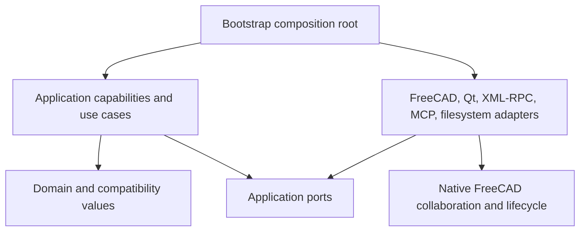
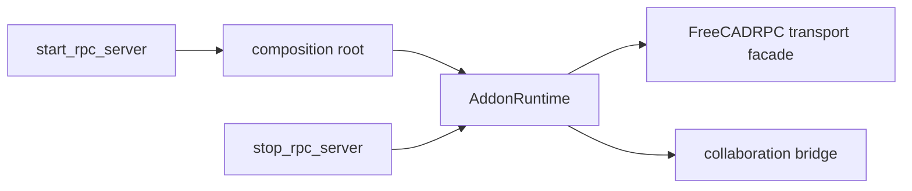
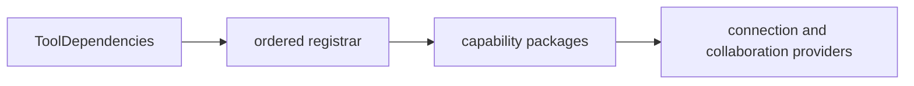

# FreeCAD MCP architecture refactor plan

Plan to refactor `feature/dirty-document-adoption` into explicit domain,
application, runtime, bootstrap, and adapter boundaries without changing public
FreeCAD MCP behavior.

This plan starts only after the repository-root
[`freecad_document_collaboration_plan.md`](../../../../doc/freecad_document_collaboration_plan.md)
is complete. Its final cutover is authoritative: FreeCAD owns collaboration,
document lifecycle, persistence, recovery, and conflict decisions. This plan
organizes the resulting MCP adapter; it does not recreate the removed Python
lease authority.

The completed
[`module-size-refactor-plan.md`](module-size-refactor-plan.md) is the structural
baseline and the style model for this document. Its thin façades, explicit
exports, compatibility shims, contract snapshots, and current lint gate are
inputs, not work to repeat.

**In scope**

- `addon/FreeCADMCP/document_lease/` compatibility and deprecation surfaces
- `addon/FreeCADMCP/rpc_server/` application, runtime, bootstrap, and adapter seams
- `addon/FreeCADMCP/InitGui.py` startup and shutdown ownership
- `src/freecad_mcp/` client, tool registration, operations, and capability packages
- addon/client protocol conformance fixtures
- architecture policy and replacement of artificial module-size rules

**Out of scope (for this plan)**

- Redesigning the native collaboration model delivered by the prerequisite plan
- Reintroducing MCP-owned sidecars, heartbeats, credentials, document ownership,
  save/recovery authority, or FCStd-difference conflict policy
- Renaming public MCP tools, XML-RPC methods, imports, signatures, or wire formats
- Removing compatibility shims or completing a separate deprecation program
- Merging addon and MCP protocol implementations before conformance tests justify it
- Splitting files only to satisfy a line-count target
- A repository-wide FreeCAD refactor unrelated to the MCP architecture seams

**Success criteria (whole effort)**

- Public MCP names, XML-RPC names/signatures, import paths, registration order,
  wire formats, and documented results remain contract-identical.
- Native FreeCAD remains the only owner of collaboration sessions, lifecycle
  epochs, dirty/persisted state, save, Save As, recovery, and mutation authority.
- Domain and application modules import no FreeCAD, Qt, XML-RPC, MCP, or filesystem
  implementation modules.
- `LeaseClientManager` is a normal class, `DocumentLeaseService` is a thin
  compatibility façade, and `FreeCADRPC` is a thin public transport façade.
- One bootstrap composition root owns the only mutable process runtime singleton.
- Tool registrars receive typed dependencies; no imported tool module is mutated.
- Mechanically named production modules move into cohesive capability packages,
  while every old path remains an explicit shim.
- Addon and client protocol twins pass shared conformance vectors.
- Docker `unit`, `e2e`, `core`, and `benchmark` pass for every numbered phase;
  architecture lint, full Ruff, contract fixtures, and the branch-built collaboration
  cross-track lane also pass at every marked integration gate.

**Execution prerequisite**

Before phase 1, the integrator must verify the completed collaboration cutover
against the actual tree rather than this plan's authoring-time checkout. The
verified baseline must contain the native collaboration client/adapter surfaces,
the preserved public deprecation imports, and the branch-built cross-track lane.
The required surviving compatibility paths are
`src/freecad_mcp/lease_manager.py`, `document_lease/model.py`,
`document_lease/types/transitions.py`, `document_lease/sidecar.py`,
`document_lease/service.py`, `document_lease/service_ops/facade_bindings.py`, and
the frozen public lease RPC adapters. They exist only as import, decoder, or
documented deprecation shims. Phase 1 records these paths and requires the old
`core_authority` implementation, `claim_locked_error_handoff` owner rotation,
lease observers, and MCP save/recovery authority to be absent or unreachable.

---

## 1. Goals and non-goals

### Goals

- Make dependency direction visible and mechanically enforceable.
- Keep lease compatibility values invariant-safe and incapable of native authority.
- Give each public workflow one cohesive application handler.
- Separate application coordination from FreeCAD, Qt, XML-RPC, MCP, and filesystem
  adapters.
- Construct runtime services explicitly and dispose them deterministically.
- Remove import-time class assembly in the required order:
  `LeaseClientManager`, `DocumentLeaseService`, then `FreeCADRPC`.
- Replace mechanical module splits with subject-based capability packages.
- Preserve every public contract and existing import shim throughout the migration.
- Keep every implementation phase commit coherent, testable, revertible, and working.

### Non-goals

- Designing a second collaboration or lease state machine in Python.
- Moving native lifecycle, persistence, recovery, or rollback policy back into MCP.
- Converting every helper into a class, interface, package, or dependency object.
- Introducing a general dependency-injection framework.
- Sharing implementation modules across the addon and MCP processes in this effort.
- Removing old imports because all in-tree callers have migrated.
- Combining unrelated behavior fixes with structural moves.
- Replaying the module-size plan's extraction solely to reduce physical line counts.

---

## 2. Hard constraints

| Constraint | Implication |
|------------|-------------|
| Collaboration plan first | No phase in §6 starts until `../../../../doc/freecad_document_collaboration_plan.md` is complete and its final MCP cutover is verified. |
| Native authority | Only FreeCAD may authorize document mutation or decide lifecycle, save, recovery, persistence, and conflict outcomes. MCP translates requests and results. |
| Compatibility lease records | `LeaseRecord`, transition tables, and sidecar formats may decode historic data but may not rotate authority, fence a live document, or advance native lifecycle state. |
| Public MCP surface | Tool names, parameters, descriptions, registration order, returned envelopes, and exported tool objects remain frozen by the registry snapshot. |
| Public XML-RPC surface | Every public name remains reflectively discoverable on `FreeCADRPC` with the same signature, docstring, and wire result. |
| Wire compatibility | Addon `lease_protocol*` and client `rpc_auth*` remain separate but pass the same canonicalization, signing, bounds, feature, manifest, replay, and error vectors. |
| Import compatibility | Every moved symbol keeps an explicit re-export at its old path. Shim removal is outside this plan. |
| GUI-thread safety | FreeCAD and Qt work remains behind the GUI dispatcher; application handlers never import or call those runtimes directly. |
| Typed authorization | Internal application code receives immutable authorization evidence, never an unrestricted `local_confirmation=True` boolean. |
| Layer direction | Domain values depend on nothing above them; application depends on values and ports; adapters implement ports; bootstrap constructs the graph. |
| Runtime ownership | Mutable process-wide services and registries exist only inside `AddonRuntime`, with at most one bootstrap-owned runtime reference. |
| Assembly order | Convert `LeaseClientManager` first, then `DocumentLeaseService`, and leave `FreeCADRPC` dynamic only for public transport registration. |
| Atomic phase commits | Every listed phase commit includes its focused regressions, leaves the branch working, and can be reverted independently. No stage squash, merge, or validation-only commits are added. |
| Capability migration | Move one stable subject at a time; old `_a`, `_b`, `_1`, and `_2` paths become declarative shims, not new grab-bags. |
| Temporary ARCH002 policy | Until the final policy migration, each new Protocol/class lives in its own defining module; subject packages compose explicit public exports. |
| Docker-only evidence | Host-side test runs do not count. Focused, integration, benchmark, import-shim, and cross-track evidence is produced in Docker. |

Related design inputs:

- [`freecad_document_collaboration_plan.md`](../../../../doc/freecad_document_collaboration_plan.md)
- [`module-size-refactor-plan.md`](module-size-refactor-plan.md)
- [`document-leases.md`](document-leases.md)
- [`document-lease-sidecar-v2.md`](document-lease-sidecar-v2.md)
- [`lease-recovery.md`](lease-recovery.md)
- [`lease-security.md`](lease-security.md)
- [`request-lifecycle.md`](request-lifecycle.md)
- [`runtime-identity.md`](runtime-identity.md)

When an older lease document conflicts with the completed collaboration cutover,
the collaboration plan wins. Preserve the old public result or return its frozen
deprecation result; do not restore the old authority implementation.

---

## 3. Architecture and migration principles

1. **Freeze contracts before moving code.** Public RPC, MCP, import, and protocol
   fixtures land before their implementation seams move.
2. **Move behavior before thinning façades.** Extract a tested application handler,
   migrate its callers, then reduce the old façade to delegation.
3. **Keep values pure.** Domain and compatibility values contain validation and
   invariant-preserving operations, not runtime or adapter access.
4. **Keep use cases cohesive.** One handler owns one public workflow; small helpers
   stay functions unless they represent a stable capability or port.
5. **Make construction explicit.** Runtime dependencies enter through constructors
   or typed contexts, not module mutation, import-time attachment, or `_rpc_mod()`.
6. **Preserve old paths.** Every extraction leaves a small explicit shim at the
   origin module for the whole effort.
7. **Structure by subject.** Package names describe stable capabilities, not an
   arbitrary slice number or line-count workaround.
8. **Keep protocol twins independent.** Shared fixtures come first; a shared package
   is a later optional decision, not a goal of this plan.
9. **Ratchet before enforcing.** Add boundary checks with a named legacy allowance,
   migrate the tree, then remove the allowance in a substantive integration phase.
10. **Relax size rules last.** ARCH001/ARCH002 remain until stronger ownership,
    dependency, complexity, and public-surface checks are green.

### 3.1 Post-collaboration authority and compatibility

The prerequisite changes the meaning of several current MCP lease concepts. The
architecture refactor preserves their public compatibility, not their old authority.

| Current or legacy concept | Authoritative post-cutover owner | MCP responsibility after cutover |
|---------------------------|----------------------------------|----------------------------------|
| Lease owner, token, generation, heartbeat | Removed as correctness authority; native edit sessions and epochs replace it | Decode old payloads, redact secrets, and return the frozen compatibility result |
| Dirty adoption and `LOCKED_ERROR` handoff | Native collaboration session APIs | Gather typed GUI evidence and translate the request/result |
| Local and foreign orphan recovery | Native lifecycle and recovery APIs | Invoke/query native recovery or return the documented deprecation result |
| Save, Save As, finalize, release | Native FreeCAD lifecycle | Route one typed request and translate the response |
| Sidecar state and FCStd baseline comparison | Removed from MCP correctness | Read old formats only when migration/deprecation requires it |
| Close/reopen, persisted marker, lifecycle epoch | Native FreeCAD | Expose read-only status through collaboration ports |

An MCP restart, replacement, or authentication-session loss must not transfer,
revoke, or corrupt document authority. Compatibility shims cannot make a native
operation legal and cannot mutate native session state.

### 3.2 Lease-domain invariants

The compatibility model still needs strong invariants because historic payloads and
old imports remain public:

- `LeaseRecord.revised()` changes metadata only.
- `LeaseRecord.transitioned()` is unavailable for production lifecycle changes after
  the native cutover.
- Generic `dataclasses.replace()` or equivalent replacement cannot change lifecycle,
  authority, owner, token, generation, fencing, or credential fields.
- Metadata revision, lifecycle transition, and authority/session rotation are
  different operations and never share one unrestricted update path.
- `LOCKED_ERROR` never rotates a Python owner. Typed evidence either permits a native
  session request or produces the frozen conflict/deprecation result.
- Authorization evidence records purpose, document identity, issuing runtime,
  decision, and freshness. The GUI adapter is the only boolean translation boundary.

### 3.3 Moved-symbol compatibility

Every symbol moved by this plan remains importable from its old defining module.
Origin modules keep explicit re-exports from the new defining modules and declare an
explicit `__all__`; they do not rebuild exports from `globals()`.

- Shims are import-only or documented deprecation adapters.
- Shims own no mutable state, registration, runtime lookup, authority, or lifecycle
  policy.
- Internal modules import the defining module, not the old shim or a package barrel.
- Module-to-package conversions retain the original module path through the package
  `__init__.py`.
- A removed re-export is blocking and requires restoration in the same phase.
- Shim removal belongs to a later deprecation plan.

This section is the shim policy referenced verbatim by §5.2 rule 16.

### 3.4 Application use-case boundaries

The application layer contains nine cohesive handlers:

1. clean document acquisition;
2. dirty document adoption;
3. `LOCKED_ERROR` handoff;
4. local orphan recovery;
5. foreign orphan recovery;
6. save;
7. Save As;
8. finalize; and
9. release.

Handlers coordinate pure values and narrow ports. They may select a mode, sequence a
small number of port calls, and translate a public result. They may not import
FreeCAD, Qt, XML-RPC, FastMCP, concrete clients, filesystems, sidecar stores, or the
runtime container.

Lower-level acquisition, recovery translation, lifecycle, persistence, and query
capabilities perform one cohesive operation. They do not duplicate public routing or
cross-use-case policy. This distinction keeps `DocumentLeaseService` decomposition
from creating two competing orchestration layers.

### 3.5 Runtime composition and import-time assembly

`AddonRuntime` owns only process resources:

- transport listener and registered transport façade;
- GUI dispatcher and worker manager;
- authenticated session manager and replay cache;
- inflight request and bounded continuation registries;
- native collaboration bridge and application handlers;
- cancellation and shutdown state.

It owns no document authority, dirty state, persistence state, recovery policy,
sidecar store, or observer-driven lease lifecycle.

One composition root constructs the graph in dependency order. Startup publishes the
singleton only after construction and listener binding succeed. Shutdown cancels
requests, stops transport and workers, unsubscribes the collaboration bridge, revokes
authentication, disposes continuations, and clears the singleton idempotently.

The import-time assembly migration order is fixed:

1. define `LeaseClientManager` normally and leave its binding modules as shims;
2. replace `DocumentLeaseService` method attachment with explicit application
   delegation; and
3. keep `FreeCADRPC` as a public transport façade while removing private business
   binding and application-layer `_rpc_mod()` lookups.

### 3.6 `DocumentLeaseService` decomposition

The old service path remains public during the migration, but it no longer owns one
unrestricted bag of state. Its collaborators are:

- acquisition capability;
- recovery translation capability;
- native lifecycle capability;
- persistence adapter; and
- read-only query capability.

Public workflows live in the nine application handlers from §3.4. The compatibility
façade delegates to those handlers and exposes retired methods as documented
deprecation delegates. `service_ops/facade_bindings.py` remains an import shim, not a
class mutation mechanism.

### 3.7 Capability packages and explicit tool dependencies

Tool registration receives one typed context containing:

- server state;
- connection provider;
- recovery compatibility service;
- native collaboration provider; and
- selector type.

Registrars do not mutate imported modules such as `module.DocumentSelectorInput`.
They return or register the same public tool objects in the frozen order.

Capability packages group tools, client operations, templates, and addon RPC
adapters by stable subject: lease acquisition, recovery, lifecycle, documents,
objects, views, sketches, features, parametric modeling, assembly, diagnostics,
references, transactions, snapshots, FEM, gears, measurement, transforms, and IO.
Old mechanically named modules remain explicit re-export and registration shims.

### 3.8 Protocol conformance twins

The addon and MCP processes have different import environments, so their protocol
implementations stay separate. Both consume the same golden vectors for:

- canonical JSON and non-JSON rejection;
- depth, byte, identifier, timestamp, and lifetime bounds;
- request and response signatures;
- nonce, replay, expiry, and redaction behavior;
- feature negotiation and runtime manifests; and
- unknown, missing, or malformed fields and stable public errors.

Only a later plan may extract a shared pure-Python implementation, and only if these
vectors prove the extraction useful without coupling the process environments.

### 3.9 Architecture enforcement and shim purity

Architecture policy eventually enforces:

- domain and application import direction;
- adapters as the only concrete runtime boundary;
- bootstrap-only mutable process state;
- no application `_rpc_mod()` lookups;
- no internal imports through package barrels;
- no production ownership in `_a`, `_b`, `_1`, or `_2` modules;
- explicit, declarative, side-effect-free compatibility shims;
- frozen MCP, XML-RPC, import, and protocol contracts;
- per-function complexity and bounded public surfaces; and
- a generous mixed-responsibility backstop for giant façades and grab-bags.

Every moved symbol keeps its old path. Origin modules import from defining modules,
never from a package barrel. Shims declare explicit `__all__`, contain no production
state, perform no registration at import time, and are not removed in this plan.

### 3.10 Target dependency sketches (illustrative)

These sketches explain direction and ownership. The principles above and the ordered
phases in §6 are authoritative when a diagram and the live tree differ.







Illustrative target layout:

```text
addon/FreeCADMCP/rpc_server/
  application/
    ports/
      collaboration_session.py
      prepared_operation.py
      lifecycle.py
      gui_dispatch.py
      authorization.py
      selection.py
      persistence.py
      compatibility_results.py
    acquisition.py
    recovery.py
    lifecycle.py
    queries.py
    acquire_clean.py
    adopt_dirty.py
    handoff.py
    recover_local.py
    recover_foreign.py
    save.py
    save_as.py
    finalize.py
    release.py
  adapters/
    collaboration_persistence.py
  runtime/
    addon_runtime.py
    composition.py

src/freecad_mcp/
  capabilities/
    lease_acquisition/
    lease_recovery/
    lease_lifecycle/
    documents/
    sketches/
    features/
    diagnostics/
    ...
```

---

## 4. Current architecture inventory

The authoring-time tree still contains pre-cutover lease machinery. Execution uses
the completed collaboration baseline, so phase 1 must refresh this inventory before
implementation. Paths below identify the current seams and public compatibility
anchors; they do not require removed authority implementations to survive.

### Addon and runtime seams

| Current area | Current pattern | Required end state |
|--------------|-----------------|--------------------|
| `document_lease/model.py`, `document_lease/types/transitions.py` | Generic record revision and transition surfaces can express more authority than compatibility needs | Immutable decoder values; metadata-only revision; native-only lifecycle authority |
| `document_lease/service.py`, `service_ops/facade_bindings.py` | Service methods are attached after class definition and collaborators receive broad service access | Explicit capabilities and handlers behind a thin public façade |
| `document_lease/sidecar.py`, `document_lease/core_authority.py`, `core_authority_ops/` | Filesystem and authority concerns are reachable from lease coordination | Sidecar is a read-only legacy codec; phase 1 records core authority as removed or deprecation-only, and phase 26 makes any authority implementation unreachable |
| `rpc_server/rpc_server.py`, `rpc_server/rpc_server_ops/facade_bindings.py` | Transport façade, runtime globals, private helpers, and dynamically attached operations meet in one module | Constructor-injected public transport façade plus bootstrap-owned runtime |
| `rpc_server/methods/lease_methods_ops/_common.py`, `acquire_v2_reserve_helpers.py` | Application paths locate `rpc_server` through `_rpc_mod()` and pass authorization booleans | Narrow handler dependencies and typed evidence passed by the composition root |
| `document_lease/service_ops/locked_error_handoff.py:claim_locked_error_handoff` | Pre-cutover code rotates a Python replacement owner | Prerequisite removes owner rotation; phase 9 tests and structures only the surviving native-session compatibility translation |
| `rpc_server/server_lifecycle.py`, `server_shutdown.py` | Startup and shutdown coordinate scattered module state | Construct and dispose one `AddonRuntime` |
| `InitGui.py` | Workbench bootstrap owns several lifecycle callbacks | Manual start, auto-start, and about-to-quit route through one composition root |

### MCP client and tool seams

| Current area | Current pattern | Required end state |
|--------------|-----------------|--------------------|
| `lease_manager_ops/lease_client_manager.py`, `lease_client_manager_bindings.py`, `lease_client_manager_init.py` | Class body is assembled from initializer and binding modules | Normal class; old modules import-only shims |
| `server_ops/tool_registration.py` | Registration mutates imported tool modules | Typed `ToolDependencies` passed to every registrar |
| `tools_register_order.py` | Central order references mechanically named tool modules | Same order, capability registrars, old modules as shims |
| `server_ops/tool_exports/bind_part_1.py`, `bind_part_2.py` | Exports are divided by arbitrary part number | Capability-named export manifests composed by bootstrap |
| `tools_*_a.py`, `tools_*_b.py`, `tools_*_1.py`, `tools_*_2.py` | Production ownership follows split suffixes | Stable subject packages with declarative old-path shims |
| `operations/` and addon `rpc_server/methods/` | Related behavior is distributed by earlier size-oriented slices | Client, operation, template, and RPC code aligned by capability |

### Protocol and policy seams

| Current area | Current pattern | Required end state |
|--------------|-----------------|--------------------|
| addon `lease_protocol*` and client `rpc_auth*` | Separate compatible implementations without one complete shared vector set | Independent implementations consuming shared golden fixtures |
| `ci/lint_python.py` | ARCH001 and ARCH002 enforce size and one-class rules; architecture checks are partial | Dependency, ownership, shim, surface, complexity, and mixed-responsibility rules |
| RPC and MCP snapshot fixtures | Public surfaces are frozen separately | Both snapshots plus import/deprecation and protocol manifests gate every migration |

### 4.1 Requirement-to-owner coverage map

| Requirement area | Main current files | Ordered phases | Execution owner |
|------------------|--------------------|-----------------|-----------------|
| Post-collaboration contract baseline | collaboration client/API, RPC and MCP snapshots | 1 | Integrator |
| Protocol conformance | addon `lease_protocol*`, client `rpc_auth*` | 2–3 | One cross-process workstream |
| Layer ratchets | `ci/lint_python.py`, architecture policy tests | 4, 26, 38, 69–70 | Integrator |
| Lease invariants and authorization | `document_lease/model.py`, transitions, `claim_locked_error_handoff`, adoption GUI | 6–9 | Domain/application workstream |
| Retired core authority | `document_lease/core_authority.py`, `core_authority_ops/` | 1, 26 | Integrator |
| Import-time client assembly | `lease_client_manager*.py` | 5 | Client workstream |
| Application ports and use cases | collaboration API/client, lease/save RPC adapters | 10–24 | Use-case workstreams |
| `DocumentLeaseService` façade | `service.py`, `facade_bindings.py` | 25 | Integrator |
| Runtime composition and RPC façade | runtime globals, lifecycle, shutdown, `InitGui`, `FreeCADRPC` | 27–38 | Runtime workstreams + integrator |
| Typed tool dependencies | server registration and tool order | 39 | Integrator |
| Lease compatibility capabilities | lease acquire/recovery/lifecycle tool modules | 40–42 | Lease tool workstreams |
| Capability package migration | document, view, sketch, feature, parametric, assembly, diagnostics, IO modules | 43–67 | Capability workstreams |
| Tool export assembly | `server_ops/tool_exports/`, `server.py` | 68 | Integrator |
| Final capability and size policy | package barrels, policy checker, contract fixtures | 69–70 | Integrator |

Every original requirement has one ordered owner above. A workstream may help several
phases, but one phase never has two concurrent owners.

---

## 5. Multitask operating model

### 5.1 Roles

| Role | Model | Responsibilities |
|------|-------|------------------|
| **Worker** (implementation subagent) | **Composer 2.5 only** — never Composer 2.5 Fast | Implements one workstream under exclusive file ownership. Does not edit shared files. |
| **Integrator** (parent / dedicated agent) | Same session orchestrator | Owns all shared files, merges worker outputs, runs Docker suites, updates §11 Progress in this doc, creates the **single phase commit**. Waits for all workers in a wave before combining. |
| **Reviewer** (read-only subagent) | **Cursor Grok 4.5 High** | After every workstream (and again after integrator merge fixes), inspects the **actual diff and tests**. Extremely critical. Reports blocking / important / non-blocking findings. |

### 5.2 Hard Multitask rules

1. Use **Composer 2.5** for every implementation subagent.
2. **Never** use Composer 2.5 Fast for subagents.
3. **Do not** delegate an entire phase to one subagent when ≥2 safe workstreams exist.
4. Assign **exclusive file ownership** to each worker (listed in the phase table).
5. Workers **must not** edit shared files (see §5.3).
6. Workers must report: **changed files**, **tests added**, **assumptions**, **blockers**.
7. Keep **shared files**, **integration**, **Docker execution**, and **§11 Progress
   updates** with one dedicated integrator.
8. The integrator **waits** for workers and **combines** their changes.
9. After every workstream, start a **read-only Cursor Grok 4.5 High** review subagent.
10. The reviewer must be extremely critical, inspect the actual diff and tests, and report **blocking**, **important**, and **non-blocking** findings.
11. **Fix all blocking and important findings**, then review again.
12. The integrator runs **all** of: `unit`, `e2e`, `core`, and `benchmark` in Docker before the phase commit.
13. **Do not** mark the phase complete unless all reviews and Docker suites pass.
14. If fewer than two safe independent workstreams exist, use **one** worker and **explicitly explain** why parallelization is unsafe.
15. **One git commit per phase** (integrator). Workstream branches/worktrees may exist temporarily; they are not the delivery unit.
16. Every moved symbol keeps its old import path working via an explicit shim (§3.3); reviewers treat a removed re-export as blocking.

### 5.3 Shared files (integrator-only)

- `doc/freecad_mcp_architecture_refactor_plan.md`
- `ci/lint_python.py`
- `tests/test_architecture_policy.py`
- `tests/fixtures/freecad_rpc_contract_snapshot.json`
- `tests/fixtures/mcp_tool_registry_contract_snapshot.json`
- `tests/fixtures/post_collaboration_compatibility_surface.json`
- `tests/fixtures/rpc_protocol_conformance.json`
- `addon/FreeCADMCP/document_lease/__init__.py`
- `addon/FreeCADMCP/document_lease/service.py` during façade reduction
- `addon/FreeCADMCP/rpc_server/rpc_server.py`
- `addon/FreeCADMCP/rpc_server/server_lifecycle.py`
- `addon/FreeCADMCP/rpc_server/server_shutdown.py`
- `addon/FreeCADMCP/InitGui.py`
- `src/freecad_mcp/server.py`
- `src/freecad_mcp/tools_register_order.py`
- `src/freecad_mcp/server_ops/tool_registration.py`
- `src/freecad_mcp/server_ops/tool_exports/`
- central package `__init__.py` and explicit `__all__` composition files

The integrator may delegate read-only analysis of these files but keeps all writes.

### 5.4 Workstream lifecycle

1. Read §11 Progress and verify the next numbered phase.
2. Confirm the prerequisite baseline, contract fixtures, and clean exclusive paths.
3. Assign source files, target files, tests, forbidden paths, and phase-gate commands.
4. Worker implements one atomic scope and reports the diff and test results.
5. Critical reviewer inspects implementation, regressions, shims, and boundaries.
6. Worker fixes blocking/important findings; reviewer rechecks.
7. Integrator applies shared-file changes and reviews the combined diff.
8. Run focused tests and all four Docker suites; at marked integration points, also
   run full architecture, Ruff, contract, and branch-built cross-track checks.
9. Update §11 and create the exact conventional phase commit from §6.

### 5.5 Worker report template

```text
## Workstream <id> report
- Phase commit: <number and exact subject>
- Changed paths: <exclusive files>
- Behavior preserved: <contracts and shims>
- Tests added or updated: <paths and cases>
- Docker validation: <commands and results>
- Assumptions or blockers: <none or explicit list>
```

### 5.6 Reviewer report template

```text
## Review <workstream or integrated phase>
- Blocking: <findings or none>
- Important: <findings or none>
- Non-blocking: <findings or none>
- Contract/shim check: <pass/fail>
- Boundary check: <pass/fail>
- Test adequacy: <pass/fail>
- Re-review required: <yes/no>
```

### 5.7 Phase and atomic commit convention

For this plan, every numbered item in §6 is one atomic **phase** and produces the
single phase commit required by §5.2. The larger Stage 0–7 headings and their waves
organize dependencies and parallel preparation only; they are not delivery or squash
boundaries.

| Delivery unit | Rule |
|---------------|------|
| Numbered atomic phase | Mandatory; one cohesive behavior fix or structural slice and exactly one integrator commit |
| Contract fixture | Same phase commit as the protected surface, or immediately before its implementation move |
| Capability migration | One stable subject per phase commit, including its old-path shims |
| Stage | Coordination group only; never a squash or merge commit |
| Workstream branch/worktree | Temporary preparation; folded into its numbered phase commit |
| Validation-only phase | Forbidden; gates accompany substantive implementation or policy work |

### 5.8 Docker and contract gates

**Phase gate — every numbered atomic phase**

- affected unit tests in Docker;
- relevant RPC, MCP, import, protocol, or registry contract tests;
- Ruff on touched files;
- architecture lint when a boundary or package layout changes; and
- all four Docker Compose suites: `unit`, `e2e`, `core`, and `benchmark`, as required
  verbatim by §5.2 rule 12.

**Additional integration gate — phases 1, 4, 26, 38, 42, 67, 69, and 70**

- architecture lint and full Ruff;
- RPC, MCP, import/deprecation, and protocol contract fixtures; and
- the predecessor's Docker branch-built FreeCAD and MCP cross-track lane.

Phase 1 uses the existing protocol/auth suites because the new vector fixture does
not exist yet. Phase 4 is the first integration gate that requires the complete
fixture from phases 2 and 3.

The integrator records the Docker image/digest, commands, counts, and results in §11.
Host-side test runs are ignored.

---

## 6. Ordered implementation (atomic phases + Multitask workstreams)

```text
Stage 0  Post-collaboration baseline and ratchets        phases 1–4
Stage 1  Compatibility invariants and client class      phases 5–9
Stage 2  Application ports, capabilities, and use cases phases 10–26
Stage 3  Runtime composition and RPC façade              phases 27–38
Stage 4  Typed tool registration and lease tools         phases 39–42
Stage 5  Capability package migration                    phases 43–67
Stage 6  Tool exports and capability enforcement         phases 68–69
Stage 7  Architecture policy migration and final gate    phase 70
```

Phase numbers are continuous and authoritative. A later stage never starts before
all earlier numbered phases and their marked gates are complete.

### Stage 0 — Post-collaboration baseline and ratchets

**Outcome:** the completed collaboration cutover is recorded as the execution
baseline; public surfaces and protocol behavior are frozen; new dependency
violations fail without requiring the whole tree to be migrated first.

| # | Atomic phase commit | Change and main paths | Focused tests and validation |
|---:|---------------|-----------------------|------------------------------|
| 1 | `test(mcp): freeze post-collaboration contracts` | Verify the exact surviving shim/removed-implementation manifest; freeze `collaboration_client.py` → `collaboration_api.py` → native binding methods, signatures, opaque IDs, structured results, cancellation, lifecycle, and recovery; refresh RPC and MCP snapshots. | Public import/deprecation, collaboration-boundary, RPC, MCP, existing protocol/auth, restart, and native-authority contracts; full Docker suites and baseline branch cross-track. |
| 2 | `test(protocol): add canonicalization conformance vectors` | Add `tests/fixtures/rpc_protocol_conformance.json` for canonical JSON, bounds, identifiers, timestamps, invalid values, and errors. | `tests/test_lease_protocol.py`, `tests/test_rpc_auth.py`; both façades consume every vector. |
| 3 | `test(protocol): add handshake conformance vectors` | Extend the fixture for signed requests/responses, manifests, features, replay, expiry, missing fields, and redaction. | Protocol, authentication, request-idempotency, and handshake-shim Docker tests. |
| 4 | `build(mcp): add layered dependency ratchets` | Add named domain, application, runtime, bootstrap, and adapter rules to `ci/lint_python.py`; record existing exceptions exactly. | `tests/test_architecture_policy.py`; architecture-only lint; **integration gate**. |

**Parallelization:** one cross-process protocol worker may prepare phases 2 and 3,
but lands them in order because both own the conformance fixture. The integrator alone
owns phases 1 and 4 and all contract/policy files. Phase 1 runs existing
protocol/auth tests; phase 4 is the first gate that requires the new conformance
fixture created by phases 2 and 3.

**Integrator:** record the parent and MCP submodule revisions, classify every legacy
lease path as retained implementation, compatibility/deprecation shim, or removed
implementation, and stop the phase if the actual cutover differs from the manifest.

**End state**

- The architecture plan no longer relies on the authoring-time pre-cutover tree.
- Every public surface has a checked-in contract owner.
- Protocol twins have shared data coverage before any structural move.
- New layer violations fail while named legacy exceptions remain ratcheted.

---

### Stage 1 — Compatibility invariants and normal client construction

**Outcome:** the first import-time class assembly is gone; surviving lease values are
safe decoder shims; typed authorization and `LOCKED_ERROR` behavior match native
session semantics.

| # | Atomic phase commit | Change and main paths | Focused tests and validation |
|---:|---------------|-----------------------|------------------------------|
| 5 | `refactor(mcp): define LeaseClientManager normally` | Move construction and methods into `lease_manager_ops/lease_client_manager.py`; leave binding/init modules as shims; retain only opaque native-session handles and compatibility results, never lease credentials, heartbeat state, revocation authority, or authority-bearing aliases. | Construction, opaque handles, aliases, reconnect, redaction, public imports, and no-import-time-binding tests. |
| 6 | `refactor(mcp): make legacy lease records immutable` | Reduce `document_lease/model.py`, transition tables, and `sidecar.py` to immutable historic DTO/decoder behavior. | Historic round-trip, malformed payload, redaction, read-only sidecar, and native-state isolation tests. |
| 7 | `fix(mcp): block legacy lease authority mutation` | Make `revised()` metadata-only; reject production `transitioned()` and generic authority/lifecycle replacement. | Forbidden fields, direct replacement, metadata revision, retired transition, and architecture-policy regressions. |
| 8 | `refactor(mcp): type local authorization evidence` | Add immutable evidence under `rpc_server/application/authorization.py`; translate booleans only in `rpc_helpers_ops/_adoption_gui.py` and `lease_methods_ops/acquire_v2_reserve_helpers.py`. | Wrong purpose/document/runtime/freshness, denial, forgery, acceptance, and unchanged XML-RPC signature tests. |
| 9 | `refactor(mcp): isolate LOCKED_ERROR compatibility translation` | Move the surviving public handoff adapter to typed native-session translation; assert `service_ops/locked_error_handoff.py:claim_locked_error_handoff` is absent or unreachable after the prerequisite. | Acceptance, conflict, denial, cancellation, replay, redaction, deprecation, and no owner/credential rotation; branch-built handoff test. |

**Wave 1 — disjoint preparation**

| WS | Phases | Exclusive paths | Notes |
|----|---------|-----------------|-------|
| 1A | 5 | `src/freecad_mcp/lease_manager.py`, `lease_manager_ops/lease_client_manager*` | Client class only; do not touch addon lease files. |
| 1B | 6–7 | `addon/FreeCADMCP/document_lease/model.py`, transition types, focused tests | Phase 7 lands only after phase 6 is green. |

**Wave 2 — authorization and handoff**

| WS | Phases | Exclusive paths | Notes |
|----|---------|-----------------|-------|
| 1C | 8 | authorization value and GUI adapter paths | Preserve GUI-thread dispatch and public boolean input. |
| 1D | 9 | handoff service/RPC paths and focused tests | Starts after phases 7 and 8; never recreates credential rotation. |

**Integrator:** owns compatibility manifest updates, package exports, any shared
application barrel, and the final combined review. Phases land strictly 5 through 9
even when workers prepare disjoint diffs concurrently.

**End state**

- `LeaseClientManager` is a normal class with no import-time mutation.
- Compatibility records cannot change live authority or lifecycle.
- Authorization is typed inside the application boundary.
- `LOCKED_ERROR` requests a native session or returns a frozen public result.

---

### Stage 2 — Application ports, capabilities, and use cases

**Outcome:** public collaboration workflows have explicit application handlers;
lower-level capabilities implement one cohesive operation; `DocumentLeaseService`
is a thin compatibility façade; native authority is mechanically enforced.

Target application paths are illustrative names. The live post-cutover tree may
adjust a filename, but it may not merge capability and use-case ownership or change
the ordered phase boundary.

#### Wave A — ports

| # | Atomic phase commit | Change and main paths | Focused tests and validation |
|---:|---------------|-----------------------|------------------------------|
| 10 | `refactor(mcp): define collaboration application ports` | Add subject-split `application/ports/` modules for sessions, prepare/commit, lifecycle, GUI dispatch, authorization, selection, persistence, and compatibility translation; one Protocol/class per file while ARCH002 remains active. | Fake-port contracts, explicit package exports, import-boundary tests, collaboration client/RPC tests, and architecture lint. |

#### Wave B — lower-level capabilities

| # | Atomic phase commit | Change and main paths | Focused tests and validation |
|---:|---------------|-----------------------|------------------------------|
| 11 | `refactor(mcp): extract collaboration acquisition` | Move native session request, selection, authorization, and result mapping into `application/acquisition.py`. | Clean/dirty mapping, authorization, conflict, cancellation, and rejected lease-authority tests. |
| 12 | `refactor(mcp): extract recovery translation` | Move local/foreign/saved-foreign and handoff result mapping into `application/recovery.py`. | Native recovered/conflict/unsupported results, cancellation, redaction, and no liveness/sidecar policy. |
| 13 | `refactor(mcp): extract collaboration lifecycle` | Move one typed save, Save As, finalize, release, cancel, or status call into `application/lifecycle.py`. | Success, conflict, failure, cancellation, restart, heartbeat-deprecation, and update-deprecation results. |
| 14 | `refactor(mcp): isolate collaboration persistence` | Implement lifecycle persistence/recovery ports in `adapters/collaboration_persistence.py`; keep the legacy sidecar codec read-only. | Save, Save As, recovery, decoder, filesystem-isolation, and rejected-sidecar-write tests. |
| 15 | `refactor(mcp): extract collaboration queries` | Move session, lifecycle, revision, and compatibility views into `application/queries.py`. | Ordering, serialization, 64-bit counters, redaction, epochs/revisions, and rejected mutation dependencies. |

Phases 11, 12, and 15 may be prepared by disjoint workers after phase 10. Phases
13 and 14 use one worker because their port and adapter contract evolves together;
they still land as two independently green phase commits.

#### Wave C — public use-case handlers

| # | Atomic phase commit | Change and main paths | Focused tests and validation |
|---:|---------------|-----------------------|------------------------------|
| 16 | `refactor(mcp): add clean acquisition handler` | Move `acquire_document_lock_v2` routing into `application/acquire_clean.py`; delegate to acquisition. | Success, conflict, cancellation, replay, public signature, and begin-session cross-track test. |
| 17 | `refactor(mcp): add dirty adoption handler` | Move `adopt_dirty_document` routing into `application/adopt_dirty.py`; keep GUI evidence in the adapter. | Authorization, dirty status, conflict, cancellation, replay, restart, and dirty-session cross-track test. |
| 18 | `refactor(mcp): add LOCKED_ERROR handoff handler` | Move public handoff sequencing into `application/handoff.py`; use typed evidence and recovery translation. | Success/conflict/deprecation, cancellation, replay, redaction, and no owner/credential mutation. |
| 19 | `refactor(mcp): add local recovery handler` | Move the local-orphan compatibility verb into `application/recover_local.py`. | Recovered/conflict/unsupported, cancellation, restart, deprecation, and no liveness/filesystem dependency. |
| 20 | `refactor(mcp): add foreign recovery handler` | Move foreign and saved-foreign routing into `application/recover_foreign.py`. | Native outcomes, unsupported records, cancellation, redaction, and no process/baseline/credential policy. |
| 21 | `refactor(mcp): add native save handler` | Move save routing into `application/save.py`; delegate persistence and rollback semantics to FreeCAD. | Success, validation failure, cancellation, restart, result mapping, public signature, and save/rollback cross-track test. |
| 22 | `refactor(mcp): add native Save As handler` | Move Save As and client-alias routing into `application/save_as.py`; aliases track only non-authoritative client handles returned by the native operation. | Success/conflict/failure, identity, non-authoritative aliases, cancellation, restart, and no sidecar or credential migration policy. |
| 23 | `refactor(mcp): add native finalize handler` | Move save, Save As, and no-save selection into `application/finalize.py`. | Every mode, invalid combinations, conflict/failure/cancellation, restart, redaction, and public result shapes. |
| 24 | `refactor(mcp): add native release handler` | Move release routing into `application/release.py`; translate native complete/cancel/conflict/status results. | Clean/dirty/stale/forced/repeated releases, cancellation, and no sidecar cleanup or authority rotation. |

**Parallelization:** three workers may prepare disjoint sequences after phases 11–15:

| WS | Phases | Ownership |
|----|---------|-----------|
| 2C-1 | 16–17 | acquisition/adoption handlers and their exclusive tests |
| 2C-2 | 18–20 | handoff/recovery handlers and their exclusive tests |
| 2C-3 | 21–24 | save/Save As/finalize/release handlers and their exclusive tests |

The integrator lands phases 16 through 24 in order and owns any shared RPC method
map, package barrel, or contract fixture.

#### Wave D — façade and authority gate

| # | Atomic phase commit | Change and main paths | Focused tests and validation |
|---:|---------------|-----------------------|------------------------------|
| 25 | `refactor(mcp): reduce DocumentLeaseService to a facade` | Replace `service_ops/facade_bindings.py` class mutation with explicit delegation from `DocumentLeaseService` to handlers and queries. | Public signatures, one-hop delegation, deprecations, imports, collaborator isolation, and no class mutation. |
| 26 | `build(mcp): enforce native collaboration authority` | Remove lease-layer ratchets; enforce ports-only application imports, adapter-only runtime access, immutable compatibility records, and native-only mutation authority. | Negative architecture fixtures for lifecycle replacement, credential rotation, sidecar writes, concrete imports, and Python-owned recovery; **integration gate**. |

**End state**

- Each public workflow has one handler and one clear contract owner.
- Capabilities provide primitives; handlers provide sequencing; the façade only
  delegates.
- Application imports remain pure and testable without FreeCAD or Qt.
- No reachable Python compatibility path can authorize document mutation.

---
### Stage 3 — Runtime composition and RPC façade

**Outcome:** one explicit `AddonRuntime` owns transport resources; startup and
shutdown construct and dispose it; application paths receive collaborators instead
of locating module globals; `FreeCADRPC` retains only public transport behavior.

#### Wave A — runtime model and composition root

| # | Atomic phase commit | Change and main paths | Focused tests and validation |
|---:|---------------|-----------------------|------------------------------|
| 27 | `refactor(mcp): introduce AddonRuntime` | Add `rpc_server/runtime/addon_runtime.py` for listener, dispatcher, workers, auth, replay, inflight/continuation registries, collaboration bridge, handlers, and shutdown state. | Pure construction, dependency identity, optional resources, ownership, and double-disposal tests without FreeCAD/Qt imports. |
| 28 | `refactor(mcp): add the addon composition root` | Add `rpc_server/runtime/composition.py`; construct adapters, handlers, auth, bridge, and `AddonRuntime`; make existing startup call this factory through a transitional hook and pass its handler registry to the current façade before any locator is removed. | Authentication requirements, dependency sharing, transitional live-start wiring, transport registration, native collaboration wiring, forbidden authority dependencies, and rollback on construction failure. |

Phase 27 defines the container without starting it. Phase 28 wires real adapters
through the existing startup/façade path after the container contract is green, so
phases 29–33 can replace locators without creating an unused parallel graph. No
lease runtime, sidecar owner, document observer, heartbeat watchdog, or authority
service enters the graph.

#### Wave B — inject adapter collaborators

| # | Atomic phase commit | Change and main paths | Focused tests and validation |
|---:|---------------|-----------------------|------------------------------|
| 29 | `refactor(mcp): inject acquisition and recovery adapters` | Pass acquisition, adoption, handoff, and recovery handlers into `methods/lease_methods_ops/`; remove their application `_rpc_mod()` lookups. | Adoption, recovery, authorization, cancellation, continuation, timeout, and dependency-identity tests. |
| 30 | `refactor(mcp): inject save and lifecycle adapters` | Pass save, Save As, finalize, release, query, and deprecation handlers into lease/lifecycle RPC adapters. | Save, release, query, close/reopen, cancellation, GUI dispatch, and RPC contract tests. |
| 31 | `refactor(mcp): inject dispatch and worker collaborators` | Replace `_rpc_mod()` in dispatch, execute-code, and worker orchestration with dispatcher, execution-safety, worker, and cancellation dependencies supplied by phase 28. | Dispatch, execute-code, mutation attribution, worker, cancellation, and AST no-locator tests. |
| 32 | `refactor(mcp): inject CAD collaborators` | Pass narrow document, object, sketch, feature, transaction, and collaboration handlers into CAD RPC adapters; remove their business locators. | CAD, object, sketch, feature, transaction, dependency-identity, and AST no-locator tests. |
| 33 | `refactor(mcp): inject GUI view and snapshot collaborators` | Pass GUI dispatch, personal-view, presentation, snapshot, and restore collaborators into GUI/view adapters; remove their business locators. | GUI dispatch, camera/view, selection isolation, snapshot/restore, cancellation, and AST no-locator tests. |

Phases 29–33 may be prepared in parallel only when their source and test ownership
is disjoint. Workers add adapters and constructor parameters; the integrator alone
edits central runtime assembly and shared method registries.

#### Wave C — startup, shutdown, and workbench bootstrap

| # | Atomic phase commit | Change and main paths | Focused tests and validation |
|---:|---------------|-----------------------|------------------------------|
| 34 | `refactor(mcp): construct AddonRuntime during startup` | Make `start_rpc_server()` adopt the transitional factory as its only path, bind the listener, register the façade, and publish the singleton only after success. | Repeated start, failed bind/auth/worker/bridge construction, reverse-order rollback, GUI-thread enforcement, and no leaked singleton. |
| 35 | `refactor(mcp): dispose AddonRuntime during shutdown` | Make `stop_rpc_server()` cancel requests, stop listener/workers, dispose dispatch, unsubscribe the bridge, revoke auth, clear continuations, and clear the singleton idempotently. | Shutdown order, concurrent stop, inflight cancellation, timeout, partial runtime, repeated disposal, bridge unsubscription, and no post-stop request. |
| 36 | `refactor(mcp): bootstrap InitGui through one runtime owner` | Route manual start, auto-start, and about-to-quit through the composition root; preserve split-exec imports without restoring document observers. | `InitGui` callback order, split namespaces, auto-start on/off, repeated activation, shutdown connection, no observer registration, and no duplicate runtime. |

These phases are sequential and integrator-owned because they share lifecycle and
bootstrap state. Each phase commit leaves manual start/stop and existing endpoint behavior
working before the next seam moves.

#### Wave D — transport façade and runtime gate

| # | Atomic phase commit | Change and main paths | Focused tests and validation |
|---:|---------------|-----------------------|------------------------------|
| 37 | `refactor(mcp): keep FreeCADRPC as a public transport facade` | Replace private business attachment from `rpc_server_ops/facade_bindings.py` with the constructor-injected handlers already used since phase 28; limit dynamic binding to an explicit public XML-RPC map. | Frozen names, signatures, docstrings, instance attributes, reflective registration, injected handlers, and no private dynamic binding. |
| 38 | `build(mcp): enforce composition root ownership` | Remove runtime ratchets; enforce bootstrap-only mutable state, no application `_rpc_mod()`, no concrete application imports, deterministic disposal, and public-only RPC binding. | Negative global/singleton/lazy-locator/adapter/private-binding fixtures; integration gate. |

**Integrator:** owns `rpc_server.py`, runtime composition, server lifecycle/shutdown,
`InitGui.py`, public registration maps, contract fixtures, and the order in which
prepared worker diffs land.

**End state**

- Exactly one runtime reference exists, and bootstrap owns it.
- Construction and partial-failure rollback are deterministic.
- Shutdown is bounded and idempotent.
- Application code has no module locator.
- `FreeCADRPC` is a reflective transport façade, not an application service.

---

### Stage 4 — Typed tool registration and lease compatibility capabilities

**Outcome:** tool modules receive explicit dependencies; the lease-related registrar
families prove the capability-package migration pattern while preserving the frozen
MCP registry and native collaboration behavior.

| # | Atomic phase commit | Change and main paths | Focused tests and validation |
|---:|---------------|-----------------------|------------------------------|
| 39 | `refactor(mcp): pass a typed tool registration context` | Add `ToolDependencies` for server state, connection, recovery compatibility, collaboration, and selector; stop mutating imported tool modules in `server_ops/tool_registration.py`. | Simultaneous registration, dependency identity, selector isolation, deterministic order, no module mutation, server lifespan, and registry snapshot tests. |
| 40 | `refactor(mcp): group lease acquisition capabilities` | Move acquire, dirty-adopt, and acquisition-claim registrars/operations into `capabilities/lease_acquisition/`; keep old acquisition paths as shims. | Public names/signatures/order/results, claim behavior, native session delegation, exports, and old imports. |
| 41 | `refactor(mcp): group lease recovery capabilities` | Move status, list, stale-force, and recovery-result registrars into `capabilities/lease_recovery/`; native recovery remains authoritative. | Status/recovery translations, deprecations, registration order, exports, old imports, and no client-owned recovery. |
| 42 | `refactor(mcp): group lease lifecycle capabilities` | Move update, heartbeat-deprecation, save, Save As, finalize, and release registrars into `capabilities/lease_lifecycle/`. | Lifecycle/save/finalize/release/deprecation behavior, registry snapshot, exports, old imports, native delegation; **integration gate**. |

**Parallelization:** phase 39 is integrator-owned and lands first. Phases 40–42
share existing lease tool modules and registration order, so one worker migrates them
sequentially. A second worker may review shims and registry diffs but does not edit.

**Integrator:** owns `server.py`, `tools_register_order.py`, tool registration,
exports, shared barrels, and registry snapshots. Each origin module becomes a small
explicit shim in the same phase commit that moves its production ownership.

**End state**

- Tool state and providers are explicit constructor/registration inputs.
- Lease capability modules follow subject names rather than split suffixes.
- Public registry order and exports are unchanged.
- Compatibility tools delegate to native collaboration handlers.

---

### Stage 5 — Capability package migration

**Outcome:** mechanically divided tool, operation, template, and addon RPC modules
are aligned by stable subject. Each capability moves in its own atomic phase and
keeps every old import path working.

Workers may prepare disjoint target packages concurrently inside a wave, but the
integrator lands the numbered phases sequentially and owns registration, exports,
barrels, and contract fixtures.

#### Wave 1 — documents, objects, and views

| # | Atomic phase commit | Change and main paths | Focused tests and validation |
|---:|---------------|-----------------------|------------------------------|
| 43 | `refactor(mcp): group document lifecycle capabilities` | Move create/open/list/activate/reload/close/recompute/undo/redo from core, GUI, history, and lifecycle RPC modules into `capabilities/documents/lifecycle/`. | Document/history/lifecycle tests, native epochs, RPC snapshot, registry order, exports, and old imports. |
| 44 | `refactor(mcp): group document object capabilities` | Move object create/inspect/edit/delete, parts lists, and object references into `capabilities/documents/objects/` and `references/`. | Object deletion, reference behavior, extended MCP, RPC snapshot, exports, and old imports. |
| 45 | `refactor(mcp): group view and presentation capabilities` | Move capture/refresh/animation/selection/tree/section/GUI state into `capabilities/view/` and `presentation/`, using the personal-context adapter. | View, camera, animation, screenshot, personal-context, selection-isolation, registry, RPC, and shim tests. |

| Phase | Current source ownership |
|-------:|--------------------------|
| 43 | `src/freecad_mcp/tools_core_document.py`, `tools_gui_document_a.py`, `tools_gui_document_b.py`, `tools_document_history.py`, `operations/core_ops/document_ops.py`, `history_ops.py`, addon `methods/lifecycle_methods_ops/` |
| 44 | `src/freecad_mcp/tools_core_document.py`, `tools_core_objects.py`, `tools_gui_document_a.py`, `operations/core_ops/object_ops.py`, `reference_ops.py`, addon `cad_methods_ops/object_crud.py`, `references.py` |
| 45 | `src/freecad_mcp/tools_gui_view_a.py`, `tools_gui_view_b.py`, `tools_gui_document_b.py`, `operations/video_anim.py`, addon `methods/gui_methods_ops/`, `view_manager_ops/` |

These phases are one sequential workstream because their current GUI-document and
registration sources overlap. Keep personal view state separate from shared
presentation state throughout the move.

#### Wave 2 — sketch capabilities

| # | Atomic phase commit | Change and main paths | Focused tests and validation |
|---:|---------------|-----------------------|------------------------------|
| 46 | `refactor(mcp): group sketch geometry capabilities` | Move sketch creation, raw geometry add/delete, and primitives into `capabilities/sketch/geometry/`; retain `tools_sketch_create_*` and primitive shims. | Creation/deletion, indices, geometry payloads, validation, registry, RPC snapshot, and old imports. |
| 47 | `refactor(mcp): group sketch curve editing capabilities` | Move curves, splines, import, construction, trim, extend, split, fillet, symmetry, and offset into `capabilities/sketch/curves/` and `editing/`. | `test_p1_sketch_curves`, `test_p2_sketch_editing`, generated code, validation, registry, and shims. |
| 48 | `refactor(mcp): group sketch constraint capabilities` | Move generic and named constraints into `capabilities/sketch/constraints/`; align client operations and addon adapters. | Constraint signatures, indices, deletion, parametric behavior, RPC snapshot, registry, and old imports. |

| Phase | Current source ownership |
|-------:|--------------------------|
| 46 | `src/freecad_mcp/tools_sketch_create_1.py`, `tools_sketch_create_2.py`, `tools_sketch_primitives.py`, `operations/core_ops/sketch_ops.py`, addon `sketch_public.py`, `sketch_geometry_ops.py` |
| 47 | `src/freecad_mcp/tools_sketch_curves_a.py`, `tools_sketch_curves_a2.py`, `tools_sketch_curves_b.py`, `tools_sketch_curves_b2.py`, `operations/p1_curves.py`, `p1_curves_ops/`, `p2_editing.py` |
| 48 | `src/freecad_mcp/tools_sketch_constraints_1.py`, `tools_sketch_constraints_2.py`, `tools_parametric_body.py`, `operations/core_ops/sketch_constraint_ops.py`, addon `sketch_constraint_*.py` |

One sketch workstream owns the overlapping core sketch sources. A separate reviewer
checks generated FreeCAD code and index stability after each phase commit.

#### Wave 3 — features and parametric modeling

| # | Atomic phase commit | Change and main paths | Focused tests and validation |
|---:|---------------|-----------------------|------------------------------|
| 49 | `refactor(mcp): group basic feature capabilities` | Move pad, pocket, linear/polar pattern, and mirror into `capabilities/features/basic/`; keep basic-feature shims. | `test_p3_features`, generated operations, signatures, results, registry, RPC, and old imports. |
| 50 | `refactor(mcp): group advanced feature capabilities` | Move revolve, loft, sweep, helical sweep, fillet, and chamfer into `capabilities/features/advanced/`. | Advanced feature validation, output shapes, generated code, registry, RPC, and shims. |
| 51 | `refactor(mcp): group boolean feature capabilities` | Move union, difference, and intersection into `capabilities/features/boolean/`, aligned with the native typed Boolean operation. | Boolean public behavior, native conflicts, registry, RPC snapshot, and old imports. |
| 52 | `refactor(mcp): group spreadsheet and expression capabilities` | Move spreadsheet creation/cells/aliases and document expressions into `capabilities/parametric/spreadsheets/` and `expressions/`. | Names, aliases, cells, expressions, errors, registry, RPC snapshot, and shims. |
| 53 | `refactor(mcp): group parametric body capabilities` | Move body creation, Tip changes, and body diagnostics into `capabilities/parametric/bodies/`. | Body/Tip/diagnostic behavior, signatures, results, registration, and old imports. |
| 54 | `refactor(mcp): group sketch attachment capabilities` | Move sketch attachment and inspection into `capabilities/sketch/attachment/`. | Support modes, placements, routing, signatures, errors, registry, RPC snapshot, and shims. |

| Phase | Current source ownership |
|-------:|--------------------------|
| 49 | `src/freecad_mcp/tools_features_basic_1.py`, `tools_features_basic_2.py`, `operations/p3_features.py`, addon `cad_methods_ops/features_gui.py` |
| 50 | `src/freecad_mcp/tools_features_advanced_a.py`, `tools_features_advanced_b.py`, `operations/p3_features.py`, addon `cad_methods_ops/features_gui.py` |
| 51 | `src/freecad_mcp/tools_features_boolean.py`, `operations/p3_features.py`, addon `cad_methods_ops/features_gui.py`, native Boolean collaboration adapter |
| 52 | `src/freecad_mcp/tools_parametric_sheet_a.py`, `tools_parametric_sheet_b.py`, `operations/parametric_ops/spreadsheet_ops.py`, `expression_ops.py`, addon `spreadsheet*.py`, `expressions.py` |
| 53 | `src/freecad_mcp/tools_parametric_body.py`, `operations/parametric_ops/body_ops.py`, addon `cad_methods_ops/features_gui.py` |
| 54 | `src/freecad_mcp/tools_parametric_body.py`, `operations/parametric_ops/sketch_attach_ops.py`, `sketch_attach_helpers.py`, addon `cad_methods_ops/sketch_attach_helpers.py` |

Feature phases 49–51 share `operations/p3_features.py` and land from one sequential
workstream. Parametric phases 52–54 may be prepared by a second disjoint worker but
land only after the feature sequence.

#### Wave 4 — assembly, Part Design, and placement

| # | Atomic phase commit | Change and main paths | Focused tests and validation |
|---:|---------------|-----------------------|------------------------------|
| 55 | `refactor(mcp): group assembly capabilities` | Move assembly creation, joints, solve, path wire, projection, tree, and pipe into `capabilities/assembly/`. | Assembly/path/routing behavior, joint payloads, solver results, generated code, registry, RPC, and shims. |
| 56 | `refactor(mcp): group Part Design structure capabilities` | Move part containers, object movement, subshape binders, and datum-plane creation into `capabilities/part_design/structure/`. | Containers, movement, binders, datums, placements, registration, and old imports. |
| 57 | `refactor(mcp): group attachment and subshape queries` | Move attachment preview, face/edge search, and normals into `capabilities/part_design/attachment/` and `subshape_queries/`. | Preview, search, worker boundary, identity, selection, result behavior, registry, and shims. |
| 58 | `refactor(mcp): group placement capabilities` | Move edge-axis, placement audit, binder, and datum tools into `capabilities/placement/`. | Audit, binder, datum, round-trip, public behavior, registry, and old imports. |

| Phase | Current source ownership |
|-------:|--------------------------|
| 55 | `src/freecad_mcp/tools_assembly.py`, `tools_partdesign_a2.py`, `operations/p7_assembly.py`, `p7_assembly_ops/`, addon `cad_methods_ops/assembly.py` |
| 56 | `src/freecad_mcp/tools_partdesign_a.py`, `operations/p7_assembly_ops/assembly_ops.py`, `helpers.py`, `tools_register_order.py` |
| 57 | `src/freecad_mcp/tools_partdesign_b.py`, `operations/diagnostics_ops/attachment_ops.py`, `subshape_ops.py`, `tools_register_order.py` |
| 58 | `src/freecad_mcp/tools_partdesign_b2.py`, `operations/diagnostics_ops/placement_ops.py`, `tools_register_order.py` |

These phases share Part Design registration sources and use one sequential worker.
The integrator owns any cross-capability export and ordering change.

#### Wave 5 — diagnostics, references, transactions, and snapshots

| # | Atomic phase commit | Change and main paths | Focused tests and validation |
|---:|---------------|-----------------------|------------------------------|
| 59 | `refactor(mcp): group diagnostic capabilities` | Move geometry inspection, dependency graphs, dimension audits, pocket/helix diagnosis, and document comparison into `capabilities/diagnostics/`. | Diagnostic names/order, hardcoded dimensions, comparison, redaction, registry, and shims. |
| 60 | `refactor(mcp): group reference capabilities` | Move reference inspection, repair, and relinking into `capabilities/references/`. | Inspect/repair/relink behavior, paths, signatures, results, RPC snapshot, registry, and old imports. |
| 61 | `refactor(mcp): group transaction capabilities` | Move transaction execution and movement-follow validation into `capabilities/transactions/` with explicit dependencies. | Transaction, movement, mutation, rollback, registration, and shim tests. |
| 62 | `refactor(mcp): group snapshot and comparison capabilities` | Move state capture, geometric diff, snapshot, and restore into `capabilities/snapshots/` and `comparison/`. | Capture/diff/snapshot/restore, coordination, rollback, registry, RPC snapshot, and old imports. |

| Phase | Current source ownership |
|-------:|--------------------------|
| 59 | `src/freecad_mcp/tools_advanced_a.py`, `tools_diagnostics.py`, `operations/diagnostics.py`, `diagnostics_ops/audit_ops.py`, `core_ops/read_diagnostics_ops.py` |
| 60 | `src/freecad_mcp/tools_core_objects.py`, `tools_advanced_b.py`, `operations/core_ops/reference_ops.py`, addon `cad_methods_ops/references.py` |
| 61 | `src/freecad_mcp/tools_advanced_a.py`, `operations/diagnostics_ops/mutation_ops.py`, `tools_register_order.py` |
| 62 | `src/freecad_mcp/tools_advanced_b.py`, `tools_advanced_b2.py`, `operations/snapshot.py`, addon `cad_methods_ops/snapshot_restore.py` |

Diagnostics and references may be prepared in parallel when current files are
disjoint. Transactions and snapshots land afterward because they consume diagnostic
and reference results.

#### Wave 6 — specialized and IO capabilities

| # | Atomic phase commit | Change and main paths | Focused tests and validation |
|---:|---------------|-----------------------|------------------------------|
| 63 | `refactor(mcp): group FEM capabilities` | Move FEM registration, execution, solver resolution, and result extraction into `capabilities/fem/`. | Inputs, solver selection, errors, results, cancellation, registry, and old imports. |
| 64 | `refactor(mcp): group gear capabilities` | Move gear creation, geometry computation, pair checking, and templates into `capabilities/gears/`. | `test_p4_gears`, parameters, generated geometry, pair diagnostics, registry, and shims. |
| 65 | `refactor(mcp): group measurement capabilities` | Move distance, angle, area, volume, bounds, center of mass, common volume, and validation into `capabilities/measurements/`. | `test_p5_measure`, units, results, validation errors, registry, and old imports. |
| 66 | `refactor(mcp): group transform capabilities` | Move translate, rotate, scale, and their templates into `capabilities/transforms/`. | Generated code, placement round-trip, results, registry, and shims. |
| 67 | `refactor(mcp): group import and export capabilities` | Move STEP/BREP/STL, color, and document-tree IO into `capabilities/io/imports/` and `exports/`. | `test_p6_io`, paths, formats, colors, document tree, registry, RPC, old imports; **integration gate**. |

| Phase | Current source ownership |
|-------:|--------------------------|
| 63 | `src/freecad_mcp/tools_advanced_b2.py`, `operations/core_ops/fem_ops.py`, addon `rpc_server/fem_executor.py`, `fem_executor_ops/` |
| 64 | `src/freecad_mcp/tools_gear_1.py`, `tools_gear_2.py`, `operations/p4_gears.py`, `templates/p4_gears/` |
| 65 | `src/freecad_mcp/tools_measure_a.py`, `tools_measure_b.py`, `operations/p5_measure.py`, `p5_measure_ops/measure_ops.py` |
| 66 | `src/freecad_mcp/tools_transform.py`, `operations/p5_measure.py`, `templates/p5_measure/translate.py.txt`, `rotate.py.txt`, `scale.py.txt` |
| 67 | `src/freecad_mcp/tools_io_import.py`, `tools_io_export.py`, `operations/p6_io.py`, addon `rpc_server/methods/cad_methods_ops/` |

These subjects may be prepared by separate workers with exclusive paths. The
integrator lands phases 63–67 in order and reruns the full registry snapshot after
each phase because all add public registrars to the central order.

**Stage 5 end state**

- Production ownership follows stable subject packages.
- Old mechanical modules contain only explicit re-exports or registrar forwarding.
- MCP names, XML-RPC names, generated code, result envelopes, and registration order
  remain frozen.
- Internal modules import defining modules, not public barrels.

---

### Stage 6 — Tool exports and capability enforcement

**Outcome:** the server composes capability exports explicitly; old split binders are
shims; production ownership, dependency direction, registration order, and public
contracts are enforced without relying on mechanical filenames.

| # | Atomic phase commit | Change and main paths | Focused tests and validation |
|---:|---------------|-----------------------|------------------------------|
| 68 | `refactor(mcp): replace split tool export binders` | Replace `server_ops/tool_exports/bind_part_1.py` and `bind_part_2.py` with capability-named manifests composed by the server bootstrap; preserve `freecad_mcp.server` exports and `__all__`. | Registration modules, public server API, duplicate/missing exports, deterministic order, registry snapshot, and old binder imports. |
| 69 | `build(mcp): enforce capability package boundaries` | Remove package-layout ratchets; ban production logic in mechanical suffix modules, internal barrel imports, duplicate public names, and uncontracted registry/RPC surfaces. | Mechanical-name, shim-purity, barrel-import, order, duplicate-name, missing-contract, and all old-import fixtures; **integration gate**. |

**Parallelization:** unsafe. Both commits touch server export composition, registry
order, policy fixtures, and package barrels. The integrator performs the changes and
uses read-only reviewers for the export and policy surfaces.

**End state**

- Every public tool object has one capability owner and one deterministic export path.
- Old binders and mechanical modules contain no production logic.
- Package barrels serve external callers only.
- Capability boundaries and public contracts are enforced before size rules change.

---

### Stage 7 — Architecture policy migration and final gate

**Outcome:** artificial 300-line and one-class rules are replaced by meaningful
architecture checks without allowing giant mixed-responsibility modules to return.

| # | Atomic phase commit | Change and main paths | Focused tests and validation |
|---:|---------------|-----------------------|------------------------------|
| 70 | `build(mcp): replace artificial module size rules` | Retire `ARCH001` and `ARCH002` only after phase 69 is green; add capability ownership, dependency direction, public-symbol budget, per-function complexity, and a generous mixed-responsibility backstop while retaining Ruff `C901`. | Accept cohesive multi-class value modules; reject giant façades, mixed-capability grab-bags, excessive public surfaces, complex functions, and cross-boundary imports; final integration gate. |

**Parallelization:** one integrator only. Policy, fixtures, final contract verification,
and progress share central files and cannot be partitioned safely.

**Final end state**

- The architecture gate measures responsibility and dependency direction, not an
  arbitrary physical line count.
- Cohesive modules may contain several closely related value types.
- Giant façades, grab-bags, complex functions, and boundary-crossing imports fail.
- Every MCP, XML-RPC, import, deprecation, and protocol contract remains green.
- All 70 numbered phase commits are independently present; no stage squash or validation-only phase
  is added.

---

## 7. Verification checklist

### Per numbered atomic phase

- [ ] The exact next commit number and subject from §6 are used.
- [ ] The branch is working before and after the commit and the diff is independently
      revertible.
- [ ] Focused regressions land in the same commit as the behavior or structure they
      protect.
- [ ] The worker touched only its exclusive paths; shared files were integrator-owned.
- [ ] Blocking and important review findings are cleared and re-reviewed.
- [ ] Public MCP names, XML-RPC names/signatures, wire shapes, registration order, and
      old imports are unchanged or match the frozen deprecation contract.
- [ ] Every moved symbol has an explicit old-path shim with no import-time side effect.
- [ ] Application/domain modules import no FreeCAD, Qt, XML-RPC, MCP, filesystem, or
      concrete adapter modules.
- [ ] No Python compatibility path creates document authority, lifecycle transitions,
      dirty/persisted state, sidecar correctness, or recovery policy.
- [ ] GUI work still enters through the dispatcher; cancellation, replay, redaction,
      and authentication guarantees remain intact.
- [ ] Relevant Docker unit and contract tests pass.
- [ ] Ruff passes on touched files; architecture lint passes when boundaries change.
- [ ] §11 snapshot and progress log are updated inside the substantive commit.

### At phase 1

- [ ] The collaboration prerequisite is complete at recorded parent and MCP revisions.
- [ ] Every legacy lease path is classified as retained, shim/deprecation, or removed.
- [ ] RPC, MCP, and import/deprecation snapshots match the real cutover tree.
- [ ] Existing protocol/auth suites pass; the not-yet-created shared conformance fixture
      is not required.
- [ ] All four Docker suites and the baseline branch-built collaboration lane pass.

### At phase 4

- [ ] The complete shared conformance fixture from phases 2 and 3 passes against both
      protocol twins.
- [ ] The initial layer ratchet contains no unowned exception.
- [ ] All four Docker suites and the branch-built collaboration lane pass.

### At phase 26

- [ ] All nine use cases depend only on values and ports.
- [ ] Capability services implement primitives; handlers alone own public sequencing.
- [ ] `DocumentLeaseService` delegates and performs no class mutation.
- [ ] Native FreeCAD remains the only collaboration and lifecycle authority.
- [ ] Full Docker and branch-built use-case/recovery/save cross-track tests pass.

### At phase 38

- [ ] One bootstrap-owned `AddonRuntime` exists.
- [ ] Startup publishes only a fully constructed runtime.
- [ ] Shutdown is bounded, idempotent, and clears every process resource.
- [ ] No application `_rpc_mod()` lookup or secondary runtime singleton remains.
- [ ] `FreeCADRPC` reflective names, signatures, docstrings, and exposure match the
      frozen snapshot.
- [ ] Full Docker and branch-built runtime/RPC cross-track tests pass.

### At phases 42 and 67

- [ ] Typed tool dependencies, registry order, public exports, and all old lease-tool
      imports are green after phase 42.
- [ ] Every capability package owns one stable subject and every mechanical origin
      module is an explicit shim after phase 67.
- [ ] MCP registry and XML-RPC snapshots match the Stage 0 baseline.
- [ ] Architecture lint, Ruff, `unit`, `e2e`, `core`, `benchmark`, import-shim tests,
      and the branch-built collaboration cross-track gate pass.

### At phases 69 and 70

- [ ] Every production module has one capability owner.
- [ ] Mechanical old paths are declarative shims only.
- [ ] Tool registration and export order match the frozen MCP registry snapshot.
- [ ] Internal code imports defining modules, not barrels.
- [ ] Boundary enforcement is green before ARCH001/ARCH002 are removed.
- [ ] Cohesive modules pass the replacement policy and giant mixed modules fail it.
- [ ] Architecture lint, Ruff, `unit`, `e2e`, `core`, `benchmark`, public contract
      fixtures, protocol vectors, import shims, and branch cross-track all pass.

---

## 8. Commit sizing and delivery

| Delivery unit | Guidance |
|---------------|----------|
| Invariant fix | One behavior correction plus focused regressions; do not mix with its later module move |
| Application handler | One public workflow and its ports/results; small private helpers may stay in the same module |
| Lower-level capability | One cohesive primitive used by handlers; no duplicate public routing |
| Runtime slice | One construction, injection, startup, shutdown, or façade seam; integrator owns shared wiring |
| Capability package | One stable subject, its client/operation/RPC moves, tests, exports, and old-path shims |
| Contract fixture | Same phase commit as the surface freeze or immediately before the protected move |
| Architecture gate | Substantive rule/fixture removal of a completed ratchet; carries the additional integration gate where marked |
| Phase merge or squash | Forbidden |
| Validation-only commit | Forbidden |
| Parent repository gitlink | Separate parent commit only after the final submodule gate, if delivery requires it |

Do not use a numeric line budget as the reason to split a commit. Split when behavior,
ownership, reviewability, or independent rollback provides a real boundary. Conversely,
do not combine all modules in an architectural area merely because a phase groups them.

---

## 9. Risks and mitigations

| Risk | Mitigation |
|------|------------|
| Prerequisite tree differs from this plan | Phase 1 records named revisions and an exact retained/shim/removed manifest; stop on mismatch instead of improvising. |
| Retired MCP lease authority is accidentally rebuilt | §3.1 mapping, native-authority architecture checks, negative tests, and branch-built collaboration cross-track gates. |
| Tests preserve dead sidecar/owner semantics | Rewrite them as native translation, deprecation, decoder, or public-contract tests before structural moves. |
| `LOCKED_ERROR` recreates replacement-owner rotation | Typed evidence requests a native session only; tests assert owner/token/generation never rotate in Python. |
| Capability and use-case layers duplicate coordination | §3.4 ownership rule: capabilities perform one primitive; handlers alone sequence public workflows. |
| Compatibility imports disappear during moves | Checked-in shim manifest, explicit re-exports, import tests, and blocking review policy. |
| Circular imports appear after package moves | Leaf modules import defining modules, never package barrels; restructure edges rather than adding lazy imports. |
| Optional FreeCAD/Qt imports hide cycles | Allow soft/lazy imports only in concrete adapter modules where the runtime is genuinely optional. |
| Runtime resources leak or a second singleton appears | Construction rollback, disposal-order tests, singleton policy, and architecture fixtures. |
| GUI-thread behavior regresses | Keep GUI collection/dispatch in adapters and run dispatcher, cancellation, and branch-built GUI tests. |
| Protocol twins drift | Shared golden data fixtures are mandatory before either implementation moves. |
| Tool names, order, or exports drift | MCP registry snapshot, explicit ordered registrars, export manifests, and per-capability contract tests. |
| Mechanical suffix removal creates new grab-bags | Stable subject ownership plus mixed-responsibility, public-symbol, and C901 backstops. |
| ARCH001/ARCH002 are relaxed too early | Phase 70 cannot start until phase 69 and its integration gate are green. |
| Parallel workers edit shared façades | Exclusive paths and integrator-only ownership for façades, barrels, registries, fixtures, and composition roots. |
| Submodule and parent histories are mixed | Create all 70 phase commits inside `tools/mcp/freecad-mcp`; update the parent gitlink separately after the final gate. |

---

## 10. Command reference

Run all MCP commands from `tools/mcp/freecad-mcp`.

```powershell
# Architecture rules only
docker run --rm -v "${PWD}:/workspace" -w /workspace `
  ghcr.io/astral-sh/uv:python3.12-bookworm-slim `
  uv run ci/lint_python.py --architecture-only addon/FreeCADMCP src/freecad_mcp

# Full package lint and Ruff
docker run --rm -v "${PWD}:/workspace" -w /workspace `
  ghcr.io/astral-sh/uv:python3.12-bookworm-slim `
  uv run ci/lint_python.py addon/FreeCADMCP src/freecad_mcp

# Safe Ruff fixes when a commit owns the affected paths
docker run --rm -v "${PWD}:/workspace" -w /workspace `
  ghcr.io/astral-sh/uv:python3.12-bookworm-slim `
  uv run ci/lint_python.py --fix addon/FreeCADMCP src/freecad_mcp

# Example focused unit invocation; replace paths with the commit's owned tests
docker compose run --rm unit tests/test_lease_manager.py -q

# Full MCP Docker suites
docker compose run --rm unit
docker compose run --rm e2e
docker compose run --rm core
docker compose run --rm benchmark
```

The integration gates also run the Docker branch-build lane recorded by the
prerequisite plan: current-branch FreeCAD App/Gui/Part tests plus the
`.woodpecker/ci.yml` equivalents of `freecad-mcp-load-preflight`,
`freecad-mcp-core-tests`, and `freecad-mcp-e2e` against the branch-built
`FreeCADCmd`. Record the exact frozen image, configure/build commands, and job
commands in §11 before phase 1; do not substitute a host build.

---

## 11. Progress (living — update every atomic phase)

The integrator owns this section. Update it inside the substantive implementation
phase commit; never create a plan-only progress commit.

### 11.1 Snapshot

| Field | Current value |
|-------|---------------|
| Authoring parent checkout | `feature/assembly-interference-detection` at `2e4336f39a` (context only; not the execution baseline) |
| MCP authoring branch | `feature/dirty-document-adoption` at `fc3a5236` |
| Module-size baseline | Completed at MCP revision `fc3a5236`; verify the live revision again before execution |
| Collaboration prerequisite | Incomplete at plan authoring; execution blocked until its final MCP cutover and gates are complete |
| Execution parent revision | `TBD at phase 1` |
| Execution MCP base revision | `TBD at phase 1` |
| Current stage / phase | Planning complete; Stage 0 not started |
| Next atomic phase | 1 — `test(mcp): freeze post-collaboration contracts` |
| In-flight ownership | None |
| Last completed architecture commit | None |
| Last review | Style, semantic, and mechanical reviews passed; no blocking or important findings |
| Last focused Docker result | N/A — plan-only change |
| Last full Docker result | N/A — required at phase 1 baseline |
| Blocker | Complete and verify `../../../../doc/freecad_document_collaboration_plan.md` |
| Resume hint | Verify prerequisite and live tree, then execute Stage 0 phase 1 only |

### 11.2 Stage and phase status

| Stage | Phases | Workstreams | Reviews | Phase gates | Integration gate | Status | Notes |
|------:|--------|-------------|---------|-------------|------------------|--------|-------|
| 0 | 1–4 | baseline, protocol, policy | pending | pending | phases 1 and 4 | **blocked** | Wait for collaboration prerequisite |
| 1 | 5–9 | client, domain, authorization/handoff | pending | pending | none; bracketed by phases 4 and 26 | **pending** | Starts after phase 4 |
| 2 | 10–26 | ports, capabilities, handlers, façade, authority policy | pending | pending | phase 26 | **pending** | Capability primitives precede handlers |
| 3 | 27–38 | runtime, adapters, bootstrap, RPC façade | pending | pending | phase 38 | **pending** | Integrator owns shared runtime files |
| 4 | 39–42 | typed context and lease tool capabilities | pending | pending | phase 42 | **pending** | Proves capability migration pattern |
| 5 | 43–67 | six subject waves | pending | pending | phase 67 | **pending** | One stable capability per phase |
| 6 | 68–69 | exports and boundary enforcement | pending | pending | phase 69 | **pending** | Policy green before size-rule change |
| 7 | 70 | final architecture policy | pending | pending | phase 70 | **pending** | Final integration gate and delivery |

### 11.3 Progress log

Append entries newest-first. Each entry must be sufficient for an integrator to
resume without prior chat context.

Template:

```text
### YYYY-MM-DD — Stage N / phase K
- Base revisions: parent …; MCP …
- Done: …
- Changed paths: …
- In flight / next: …
- Ownership: …
- Reviews: … (blocking/important cleared? yes/no)
- Docker focused: …
- Docker full/cross-track: … or N/A
- Contracts/shims: …
- Decisions/deviations: …
- Blockers: …
```

### 2026-08-02 — Chaptered plan ready

- Base revisions: authoring-time checkout only; execution revisions intentionally TBD.
- Done: architecture requirements mapped to 70 atomic phase commits, eight coordination
  stages, exclusive workstreams, phase/integration gates, risk controls, and progress rules.
- Changed paths: `doc/freecad_mcp_architecture_refactor_plan.md` only.
- In flight / next: wait for the repository-root collaboration plan; then execute
  Stage 0 phase 1.
- Ownership: none active.
- Reviews: style, semantic, and mechanical reviews passed; no blocking or important
  findings remain.
- Docker focused: N/A — document-only planning change.
- Docker full/cross-track: N/A — baseline required at phase 1.
- Contracts/shims: no implementation or public surface changed.
- Decisions/deviations: stages organize phases and never create a squash commit.
- Blockers: prerequisite collaboration cutover is not yet complete.

---

## 12. Integrator prompt cheat-sheet

When starting or resuming work:

1. Read §11.1 and the newest §11.3 entry first.
2. Verify the repository-root collaboration prerequisite and recorded base revisions.
3. Select exactly the next numbered phase from §6; do not skip ahead.
4. Freeze integrator-only shared paths from §5.3.
5. Give each worker exact exclusive source, target, and test paths plus forbidden
   paths.
6. State the native-authority rule and the public contracts the phase must preserve.
7. Require the §5.5 worker report and §5.6 critical review report.
8. Clear blocking and important findings before integration.
9. Apply shared façade, barrel, registry, fixture, and composition changes yourself.
10. Run focused checks and all four Docker suites for every phase; run the additional
    integration and branch cross-track gate when §6 marks it.
11. Verify old-path shims, MCP registry order, XML-RPC exposure, protocol vectors,
    and architecture direction as applicable.
12. Update §11 inside the substantive phase commit.
13. Create the exact conventional phase commit subject from §6.
14. Never add a phase squash, merge commit, shim-removal commit, or validation-only
    commit.
15. After phase 70 passes, prepare any parent-repository gitlink update separately.
