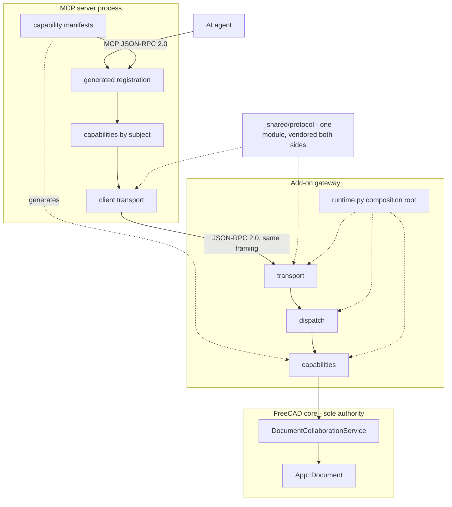

# FreeCAD MCP architecture refactor plan

Plan to reshape `feature/dirty-document-adoption` into a **thin two-process
adapter**: an MCP server free to use any dependency, and an add-on that is a
pure-stdlib gateway inside FreeCAD. One protocol implementation, one wire
encoding, one place to declare a capability.

This plan starts after native Phases 1–6 of the repository-root
[`freecad_document_collaboration_plan.md`](../../../../doc/freecad_document_collaboration_plan.md)
are complete. The collaboration plan's former standalone Phase 7 is absorbed
here: this plan first reorganizes and routes the MCP adapter, then performs the
authoritative collaboration cutover in Phase 18. After that gate, FreeCAD alone
owns collaboration, document lifecycle, persistence, recovery, and conflict
decisions. No phase may extend the temporary Python lease authority while it is
being retired.

The completed [`module-size-refactor-plan.md`](module-size-refactor-plan.md) is
the structural baseline. Its thin façades, explicit exports, compatibility
shims, and contract snapshots are inputs. Its ARCH001/ARCH002 size rules are
**not** — this plan retires them in Stage 0, because they are what produced the
31 modules currently split by line count rather than by subject.

**In scope**

- `addon/FreeCADMCP/` gateway layering, runtime ownership, and startup/shutdown
- `src/freecad_mcp/` client, capability packages, and tool registration
- the wire encoding and the single shared protocol module
- capability manifests and generated registration
- `addon/FreeCADMCP/document_lease/` compatibility and deprecation surfaces
- architecture policy replacing the module-size rules

**Out of scope**

- Redesigning the native collaboration model delivered by Phases 1–6 of the prerequisite plan
- Reintroducing MCP-owned sidecars, heartbeats, credentials, document ownership,
  save/recovery authority, or FCStd-difference conflict policy
- Renaming public **MCP tool** names, parameters, descriptions, or result envelopes
- Collapsing the two processes into one (see §3.2 for why)
- Moving off loopback TCP to a permissioned socket (see §3.4 — separate spike)
- Removing compatibility import shims; that is a later deprecation plan

**Success criteria**

- Public MCP tool names, parameters, descriptions, registration order, and
  returned envelopes remain contract-identical.
- Native FreeCAD remains the only owner of collaboration sessions, lifecycle
  epochs, dirty/persisted state, save, Save As, recovery, and mutation authority.
- The add-on imports nothing outside the Python standard library and FreeCAD.
- Exactly one protocol implementation exists, vendored into both processes and
  gated by a byte-equality check.
- The wire is JSON-RPC 2.0 end to end; failures travel as errors, not as
  success-shaped envelopes.
- Each capability is declared in exactly one manifest entry; registration is
  generated and asserted byte-equal to the frozen registry snapshot.
- One bootstrap composition root owns the only mutable process runtime singleton.
- No application code performs a `_rpc_mod()` runtime lookup.
- Architecture policy measures capability ownership, dependency direction, public
  surface, and complexity — never physical line count.

---

## 1. Goals and non-goals

### Goals

- Make the add-on a gateway, not a second application.
- Remove the encoding mismatch between the MCP hop and the RPC hop.
- Delete the protocol twins rather than synchronizing them.
- Declare each capability once and generate the rest.
- Construct runtime services explicitly and dispose them deterministically.
- Preserve every public MCP contract and existing import shim throughout.
- Keep every phase commit coherent, testable, revertible, and working.

### Non-goals

- Designing a second collaboration or lease state machine in Python.
- Moving native lifecycle, persistence, recovery, or rollback policy back to MCP.
- Building a ports-and-adapters layer where there is no policy left to protect.
- Introducing a dependency-injection framework.
- Removing old import paths because in-tree callers have migrated.
- Splitting or merging files to satisfy a line-count target.

---

## 2. Hard constraints

| Constraint | Implication |
|------------|-------------|
| Native foundation first | No phase starts until native collaboration Phases 1–6 are complete and verified against the actual tree. The former Phase 7 is executed through this plan. |
| Native authority target | Only FreeCAD may authorize document mutation or decide lifecycle, save, recovery, persistence, and conflict outcomes after Phase 18. Until then, existing lease machinery is frozen compatibility debt: it may keep the branch working but may not be expanded or become a dependency of new code. |
| Add-on dependency purity | The add-on imports only the Python standard library and FreeCAD. A compiled or third-party dependency in the add-on is blocking. |
| Compatibility lease records | New decoder/shim surfaces may decode historic data but may not rotate authority, fence a live document, or advance native lifecycle state. Existing live records remain only as named Phase 18 allowances until their callers are routed. |
| Public MCP surface | Tool names, parameters, descriptions, registration order, returned envelopes, and exported tool objects remain frozen by the registry snapshot. |
| Semantic RPC contract | The RPC contract is frozen as method name → parameters → result schema, **independent of encoding**, so it validates both listeners during migration. |
| Import compatibility | Every moved symbol keeps an explicit re-export at its old path. Shim removal is outside this plan. |
| GUI-thread safety | FreeCAD and Qt work remains behind the GUI dispatcher; capability code never bypasses it. |
| Typed authorization target | New and migrated internal code receives immutable authorization evidence, never a new unrestricted `local_confirmation=True` boolean; existing boolean paths are named allowances until their owning routing phase removes them. |
| Layer direction | `transport` → `dispatch` → `capabilities` → FreeCAD. No layer imports upward; `runtime` constructs the graph and is imported by none of them. |
| Runtime ownership target | By Phase 17, mutable process-wide services and registries exist only inside `AddonRuntime`, with at most one bootstrap-owned reference. |
| Generated registration | Generated output is asserted byte-equal to the frozen registry snapshot. A hand edit to generated code is blocking. |
| Manifest ownership | One manifest file per capability subject. A single global manifest is blocking — it destroys exclusive worker ownership. |
| Atomic phase commits | Every phase commit includes its focused regressions, leaves the branch working, and can be reverted independently. No stage squash, merge, or validation-only commits. |
| Docker-only evidence | Host-side test runs do not count. All evidence is produced in Docker. |

Related design inputs:

- [`freecad_document_collaboration_plan.md`](../../../../doc/freecad_document_collaboration_plan.md)
- [`module-size-refactor-plan.md`](module-size-refactor-plan.md)
- [`document-leases.md`](document-leases.md), [`lease-recovery.md`](lease-recovery.md), [`lease-security.md`](lease-security.md)
- [`request-lifecycle.md`](request-lifecycle.md), [`runtime-identity.md`](runtime-identity.md), [`structured-results.md`](structured-results.md)

When an older lease document conflicts with the native collaboration model or the
Phase 18 cutover contract, the collaboration plan wins. Preserve the old public
result or return its frozen deprecation result; do not extend or restore the old
authority implementation.

---

## 3. Target architecture

### 3.1 Collaboration authority target

The completed native foundation changes what several MCP lease concepts mean.
This plan preserves their public compatibility while routing every ingress to the
native boundary, then removes their old authority in Phase 18.

| Legacy concept | Post-cutover owner | MCP responsibility |
|---|---|---|
| Lease owner, token, generation, heartbeat | Removed; native edit sessions and epochs replace it | Decode old payloads, redact secrets, return the frozen compatibility result |
| Dirty adoption and `LOCKED_ERROR` handoff | Native collaboration session APIs | Gather typed GUI evidence, translate request and result |
| Local and foreign orphan recovery | Native lifecycle and recovery APIs | Invoke or query native recovery, or return the documented deprecation result |
| Save, Save As, finalize, release | Native FreeCAD lifecycle | Route one typed request, translate the response |
| Sidecar state and FCStd baseline comparison | Removed from MCP correctness | Read old formats only where migration or deprecation requires it |
| Close/reopen, persisted marker, lifecycle epoch | Native FreeCAD | Expose read-only status |

Phase 18 must prove that an MCP restart, replacement, or authentication-session loss
does not transfer, revoke, or corrupt document authority. Compatibility shims cannot
make a native operation legal and cannot mutate native session state.

### 3.2 Two processes, three layers

The process split stays. Three properties pay for it:

1. **Crash isolation.** A failed adapter leaves the CAD session and its unsaved
   document intact.
2. **Dependency freedom.** The MCP process uses any Python and any dependency;
   the add-on stays stdlib-only, so nothing compiled must be installed into four
   different FreeCAD bundle formats.
3. **The isolation model.** Headless `FreeCADCmd` workers and multi-instance
   scenarios require the MCP process to be separable from any one FreeCAD.

Inside the add-on, three layers and one composition root:

```text
addon/FreeCADMCP/
  transport/        listener, authentication, replay          (no FreeCAD import)
  dispatch/         GUI-thread marshalling, cancellation,
                    inflight and continuation registries      (no FreeCAD import)
  capabilities/     one package per subject; thin typed calls (FreeCAD here only)
  runtime.py        the single composition root
  _shared/protocol/ vendored; identical to the client copy
```

`transport` and `dispatch` are FreeCAD-free and therefore genuinely unit-testable
without FreeCAD. That is where a port abstraction earns its keep. It is **not**
introduced anywhere else: after the cutover the policy lives in C++, so a handler
per lifecycle verb would wrap exactly one typed native call and add nothing.



### 3.3 One protocol, one encoding

MCP **is** JSON-RPC 2.0. Today the client speaks JSON-RPC to the agent, re-encodes
to XML-RPC, and decodes back — an impedance mismatch between two halves of one
product. It has three concrete costs:

- **Errors.** XML-RPC gives `Fault(int, string)`. Anything richer must travel
  inside a *successful* response carrying a failure envelope. The collaboration
  design requires conflict results to return changed semantic keys with expected
  and current revisions (`freecad_document_collaboration_plan.md` §7); that maps
  onto `error.data` and nowhere good in XML-RPC.
- **Cancellation.** Advisory cancellation is fire-and-forget by nature. XML-RPC
  forces a full request/response cycle; JSON-RPC notifications do not.
- **Values.** XML-RPC has no `null` without a non-standard extension, and its
  standard integer is 32-bit signed — so the monotonic 64-bit revision counters
  must be smuggled as strings or doubles.

The two protocol implementations (`lease_protocol*` in the add-on, `rpc_auth*` in
the client) exist only because the boundary exists. Canonicalization, HMAC,
nonce, and bounds checking are pure stdlib. They become **one** module vendored
into both sides with a byte-equality check in CI. The existing conformance
vectors survive as ordinary tests of that module, not as a permanent
cross-process synchronization apparatus.

### 3.4 Encoding and channel are separate decisions

JSON-RPC 2.0 is the **encoding** and is platform-neutral; it proceeds in Stage 1.

Moving off loopback TCP to a permissioned channel — Unix domain socket or named
pipe — is the larger security win, because much of the signing layer exists to
defend a port reachable by any local process. It is **not** in this plan. CPython's
`AF_UNIX` support on Windows is patchy and the fallback is a named pipe or a token
file; that needs its own spike on the primary development platform. Stage 2 keeps
the listener swappable so the channel can change later without touching dispatch.

### 3.5 Capability manifests and generation

Every CAD capability currently lives in four hand-maintained places: the MCP tool
module, the client operation, the code template, and the add-on RPC method. That
is the cost worth removing, and the codebase already generates code — the
`templates/*.py.txt` files are generated FreeCAD scripts.

A capability is declared once, in a manifest owned by its subject:

```text
src/freecad_mcp/capabilities/<subject>/manifest.py
    name, description, parameter schema, result schema,
    execution mode (typed gateway call | generated script),
    GUI-thread requirement, mutation classification
```

The generator emits the MCP tool registration, the client call stub, and the
gateway dispatch entry. The manifest is **bootstrapped from** the existing frozen
registry snapshot, and generated output is then asserted byte-equal to it — a
mechanically stronger guarantee than review-verified relocation.

Generation must prove itself against the awkward subjects before the tree
commits: sketch constraints, FEM, and assembly joints. A subject that resists the
schema uses an escape hatch — the manifest entry points at a hand-written
implementation — but if all three need one, Stage 5 does not collapse as planned
and the phase list is revised under §5.5.

### 3.6 Moved-symbol compatibility

Every symbol moved by this plan remains importable from its old defining module.
Origin modules keep explicit re-exports and declare an explicit `__all__`; they do
not rebuild exports from `globals()`.

- Shims are import-only or documented deprecation adapters.
- Shims own no mutable state, registration, runtime lookup, authority, or policy.
- Internal modules import the defining module, never the old shim or a barrel.
- Module-to-package conversions retain the original path via `__init__.py`.
- A removed re-export is blocking and is restored in the same phase.
- Shim removal belongs to a later deprecation plan.

### 3.7 Architecture policy

ARCH001 (300 lines) and ARCH002 (one class per file) are retired in **Stage 0**,
not at the end. They are what produced `tools_sketch_curves_a2.py` and
`bind_part_2.py`; keeping them through the migration would distort every
intermediate state and force files to be moved twice. Their replacement lands in
the same phase:

- capability ownership — one subject per production module;
- layer direction — `transport` → `dispatch` → `capabilities`, never upward;
- no `_rpc_mod()` or equivalent runtime locator in any layer;
- no internal imports through package barrels;
- explicit, declarative, side-effect-free compatibility shims;
- public-symbol budget per package;
- per-function complexity, retaining Ruff `C901`; and
- a generous mixed-responsibility backstop so giant grab-bags still fail.

Cohesive modules holding several closely related value types are accepted. Giant
façades, mixed-capability grab-bags, and boundary-crossing imports fail.

---

## 4. Execution prerequisite and baseline

The authoring-time tree contains the completed native collaboration foundation and
the still-live pre-cutover lease machinery. Execution begins from that mixed
baseline, so **phase 1 refreshes this inventory before any implementation**. The
legacy authority paths remain frozen and explicitly allowed only until Phase 18.

### 4.1 What phase 1 must establish

1. **Recorded revisions.** Parent revision containing completed native Phase 6 and
   the MCP submodule revision selected as the refactor base.
2. **The planned compatibility manifest.** Every legacy lease path classified as
   temporary implementation, retained compatibility/deprecation shim, or planned
   removal. Phase 1 derives and commits this initial manifest as
   `tests/fixtures/post_collaboration_compatibility_surface.json`; Phase 18 updates
   it to the verified post-cutover state. The following are expected to survive as
   import, decoder, or deprecation shims — but the committed manifest, not this list,
   is authoritative:
   `src/freecad_mcp/lease_manager.py`, `document_lease/model.py`,
   `document_lease/types/transitions.py`, `document_lease/sidecar.py`,
   `document_lease/service.py`, `document_lease/service_ops/facade_bindings.py`,
   and the frozen public lease RPC adapters.
3. **Removal inventory.** Record every reachable `core_authority`,
   `claim_locked_error_handoff` owner rotation, lease observer, heartbeat, sidecar
   correctness path, and MCP save/recovery authority path. Each receives an explicit
   Phase 18 removal owner and a negative end-state assertion. New code may not call
   these paths.
4. **The locator census.** Per-module counts of `_rpc_mod()` and equivalent runtime
   lookups — 514 at authoring time. Stage 3 is sized from this census and the final
   gate measures against it.
5. **The compose-lane decision.** `tools/mcp/freecad-mcp/Dockerfile` installs
   FreeCAD from conda-forge, so the `core`, `e2e`, and `benchmark` services run
   against a build with **no native collaboration bindings**. Phase 1 records one of:
   (a) the compose image is rebased onto the Docker branch build, or (b) those
   services are scoped as adapter-only evidence and every phase touching a
   collaboration path additionally runs the branch-built cross-track lane. Deciding
   this at phase 1 rather than discovering it mid-stage is mandatory.
6. **The semantic contract snapshot.** `freecad_rpc_contract_snapshot.json` is
   rewritten as method → parameters → result schema, independent of encoding, so it
   validates both listeners during Stage 1.

If the actual native foundation or pre-cutover MCP tree contradicts the derived
manifest in a way that removes a phase's subject entirely, phase 1 **re-scopes the
phase list** under §5.5 and records the change. Stopping the program is reserved
for a contradiction that cannot be resolved by re-scoping.

### 4.2 Current seams

| Current area | Current pattern | Required end state |
|---|---|---|
| `rpc_server/rpc_server.py`, `rpc_server_ops/facade_bindings.py` | Transport façade, runtime globals, private helpers, and dynamically attached operations in one module | `transport/` plus a bootstrap-owned runtime |
| `rpc_server/methods/*_ops/` | Application paths locate `rpc_server` through `_rpc_mod()` and pass authorization booleans | `capabilities/` with constructor-injected collaborators and typed evidence |
| `rpc_server/server_lifecycle.py`, `server_shutdown.py`, `InitGui.py` | Startup and shutdown coordinate scattered module state | Construct and dispose one `AddonRuntime` |
| addon `lease_protocol*`, client `rpc_auth*` | Two compatible implementations | One vendored `_shared/protocol/`, byte-equality gated |
| `document_lease/service.py`, `service_ops/facade_bindings.py` | Methods attached after class definition | Thin façade delegating to capabilities |
| `lease_manager_ops/lease_client_manager*.py` | Class body assembled from binding modules | Normal class; old modules import-only shims |
| `tools_*_a.py`, `_b.py`, `_1.py`, `_2.py` (31 modules) | Ownership follows split suffixes | Subject packages generated from manifests; old paths declarative shims |
| `server_ops/tool_registration.py`, `tools_register_order.py`, `tool_exports/bind_part_*.py` | Registration mutates imported modules; order is a hand-written list | Typed `ToolDependencies`; generated ordered registration |
| `ci/lint_python.py` | ARCH001/ARCH002 enforce size and one-class rules | Capability, dependency, shim, surface, and complexity rules |

---

## 5. Multitask operating model

### 5.1 Roles

This plan adopts the prerequisite's Codex subagent policy
(`freecad_document_collaboration_plan.md` §5.1–§5.2). The earlier Composer/Cursor
policy in this document is superseded; the two plans run in one program and must
not use divergent worker policies.

| Role | Model and reasoning | Responsibilities |
|---|---|---|
| **Worker** | **GPT-5.6 Terra / high** by default; **GPT-5.6 Sol / high or xhigh** for the risk classes below | Implements one frozen workstream under exclusive file ownership. Does not edit shared files. Adds focused tests. |
| **Integrator** (parent) | Session parent model; raise effort for shared-seam integration | Partitions work, freezes interfaces, owns shared files, waits for every worker in a wave, combines outputs, runs every Docker suite, updates §11, creates the single phase commit. |
| **Reviewer** (read-only) | **GPT-5.6 Sol / xhigh**; **max** only for an unresolved correctness blocker | Reviews adversarially after every workstream and after integration. Reports blocking, important, and non-blocking findings. Never edits. |

Risk classes requiring Sol: the wire migration and error-model change, the shared
protocol module, runtime construction and disposal, cancellation and GUI-thread
seams, the generator's contract-equality proof, and every review gate.

### 5.2 Hard rules

1. Apply the prerequisite's §5.2.1 test before every spawn; record task, done
   condition, model, reasoning level, exclusive paths, and dependencies.
2. Do not delegate a whole phase to one worker when at least two safe workstreams
   exist; do not split a tightly coupled workstream to manufacture parallelism.
3. Assign exclusive file ownership before starting a wave.
4. Workers never edit §5.3 shared files.
5. Workers do not recursively delegate without explicit integrator authorization.
6. Workers report changed files, tests, assumptions, and blockers (§5.6).
7. One integrator owns shared files, integration, Docker execution, §11 updates,
   and the single phase commit.
8. The integrator waits for all workers in a wave before combining.
9. After every workstream, run a read-only **Sol / xhigh** review of the actual diff.
10. Fix every blocking and important finding, then re-review.
11. Run the required Docker suites before the phase commit (§5.7).
12. Do not mark a phase complete unless all reviews and suites pass.
13. If fewer than two independent workstreams remain, use one worker or work
    locally and record why.
14. One commit per phase, inside `tools/mcp/freecad-mcp`.
15. Every moved symbol keeps its old import path (§3.6); a removed re-export is blocking.
16. Verify assigned models before each wave; never silently downgrade.
17. Keep one runtime slot free for the integrator.

### 5.3 Shared files (integrator-only)

- `doc/freecad_mcp_architecture_refactor_plan.md`
- `ci/lint_python.py`, `tests/test_architecture_policy.py`
- `tests/fixtures/freecad_rpc_contract_snapshot.json`
- `tests/fixtures/mcp_tool_registry_contract_snapshot.json`
- `tests/fixtures/post_collaboration_compatibility_surface.json`
- `addon/FreeCADMCP/_shared/protocol/` and `src/freecad_mcp/_shared/protocol/`
- `addon/FreeCADMCP/runtime.py`, `rpc_server/rpc_server.py`,
  `rpc_server/server_lifecycle.py`, `rpc_server/server_shutdown.py`, `InitGui.py`
- `addon/FreeCADMCP/document_lease/__init__.py`; `document_lease/service.py` during façade reduction
- `src/freecad_mcp/server.py`, `tools_register_order.py`,
  `server_ops/tool_registration.py`, `server_ops/tool_exports/`
- the manifest **schema** and the generator; individual subject manifests are worker-owned
- central `__init__.py` and `__all__` composition files
- `Dockerfile`, `docker-compose.yml`, and the parent-repository gitlink
- for Phase 18, the parent plan, App/Gui authority sources and build registration,
  `src/Gui/Command.cpp`, `src/Gui/Dialogs/DlgMutationTakeover.*`,
  `tests/src/App/DocumentMutationAuthority.cpp`, and
  `tests/src/Gui/CollaborationAuthorityRemoval.cpp`

### 5.4 Cross-repository delivery

Except for Phase 18, substantive phase commits are created inside
`tools/mcp/freecad-mcp`. The parent gitlink is **not** frozen for the whole program:
the branch-built cross-track lane builds the parent branch at its recorded submodule
revision, so a frozen gitlink would test the pre-refactor add-on at every gate. The
integrator bumps the parent gitlink in a separate parent commit at each integration
gate (phases 1, 3, 5, 12, 18, 19, 22, and 23), or records that the lane mounts the
submodule worktree at its actual HEAD. Either is acceptable; leaving the gitlink
stale through the program is not.

Phase 18 is one logical cross-repository cutover with two unavoidable Git objects:
one squashed nested MCP commit and one parent commit containing the native authority
removal, the updated gitlink, both plan/progress updates, and the final cross-track
evidence. The parent commit is the canonical Phase 18 delivery. Worker commits are
never delivery units.

### 5.5 Re-scoping authority

Phase 1 alone may revise the phase list, and only from verified facts about the
native Phase 6 parent and pre-cutover MCP tree — a phase whose subject no longer
exists is deleted, and phases whose subjects merged become one. Every change is
recorded in §11.3 with its justification. After phase 1, the list is fixed; a later
discovery that invalidates a phase blocks under §7 rather than silently re-planning.

### 5.6 Worker report template

```text
## Workstream <id> report
- Phase commit: <number and exact subject>
- Changed paths: <exclusive files>
- Behavior preserved: <contracts and shims>
- Tests added or updated: <paths and cases>
- Docker validation: <commands and results>
- Assumptions or blockers: <none or explicit list>
```

### 5.7 Docker gates

**Every phase**

- affected unit tests, relevant contract fixtures, Ruff on touched files, and
  architecture lint when a boundary or package layout changes; plus
- the `unit` Compose service; plus
- the branch-built cross-track lane for any phase touching a collaboration path,
  per the phase-1 compose-lane decision (§4.1 item 5).

**Integration gates — phases 1, 3, 5, 12, 18, 19, 22, and 23**

- all four Compose services: `unit`, `e2e`, `core`, `benchmark`;
- architecture lint and full Ruff;
- registry, semantic RPC, import/deprecation, and protocol contract fixtures; and
- the branch-built FreeCAD and MCP cross-track lane.

The per-phase gate deliberately does not run all four services. The registry and
semantic contract snapshots are what protect the public surface, and they are cheap;
running `benchmark` after every file move buys nothing. The integrator records the
Docker image/digest, commands, counts, and results in §11. Host-side runs are ignored.

---

## 6. Ordered implementation

```text
Stage 0  Baseline, policy, and one protocol      phases 1–3
Stage 1  Wire migration to JSON-RPC 2.0          phases 4–5
Stage 2  Compatibility surfaces                  phases 6–7
Stage 3  Gateway layers                          phases 8–11
Stage 4  Locator removal and bootstrap           phases 12–17
Stage 5  Collaboration cutover                   phase 18
Stage 6  Typed registration                      phase 19
Stage 7  Manifests and generation                phases 20–22
Stage 8  Final enforcement                       phase 23
```

Phase numbers are continuous and authoritative. A later stage never starts before
all earlier phases and their marked gates are complete.

### Stage 0 — Baseline, policy, and one protocol

**Outcome:** the completed native foundation and temporary pre-cutover MCP state are
recorded as the execution baseline; the distorting size rules are gone before any
code moves; the protocol exists once.

| # | Phase commit | Change and main paths | Focused tests and validation |
|---:|---|---|---|
| 1 | `test(mcp): freeze the native collaboration baseline` | All six items in §4.1: revisions, planned compatibility manifest, removal inventory, locator census, compose-lane decision, and semantic contract snapshot. Refresh the MCP registry snapshot and record every temporary authority allowance without changing runtime behavior. | Import/deprecation, collaboration-boundary, semantic RPC, MCP registry, restart, legacy-authority census, and native-API availability contracts; **integration gate**. |
| 2 | `build(mcp): replace module size rules with boundary policy` | Retire ARCH001/ARCH002 from `ci/lint_python.py`; add capability ownership, layer direction, locator ban, barrel-import ban, shim purity, public-surface budget, and the mixed-responsibility backstop, each with named structural allowances recorded exactly. Phase 1 separately owns temporary authority allowances. Retain Ruff `C901`. | `tests/test_architecture_policy.py`; accept cohesive multi-class value modules; reject giant façades and grab-bags; architecture-only lint. |
| 3 | `refactor(mcp): extract the shared protocol module` | Create `_shared/protocol/` with canonicalization, signing, nonce, replay, and bounds checking; vendor identically into both processes; add the byte-equality CI check. `lease_protocol*` and `rpc_auth*` become import shims. Framing is still XML-RPC. | Existing protocol and auth suites become tests of the one module; byte-equality gate; both façades unchanged; **integration gate**. |

Phase 2 lands before any code moves, deliberately. Keeping a 300-line rule through
a migration forces files into shapes that must be undone later.

### Stage 1 — Wire migration

**Outcome:** JSON-RPC 2.0 end to end; failures are errors.

| # | Phase commit | Change and main paths | Focused tests and validation |
|---:|---|---|---|
| 4 | `feat(mcp): add the JSON-RPC 2.0 transport` | Add JSON-RPC 2.0 framing to `_shared/protocol/`; bind the new listener **alongside** XML-RPC onto the same dispatch path; define the structured error model mapping conflict, stale, cancellation, and lifecycle results onto `error.code/message/data`. | Both listeners satisfy the semantic contract; error-model mapping; batch; notification; `null` and 64-bit integer round-trips; replay and signing across both framings. |
| 5 | `refactor(mcp): migrate to JSON-RPC and retire XML-RPC` | Switch the client to JSON-RPC; convert success-shaped failure envelopes to native errors; add protocol-version negotiation with a clear mismatch error; remove the XML-RPC listener and leave a documented deprecation response. | Full semantic contract on the surviving listener; envelope-to-error conversion for every documented result; version-mismatch behavior; cancellation as notification; **integration gate**. |

Phase 4 leaves both listeners working, so phase 5 is independently revertible. The
error-model change lands here, before the generator exists, so the manifest's result
schema is designed against a native error model rather than inheriting the workaround.

### Stage 2 — Compatibility surfaces

**Outcome:** import-time class assembly is gone; native-session and historic-decoder
boundaries are explicit. Temporary live legacy behavior remains only behind named
Phase 18 allowances until the native routing phases replace it.

| # | Phase commit | Change and main paths | Focused tests and validation |
|---:|---|---|---|
| 6 | `refactor(mcp): define LeaseClientManager normally` | Move construction and methods into `lease_manager_ops/lease_client_manager.py`; binding and init modules become shims; introduce opaque native-session handles and compatibility results. Existing credential, heartbeat, and revocation behavior may remain only behind named Phase 18 allowances until phases 12–13 replace its live callers. | Construction, opaque handles, aliases, reconnect, redaction, public imports, no import-time binding, and no new legacy-authority dependency. |
| 7 | `refactor(mcp): isolate legacy lease decoders` | Separate immutable historic decoding in `model.py`, transition tables, and `sidecar.py` from the still-live legacy implementation. Decoder APIs cannot transition authority; all remaining mutable callers are enumerated as Phase 18 removals and otherwise left behaviorally unchanged until native routing is live. | Historic round-trip, malformed payloads, redaction, decoder immutability, forbidden decoder transitions, complete mutable-caller census, and unchanged temporary runtime behavior. |

**Parallelization:** two disjoint workers — 6 owns client paths, 7 owns add-on
`document_lease/` paths. They land in order.

### Stage 3 — Gateway layers

**Outcome:** the add-on has three layers and one composition root.

| # | Phase commit | Change and main paths | Focused tests and validation |
|---:|---|---|---|
| 8 | `refactor(mcp): introduce the gateway runtime` | Add `runtime.py` owning listener, dispatcher, workers, auth, replay, inflight and continuation registries, collaboration bridge, and shutdown state. It owns no document authority, dirty state, persistence, recovery policy, or sidecar store. | Pure construction, dependency identity, optional resources, ownership, and double-disposal — all without importing FreeCAD or Qt. |
| 9 | `refactor(mcp): establish the transport layer` | Move listener, authentication, and replay into `transport/`, consuming `_shared/protocol/`; keep the listener swappable so §3.4's channel change stays possible. | Bind, auth, replay, redaction, malformed framing, listener substitution, and no FreeCAD import from `transport/`. |
| 10 | `refactor(mcp): establish the dispatch layer` | Move GUI-thread marshalling, cancellation, and the inflight/continuation registries into `dispatch/`. | GUI-thread enforcement, cancellation, continuation bounds, timeout, concurrency, and no FreeCAD import from `dispatch/`. |
| 11 | `refactor(mcp): add the composition root` | Construct transport, dispatch, capabilities, auth, and the collaboration bridge in dependency order; existing startup calls this factory through a transitional hook before any locator is removed. | Authentication requirements, dependency sharing, transitional live-start wiring, forbidden authority dependencies, and rollback on construction failure. |

Phase 8 defines the container without starting it; phase 11 wires real adapters
through the existing startup path, so Stage 4 replaces locators without creating an
unused parallel graph.

### Stage 4 — Locator removal and bootstrap

**Outcome:** no runtime locator remains; startup and shutdown are deterministic.

Sized from the phase-1 census (514 sites at authoring time). Each phase reduces the
census measurably and records the remaining count.

| # | Phase commit | Change and main paths | Focused tests and validation |
|---:|---|---|---|
| 12 | `refactor(mcp): inject collaboration collaborators` | Add the thin `collaboration_client.py` and add-on `collaboration_api.py` bridge over the frozen native API; pass acquisition, adoption, handoff, and recovery collaborators into `methods/lease_methods_ops/`; remove their `_rpc_mod()` lookups. | Public compatibility shims, structured native results, reconnect, adoption, recovery, authorization, cancellation, continuation, timeout, dependency identity, and no-client-authority tests; **integration gate**. |
| 13 | `refactor(mcp): inject lifecycle collaborators` | Pass save, Save As, finalize, release, query, and deprecation collaborators into lease and lifecycle adapters; route them to native lifecycle results without MCP dirty, persistence, or recovery decisions. | Save, release, query, close/reopen, restart, cancellation, GUI dispatch, semantic RPC contract, and no-MCP-lifecycle-authority tests. |
| 14 | `refactor(mcp): inject execution collaborators` | Replace `_rpc_mod()` in dispatch, execute-code, and worker orchestration with injected dispatcher, execution-safety, worker, cancellation, and native compatibility-mutation dependencies. | Dispatch, execute-code, native mutation attribution, worker, cancellation, and AST no-locator scan. |
| 15 | `refactor(mcp): inject CAD collaborators` | Pass document, object, sketch, feature, transaction, and native collaboration/compatibility-commit collaborators into CAD adapters; remove their dependence on MCP mutation ownership. | CAD, object, sketch, feature, transaction, remote revision-stream publication, dependency identity, and AST no-locator scan. |
| 16 | `refactor(mcp): inject GUI and view collaborators` | Pass GUI dispatch, personal-view, presentation, snapshot, and restore collaborators into GUI and view adapters; add `collaboration_context.py` and route focus, screenshot, and refresh through the native personal-context API rather than authoritative global selection or active-view state. | GUI dispatch, camera/view, selection isolation, snapshot/restore, personal-context apply/render/restore, cancellation, and AST no-locator scan. |
| 17 | `refactor(mcp): bootstrap startup and shutdown through the runtime` | `start_rpc_server()` adopts the factory as its only path and publishes the singleton only after success; `stop_rpc_server()` cancels, stops, disposes, unsubscribes, drops adapter authentication/session handles, and clears idempotently without changing native document authority; `InitGui.py` routes manual start, auto-start, and about-to-quit through the root. | Repeated start, failed bind/auth/worker/bridge construction, reverse-order rollback, concurrent stop, inflight cancellation, native-session survival, partial runtime, repeated disposal, `InitGui` callback order, and no duplicate runtime. |

Phases 12–16 may be prepared in parallel where source and test ownership is disjoint;
workers add constructor parameters, the integrator edits central assembly. Phase 17 is
sequential and integrator-owned.

### Stage 5 — Collaboration cutover

**Outcome:** every remote mutation, lifecycle, recovery, and view operation uses the
native FreeCAD boundary; the temporary Python and native authority surfaces are gone.

| # | Phase commit | Change and main paths | Focused tests and validation |
|---:|---|---|---|
| 18 | `refactor(collaboration): cut over native MCP authority` | Remove live MCP lease ownership, heartbeat, sidecar-correctness, observer, FCStd-difference conflict, and save/recovery authority while retaining only the frozen decoder/deprecation shims. Remove the parent-tree `DocumentMutationAuthority`, `MutationCapability`, `MutationOwner`/`MutationOrigin`, `MutationAuthorityTLS`/`MutationInternalScope`, `DocumentPy` ownership methods, `AlterDoc` authority gate, and `DlgMutationTakeover` surface. Update package exports, CMake registration, the compatibility manifest, and both progress plans. | Remote operations enter the native revision stream; restart preserves document/lifecycle/persisted/recovery state; personal contexts are preserved; every old import returns its frozen shim or deprecation result; `CollaborationAuthorityRemoval.cpp` and negative reachability scans pass; branch-built App/Gui/Part tests, all four Compose services, and the branch cross-track lane pass; **integration gate**. |

Phase 18 starts only after phases 12–17 prove that every affected ingress and the
only startup path use injected native collaborators. Removal and façade rewiring are
integrator-owned because they cross the parent/submodule boundary. The compatibility
manifest changes from a planned classification to the verified post-cutover surface
in the same delivery. The cross-repository commit protocol in §5.4 is mandatory.

### Stage 6 — Typed registration

| # | Phase commit | Change and main paths | Focused tests and validation |
|---:|---|---|---|
| 19 | `refactor(mcp): pass a typed tool registration context` | Add `ToolDependencies` for server state, connection, recovery compatibility, collaboration, and selector; stop mutating imported tool modules in `server_ops/tool_registration.py`. | Simultaneous registration, dependency identity, selector isolation, deterministic order, no module mutation, server lifespan, registry snapshot; **integration gate**. |

This is the precondition for generation: a generated registrar must receive its
dependencies rather than reach for module globals.

### Stage 7 — Manifests and generation

**Outcome:** each capability is declared once; registration is generated and proven
equal to the frozen snapshot.

| # | Phase commit | Change and main paths | Focused tests and validation |
|---:|---|---|---|
| 20 | `feat(mcp): add capability manifests and the generator` | Define the manifest schema and the generator; bootstrap manifests for every subject from the frozen registry snapshot; emit registration, client stubs, and gateway dispatch entries into a shadow location. Prove the schema against sketch constraints, FEM, and assembly joints first. | Generated output byte-equal to the registry snapshot; schema coverage for the three awkward subjects; escape-hatch behavior; no hand edit to generated files. |
| 21 | `refactor(mcp): switch registration to generated output` | Replace `tools_register_order.py` and `server_ops/tool_exports/bind_part_*.py` with generated ordered registration; old modules become declarative shims. | Registration order, public server API, duplicate/missing exports, registry snapshot, and all old binder imports. |
| 22 | `refactor(mcp): delete the hand-written capability mirrors` | Remove the 31 mechanically split modules and the duplicated client operations and gateway methods now emitted by the generator; every old path remains an explicit shim. | Full registry snapshot, semantic RPC contract, generated FreeCAD code, per-subject behavior suites, and every old import path; **integration gate**. |

**Parallelization:** phase 20 is integrator-owned. In phases 21–22, disjoint workers
may migrate separate subjects concurrently; the integrator lands them in one commit
per phase and owns the generator, schema, and snapshots.

### Stage 8 — Final enforcement

| # | Phase commit | Change and main paths | Focused tests and validation |
|---:|---|---|---|
| 23 | `build(mcp): enforce the final architecture policy` | Remove every named structural allowance from phase 2; confirm Phase 18 removed every authority allowance; enforce add-on dependency purity, layer direction, zero locators against the phase-1 census, generated-registration equality, shim purity, and manifest-per-subject ownership. | Negative fixtures for each rule; full contract set; final **integration gate**. |

---

## 7. Verification checklist

### Every phase

- [ ] The exact next phase number and subject from §6 are used.
- [ ] The branch works before and after; the diff is independently revertible.
- [ ] Focused regressions land in the same commit as what they protect.
- [ ] Workers touched only exclusive paths; shared files were integrator-owned.
- [ ] Blocking and important review findings are cleared and re-reviewed.
- [ ] Public MCP names, parameters, order, envelopes, and old imports are unchanged
      or match the frozen deprecation contract.
- [ ] Every moved symbol has an explicit old-path shim with no import-time side effect.
- [ ] The add-on imports nothing outside the standard library and FreeCAD.
- [ ] `transport/` and `dispatch/` import no FreeCAD or Qt module.
- [ ] No new or migrated Python path creates document authority, lifecycle
      transitions, dirty state, sidecar correctness, or recovery policy; before
      Phase 18, every remaining legacy path is a named allowance from Phase 1.
- [ ] GUI work enters through the dispatcher; cancellation, replay, redaction, and
      authentication guarantees are intact.
- [ ] Required Docker suites pass per §5.7; Ruff passes on touched files.
- [ ] §11 is updated inside the substantive commit.

### At phase 1

- [ ] Native collaboration Phases 1–6 are complete at the recorded parent revision,
      and the selected MCP base revision is recorded.
- [ ] The planned compatibility manifest and complete Phase 18 removal inventory are committed.
- [ ] The locator census is recorded per module.
- [ ] The compose-lane decision is recorded and its consequences applied to §5.7.
- [ ] The contract snapshot is semantic, not encoding-bound.
- [ ] Any re-scoping under §5.5 is recorded with justification.

### At phase 5

- [ ] One listener remains and satisfies the full semantic contract.
- [ ] Every documented failure result travels as a JSON-RPC error, not as a success.
- [ ] Version mismatch produces a clear, documented error.
- [ ] 64-bit counters and `null` round-trip without smuggling.

### At phase 12

- [ ] The locator census has fallen measurably and the remaining count is recorded.

### At phase 19

- [ ] The locator census has fallen measurably and the remaining count is recorded.
- [ ] Tool registration receives typed dependencies and mutates no imported module.

### At phase 18

- [ ] Every remote mutation, lifecycle, recovery, save, and view ingress uses the native boundary.
- [ ] The final compatibility manifest matches the verified post-cutover tree.
- [ ] No live lease owner, heartbeat, sidecar correctness, observer, MCP save/recovery authority,
      `McpOwned`, `MutationAuthorityTLS`, `MutationInternalScope`, `AlterDoc` gate, or takeover dialog remains reachable.
- [ ] Restart, revision-stream, lifecycle/persistence/recovery, personal-context,
      import/deprecation, all-Compose, branch-built FreeCAD, and cross-track tests pass.

### At phase 22 and 23

- [ ] Generated registration is byte-equal to the frozen registry snapshot.
- [ ] Every capability has exactly one manifest entry and one subject owner.
- [ ] The locator census is zero.
- [ ] No structural allowance from phase 2 or authority allowance from phase 1 remains.
- [ ] Every old import path resolves; every shim is declarative.
- [ ] Architecture lint, Ruff, all four Compose services, contract fixtures, and the
      branch cross-track lane pass.

---

## 8. Commit sizing

| Delivery unit | Guidance |
|---|---|
| Invariant fix | One behavior correction plus focused regressions |
| Layer establishment | One layer, its tests, and its old-path shims |
| Locator slice | One adapter family; record the census delta |
| Wire slice | One listener addition or one retirement, never both |
| Capability migration | One subject per commit, including old-path shims |
| Contract fixture | Same commit as the surface freeze, or immediately before the protected move |
| Architecture gate | Substantive rule or allowance removal |
| Phase merge or squash | Forbidden |
| Validation-only commit | Forbidden |

Split when behavior, ownership, reviewability, or independent rollback provides a
real boundary — never to satisfy a line budget.

---

## 9. Risks and mitigations

| Risk | Mitigation |
|---|---|
| Native foundation or MCP base differs from this plan | Phase 1 derives the manifest from the real tree and may re-scope under §5.5 rather than improvising or stopping. |
| The former collaboration Phase 7 published no compatibility manifest | Phase 1 derives and commits the planned manifest; Phase 18 verifies and updates it to the final state. |
| Compose services cannot exercise the native API | Phase-1 compose-lane decision; collaboration-touching phases run the branch-built lane. |
| Temporary lease authority is expanded before cutover | Phase-1 named allowances, no-new-dependency checks, native routing phases, and Phase-18 negative reachability tests. |
| Wire migration breaks an unknown external caller | Confirm before phase 4 whether anything outside this repo calls the RPC surface; dual-bind keeps both listeners live through phase 4. |
| Error-model change loses a documented result | The semantic contract enumerates every result; phase 5 maps each one explicitly and tests the conversion. |
| Generation cannot express a subject | Phase 20 proves the schema against sketch constraints, FEM, and assembly joints **first**; escape hatches are allowed and counted. |
| The manifest becomes a shared file | One manifest per subject is a hard constraint; a global manifest is blocking. |
| Generated code is hand-edited | Byte-equality assertion plus an architecture rule; a hand edit fails the gate. |
| Vendored protocol copies drift | Byte-equality check in CI, not review discipline. |
| Retiring size rules early lets grab-bags return | Phase 2 lands the replacement policy in the same commit, including the mixed-responsibility backstop. |
| Compatibility imports disappear during moves | Committed shim manifest, explicit re-exports, import tests, blocking review policy. |
| Circular imports after package moves | Leaf modules import defining modules, never barrels; restructure edges rather than adding lazy imports. |
| Runtime resources leak or a second singleton appears | Construction rollback, disposal-order tests, singleton policy, architecture fixtures. |
| Parent gitlink goes stale and the cross-track lane tests old code | §5.4 requires a gitlink bump at every integration gate, or a worktree-mounted lane. |
| Parallel workers edit shared façades | Exclusive paths; integrator-only façades, barrels, registries, fixtures, generator, and composition root. |

---

## 10. Command reference

Run all MCP commands from `tools/mcp/freecad-mcp`.

```powershell
# Architecture rules only
docker run --rm -v "${PWD}:/workspace" -w /workspace `
  ghcr.io/astral-sh/uv:python3.12-bookworm-slim `
  uv run ci/lint_python.py --architecture-only addon/FreeCADMCP src/freecad_mcp

# Full package lint and Ruff
docker run --rm -v "${PWD}:/workspace" -w /workspace `
  ghcr.io/astral-sh/uv:python3.12-bookworm-slim `
  uv run ci/lint_python.py addon/FreeCADMCP src/freecad_mcp

# Per-phase gate
docker compose run --rm unit

# Integration gate
docker compose run --rm unit
docker compose run --rm e2e
docker compose run --rm core
docker compose run --rm benchmark
```

Integration gates also run the Docker branch-build lane recorded from the native foundation:
current-branch FreeCAD App/Gui/Part tests plus the `.woodpecker/ci.yml` equivalents of
`freecad-mcp-load-preflight`, `freecad-mcp-core-tests`, and `freecad-mcp-e2e` against
the branch-built `FreeCADCmd`. Record the frozen image, configure/build commands, and
job commands in §11 before phase 1. Do not substitute a host build.

---

## 11. Progress

### 11.1 Snapshot

| Field | Current value |
|---|---|
| Authoring parent checkout | `feature/assembly-interference-detection` at `2e4336f39a` (context only) |
| MCP authoring branch | `feature/dirty-document-adoption` at `fc3a5236` |
| Module-size baseline | Complete at `fc3a5236`; its size rules are retired by phase 2 |
| Collaboration prerequisite | Native Phases 1–6 complete; former Phase 7 absorbed into this plan as Phase 18 cutover |
| Execution parent revision | `TBD at phase 1` |
| Execution MCP base revision | `TBD at phase 1` |
| Current stage / phase | Planning revised; Stage 0 not started |
| Next phase | 1 — `test(mcp): freeze the native collaboration baseline` |
| In-flight ownership | None |
| Last review | Phase ordering reconciled against both plans and the live tree on 2026-08-03 |
| Blocker | None; Phase 1 must still record execution revisions, inventories, and the compose-lane decision |
| Resume hint | Verify native Phases 1–6 and the selected MCP base, then execute phase 1 only |

### 11.2 Stage status

| Stage | Phases | Integration gate | Status |
|---:|---|---|---|
| 0 | 1–3 | phases 1 and 3 | pending |
| 1 | 4–5 | phase 5 | pending |
| 2 | 6–7 | none | pending |
| 3 | 8–11 | none | pending |
| 4 | 12–17 | phase 12 | pending |
| 5 | 18 | phase 18 | pending |
| 6 | 19 | phase 19 | pending |
| 7 | 20–22 | phase 22 | pending |
| 8 | 23 | phase 23 | pending |

### 11.3 Progress log

Append entries newest-first. Each must be sufficient to resume without prior context.

#### 2026-08-03 — Collaboration cutover absorbed; plan expanded to 23 phases

- **Decision:** start this plan after native collaboration Phases 1–6. The former
  standalone collaboration Phase 7 is not a prerequisite or a separate delivery;
  its adapter and cutover obligations are now owned here.
- **Reason:** the prior plans formed a cycle: collaboration Phase 7 expected a
  stabilized MCP, while this plan required collaboration Phase 7 to have removed the
  lease authority before MCP work began.
- **Baseline change:** phase 1 records the native Phase 6 parent plus the live
  pre-cutover MCP tree, commits a planned compatibility manifest and complete removal
  inventory, and freezes every temporary authority path as a named allowance.
- **Ordering change:** phases 6–17 prepare compatibility surfaces, native routing,
  and deterministic bootstrap without expanding legacy authority. New Phase 18 then
  removes the live MCP lease/sidecar/heartbeat/save-recovery authority and the parent
  `McpOwned`/TLS/takeover surface in one cross-repository integration delivery.
- **Renumbering:** typed registration is phase 19, manifests/generation are phases
  20–22, and final enforcement is phase 23.
- **Live state checked:** the parent records MCP gitlink
  `fa98ad32a4dd80076200e1850a3169a67132566a`; the selected nested base is
  `49b2dfda63caa9915e15949889d8612c7816fbc2`, whose committed content tree matches
  the gitlink. This plan file is the only nested worktree change. Native
  authority files and legacy MCP authority paths remain present, while the planned
  collaboration client/bridge and final compatibility manifest are absent, matching
  the new pre-cutover baseline.
- **Next:** execute phase 1 only.

#### 2026-08-02 — Architecture redesigned; 70 phases reduced to 22 (superseded by 2026-08-03 ordering)

- **Base revisions:** authoring-time only; execution revisions intentionally TBD.
- **Superseded:** the previous 70-phase plan and its 2026-08-02 "Chaptered plan ready"
  entry. That plan was authored against the pre-cutover tree and sized its Stage 2
  (17 phases of ports and nine use-case handlers) and Stage 5 (25 phases of file
  relocation) against code the prerequisite either deletes or leaves as deprecation
  stubs. Its Composer/Cursor worker policy also contradicted the prerequisite's Codex
  policy.
- **Architecture decisions:**
  - Keep two processes. Crash isolation, the headless-worker isolation model, and a
    stdlib-only add-on outweigh the duplication the split costs.
  - The add-on becomes three layers plus one composition root. No ports-and-adapters
    layer beyond `transport` and `dispatch`, because post-cutover there is no policy
    left in Python to protect.
  - Move the wire to JSON-RPC 2.0. MCP is already JSON-RPC 2.0, so this removes a
    re-encode at the midpoint and lets failures travel as errors instead of inside
    success-shaped envelopes. Encoding and channel are decoupled; the permissioned-socket
    change is deferred to its own spike because `AF_UNIX` on Windows needs proving.
  - One vendored protocol module with a byte-equality gate replaces the two
    implementations and the permanent conformance-vector apparatus.
  - Declare each capability once in a per-subject manifest; generate registration,
    client stubs, and gateway dispatch; assert byte-equality against the frozen
    registry snapshot.
  - Retire ARCH001/ARCH002 in Stage 0 rather than at the end, since they are what
    produced the 31 line-count splits and would distort every intermediate state.
- **Review findings incorporated:** phase 1 may re-scope the phase list (§5.5) rather
  than only stopping; phase 1 derives the compatibility manifest if the prerequisite
  does not publish one (§4.1); the compose-lane limitation is a recorded phase-1
  decision (§4.1 item 5); the worker policy now matches the prerequisite's (§5.1); the
  parent gitlink is bumped at integration gates so the cross-track lane does not test
  the pre-refactor add-on (§5.4); the locator census is recorded per module (§4.1 item 4).
- **Open question blocking phase 4:** whether anything outside this repository calls the
  RPC surface — user macros, other add-ons, scripts against the port. If nothing does,
  the frozen XML-RPC surface is a refactor safety net rather than a public contract.
- **Contracts/shims:** no implementation or public surface changed; document only.
- **Next:** wait for the collaboration prerequisite through its phase 7, then execute
  phase 1 only.

#### 2026-08-02 — Chaptered plan ready (superseded)

- Retained for history. Its 70-phase list, Stage 0–7 structure, Composer/Cursor worker
  policy, and per-phase four-service Docker gate are replaced by the entry above.

---

## 12. Integrator cheat-sheet

1. Read §11.1 and the newest §11.3 entry first.
2. Verify native collaboration Phases 1–6 and record the parent and MCP base revisions.
3. Select exactly the next numbered phase from §6; do not skip ahead.
4. Freeze integrator-only shared paths from §5.3.
5. Give each worker exact exclusive source, target, and test paths plus forbidden paths.
6. State the native-authority rule and the public contracts the phase must preserve.
7. Require the §5.6 worker report and an adversarial Sol/xhigh review.
8. Clear blocking and important findings before integration.
9. Apply shared façade, barrel, registry, fixture, generator, and composition changes yourself.
10. Run the §5.7 gate for the phase; run the integration gate where §6 marks it.
11. Verify old-path shims, registry order, semantic RPC contract, and layer direction.
12. Update §11 inside the substantive phase commit.
13. Create the exact phase commit subject from §6.
14. Bump the parent gitlink at integration gates per §5.4.
15. Never add a phase squash, merge, shim-removal, or validation-only commit.
