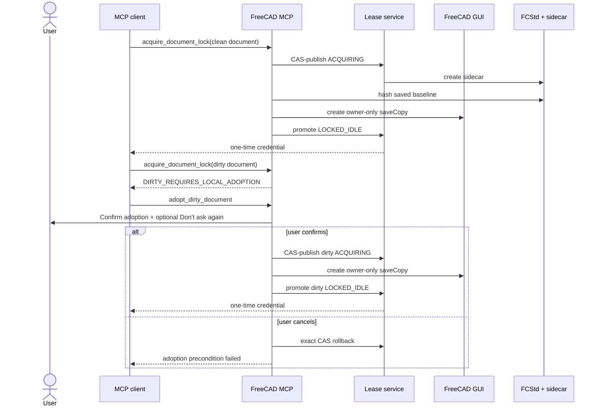
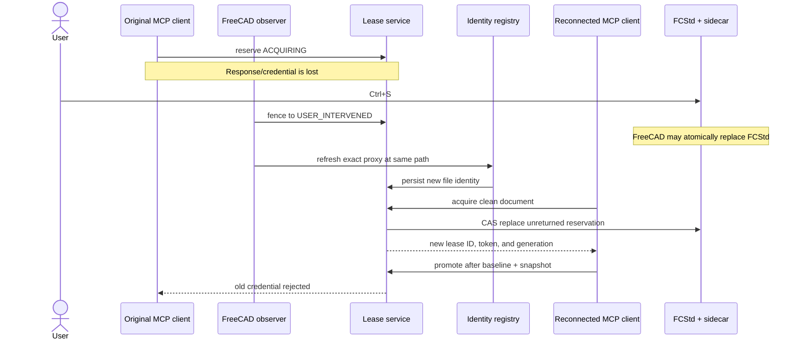
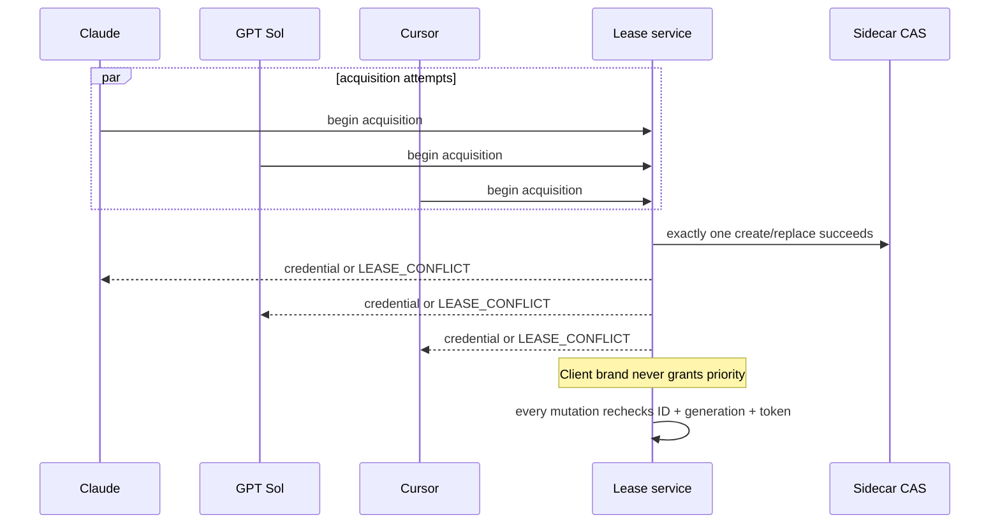

# Lease client scenarios

This document maps the supported acquisition, save, reconnect, and recovery
paths for any MCP client, including Claude, GPT Sol, and Cursor. Client names
are display metadata only. Coordination is based on the authenticated MCP
instance ID, addon runtime identity, document identity, lease ID, generation,
and bearer token.

The recovery exception described here is intentionally narrow. A new client
may replace a fenced acquisition reservation only when the reservation never
reached baseline/snapshot promotion and therefore cannot contain agent edits.
Any promoted lease, successful save, recovery snapshot, malformed authority,
or uncertain owner remains fail-closed.

## Clean and dirty acquisition



The “Don't ask again” choice applies only to later dirty adoptions in the
current FreeCAD process. Restarting FreeCAD restores the confirmation prompt.

## GUI save while acquisition response is unavailable

This is the path that previously produced the three-way deadlock:
`LEASE_CONFLICT`, missing mapped credential, and
`DIRTY_REQUIRES_LOCAL_ADOPTION`.



The identity refresh accepts only the same registered Python document proxy,
unchanged document name, and unchanged canonical path. Save As and proxy
replacement continue through their explicit guarded workflows.

## Restart with an adjacent orphaned reservation

```mermaid
sequenceDiagram
    participant OldFC as Previous FreeCAD
    participant Disk as FCStd + sidecar
    participant NewFC as Restarted FreeCAD
    participant Lease as Lease service
    participant Client as MCP client

    OldFC->>Disk: USER_INTERVENED unreturned reservation
    OldFC--xOldFC: process exits
    NewFC->>Disk: open current FCStd
    NewFC->>Lease: import adjacent recovery authority
    Note over Lease: Same path + exact unreturned shape only
    Client->>Lease: acquire clean document
    Lease->>NewFC: verify host, boot, PID, process start, runtime
    alt previous FreeCAD owner is proven dead
        Lease->>Disk: CAS rotate authority onto live document identity
        Lease-->>Client: new one-time credential
    else owner alive or death unknown
        Lease-->>Client: fail closed; sidecar unchanged
    end
```

A changed filesystem identity is tolerated during import only for this
unreturned-reservation shape. Replacement still requires proof that the
recorded FreeCAD owner is dead. A dead MCP child alone is not sufficient.

## Multiple clients



## Scenario and refusal matrix

| Live document | Existing authority | Owner evidence | Requested action | Expected result | Regression coverage |
|---|---|---|---|---|---|
| Clean | None | n/a | Acquire | Lease promoted and credential returned | RPC and lifecycle suites |
| Dirty | None | n/a | Normal acquire | `DIRTY_REQUIRES_LOCAL_ADOPTION` | dirty-adoption RPC suite |
| Dirty | None | User cancels | Adopt | Exact rollback; no sidecar or snapshot remains | `test_dirty_adoption_requires_local_confirmation` |
| Dirty | None | User confirms | Adopt | Dirty baseline snapshot and promoted lease | `test_dirty_adoption_snapshots_then_returns_dirty_lease` |
| Dirty | Unreturned `STALE` reservation | Same local runtime | Adopt | CAS rotation and new credential | `test_confirmed_dirty_adoption_fences_unreturned_stale_reservation` |
| Clean | Unreturned `USER_INTERVENED` reservation | Same local runtime | Acquire | CAS rotation and new credential | `test_gui_save_refreshes_identity_and_clean_retry_fences_lost_reservation` |
| Clean | Unreturned reservation after atomic GUI save | Same live proxy/path | Acquire | Identity refresh, then successful RPC acquisition | `test_gui_save_then_clean_acquire_avoids_identity_registration_deadlock` |
| Clean | Foreign unreturned reservation after restart | Previous FreeCAD proven dead | Acquire | Import, CAS rotation, and local identity rebind | `test_restart_rebinds_dead_unreturned_reservation_after_gui_save` |
| Clean | Foreign unreturned reservation after restart | Previous FreeCAD alive/unknown | Acquire | Refused; sidecar unchanged | `test_restart_will_not_replace_unreturned_reservation_if_owner_is_alive` and foreign recovery proof tests |
| Any | Promoted `STALE` or `USER_INTERVENED` lease | Any | Acquire/adopt | Refused; explicit recovery required | promoted stale/intervened refusal tests |
| Any | Active lease from another MCP instance | Any | Acquire | `LEASE_CONFLICT` | `test_clients_share_one_cas_fenced_acquisition_authority` |
| Any | Old credential after takeover/retry | Any | Authorize/mutate | Rejected by lease ID/generation/token fencing | authorization and multi-client tests |
| Any | Malformed, unknown-schema, changed, or mismatched sidecar | Any | Import/acquire | Refused and preserved byte-for-byte | foreign recovery and sidecar suites |
| Any | Save As or replacement document proxy | Any | Implicit identity refresh | Refused; guarded Save As/rebind required | `test_gui_save_refresh_rejects_save_as_and_replacement_proxy` |

## Invariants checked by the suite

- Only one MCP instance owns write authority for a document at a time.
- A token is returned once and is never persisted or exposed in status.
- Every retry rotates the lease ID, generation, and token.
- A GUI save can refresh file identity only after local fencing and only for
  the exact registered proxy at the same path.
- Automatic retry never replaces a promoted lease or one with a baseline,
  recovery snapshot, successful save, validation, or agent mutation history.
- Foreign retry requires compare-and-swap plus positive old-FreeCAD death
  proof; timeout or a dead MCP client is not enough.
- Unknown authority is preserved and blocks mutations.
