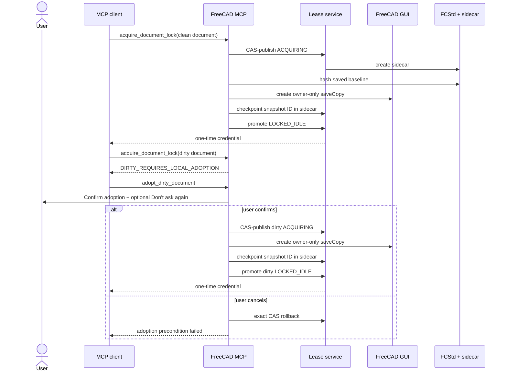
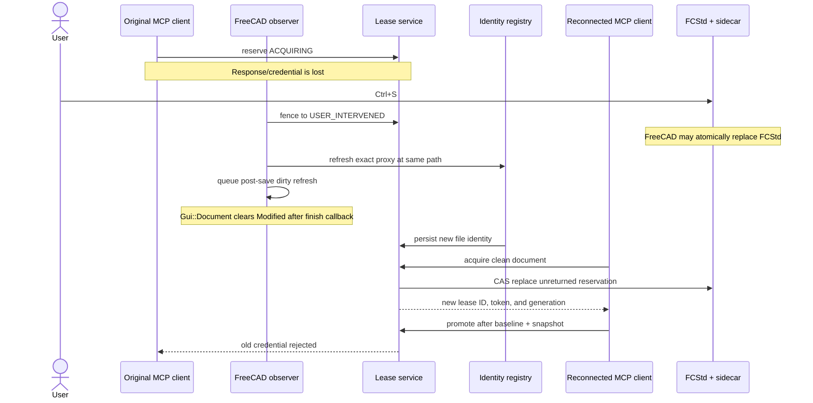
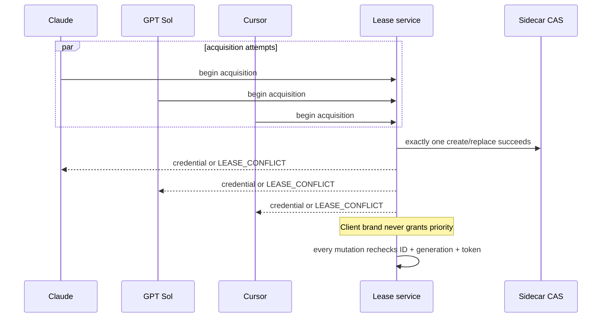

# Lease client scenarios

This document maps the supported acquisition, save, reconnect, and recovery
paths for any MCP client, including Claude, GPT Sol, and Cursor. Client names
are display metadata only. Coordination is based on the authenticated MCP
instance ID, addon runtime identity, document identity, lease ID, generation,
and bearer token.

The recovery exception described here is intentionally narrow. A new client
may replace a fenced acquisition reservation only when the reservation never
reached baseline/snapshot promotion and therefore cannot contain agent edits.
Any promoted lease, successful save, recovery snapshot, malformed authority,
or uncertain owner remains fail-closed.

## Clean and dirty acquisition



The “Don't ask again” choice applies only to later dirty adoptions in the
current FreeCAD process. Restarting FreeCAD restores the confirmation prompt.

## GUI save while acquisition response is unavailable

This is the path that previously produced the three-way deadlock:
`LEASE_CONFLICT`, missing mapped credential, and
`DIRTY_REQUIRES_LOCAL_ADOPTION`.



The identity refresh accepts only the same registered Python document proxy,
unchanged document name, and unchanged canonical path. Save As and proxy
replacement continue through their explicit guarded workflows.

## Restart with an adjacent orphaned reservation

```mermaid
sequenceDiagram
    participant OldFC as Previous FreeCAD
    participant Disk as FCStd + sidecar
    participant NewFC as Restarted FreeCAD
    participant Lease as Lease service
    participant Client as MCP client

    OldFC->>Disk: USER_INTERVENED unreturned reservation
    OldFC--xOldFC: process exits
    NewFC->>Disk: open current FCStd
    NewFC->>Lease: import adjacent recovery authority
    Note over Lease: Same path + exact unreturned shape only
    Client->>Lease: acquire clean document
    Lease->>NewFC: verify host, boot, PID, process start, runtime
    alt previous FreeCAD owner is proven dead
        Lease->>Disk: CAS rotate authority onto live document identity
        Lease-->>Client: new one-time credential
    else owner alive or death unknown
        Lease-->>Client: fail closed; sidecar unchanged
    end
```

A changed filesystem identity is tolerated during import only for this
unreturned-reservation shape. Replacement still requires proof that the
recorded FreeCAD owner is dead. A dead MCP child alone is not sufficient.
An `ACQUIRING` record from a dead FreeCAD process is also an unreturned
reservation: the public RPC does not return its credential until promotion.
It may be replaced after the same exact-shape, death-proof, and CAS checks.
An `ACQUIRING` record in the current FreeCAD process remains active and cannot
be replaced. If snapshot creation finished before the crash, its ID is already
checkpointed in the sidecar; that record is not automatically replaceable
because it may preserve unsaved user work.

## Close and reopen inside FreeCAD

```mermaid
sequenceDiagram
    actor User
    participant GUI as FreeCAD GUI
    participant Observer as Lease observer
    participant Identity as Identity registry
    participant Lease as Lease service
    participant Client as MCP client

    User->>GUI: Close document
    alt no local or foreign authority
        Observer->>Identity: unregister closed proxy
        User->>GUI: Reopen same FCStd
        GUI->>Identity: register fresh document UUID
    else recovery authority exists
        Observer->>Lease: fence local owner if needed
        Observer->>Identity: refresh exact same-path save identity
        Note over Observer: Covers close when finish-save callback was absent
        Observer->>Lease: retain one-shot close marker
        User->>GUI: Reopen same FCStd
        Lease->>Identity: exact proxy rebind
        Note over Observer: Delayed callbacks from old proxy are ignored
        alt untouched unreturned reservation
            Client->>Lease: CAS retry acquisition
            Lease-->>Client: new credential
        else promoted or otherwise recoverable lease
            Lease-->>Client: conflict; explicit recovery remains required
        end
    end
```

The rebind requires the same name, canonical path, and filesystem identity.
It is rejected when the close was not observed, the old proxy is supplied,
or the file changed while closed. Foreign recovery authority is retained
across the same close/reopen cycle without rewriting its sidecar.

## Multiple clients



## Scenario and refusal matrix

| Live document | Existing authority | Owner evidence | Requested action | Expected result | Regression coverage |
|---|---|---|---|---|---|
| Clean | None | n/a | Acquire | Lease promoted and credential returned | RPC and lifecycle suites |
| Clean or dirty | Successful acquire/adopt response | Current MCP process | Next mutation | Credential and name/path mapping are already in private custody | `test_acquire_and_adopt_custody_credential_before_next_mutation` and MCP lifecycle suite |
| Any | Successful acquire/adopt response is replayed idempotently | Same MCP process already custodied token | Re-handle response | Exact local grant is reused; redaction marker is never stored as a token | `test_idempotent_acquire_or_adopt_replay_reuses_custodied_redacted_token` |
| Dirty | None | n/a | Normal acquire | `DIRTY_REQUIRES_LOCAL_ADOPTION` | dirty-adoption RPC suite |
| Dirty | None | User cancels | Adopt | Exact rollback; no sidecar or snapshot remains | `test_dirty_adoption_requires_local_confirmation` |
| Dirty | None | User confirms | Adopt | Dirty baseline snapshot and promoted lease | `test_dirty_adoption_snapshots_then_returns_dirty_lease` |
| Dirty | Unreturned `STALE` reservation | Same local runtime | Adopt | CAS rotation and new credential | `test_confirmed_dirty_adoption_fences_unreturned_stale_reservation` |
| Clean | Unreturned `USER_INTERVENED` reservation | Same local runtime | Acquire | CAS rotation and new credential | `test_gui_save_refreshes_identity_and_clean_retry_fences_lost_reservation` and live `test_live_gui_save_close_reopen_rebinds_and_allows_clean_retry` |
| Clean | Unreturned reservation after atomic GUI save | Same live proxy/path | Acquire | Identity refresh, then successful RPC acquisition | `test_gui_save_then_clean_acquire_avoids_identity_registration_deadlock` |
| Clean or dirty | Local unreturned `STALE`/`USER_INTERVENED` reservation | Same local runtime | Acquire/adopt | All four state/dirty combinations rotate authority | `test_local_unreturned_reservation_retry_matrix` |
| Any | Local `ACQUIRING` reservation | Current FreeCAD process | Competing acquire | Refused while the original request may still be running | multi-client conflict tests |
| Clean | Foreign `ACQUIRING` reservation after restart | Previous FreeCAD proven dead | Acquire | Import and CAS rotation | `test_dead_foreign_unreturned_reservation_retry_matrix` |
| Clean or dirty | Foreign `ACQUIRING` with checkpointed snapshot | Previous FreeCAD dead | Acquire/adopt | Refused; snapshot recovery authority retained | `test_foreign_acquiring_with_checkpointed_snapshot_requires_recovery` |
| Clean | Foreign unreturned reservation after restart | Previous FreeCAD proven dead | Acquire | Import, CAS rotation, and local identity rebind | `test_restart_rebinds_dead_unreturned_reservation_after_gui_save` |
| Clean | Foreign unreturned reservation after restart | Previous FreeCAD alive/unknown | Acquire | Refused; sidecar unchanged | `test_restart_will_not_replace_unreturned_reservation_if_owner_is_alive` and foreign recovery proof tests |
| Dirty | Foreign `ACQUIRING` reservation after addon restart | Same FreeCAD process, replaced addon runtime | Adopt | Confirmed dirty adoption rotates authority | `test_same_freecad_addon_restart_retries_dirty_acquiring_reservation` |
| Any | Foreign reservation changed after import | Previous owner/concurrent process | Acquire/adopt | CAS refusal; changed sidecar preserved | `test_foreign_acquiring_retry_is_cas_fenced_after_import` |
| Any | Unlocked document is closed/reopened | No authority | Open/acquire | Old proxy unregistered; fresh identity registered | `test_unlocked_close_unregisters_identity_for_fresh_reopen` and live `test_live_unlocked_close_reopen_gets_fresh_session_identity` |
| Clean | Unreturned local reservation is closed/reopened | Exact same saved file | Acquire | One-shot proxy rebind, then CAS retry | `test_close_reopen_then_clean_acquire_avoids_identity_registration_deadlock` and live `test_live_gui_save_close_reopen_rebinds_and_allows_clean_retry` |
| Clean | Save-start is observed, finish-save is absent, then document closes | Same exact proxy/path | Close/reopen | Close refreshes atomic file identity and preserves one-shot rebind | `test_save_start_then_close_refreshes_identity_without_finish_callback` |
| Any | Deferred save callback runs after close/reopen | Old proxy replaced | Refresh dirty state | Callback is ignored and cannot overwrite the reopened document's state | `test_deferred_save_refresh_ignores_closed_proxy_after_reopen` |
| Any | Arbitrary observer callback arrives from closed proxy | Reopened document has a new owner | Fence mutation | Stale callback is ignored and cannot revoke the new owner | `test_stale_closed_proxy_callback_cannot_fence_reopened_owner` |
| Any | Promoted lease is closed/reopened | Exact same saved file | Acquire | Proxy rebind succeeds; recovery block remains | `test_close_reopen_rebinds_promoted_lease_but_keeps_recovery_block` |
| Any | Recovery document is closed/reopened | File identity changed while closed | Open/acquire | Rebind refused; authority retained | `test_close_reopen_refuses_changed_file_identity` |
| Any | Foreign recovery document is closed/reopened | Exact same saved file | Open/acquire | Foreign authority retained and rebound | `test_close_reopen_preserves_foreign_recovery_then_dead_owner_retry` |
| Any | Promoted `STALE` or `USER_INTERVENED` lease | Any | Acquire/adopt | Refused; explicit recovery required | promoted stale/intervened refusal tests |
| Any | Active lease from another MCP instance | Any | Acquire | `LEASE_CONFLICT` | `test_clients_share_one_cas_fenced_acquisition_authority` |
| Any | Claude, GPT Sol, and Cursor acquire simultaneously | Same FreeCAD process | Acquire | Exactly one winner and two conflicts | `test_simultaneous_claude_gpt_sol_cursor_race_has_one_winner` |
| Any | Old credential after takeover/retry | Any | Authorize/mutate | Rejected by lease ID/generation/token fencing | authorization and multi-client tests |
| Any | Malformed, unknown-schema, changed, or mismatched sidecar | Any | Import/acquire | Refused and preserved byte-for-byte | foreign recovery and sidecar suites |
| Any | Save As or replacement document proxy | Any | Implicit identity refresh | Refused; guarded Save As/rebind required | `test_gui_save_refresh_rejects_save_as_and_replacement_proxy` |

## Coverage layers and boundary

The pure-Python suite exhaustively parameterizes the supported protocol state
machine: clean/dirty state, local/foreign authority, owner liveness, file
identity, snapshot checkpoint, callback order, client race, cancellation, and
compare-and-swap conflict. The live `FreeCADCmd` layer then verifies the
runtime adapters with temporary documents:

- real FCStd save and atomic same-path file identity;
- real App document observer callbacks;
- real close/open proxy replacement and one-shot rebind;
- embedded Python 3.11 MCP schema import;
- RPC shutdown with active and queued workers; and
- Windows Job Object descendant termination.

`FreeCADCmd` has no interactive `Gui::Document`, so the live save test models
only the final GUI dirty-flag clear that `Gui::Document::save()` performs after
`App::Document::save()` returns. The callback, FCStd write, file identity,
sidecar CAS, close, reopen, and retry are real. GUI confirmation rendering and
the “Don't ask again” preference are separately tested at the dialog boundary.

No finite suite can enumerate hardware failure, arbitrary third-party macros,
or malicious external sidecar changes at every machine instruction. Those
cases are covered by the fail-closed invariants below: unknown or changed
authority is preserved, no credential is inferred, and mutation remains
blocked until explicit recovery.

## Invariants checked by the suite

- Only one MCP instance owns write authority for a document at a time.
- A token is returned once and is never persisted or exposed in status.
- Every retry rotates the lease ID, generation, and token.
- A GUI save can refresh file identity only after local fencing and only for
  the exact registered proxy at the same path.
- A callback from a closed proxy cannot resolve by reused name/path into its
  reopened replacement or update that replacement's recovery state.
- Automatic retry never replaces a promoted lease or one with a baseline,
  recovery snapshot, successful save, validation, or agent mutation history.
- A recovery snapshot ID is persisted while still `ACQUIRING`, before the
  promotion CAS, closing the process-exit window after `saveCopy`.
- Foreign retry requires compare-and-swap plus positive old-FreeCAD death
  proof; timeout or a dead MCP client is not enough.
- Closing an unlocked document removes its stale proxy identity; closing a
  recovery document retains only a one-shot, exact-file rebind capability.
- Unknown authority is preserved and blocks mutations.
