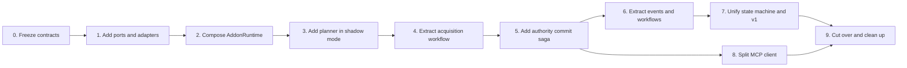

# FreeCAD MCP lease architecture integration plan

Status: proposed

Source: [`mcp-plan.md`](mcp-plan.md)

## 1. Purpose

This plan turns the lease redesign into a sequence of mergeable changes for the
current FreeCAD MCP repository. The target is the modular monolith described in
the source design: pure lease policy, explicit application workflows, ports and
adapters for FreeCAD and persistence, and thin RPC/MCP boundaries.

The integration changes the orchestration, not the lease protocol. Existing
clients, saved sidecars, recovery artifacts, and legacy callers must continue to
work throughout the migration.

## 2. Required outcome

At completion:

- `FreeCADRPC._acquire_document_lock_v2()` is a thin RPC adapter over an
  `AcquisitionWorkflow`.
- acquisition and recovery routing is represented by typed plans, not expected
  exceptions or a `dict[str, Any]` phase bag;
- authority changes are committed by one journaled saga with prepared
  credential escrow;
- one lease aggregate and state machine authorize both v2 and compatibility
  operations;
- the process-lifetime `AddonRuntime` owns all lease dependencies and survives
  XML-RPC listener restarts;
- FreeCAD observers emit typed events to injected handlers and do not discover
  services through `sys.modules`;
- MCP-side transport, lease API, credential custody, heartbeat, and tool result
  formatting are separate components;
- raw lease tokens remain confined to the server escrow and MCP credential
  vault.

## 3. Compatibility guardrails

The following are invariants, not redesign opportunities:

| Surface | Integration rule |
| --- | --- |
| XML-RPC v2 | Preserve method names, request envelopes, authentication, request IDs, response fields, and public error codes. |
| Legacy RPC | Keep v1 behavior through a compatibility facade until the v2 domain passes the legacy compatibility suite. |
| Sidecars | Keep schema version, field meanings, canonical path rules, CAS semantics, permissions, and fail-closed parsing unchanged. |
| Credentials | Return a raw token once, retain an unacknowledged credential without expiry, redact all public/diagnostic data, and require explicit custody acknowledgement. |
| Authority | Preserve exact document identity, generation fencing, prequeue authorization, GUI-thread reauthorization, and FreeCAD core mutation fencing. |
| Recovery | Preserve snapshots, owner-death proof, no automatic stale deletion, saved-file baseline verification, and fail-closed unknown liveness. |
| Threading | FreeCAD document and core-authority calls stay on the GUI thread; hashing, sidecar I/O, and OS liveness checks stay off it. |
| Runtime lifetime | Listener stop/start must not replace process-owned identity, request history, escrow, lease state, observer state, or watchdog ownership. |

No sidecar data migration or coordinated MCP client/server flag day is required.

## 4. Design decisions

These decisions are fixed for this migration unless the plan is explicitly
amended with a reason and corresponding test changes.

| ID | Decision | Reason and consequence |
| --- | --- | --- |
| D1 | Keep a modular monolith inside the FreeCAD process. | The design needs clear boundaries, not independently deployed services or another network failure domain. |
| D2 | Preserve the existing protocol and persisted sidecar contract. | The work can roll out incrementally without a client/server flag day or sidecar migration. |
| D3 | Keep `document_lease` as the addon package root. | Both installed-FreeCAD and repository import styles already use it; internal subpackages provide the new boundaries with less import risk. |
| D4 | Use one process-lifetime `AddonRuntime`. | Listener restart must not replace identity, lease state, request history, escrow, observer state, or watchdog ownership. |
| D5 | Inspect first, then return a typed plan or rejection. | Expected recovery choices are domain decisions, not exceptions, and execution never rediscovers policy halfway through. |
| D6 | Use immutable typed workflow context values. | Phase inputs and missing evidence remain visible to type checking and tests; no new `dict[str, Any]` workflow state is allowed. |
| D7 | Route every authority rotation through one journaled saga. | Sidecar, core authority, in-memory state, escrow, and request publication must converge to `COMMITTED`, `ROLLED_BACK`, or fail-closed `UNCERTAIN`. |
| D8 | Prepare credential escrow before authority changes. | A successfully rotated authority must never lose the only raw credential needed by its owner. |
| D9 | Keep GUI and non-GUI work separated by ports. | Document proxy access, snapshots, and core authority stay on the GUI thread; hashing, sidecar I/O, and process inspection stay off it. |
| D10 | Use one aggregate, repository, and transition table for v1 and v2. | A compatibility adapter may translate calls, but it may not own independent authority or policy. |
| D11 | Keep raw credentials behind escrow/vault boundaries. | Controllers, workflows, lifecycle status, telemetry, journals, and model-facing tool results contain redacted data only. |
| D12 | Enforce the new Python architecture with `ci/lint_python.py`. | Every new or migrated Python file must pass Ruff, stay at or below 300 physical lines, and declare at most one class. Split plan types and handlers into separate modules where necessary. |
| D13 | Migrate through delegating facades and measurable exit gates. | Each phase remains mergeable and reversible while only one component is authoritative for each policy decision. |
| D14 | Run all tests in Docker. | Host `pytest` results are not accepted as verification. Focused tests run through the Docker test image, and every phase/release exit runs the complete unit, e2e, core, and benchmark services. |

Run the lint gate from `tools/mcp/freecad-mcp`:

```text
uv run ci/lint_python.py <changed-python-paths>
```

Run it against every new or migrated Python file in each change. Run it against
the full newly introduced package boundary at the phase exit gate. Existing
legacy files are not evidence that new files may exceed these limits; when a
legacy file is migrated, split it rather than copying its size or class density.

## 5. Current integration seams

The plan is grounded in these current components:

| Current component | Current role | Migration seam |
| --- | --- | --- |
| `addon/FreeCADMCP/rpc_server/rpc_server.py` | RPC authentication, process globals, acquisition workflow, GUI dispatch, recovery, and result mapping | Add `LeaseRpcController`, then delegate existing RPC methods to it. |
| `FreeCADRPC._acquire_document_lock_v2()` | Mutable, exception-routed acquisition workflow | Replace its internals with a typed `AcquisitionWorkflow` call. |
| `document_lease/service.py` / `DocumentLeaseService` | Lease rules plus persistence, liveness, recovery, and commit orchestration | Put contracts around it first, then move responsibilities one at a time. |
| `document_lease/sidecar.py` / `SidecarStore` | Durable v2 sidecar parsing and CAS | Adapt it to `LeaseRepository`; keep its bytes-on-disk behavior stable. |
| `document_lease/model.py` | v2 state, records, transitions, credentials, and checkpoints | Split internally into aggregate components while retaining exports and serialization. |
| `document_lock.py` | Legacy state machine, request scope, mutation attribution, observer behavior, and compatibility APIs | Extract dedicated concerns and end as `LegacyV1LeaseAdapter` plus a small facade. |
| `acquisition_claims.py` | One-shot credential claim and acknowledgement | Evolve behind `AcquisitionCredentialEscrow`; add prepare/publish states. |
| `handoff_continuations.py` and `inflight_requests.py` | Handoff-specific progress plus general cancellation state | Introduce a generic acquisition lifecycle store without weakening existing cancellation semantics. |
| `document_lease/observer.py` | FreeCAD callbacks plus runtime discovery and takeover policy | Inject a `DocumentEventHandler`; leave callbacks as event translation only. |
| `src/freecad_mcp/freecad_client.py` | Transport, authenticated invocation, recovery, lease calls, and other client operations | Retain `FreeCADConnection` as a facade while extracting transport and lease API. |
| `src/freecad_mcp/lease_manager.py` | Session state, credential custody, aliasing, revocation, and redaction | Make it implement `ClientCredentialVault`, then narrow non-vault responsibilities. |
| `src/freecad_mcp/operations/locking.py` | Tool orchestration, credential intake, compatibility token maps, and public results | Delegate custody/session work and keep only model-facing redacted outcomes. |

### Package integration decision

Use the existing `addon/FreeCADMCP/document_lease` package as the migration root.
The source design's `lease/domain`, `lease/application`, `lease/ports`, and
`lease/adapters` boundaries will be created beneath it. This preserves both
installed-FreeCAD imports (`document_lease`) and repository imports
(`addon.FreeCADMCP.document_lease`). Existing modules become compatibility
facades as their implementations move.

The target addon layout is:

```text
addon/FreeCADMCP/
├── document_lease/
│   ├── domain/
│   ├── application/
│   ├── ports/
│   ├── adapters/
│   │   ├── filesystem/
│   │   ├── freecad/
│   │   ├── os/
│   │   └── security/
│   ├── model.py              # compatibility re-exports
│   ├── service.py            # temporary compatibility facade
│   ├── sidecar.py            # compatibility re-exports
│   └── observer.py           # FreeCAD callback adapter
├── rpc_server/
│   ├── lease_controller.py
│   └── request_context.py
├── compat/
│   └── v1_lease_adapter.py
└── runtime.py
```

The MCP-side target remains:

```text
src/freecad_mcp/
├── lease/
│   ├── api_client.py
│   ├── session_coordinator.py
│   ├── credential_vault.py
│   ├── heartbeat_service.py
│   └── models.py
├── transport/
│   └── xmlrpc_transport.py
├── freecad_client.py         # compatibility facade
└── operations/
    └── locking.py            # redacted tool boundary
```

## 6. Delivery sequence



Each phase must be independently mergeable. A phase may add a facade or
temporary adapter, but it may not leave two components independently deciding
lease policy.

### Current progress

Last assessed: 2026-07-31

Status refers to completion of this architecture migration. Existing safety
features are listed as foundations, but they do not count as a completed phase
until that phase's exit gate passes.

| Phase | Status | Current evidence | Remaining work / completion gate |
| --- | --- | --- | --- |
| 0. Freeze observable contracts | 🟡 Partially covered | The repository already has broad lease, RPC lifecycle, cancellation, response-loss, sidecar, save, legacy, and mutation-attribution tests. | Add the explicit wire/error-code contract fixtures, complete sidecar golden fixtures, scenario-to-test mapping, and dual-import singleton tests described below. |
| 1. Ports and delegating adapters | ⚪ Not started | `DocumentLeaseService`, `SidecarStore`, core-authority helpers, snapshot service, liveness probes, and GUI dispatch exist as adapter candidates. | No `document_lease/ports` or `document_lease/adapters` boundary exists yet; add contracts and prove behavioral parity. |
| 2. Process composition root | ⚪ Not started | The current runtime objects already have process-lifetime intent. | Add `AddonRuntime`; replace writable RPC globals and observer discovery while preserving listener-restart behavior. |
| 3. Acquisition planner | ⚪ Not started | The current service and RPC path contain the decision rules and scenario coverage. | Add typed evidence, plan/rejection types, table-driven tests, and shadow comparison. Expected recovery still routes through exceptions. |
| 4. Acquisition workflow/controller | ⚪ Not started | Acquisition already has explicit operational checkpoints and GUI/off-GUI phases. | Extract the controller, workflow, handlers, and typed context. `_acquire_document_lock_v2()` still owns the workflow and mutable phase dictionaries. |
| 5. Authority commit saga | ⚪ Not started; safety foundations exist | Sidecar CAS, core fencing, credential claim/acknowledgement, snapshots, compensation, and uncertain-result handling already exist. | Add prepared escrow, one commit journal/saga, reconciliation, and fault injection at every commit step. |
| 6. Events and document workflows | ⚪ Not started; implementation exists in coupled form | Observer, save, release, takeover, mutation attribution, and snapshot attribution behavior already exists. | Extract typed events and workflows. The observer still discovers modules through `sys.modules` and participates in policy. |
| 7. One state machine and v1 adapter | ⚪ Not started | v2 domain behavior and legacy compatibility tests are present. | Introduce the aggregate split and v1 adapter, then remove the duplicate `LeaseState` and `LeaseRecord` from `document_lock.py`. |
| 8. MCP client split | 🟡 Partially covered | `LeaseManager` already protects raw credentials, and locking operations redact model-facing results. | Extract `XmlRpcTransport`, `LeaseApiClient`, `LeaseSessionCoordinator`, vault interface, and heartbeat service while retaining facades. |
| 9. Cutover and cleanup | ⚪ Not started | Compatibility paths remain available for a staged migration. | Complete both dependency branches, pass all release gates, remove old orchestration and temporary switches, and update documentation. |

Overall: **0 of 10 phases have passed their exit gates**. Phase 0 and Phase 8
have meaningful partial coverage, and Phase 5 has strong safety primitives, but
the target architecture classes and package boundaries have not yet been added.
The next implementation step is Phase 0, followed by the Phase 1 port contracts.

Update this table in the same change that satisfies or invalidates a phase exit
gate; do not mark a phase complete based only on files or class names being
present.

## 7. Progression

### How to continue the work

At the start of every implementation session:

1. Read this plan, inspect both repository statuses, and preserve unrelated or
   uncommitted work.
2. Recheck the current-progress table against the code and tests; the table is a
   navigation aid, while passing exit gates are the source of truth.
3. Select the first incomplete phase whose dependencies in the delivery graph
   are complete. Work on the smallest behavior slice that advances its exit
   gate.
4. Add or update characterization tests before changing behavior-sensitive
   lease code.
5. Run `uv run ci/lint_python.py <changed-python-paths>` for all changed Python
   files. Run every focused and regression test through Docker; never use host
   `pytest` as verification. At a phase exit, run all four Docker suites: unit,
   e2e, core, and benchmark.
6. Update the current-progress row, its `Last assessed` date, and the progression
   log in the same change. Mark a phase complete only when every listed exit
   condition passes.

Do not skip a dependency because later-phase foundations already exist. If a
phase is blocked, record the exact failed gate and continue only with an
independent branch shown in the delivery graph.

### Progression log

| Date | Phase | Progress | Verification | Next action |
| --- | --- | --- | --- | --- |
| 2026-07-31 | Planning | Derived the integration plan, added the delivery status baseline, and incorporated the strict Python lint/architecture gate. | Repository structure and current target-class absence inspected; Markdown structure checked. | Start Phase 0 by inventorying and freezing the wire response/error-code contracts. |

Keep this log concise: one row per meaningful merged slice or exit-gate change,
not one row per edit or test invocation.

### Minimal resume prompt

```text
Read tools/mcp/freecad-mcp/doc/mcp-integration-plan.md, verify its progress, and continue the next incomplete phase. Follow its design and lint gates, run every test in Docker (never host pytest), run unit/e2e/core/benchmark before completing a phase, and update the progress table and log.
```

## 8. Phase 0 — freeze observable contracts

Goal: make behavioral drift visible before moving code.

Changes:

- add wire-contract tests for acquire, dirty adopt, pending handoff, request
  status, claim, acknowledge, cancel, heartbeat, save, Save As, release, and
  takeover;
- add golden round-trip fixtures for every effective v2 sidecar state and Save
  As migration role;
- record the current public error codes and redaction guarantees;
- map the scenarios in `doc/lease-client-scenarios.md` to named tests;
- add tests proving both supported addon import styles resolve the same
  process-owned runtime objects.

Primary existing tests:

- `test_rpc_dirty_adoption.py`
- `test_rpc_request_idempotency.py`
- `test_rpc_request_cancellation.py`
- `test_document_lease_v2_model.py`
- `test_document_lease_v2_service.py`
- `test_document_lease_v2_sidecar.py`
- `test_mcp_rpc_v2_lifecycle.py`
- `test_legacy_lease_compatibility.py`
- `test_gui_mutation_attribution.py`
- `test_save_service.py`

Exit gate:

- the contract fixtures cover success, denial, retry, response loss, rollback,
  and uncertain completion;
- the existing implementation passes them unchanged;
- no raw token or token-derived fingerprint appears in a public error,
  lifecycle status, journal fixture, log capture, or replay result.

## 9. Phase 1 — add ports and delegating adapters

Goal: introduce dependency boundaries with no control-flow change.

Add pure contracts under `document_lease/ports`:

- `LeaseRepository`
- `DocumentGateway`
- `SnapshotPort`
- `CoreAuthorityPort`
- `ProcessLivenessPort`
- `AcquisitionCredentialEscrow`
- `BaselineHasher`
- `GuiExecutor`

Add adapters that delegate to `SidecarStore`, the current identity helpers,
snapshot service, `core_authority`, process probes, claim store, SHA-256 capture,
and current GUI dispatcher. Keep FreeCAD imports out of domain and port modules.

Integration steps:

1. Define typed inputs/outputs and contract tests.
2. Wrap current implementations without moving their logic.
3. Inject the wrappers into `DocumentLeaseService` through backward-compatible
   constructor defaults.
4. Replace direct callback arguments only after the corresponding port is in
   use and tested.

Exit gate:

- adapters reproduce current sidecar CAS conflict and uncertain-commit
  behavior;
- GUI adapters reject or dispatch off-thread calls consistently;
- domain and port tests import without FreeCAD or Qt;
- all Phase 0 tests remain unchanged and green.

Rollback: remove injected bindings and continue through the existing defaults;
there is no persisted-format change.

## 10. Phase 2 — introduce the process composition root

Goal: replace hidden module discovery and globals with one process-lifetime
owner, without changing listener lifecycle.

Add `addon/FreeCADMCP/runtime.py` with `AddonRuntime.start()`,
`start_listener_services()`, `stop_listener_services()`, and `stop()`. It owns:

- identity, lease repository/service, core and document adapters;
- request replay, inflight cancellation, lifecycle requests, and escrow;
- save service, observer/event handler, runtime manifest, and watchdog;
- workflow and controller instances as they are introduced.

Integration steps:

1. Build the runtime from the same settings currently consumed by
   `initialize_document_lease_runtime()`.
2. Make current module globals read-only compatibility aliases/accessors to the
   runtime during the migration.
3. Make `InitGui.py` start the runtime once, register its observer, and connect
   final `aboutToQuit` shutdown once.
4. Make RPC listener start/stop operate only on listener-scoped resources.
5. Inject the runtime service into the observer; remove `sys.modules` discovery
   only when the event handler lands in Phase 6.

Exit gate:

- listener restart preserves addon runtime ID, document session IDs, active and
  recovery records, request replay, claimable credentials, and watchdog;
- final addon shutdown stops the watchdog and unregisters observers exactly
  once;
- importing through either supported module path does not create a second
  runtime.

## 11. Phase 3 — extract acquisition planning in shadow mode

Goal: express every expected acquisition/recovery decision as data before it is
allowed to drive mutations.

Add immutable domain types:

- `AcquisitionCommand` and `AcquisitionIntent`;
- `LiveDocumentEvidence` and `AuthorityEvidence`;
- `AcquisitionPlan` and `AcquisitionPlanKind`;
- `AcquisitionRejection` for expected denials;
- `AcquisitionPlanner` as a pure service.

The plan kinds are:

```text
FRESH_CLEAN
FRESH_DIRTY
REPLACE_UNRETURNED_RESERVATION
HANDOFF_LOCKED_ERROR
RECOVER_LOCAL_MCP_ORPHAN
RECOVER_FOREIGN_RUNTIME
RECOVER_SAVED_FOREIGN
```

Liveness and file inspection occur before planning and are supplied as typed
evidence. Unknown liveness, malformed/changed sidecars, ambiguous selectors,
missing required baselines, and unauthorized intent produce typed rejections;
they do not select a permissive fallback.

Integration steps:

1. Convert the existing scenario matrix into table-driven planner tests.
2. Add adapters that translate current service results/exceptions into the
   evidence and decision model.
3. Run the planner in shadow mode from the existing RPC path: the old behavior
   remains authoritative, while tests compare the planned route with the route
   actually taken.
4. Resolve every disagreement before Phase 4. Do not ship silent fallback from
   the planner to old exception routing.

Required matrix dimensions:

```text
clean / dirty
acquire-clean / adopt-dirty intent
no / local / foreign authority
owner alive / dead / unknown
snapshot present / absent
response returned / unreturned
sidecar present / missing / changed / malformed
saved baseline matching / changed / unavailable
same request / competing request
```

Exit gate: every current acquisition, adoption, handoff, and recovery test maps
to exactly one plan or explicit rejection, with no planner/legacy disagreement.

## 12. Phase 4 — extract the acquisition workflow and controller

Goal: move orchestration out of `rpc_server.py` while initially retaining the
current commit mechanics.

Add:

- `rpc_server/lease_controller.py` for DTO validation and result mapping;
- `application/acquisition_workflow.py`;
- `application/acquisition_handlers.py`;
- typed `AcquisitionContext` values returned by each phase.

Workflow stages:

1. authenticate and create request context at the RPC boundary;
2. resolve the exact live document and capture GUI-thread evidence;
3. inspect effective authority and liveness through ports;
4. obtain an explicit plan;
5. capture or verify the saved-file baseline off the GUI thread when required;
6. re-resolve the same document proxy, identity, and dirty state on the GUI
   thread;
7. create a recovery snapshot when required;
8. execute the selected handler;
9. publish a redacted RPC result or resumable lifecycle state.

Cancellation checkpoints remain explicit. Everything before the declared
irreversible boundary is cancellable and compensated. After that boundary the
request reports its real terminal or uncertain state; it must never claim that
authority-changing work was cancelled.

Integration steps:

1. Route fresh clean acquisition through the workflow.
2. Route initial dirty adoption.
3. Route unreturned reservation replacement.
4. Route local and foreign orphan recovery.
5. Replace the handoff-only background path with a generic lifecycle request
   entry used by the workflow.
6. Reduce `_acquire_document_lock_v2()` to validation/delegation and keep
   `acquire_document_lock()` and `adopt_dirty_document()` as stable wrappers.

Exit gate:

- no expected recovery condition is communicated from the workflow through an
  exception;
- no mutable phase dictionary remains in acquisition;
- current timeout, response-loss, retry, and cancellation tests pass without
  weakening assertions;
- exact document revalidation still occurs after every off-GUI gap.

Rollback: bind the controller to the old acquisition adapter. Sidecars and wire
responses remain compatible.

## 13. Phase 5 — introduce prepared escrow and the authority commit saga

Goal: make cross-layer authority changes one explicit, recoverable operation.

Add:

- `AuthorityCommitSaga`;
- `PreparedAuthorityChange` and `CommitJournalEntry`;
- `CommitOutcome` with only `COMMITTED`, `ROLLED_BACK`, or `UNCERTAIN`;
- `AuthorityCommitJournal`, stored process-privately and containing no raw
  credential;
- escrow states `PREPARED`, `CLAIMABLE`, and `ACKNOWLEDGED`.

Commit order:

1. generate the credential and prepare it in non-claimable escrow;
2. write the prepared journal entry;
3. CAS-publish sidecar authority;
4. transfer FreeCAD core mutation authority;
5. publish the escrow entry as claimable;
6. publish the in-memory authority projection;
7. complete the lifecycle result and serialize the response.

Each completed step advances the journal. Compensation runs in reverse order
where the underlying authority proves it is still safe to do so. If ownership
cannot be proven after a timeout or conflict, the saga records `UNCERTAIN`,
retains the recovery snapshot and journal, and blocks mutation until
reconciliation resolves the authority.

Reconciliation runs at addon startup and when lifecycle status is queried. It
compares journal, sidecar, core authority, in-memory projection, and escrow, then
converges to one of the three outcomes. It never invents or reconstructs a raw
credential.

Fault-injection gates are required immediately after:

1. escrow preparation;
2. sidecar CAS;
3. core-authority transfer;
4. escrow publication;
5. in-memory publication;
6. response serialization.

For every injected crash, timeout, and exception, assert exactly one result:

```text
committed and claimable
fully rolled back
uncertain and mutation-blocked
```

Also assert that a late retry or response-loss claim cannot create a second
generation, move core authority twice, expose two credentials, or discard the
only usable credential.

Exit gate: all acquisition handlers use the saga; direct combinations of
sidecar CAS, core transfer, credential storage, and result publication are
forbidden outside it.

## 14. Phase 6 — extract document workflows and observer events

Goal: finish the application boundary and make FreeCAD callbacks policy-free.

Add typed events:

```text
DocumentMutationObserved
DocumentSaveStarted
DocumentSaveFinished
DocumentClosed
DocumentOpened
DocumentEditModeEntered
```

Add `DocumentEventHandler` and extract, one use case at a time:

- `MutationWorkflow`
- `SaveWorkflow` and Save As migration
- `ReleaseWorkflow`
- `TakeoverWorkflow`

Move request attribution and snapshot-save attribution into
`FreeCadMutationScope`. The observer converts FreeCAD callback arguments into
typed events and invokes the injected handler. It does not locate runtime
modules, decide takeover/recovery policy, or perform sidecar I/O.

Exit gate:

- no `sys.modules` service discovery remains in the observer;
- observer tests use injected fakes and assert event ordering;
- user edits, agent edits, internal snapshot saves, close/reopen, Save As, and
  takeover retain their current fences and recovery behavior;
- GUI callbacks do not perform hashing, process inspection, or sidecar parsing.

## 15. Phase 7 — converge on one state machine

Goal: remove duplicated lease authority without breaking legacy callers.

Integration steps:

1. Split the current serialized `LeaseRecord` internally into
   `LeaseAuthority`, `LeaseLifecycle`, and `DocumentCheckpoint`, contained by a
   `LeaseAggregate`.
2. Keep `document_lease.model.LeaseRecord` serialization and public imports as
   compatibility views until all callers are migrated.
3. Move the sole transition table to
   `document_lease/domain/state_machine.py`.
4. Add `compat/v1_lease_adapter.py`, translating v1 calls into commands against
   the same aggregate and authority repository.
5. Move request identity to `rpc_server/request_context.py`, mutation scope to
   the FreeCAD adapter, and verb classification to the RPC method registry.
6. Delete `document_lock.py`'s `LeaseState`, `LeaseRecord`, registry, and
   sidecar-authority implementation only after compatibility tests use the
   adapter successfully.
7. Retain a small `document_lock.py` facade for documented imports and FreeCAD
   command/observer registration until a separate deprecation decision.

Exit gate:

- one transition table defines all valid states;
- one repository is authoritative for v1 and v2;
- v1 can neither bypass generation fencing nor create an independently valid
  owner;
- current legacy, enforcement, stale reconciliation, Save As, lock indicator,
  and mutation attribution tests pass against the unified domain.

## 16. Phase 8 — split the MCP client

Goal: make credential custody and authenticated lease sessions explicit without
changing model-facing tools.

Integration steps:

1. Extract raw XML-RPC invocation and envelope transport from
   `FreeCADConnection` into `XmlRpcTransport`.
2. Extract acquire, adopt, status, claim, acknowledge, cancel, heartbeat, save,
   and release calls into `LeaseApiClient`.
3. Make the current `LeaseManager` implement `ClientCredentialVault`; then move
   session coordination and heartbeat scheduling into their named components.
4. Add `LeaseSessionCoordinator` for acquire/resume, response-loss recovery,
   custody acknowledgement, and revocation handling.
5. Make `operations/locking.py` consume redacted outcomes only. It must never
   format, log, or return a raw token.
6. Keep `FreeCADConnection` and current operation functions as delegating
   compatibility facades until all internal callers use the new components.

Exit gate:

- raw tokens exist only in transport-local request material, escrow claim
  responses during intake, and `ClientCredentialVault`;
- replay of a redacted acquisition result succeeds only when the exact local
  credential already exists;
- disconnect, reconnect, listener restart, heartbeat revocation, claim/ack,
  aliases, and legacy fallback behavior pass the current client tests.

## 17. Phase 9 — cutover and cleanup

Goal: make the new path the only production orchestration path.

Cutover checklist:

- make `AddonRuntime` bindings unconditional and remove transitional writable
  module globals;
- remove planner shadow comparison and the old acquisition adapter;
- remove `OrphanedForeignRecoveryRequired`,
  `OrphanedLocalMcpRecoveryRequired`, `SavedForeignRecoveryRequired`, and
  `LockedErrorHandoffRequired` from normal routing; retain only compatibility
  aliases if public imports require them;
- remove `HandoffContinuationStore` after all lifecycle requests use the
  generic store;
- remove direct core-authority callbacks from service APIs;
- remove obsolete credential maps after the vault owns every supported path;
- update lease architecture, recovery, security, and client scenario docs;
- verify sidecars produced before and after the migration remain mutually
  readable and schema-compatible, apart from fields already allowed to change;
- remove temporary feature switches and test-only dual-path assertions.

Rollback remains deployment-level: revert to the prior code while continuing
to read the same sidecars. Do not delete or rewrite sidecars, recovery snapshots,
or unresolved saga journals as part of rollback.

## 18. Test and release gates

### Per-change gates

- pure domain/planner tests run without FreeCAD or Qt;
- adapter contract tests use fakes for GUI, filesystem, liveness, and core
  authority;
- focused lease/RPC tests pass for every touched behavior;
- every focused and full test invocation runs inside the Docker test image;
- import tests cover installed-addon and repository package styles;
- redaction tests inspect nested exceptions, results, telemetry, journals, and
  replay data.

### Required scenario gates

- fresh clean acquire and initial dirty adoption;
- clean acquire rejected for pre-existing dirty state;
- same-owner retry and competing live acquisition;
- unreturned reservation replacement;
- live `LOCKED_ERROR` handoff, cancellation, timeout, and lost response;
- dead local MCP, dead foreign runtime, missing sidecar, saved foreign, and
  abandoned `LOCKED_ERROR` recovery;
- baseline changes between hashing and promotion;
- CAS conflict and uncertain sidecar commit;
- crash/fault at every saga step;
- GUI mutation before and after prequeue authorization;
- Save As, close/reopen, snapshot restore, user intervention, and clean release;
- listener restart and final addon shutdown;
- v1/v2 compatibility and credential revocation.

### Repository sign-off

Docker is the only accepted test environment. Rebuild the shared test image
after source, dependency, or Dockerfile changes. Focused tests may be selected
by passing their paths to a Compose test service, for example:

```text
docker compose build
docker compose run --rm unit tests/test_rpc_dirty_adoption.py -ra --tb=short
```

Before completing any phase or release, run the full matrix:

```text
docker compose run --rm unit
docker compose run --rm e2e
docker compose run --rm core
docker compose run --rm benchmark
```

Do not use host `pytest` for fast feedback or sign-off. A host result does not
count as test evidence and must not be recorded in the progression log.

## 19. Operational observability

Add structured, redacted telemetry for:

- acquisition plan kind or rejection code;
- workflow stage and duration;
- saga step and terminal outcome;
- reconciliation trigger and resolution;
- cancellation position relative to the irreversible boundary;
- lifecycle request state and claim/ack status.

Use opaque request/runtime/document session identifiers already allowed by the
security model. Never emit tokens, token fingerprints, task text that has not
passed current redaction, full sidecar contents, or snapshot contents.

## 20. Main risks and controls

| Risk | Control |
| --- | --- |
| Two module import paths create two runtimes | Process singleton tests and one `AddonRuntime` accessor used by both import styles. |
| GUI object changes during hashing/liveness gaps | Capture evidence, then re-resolve exact proxy, session UUID, path identity, dirty state, and authority revision before mutation. |
| Sidecar and core authority diverge | One journaled saga, reverse compensation, and fail-closed reconciliation. |
| Credential becomes unreachable after commit | Prepare escrow before authority rotation; never expire an unacknowledged entry. |
| Cancellation reports success after mutation began | Declare and persist the irreversible boundary; terminalize as committed or uncertain. |
| Legacy and v2 rules diverge during migration | Compatibility adapter calls the same state machine; never add policy to the facade. |
| Observer reentrancy or event reordering changes behavior | Typed event ordering tests and reference-counted mutation/snapshot scopes. |
| Large refactor hides behavior changes | Shadow planning, delegating adapters, one behavior slice per merge, and contract fixtures from Phase 0. |

## 21. Definition of done

The integration is complete only when:

- all production lease state transitions go through one state machine;
- all acquisition authority rotations go through `AuthorityCommitSaga`;
- all acquisition decisions originate from `AcquisitionPlanner`;
- RPC methods contain validation, delegation, and DTO mapping only;
- `DocumentLeaseService` no longer performs persistence, process inspection,
  GUI operations, credential escrow, or recovery orchestration;
- observer callbacks only translate and emit typed events;
- MCP tools never receive or expose raw credentials;
- existing wire, sidecar, recovery, and compatibility contracts remain valid;
- all Docker unit, e2e, core, and benchmark gates pass;
- the old orchestration path, duplicate state machine, runtime service
  discovery, and temporary migration switches are removed.
