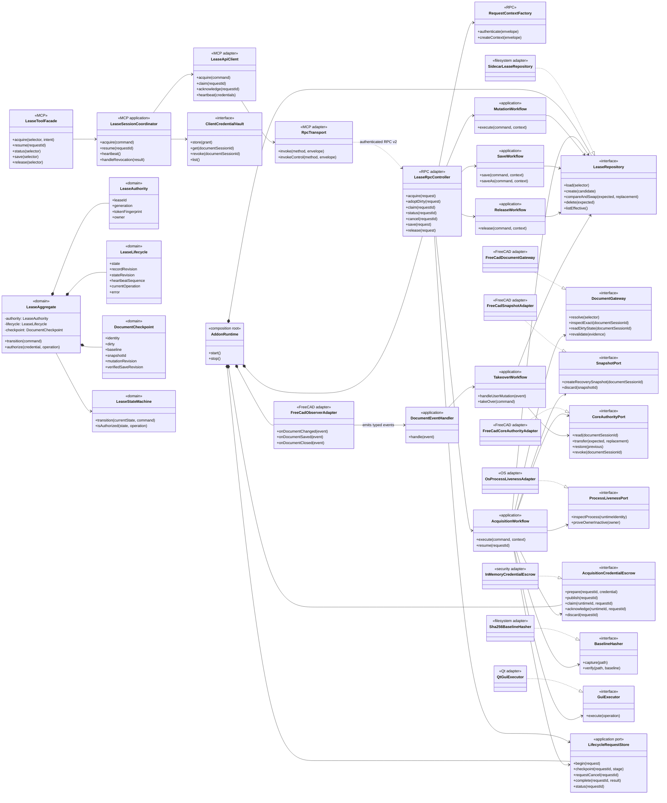
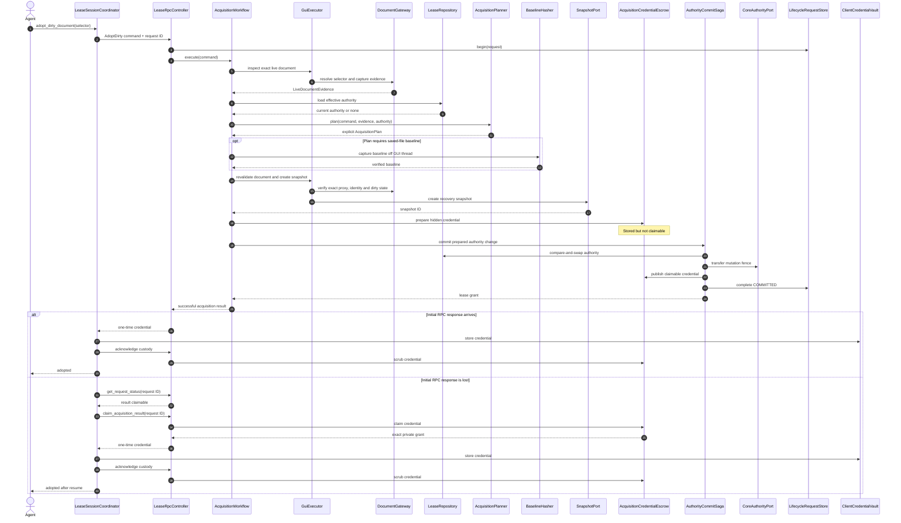

# Redesign verdict

I pulled the branch again and reviewed the refreshed implementation.

The **safety model is strong**, but the **architecture is overloaded**. You have strict selectors, generation fencing, token fingerprints, sidecar CAS, recovery snapshots, double authorization, response-loss recovery, and core mutation authority. Those are worth preserving.

The problem is that they have accumulated inside a few enormous classes and transaction scripts. The result is a small distributed system disguised as several Python files, because apparently humans only recognize distributed systems after adding Kubernetes.

## Main problems in the current design

### 1. `DocumentLeaseService` is a god object

It currently owns:

* lease state transitions;
* credential authorization;
* token generation and fencing;
* sidecar synchronization;
* local and foreign recovery;
* process-liveness proof;
* Save As migration;
* cancellation;
* close/reopen identity recovery;
* multiple in-memory registries.

Its constructor alone exposes identity, persistence, timing, liveness, token generation, and runtime identity concerns.

The class should retain **domain lease behavior**, but recovery orchestration, persistence, liveness proof, and workflow state should move out.

### 2. `_acquire_document_lock_v2()` is an implicit workflow engine

The method uses a mutable `phase: dict[str, Any]`, GUI callbacks, off-thread hashing, exception-driven recovery selection, snapshots, core fencing, rollback callbacks, escrow, cancellation checkpoints, and response construction.

Normal business decisions are currently communicated through exceptions such as:

* `OrphanedForeignRecoveryRequired`
* `OrphanedLocalMcpRecoveryRequired`
* `SavedForeignRecoveryRequired`
* `LockedErrorHandoffRequired`

The RPC method catches these and writes flags into the phase dictionary. That works, but it makes the RPC layer responsible for understanding every recovery path.

Later phases inspect those flags and perform different snapshot, core-authority, recovery, and escrow behavior.

That needs to become an explicit `AcquisitionPlan`, not a collection of exceptions and dictionary keys.

### 3. Cross-layer commits are not represented as a first-class transaction

Acquisition may update:

1. the sidecar authority;
2. FreeCAD core mutation authority;
3. in-memory lease state;
4. credential escrow;
5. request/continuation state.

The code contains careful compensation, but it is spread between RPC callbacks and service callbacks. It even has a defined outcome where authority was rotated but credential escrow failed, leaving recovery required.

That should become an explicit **authority commit saga**, including a prepared escrow entry before any irreversible authority rotation.

### 4. There are two lease implementations

`document_lease/model.py` contains the v2 lease model, while `document_lock.py` still contains another `LeaseState` and `LeaseRecord`, plus settings, request identity, mutation attribution, sidecar handling, observer behavior, verb classification, and legacy acquisition.

Keeping a compatibility adapter is sensible. Keeping a second state machine and second authority implementation is not. Eventually they will disagree at precisely 03:17 on the one machine nobody can reproduce.

### 5. Runtime dependencies are hidden in globals and module discovery

`rpc_server.py` owns process-wide globals for the lease service, identity service, replay cache, inflight registry, claim store, handoff store, save service, runtime policy, and watchdog.

The observer then locates the service through `sys.modules` and delegates mutation attribution back into the legacy lock module.

This should be replaced with one explicit process-lifetime `AddonRuntime` composition root.

---

# Recommended architecture

Keep this as a **modular monolith inside the FreeCAD process**. Do not turn it into network microservices. FreeCAD already gives you enough threading and lifecycle misery without adding distributed deployment for sport.

The design should have four layers:

1. **Domain**
   Pure lease state, transitions, authority, document checkpoints, and planning rules.

2. **Application workflows**
   Acquisition, dirty adoption, recovery, mutation, save, release, and takeover orchestration.

3. **Ports and adapters**
   Sidecar CAS, FreeCAD GUI operations, snapshot creation, core authority, hashing, process liveness, and credential escrow.

4. **RPC and MCP boundaries**
   Request authentication, DTO mapping, client credential custody, heartbeat, and tool responses.

---

# High-level Mermaid class diagram

One giant diagram would merely recreate the current god object in Mermaid, which would be architecturally consistent but not useful. This diagram shows the main boundaries.



---

# Acquisition-specific class diagram

This is the important redesign for `acquire_document_lock()` and `adopt_dirty_document()`.

The central change is:

> **Inspect first, produce an explicit plan, then execute the plan.**

No normal recovery selection through exceptions. No mutable `phase` dictionary with magical keys.

```mermaid
classDiagram
direction TB

class AcquisitionCommand {
    +requestId
    +selector
    +intent
    +owner
    +taskSummary
}

class AcquisitionIntent {
    <<enumeration>>
    ACQUIRE_CLEAN
    ADOPT_DIRTY
}

class LiveDocumentEvidence {
    +documentIdentity
    +dirty
    +fileIdentity
    +baseline
    +observedAt
}

class AcquisitionPlanKind {
    <<enumeration>>
    FRESH_CLEAN
    FRESH_DIRTY
    REPLACE_UNRETURNED_RESERVATION
    HANDOFF_LOCKED_ERROR
    RECOVER_LOCAL_MCP_ORPHAN
    RECOVER_FOREIGN_RUNTIME
    RECOVER_SAVED_FOREIGN
}

class AcquisitionPlan {
    +kind: AcquisitionPlanKind
    +expectedAuthority
    +requiresBaseline
    +requiresSnapshot
    +requiresOwnerDeathProof
    +requiresDirtyRevalidation
    +publicationMode
}

class AcquisitionPlanner {
    <<domain service>>
    +plan(command, evidence, existingAuthority)
}

AcquisitionCommand --> AcquisitionIntent
AcquisitionPlanner --> AcquisitionPlan
AcquisitionPlan --> AcquisitionPlanKind
AcquisitionPlanner --> LiveDocumentEvidence
AcquisitionPlanner --> LeaseAggregate


class AcquisitionWorkflow {
    <<application>>
    +execute(command)
    +resume(requestId)
}

class AcquisitionPlanExecutor {
    <<application>>
    +execute(plan, evidence, context)
}

class AcquisitionPlanHandler {
    <<interface>>
    +prepare(plan, evidence, context)
}

class FreshAcquisitionHandler {
    +prepare(plan, evidence, context)
}

class ReservationReplacementHandler {
    +prepare(plan, evidence, context)
}

class LockedErrorHandoffHandler {
    +prepare(plan, evidence, context)
}

class OrphanRecoveryHandler {
    +prepare(plan, evidence, context)
}

FreshAcquisitionHandler ..|> AcquisitionPlanHandler
ReservationReplacementHandler ..|> AcquisitionPlanHandler
LockedErrorHandoffHandler ..|> AcquisitionPlanHandler
OrphanRecoveryHandler ..|> AcquisitionPlanHandler

AcquisitionPlanExecutor o-- AcquisitionPlanHandler

AcquisitionWorkflow --> AcquisitionPlanner
AcquisitionWorkflow --> AcquisitionPlanExecutor
AcquisitionWorkflow --> DocumentGateway
AcquisitionWorkflow --> BaselineHasher
AcquisitionWorkflow --> SnapshotPort
AcquisitionWorkflow --> GuiExecutor
AcquisitionWorkflow --> LifecycleRequestStore


class PreparedAuthorityChange {
    +expectedAuthority
    +replacementAuthority
    +credential
    +snapshotId
    +previousCoreAuthority
}

class AuthorityCommitSaga {
    <<application>>
    +commit(change, requestId)
    +compensate(journal)
}

class CommitOutcome {
    <<enumeration>>
    COMMITTED
    ROLLED_BACK
    UNCERTAIN
}

AcquisitionPlanExecutor --> PreparedAuthorityChange
AcquisitionPlanExecutor --> AuthorityCommitSaga
AuthorityCommitSaga --> PreparedAuthorityChange
AuthorityCommitSaga --> CommitOutcome
AuthorityCommitSaga --> LeaseRepository
AuthorityCommitSaga --> CoreAuthorityPort
AuthorityCommitSaga --> AcquisitionCredentialEscrow
AuthorityCommitSaga --> LifecycleRequestStore
```



## Why handlers instead of another giant `if`

Each handler has one recovery responsibility:

| Handler                         | Responsibility                                                                    |
| ------------------------------- | --------------------------------------------------------------------------------- |
| `FreshAcquisitionHandler`       | Normal clean acquisition and initial dirty adoption                               |
| `ReservationReplacementHandler` | Replace only proven unreturned reservations                                       |
| `LockedErrorHandoffHandler`     | Live dirty handoff from another MCP owner                                         |
| `OrphanRecoveryHandler`         | Dead MCP, dead FreeCAD runtime, missing-sidecar, and saved foreign recovery plans |

The planner decides **which** handler is allowed. The handler does not rediscover policy halfway through execution.

---

# Redesigned dirty-document adoption sequence



## Important escrow change

The current claim store correctly retains an unacknowledged credential indefinitely rather than expiring or evicting the only usable secret.

I would preserve that policy, but change the commit ordering:

1. Generate credential.
2. **Prepare it in escrow, but keep it non-claimable.**
3. CAS-publish sidecar authority.
4. Transfer FreeCAD core authority.
5. Mark escrow entry claimable.
6. Publish the success result.

That removes the failure category:

> Authority successfully rotated, but the only raw credential could not be escrowed.

The escrow entry already exists before authority changes. If the commit fails, it is discarded. If the commit becomes uncertain, it remains hidden until reconciliation decides whether the authority committed.

---

# Domain model split

`LeaseRecord` currently combines every concern. I would split it internally while keeping the same serialized sidecar schema initially.

## `LeaseAuthority`

Owns security identity:

```text
lease_id
generation
token_fingerprint
owner
```

## `LeaseLifecycle`

Owns operational state:

```text
state
record_revision
state_revision
heartbeat_sequence
last_heartbeat
current_operation
error
```

## `DocumentCheckpoint`

Owns document recovery evidence:

```text
document identity
dirty state
baseline
snapshot ID
mutation revision
verified-save revision
user intervention
Save As migration
```

## `LeaseAggregate`

Contains the three structures and provides pure operations such as:

```python
aggregate.reserve(...)
aggregate.promote(...)
aggregate.begin_mutation(...)
aggregate.mark_mutated(...)
aggregate.begin_save(...)
aggregate.mark_save_verified(...)
aggregate.mark_error(...)
aggregate.take_over(...)
aggregate.release(...)
aggregate.authorize(...)
```

The aggregate must not:

* read files;
* inspect processes;
* call FreeCAD;
* write sidecars;
* store raw tokens;
* serialize RPC results;
* discover recovery records.

Those belong outside the domain.

---

# What should replace the current files

| Current responsibility                               | New component                                       |
| ---------------------------------------------------- | --------------------------------------------------- |
| `FreeCADRPC._acquire_document_lock_v2()`             | `LeaseRpcController` plus `AcquisitionWorkflow`     |
| Recovery selection through exception handling        | `AcquisitionPlanner` returning `AcquisitionPlan`    |
| `DocumentLeaseService` persistence logic             | `LeaseRepository`                                   |
| `DocumentLeaseService` process-death proof           | `OwnershipProofService` using `ProcessLivenessPort` |
| Core-authority callbacks passed into service methods | `AuthorityCommitSaga`                               |
| `HandoffContinuationStore`                           | Generic `LifecycleRequestStore`                     |
| `AcquisitionClaimStore`                              | `AcquisitionCredentialEscrow`                       |
| RPC module globals                                   | `AddonRuntime`                                      |
| `LeaseObserver` service discovery                    | Injected `DocumentEventHandler`                     |
| v1 state machine in `document_lock.py`               | `LegacyV1LeaseAdapter`                              |
| request identity in `document_lock.py`               | `RpcRequestContext`                                 |
| agent mutation thread-local code                     | `FreeCadMutationScope`                              |
| MCP `FreeCADConnection` lease coordination           | `LeaseApiClient` plus `LeaseSessionCoordinator`     |
| MCP raw credential map                               | `ClientCredentialVault`                             |

---

# Proposed package structure

```text
addon/FreeCADMCP/
├── lease/
│   ├── domain/
│   │   ├── aggregate.py
│   │   ├── authority.py
│   │   ├── lifecycle.py
│   │   ├── checkpoint.py
│   │   ├── state_machine.py
│   │   ├── acquisition_plan.py
│   │   └── errors.py
│   │
│   ├── application/
│   │   ├── acquisition_workflow.py
│   │   ├── acquisition_planner.py
│   │   ├── acquisition_handlers.py
│   │   ├── authority_commit_saga.py
│   │   ├── mutation_workflow.py
│   │   ├── save_workflow.py
│   │   ├── release_workflow.py
│   │   ├── takeover_workflow.py
│   │   └── lifecycle_request_store.py
│   │
│   ├── ports/
│   │   ├── lease_repository.py
│   │   ├── document_gateway.py
│   │   ├── snapshot_port.py
│   │   ├── core_authority_port.py
│   │   ├── process_liveness_port.py
│   │   ├── credential_escrow.py
│   │   ├── baseline_hasher.py
│   │   └── gui_executor.py
│   │
│   └── adapters/
│       ├── filesystem/
│       │   ├── sidecar_repository.py
│       │   └── sha256_hasher.py
│       ├── freecad/
│       │   ├── document_gateway.py
│       │   ├── snapshot_adapter.py
│       │   ├── core_authority_adapter.py
│       │   ├── observer_adapter.py
│       │   └── mutation_scope.py
│       ├── os/
│       │   └── process_liveness.py
│       └── security/
│           └── in_memory_credential_escrow.py
│
├── rpc_server/
│   ├── lease_controller.py
│   ├── request_context.py
│   ├── method_registry.py
│   └── rpc_server.py
│
├── compat/
│   └── v1_lease_adapter.py
│
└── runtime.py
```

MCP side:

```text
src/freecad_mcp/
├── lease/
│   ├── api_client.py
│   ├── session_coordinator.py
│   ├── credential_vault.py
│   ├── heartbeat_service.py
│   └── models.py
├── transport/
│   └── xmlrpc_transport.py
└── operations/
    └── locking.py
```

---

# Rules I would enforce

## 1. One lease state machine

Only `lease/domain/state_machine.py` defines valid state transitions.

The v1 adapter translates legacy calls into commands against the same model. It does not get its own `LeaseState`, transition table, or sidecar authority.

## 2. No exception-driven normal routing

Exceptions remain appropriate for unexpected failures.

These are not unexpected failures:

* another live `LOCKED_ERROR` owner;
* a replaceable unreturned reservation;
* a dead local MCP owner;
* a dead foreign FreeCAD runtime;
* a saved foreign recovery record.

They are valid `AcquisitionPlanKind` values.

## 3. No `dict[str, Any]` workflow state

Replace the current phase dictionary with immutable or narrowly mutable typed objects:

```python
@dataclass(frozen=True)
class AcquisitionContext:
    command: AcquisitionCommand
    evidence: LiveDocumentEvidence
    plan: AcquisitionPlan
    baseline: FileBaseline | None = None
    snapshot_id: str | None = None
```

Each phase returns a new context. Missing fields become type-visible rather than a runtime `phase["something"]` surprise.

## 4. GUI operations and filesystem operations never mix

GUI thread:

* resolve exact document proxy;
* inspect dirty state;
* revalidate identity;
* create `saveCopy`;
* transfer core authority.

Worker thread:

* hash FCStd;
* inspect OS process liveness;
* parse and validate sidecars;
* verify saved files.

The workflow owns the order. The adapters own the mechanics.

## 5. Every irreversible operation is journaled

Before sidecar CAS or core-authority transfer:

```text
request ID
plan kind
expected authority revision
replacement authority identity
prepared escrow ID
snapshot ID
current commit step
```

After a crash or timeout, reconciliation reads the journal and determines:

```text
COMMITTED
ROLLED_BACK
UNCERTAIN
```

No bespoke continuation state specifically for `LOCKED_ERROR`.

## 6. Observer callbacks only emit events

The observer should produce typed events:

```python
DocumentMutationObserved
DocumentSaveStarted
DocumentSaveFinished
DocumentClosed
DocumentOpened
DocumentEditModeEntered
```

It should not discover services through `sys.modules`, classify recovery authority, or directly implement takeover policy.

---

# Migration plan

Do not rewrite it in one branch. That is how a difficult system becomes an archaeological site.

## Phase 1: Add boundaries without changing behavior

Introduce interfaces around the existing implementations:

* `LeaseRepository`
* `DocumentGateway`
* `CoreAuthorityPort`
* `SnapshotPort`
* `ProcessLivenessPort`
* `AcquisitionCredentialEscrow`
* `GuiExecutor`

`DocumentLeaseService`, `SidecarStore`, and the current RPC code initially implement or call these interfaces.

## Phase 2: Extract acquisition planning

Move the decision matrix out of `_acquire_document_lock_v2()`.

Write pure table-driven tests for:

```text
clean/dirty
no/local/foreign authority
owner alive/dead/unknown
snapshot present/absent
response returned/unreturned
sidecar present/missing/changed
```

The existing scenario matrix already provides most of this behavioral specification.

## Phase 3: Extract `AcquisitionWorkflow`

Move:

* GUI resolve;
* baseline hash;
* revalidation;
* snapshot;
* plan execution;
* response-loss escrow;

out of `rpc_server.py`.

Leave the old RPC method as a thin delegating wrapper so external behavior remains unchanged.

## Phase 4: Introduce the authority commit saga

Add prepared escrow and explicit commit journaling.

Fault-inject after every step:

1. escrow prepare;
2. sidecar CAS;
3. core-authority transfer;
4. escrow publication;
5. in-memory publication;
6. response serialization.

Each test must end in exactly one of:

```text
committed and claimable
fully rolled back
uncertain and mutation-blocked
```

## Phase 5: Remove duplicated v1 authority

Turn `document_lock.py` into a compatibility facade.

Move:

* request identity;
* mutation attribution;
* verb classification;
* snapshot-save attribution;

to dedicated modules.

Delete its duplicated `LeaseState`, `LeaseRecord`, and registry once the compatibility tests pass against the v2 domain.

## Phase 6: Split the MCP client

Separate:

* XML-RPC transport;
* authenticated session management;
* lease API;
* credential custody;
* heartbeat;
* model-facing tool responses.

This keeps raw tokens inside `ClientCredentialVault`, while `operations/locking.py` only receives redacted outcomes.

---

# Final recommendation

Do **not** redesign the lease protocol itself. Its core rules are sensible:

* exact document identity;
* one-time raw credentials;
* generation fencing;
* fail-closed unknown sidecars;
* prequeue and GUI-thread authorization;
* no automatic stale deletion;
* recoverable snapshots;
* explicit custody acknowledgement.

Redesign the **orchestration around that protocol**.

The first concrete extraction should be:

```text
FreeCADRPC._acquire_document_lock_v2
    ↓
LeaseRpcController
    ↓
AcquisitionWorkflow
    ↓
AcquisitionPlanner
    ↓
AcquisitionPlanHandler
    ↓
AuthorityCommitSaga
```

That single extraction removes the mutable phase dictionary, normal-flow exceptions, special-purpose handoff continuation, and cross-layer callbacks from the RPC server without weakening any of the current safety guarantees.
