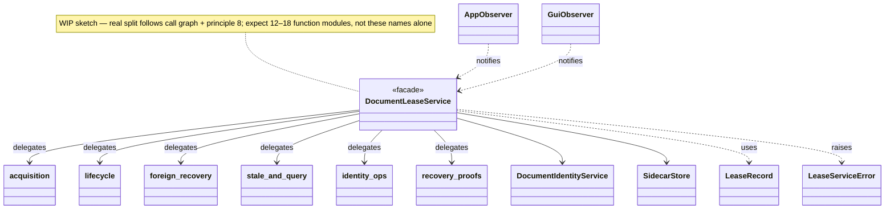
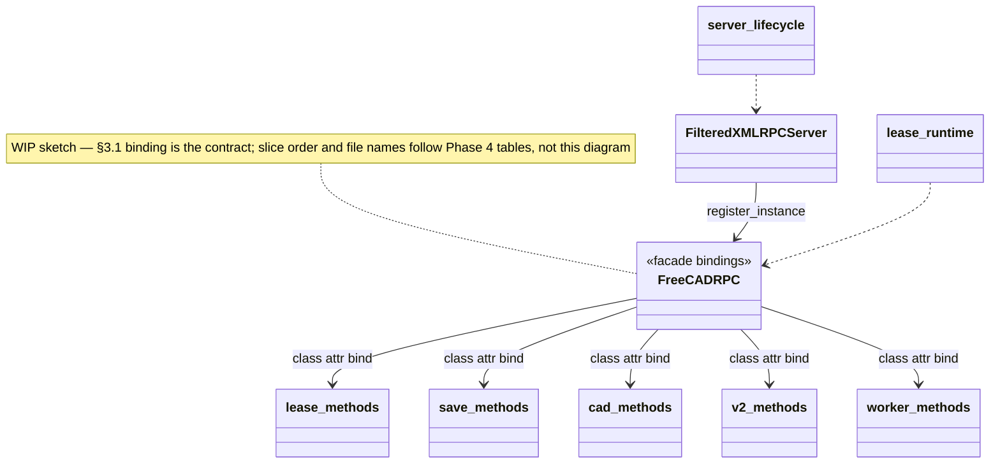
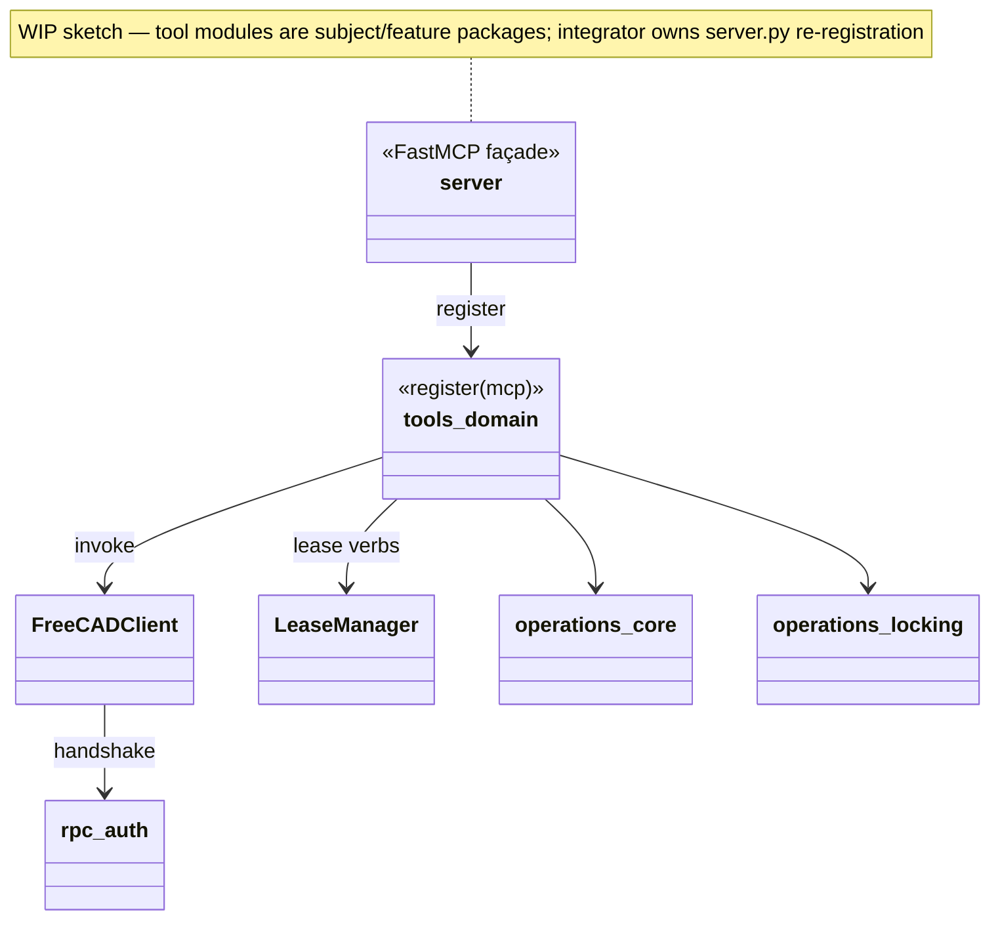

# Module-size and one-class refactor plan

Plan to bring the shipped package trees under the architecture lint in
`ci/lint_python.py` without changing wire protocols, MCP tool names, or
XML-RPC method names.

**In scope**

- `addon/FreeCADMCP/`
- `src/freecad_mcp/`

**Out of scope (for this plan)**

- Broad `tests/` rewrites (add focused regressions only when a seam is uncovered)
- Behavioral feature work unrelated to structure
- Changing lease/auth wire formats

**Success criteria (whole effort)** — run from `tools/mcp/freecad-mcp`:

```powershell
docker run --rm -v "${PWD}:/workspace" -w /workspace `
  ghcr.io/astral-sh/uv:python3.12-bookworm-slim `
  uv run ci/lint_python.py addon/FreeCADMCP src/freecad_mcp
```

exits 0. That means:

- **ARCH001** — every checked `.py` file ≤ 300 physical lines
- **ARCH002** — every checked `.py` file declares at most one class
  (nested classes, dataclasses, enums, protocols, and exceptions all count)
- **Ruff** — configured rule set (`E`, `F`, `I`, `UP`, `B`, `SIM`, `C901`, `RUF`) clean,
  including the **117** baseline C901 complexity findings (ownership policy: §6 Phase 0)

**Phase success criteria:** a phase is complete only when its commit is created
after all workstream reviews pass, the integrator’s full Docker suite is green,
and the two-tier lint gate passes (§5.8): touched paths exit 0, global counts
at or below the §11.2 ceilings. Full-tree lint exits 0 only at Phase 8.

Baseline (2026-08-01): **83** files checked, **37** ARCH001, **26** ARCH002,
**524** Ruff findings (**202** safe auto-fixes; **117** C901). §4.1 maps every
violating file to exactly one owning phase/workstream — if the lint baseline
moves, update §4.1 and the §11.2 ceilings together. Live execution status lives
in **§11 Progress** (not in chat context).

---

## 1. Goals and non-goals

### Goals

- Make modules reviewable and testable at the unit of one responsibility.
- Preserve runtime contracts listed in §3.
- Prefer move/extract over rewrite; keep behavior identical unless a bug is
  unavoidable to surface during the split.
- Execute with **Cursor Multitask**: maximize safe parallel workstreams under
  exclusive file ownership; one integrator; critical review after every
  workstream; **one git commit per phase**.

### Non-goals

- Merging v1 `document_lock` away from v2 `document_lease` in this effort
  (compatibility facade stays until a separate deprecation plan).
- Sharing Python modules across the FreeCAD addon process and the MCP process
  (they remain twins where auth/handshake already mirrors).
- Raising ARCH limits or carving permanent lint exclusions for giants.
- Multiple commits inside a phase (squash workstream results into the phase
  commit via the integrator).

---

## 2. Hard constraints

| Constraint | Implication |
|------------|-------------|
| ARCH002 one class / file | Exception hierarchies, enums, and small DTOs each get their own module (or a package of one-class files). Do not leave “errors.py with 12 subclasses”. |
| FreeCAD flat imports | `InitGui` / addon `sys.path` load `rpc_server` as a top-level package. Keep `rpc_server/__init__.py` import-safe; do not require `addon.FreeCADMCP.` for in-process imports. |
| `document_lock` dual module name | Preserve `_install_module_aliases()` so `document_lock` and `addon.FreeCADMCP.document_lock` share one registry. |
| `document_lease/__init__.py` | Keep the **public** re-export surface with **explicit** `__all__` (see §3.2). Never rebuild `__all__` from `globals()`. |
| `operations/__init__.py` | Keep the barrel that `server.py` imports; prefer explicit `__all__` assembled from subdomain `__all__` lists (same §3.2 pattern). |
| XML-RPC methods on `FreeCADRPC` | External contract via `register_instance()`. Keep every public method as an **attribute** of `FreeCADRPC` using the §3.1 binding strategy — not per-method wrappers, not `__getattr__`. |
| MCP `@mcp.tool` names in `server.py` | External contract; registration may move, names must not. |
| Client↔addon handshake | `src/freecad_mcp/rpc_auth.py` and `addon/.../lease_protocol.py` stay wire-compatible; change both sides in the same phase when types move. |
| Deep import paths | 40+ test files import defining modules directly (e.g. `from addon.FreeCADMCP.document_lease.identity import …`). Every moved symbol keeps an explicit re-export shim at its old path for the whole effort (§3.3). |

Related design docs (do not contradict them while splitting):
[document-leases](document-leases.md),
[document-lease-sidecar-v2](document-lease-sidecar-v2.md),
[lease-recovery](lease-recovery.md),
[lease-security](lease-security.md),
[request-lifecycle](request-lifecycle.md),
[runtime-identity](runtime-identity.md),
[freecad_rpc_worker_architecture_plan](freecad_rpc_worker_architecture_plan.md),
[execute-code-migration](execute-code-migration.md).

---

## 3. Split principles

1. **One public class per file; helpers as functions.** Prefer module-level
   functions over nested helper classes when ARCH002 would otherwise force a
   private class into its own file.
2. **Façade stays thin.** Giant orchestration classes become coordinators that
   expose extracted callables; public names remain on the façade (see §3.1 for
   `FreeCADRPC`).
3. **Exceptions = package of tiny modules.** Example layout:

   ```text
   document_lease/errors/
     __init__.py          # re-exports (integrator-owned when shared)
     lease_service_error.py
     lease_conflict_error.py
     ...
   ```

4. **Enums / small frozen DTOs = one file each** under a `types/` or domain
   subpackage, re-exported from the parent `__init__.py`.
5. **No behavior change in a structure phase.** Pair every phase with existing
   unit/e2e markers; add a focused regression only when a seam had no coverage.
6. **Ruff first when cheap.** Phase 0 owns autofix so later phase diffs are not
   mixed with import-sort noise.
7. **Old import paths keep working.** Moving a symbol never breaks an existing
   `from <old.module> import <symbol>`; the origin module keeps an explicit
   re-export shim for the whole effort (§3.3).
8. **Structure by subject or feature.** Start with the smallest practical
   structure. Promote a subject to its own package when it contains several
   cohesive files or distinct responsibilities. Introduce layered subpackages
   only when multiple real architectural layers exist. Do not create folders
   merely to satisfy an architectural pattern. Phase layout sketches and
   Mermaid diagrams (§3.4) illustrate possible shapes; this rule decides the
   real tree.

### 3.1 Keeping `FreeCADRPC` under 300 lines

The XML-RPC server registers a `FreeCADRPC` instance reflectively with
`register_instance()`, so **method availability on the instance is the transport
contract**. Every public RPC name must remain an attribute of `FreeCADRPC`.

`rpc_server.py` / the `FreeCADRPC` class body must still satisfy ARCH001
(≤300 lines). That will **not** stay clean if every RPC method gets a normal
wrapper:

```python
def save_document(self, ...):
    return rpc_lease_methods.save_document(self, ...)
```

There are too many methods and too many multi-line signatures.

**Scale check (2026-08-01):** the file holds **~90 public** and **~74 private**
methods, mostly on `FreeCADRPC`. One class-attribute assignment per public
name costs ~90 lines; with imports and a minimal `__init__`, the façade stays
under 300 **only if nearly all private helpers are also extracted** as
module-level functions (first parameter `self`). Budget at most ~40 lines of
private helpers on the class itself.

#### Preferred: assign extracted functions to the class

Extract implementations as plain functions (first parameter `self` / the RPC
instance) in domain modules, then bind them as class attributes:

```python
from .methods import lease_methods
from .methods import save_methods
from .methods import cad_methods


class FreeCADRPC:
    acquire_document_lock = lease_methods.acquire_document_lock
    adopt_dirty_document = lease_methods.adopt_dirty_document
    save_document = save_methods.save_document
    create_object = cad_methods.create_object
    # ... one assignment per public RPC name
```

Suggested layout (Phase 4 workers write these; integrator owns the class body):

```text
rpc_server/methods/
  lease_methods.py      # functions only (or split further if >300 lines)
  save_methods.py
  cad_methods.py
  worker_methods.py
  v2_methods.py
  ...
```

**Advantages**

- No wrapper boilerplate.
- Signatures generally remain inspectable (`inspect.signature` on the bound
  attribute sees the extracted function).
- No multiple-inheritance ordering.
- Public methods remain attributes of `FreeCADRPC` (compatible with
  `register_instance()`).
- The façade can remain below 300 lines (imports + assignments + minimal
  `__init__` / private helpers that must stay on the class).

**Contract tests (required in Phase 4)** must verify, against a frozen snapshot
taken before the carve-out:

- public method **names** exposed on `FreeCADRPC` / an instance;
- **signatures** (parameters, defaults, annotations where present);
- **docstrings**;
- method **exposure** through the same reflective path the server uses
  (instance attributes discoverable for XML-RPC registration).

#### Alternative: stateless method mixins

```python
class FreeCADRPC(
    LeaseRpcMethods,
    SaveRpcMethods,
    WorkerRpcMethods,
    CadRpcMethods,
):
    ...
```

Rules if chosen: **one mixin class per file** (ARCH002), **no mixin-owned
state**, **no overlapping method names**. This satisfies line limits but adds
MRO as review surface. Prefer attribute binding unless a concrete blocker
appears.

#### Rejected: dynamic `__getattr__` dispatch

Do **not** route missing names through `__getattr__` (or similar lazy
dispatch). It makes method discovery, signatures, and contract snapshots
considerably less reliable for `register_instance()` and for tests.

### 3.2 Explicit package exports and dependency direction

Today `document_lease/__init__.py` builds:

```python
__all__ = [name for name in globals() if not name.startswith("_")]
```

After the split, that can accidentally export imported modules, helpers, or
compatibility aliases. **Replace dynamic exports with explicit domain exports.**

Integrator-owned package façade (illustrative):

```python
from .errors import *
from .errors import __all__ as _error_exports
from .types import *
from .types import __all__ as _type_exports
from .service import DocumentLeaseService

__all__ = [
    *_error_exports,
    *_type_exports,
    "DocumentLeaseService",
]
```

Apply the same pattern to other barrels that grow during this refactor
(`operations/__init__.py`, `rpc_server/methods/` package inits, client type
packages): each subdomain owns an explicit `__all__`; the parent only composes
those lists plus a short list of façade symbols.

**Internal imports never go through the package barrel.** Every leaf module
imports base classes and helpers from their **defining modules**, not from
`document_lease` / `freecad_mcp.operations` package `__init__`. That keeps a
clear dependency direction:

```text
errors / types
      ↓
pure domain functions
      ↓
state and stores
      ↓
services
      ↓
RPC / MCP / GUI adapters
```

Barrels exist for **external callers** (and for documenting the public surface).
They are not an internal import hub.

**Optional FreeCAD/Qt imports** may remain soft/lazy at the **adapter** layer
only (e.g. `core_authority` when FreeCAD is absent). That is not permission to
use lazy imports as the main cycle-breaking strategy inside the domain stack.

Apply §3.2 when Phase 1+ first touches `document_lease/__init__.py` (integrator):
replace the `globals()` `__all__` in the same change that adds the new domain
re-exports, so the package never ships a half-split with dynamic export.

### 3.3 Moved-symbol compatibility (shims)

Tests and callers import **defining modules** directly (40+ test files, e.g.
`from addon.FreeCADMCP.document_lease.identity import …`,
`from freecad_mcp.lease_manager import …`). Broad test rewrites are out of
scope, so every extraction leaves a **shim**: an explicit re-export at the old
import path.

- Origin module keeps `from .types.lease_record import LeaseRecord  # noqa: F401`
  style lines for every moved symbol. Workers own shim lines inside their
  exclusive files; the integrator owns package-barrel re-exports.
- **Module → package conversion keeps the import path.** `service.py` becoming
  `service/` requires `service/__init__.py` (integrator-owned) to re-export
  the full legacy module surface explicitly (§3.2 pattern).
- Shims are import-only: zero classes (ARCH002-clean) and small (ARCH001-clean)
  by construction. They may not import from package barrels.
- Removing shims is a separate deprecation effort, not part of this plan.
- Reviewers grep worker diffs for deleted re-exports; a missing shim is a
  **blocking** finding.

### 3.4 Target package sketches (WIP Mermaid — not guiding)

The class diagrams below are **work-in-progress sketches**. They are **not**
guiding design, ownership, or file layout.

**Authoritative when anything conflicts (in this order):**

1. §3 principles (especially §3.1–§3.3 and principle 8 — subject/feature packaging)
2. §4.1 coverage map and §6 phase / workstream tables
3. Runtime contracts in §2 / §3

Update diagrams opportunistically after a phase lands so they stay roughly
aligned with reality. Do **not** block a workstream, review, or commit on
diagram accuracy. Do **not** invent extra packages or layers just to match a
box in Mermaid — apply principle 8 first.

#### `document_lease` (illustrative WIP)



#### `rpc_server` façade + methods (illustrative WIP)



#### MCP client / tool surface (illustrative WIP)



---

## 4. Current hotspot inventory

Approximate physical lines from architecture lint (max 300).

### Addon — worst first

| File | ~Lines | Classes (ARCH002) | Primary responsibility |
|------|-------:|-------------------|------------------------|
| `rpc_server/rpc_server.py` | 11411 | 3 | Transport + `FreeCADRPC` + lease/CAD surface |
| `document_lease/service.py` | 4972 | 22 | `DocumentLeaseService` + errors/DTOs |
| `document_lock.py` | 2469 | 6 | v1 lock registry / verbs / observer |
| `lock_indicator.py` | 2185 | 2 | Qt lease dock UI |
| `rpc_server/lease_protocol.py` | 1825 | 14 | Handshake, session, envelope, replay |
| `document_lease/sidecar.py` | 1439 | 18 | Sidecar I/O, Windows ACL, store |
| `document_lease/observer.py` | 1350 | 4 | App/GUI lease observers |
| `rpc_server/save_service.py` | 1319 | 17 | Save / save-as / finalize |
| `rpc_server/worker_manager.py` | 868 | 5 | Worker admission / lifecycle |
| `rpc_server/worker_entry.py` | 759 | 4 | FreeCADCmd worker entry |
| `rpc_server/mutation_guard.py` | 755 | 8 | Mutation health wrappers |
| `rpc_server/snapshot_service.py` | 722 | — | Snapshot coordination |
| `document_lease/model.py` | 608 | 14 | Lease wire/schema types |
| `document_lease/identity.py` | 578 | 7 | Document identity service |
| `rpc_server/inflight_requests.py` | 555 | 7 | Inflight / cancel registry |
| `rpc_server/gui_dispatcher.py` | 514 | 7 | GUI dispatch |
| + several 301–450 line modules | | | `core_authority`, `gui_tools`, `settings`, `view_manager`, … |

### MCP client / server — worst first

| File | ~Lines | Classes (ARCH002) | Primary responsibility |
|------|-------:|-------------------|------------------------|
| `server.py` | 6372 | — | FastMCP tool registration |
| `freecad_client.py` | 2628 | 6 | XML-RPC client / invoke_v2 |
| `operations/core.py` | 1602 | — | Core CAD operations |
| `lease_manager.py` | 1249 | 12 | Client leases + stale recovery |
| `rpc_auth.py` | 1111 | 5 | Client handshake / manifests |
| `instrumented_server.py` | 636 | 2 | Telemetry FastMCP wrapper |
| `operations/locking.py` | 604 | — | Lease tools |
| `operations/diagnostics.py` | 566 | — | Diagnostics tools |
| + other `operations/*` over 300 | | | parametric, p7, p1, p5, `__init__.py`, … |

The hotspot tables above are illustrative; the authoritative list is §4.1.

### 4.1 Coverage map — every violation has exactly one owner

Complete lint baseline (2026-08-01). `—` = no finding. C901-only files pass
ARCH but still block the Phase 8 gate, so they are mapped too. `X → Y` means
phase X extracts leaf types, phase Y splits the body.

Addon:

| File | ARCH001 | ARCH002 | C901 | Owner |
|------|--------:|--------:|-----:|-------|
| `document_lease/core_authority.py` | 420 | — | — | 2D |
| `document_lease/identity.py` | 578 | 7 | 1 | 1F → 2A |
| `document_lease/model.py` | 608 | 14 | — | 1A |
| `document_lease/observer.py` | 1350 | 4 | 4 | 2C |
| `document_lease/service.py` | 4972 | 22 | 16 | 1E → 2E |
| `document_lease/sidecar.py` | 1439 | 18 | 4 | 1B → 2B |
| `document_lock.py` | 2469 | 6 | 7 | 5A |
| `lock_indicator.py` | 2185 | 2 | 7 | 5B |
| `rpc_server/acquisition_claims.py` | — | 2 | — | 1D |
| `rpc_server/commands.py` | — | 5 | — | 1D |
| `rpc_server/execute_code_analysis.py` | — | — | 1 | 3D |
| `rpc_server/execution_safety.py` | — | 3 | 1 | 1D + 3B |
| `rpc_server/fem_executor.py` | — | — | 1 | 3D |
| `rpc_server/gui_dispatch.py` | — | — | 1 | 3A |
| `rpc_server/gui_dispatcher.py` | 514 | 7 | 1 | 3A |
| `rpc_server/gui_tools.py` | 388 | — | 2 | 3B |
| `rpc_server/handoff_continuations.py` | — | 2 | — | 1D |
| `rpc_server/inflight_requests.py` | 555 | 7 | — | 3A |
| `rpc_server/lease_protocol.py` | 1825 | 14 | — | 1G → 3F |
| `rpc_server/mutation_guard.py` | 755 | 8 | — | 3B |
| `rpc_server/process_control.py` | — | 4 | 1 | 1D → 3D |
| `rpc_server/property_mapper.py` | — | — | 1 | 3C |
| `rpc_server/reference_repair.py` | 325 | — | 1 | 3C |
| `rpc_server/rpc_server.py` | 11411 | 3 | 45 | 4A–4H |
| `rpc_server/save_service.py` | 1319 | 17 | 1 | 1C → 3E |
| `rpc_server/settings.py` | 336 | — | — | 3C |
| `rpc_server/snapshot_service.py` | 722 | — | 3 | 3B |
| `rpc_server/view_manager.py` | 442 | — | 1 | 3C |
| `rpc_server/worker_entry.py` | 759 | 4 | 3 | 3D |
| `rpc_server/worker_manager.py` | 868 | 5 | 1 | 3D |
| `rpc_server/worker_protocol.py` | 318 | 3 | 2 | 3D |

MCP client / server:

| File | ARCH001 | ARCH002 | C901 | Owner |
|------|--------:|--------:|-----:|-------|
| `assembly_api_bootstrap.py` | 324 | — | — | 7E |
| `freecad_client.py` | 2628 | 6 | 5 | 6A |
| `instrumented_server.py` | 636 | 2 | 1 | 6C |
| `lease_manager.py` | 1249 | 12 | — | 6B |
| `operations/__init__.py` | 401 | — | — | Phase 7 integrator |
| `operations/core.py` | 1602 | — | 2 | 7A |
| `operations/diagnostics.py` | 566 | — | — | 7B |
| `operations/locking.py` | 604 | — | 1 | 7B |
| `operations/p1_curves.py` | 368 | — | — | 7C |
| `operations/p5_measure.py` | 315 | — | — | 7C |
| `operations/p7_assembly.py` | 487 | — | — | 7C |
| `operations/parametric.py` | 505 | — | 1 | 7C |
| `outcomes.py` | — | 2 | — | 1D |
| `responses.py` | 347 | — | 1 | 7E |
| `rpc_auth.py` | 1111 | 5 | 1 | 1G → 6D |
| `server.py` | 6372 | — | — | 7D slices |

**Gate rule:** any file not listed here must stay lint-clean; a new violation
in an unmapped file fails the §5.8 tier-1 gate of the phase that touched it.

---

## 5. Multitask operating model

This refactor is executed with Cursor Multitask. Maximize parallel workers
**only** when file ownership is disjoint. Default to one worker when fewer than
two safe independent workstreams exist, and state why.

### 5.1 Roles

| Role | Model | Responsibilities |
|------|-------|------------------|
| **Worker** (implementation subagent) | **Composer 2.5 only** — never Composer 2.5 Fast | Implements one workstream under exclusive file ownership. Does not edit shared files. |
| **Integrator** (parent / dedicated agent) | Same session orchestrator | Owns all shared files, merges worker outputs, runs Docker suites, updates §11 Progress in this doc, creates the **single phase commit**. Waits for all workers in a wave before combining. |
| **Reviewer** (read-only subagent) | **Cursor Grok 4.5 High** | After every workstream (and again after integrator merge fixes), inspects the **actual diff and tests**. Extremely critical. Reports blocking / important / non-blocking findings. |

### 5.2 Hard Multitask rules

1. Use **Composer 2.5** for every implementation subagent.
2. **Never** use Composer 2.5 Fast for subagents.
3. **Do not** delegate an entire phase to one subagent when ≥2 safe workstreams exist.
4. Assign **exclusive file ownership** to each worker (listed in the phase table).
5. Workers **must not** edit shared files (see §5.3).
6. Workers must report: **changed files**, **tests added**, **assumptions**, **blockers**.
7. Keep **shared files**, **integration**, **Docker execution**, and **§11 Progress
   updates** with one dedicated integrator.
8. The integrator **waits** for workers and **combines** their changes.
9. After every workstream, start a **read-only Cursor Grok 4.5 High** review subagent.
10. The reviewer must be extremely critical, inspect the actual diff and tests, and report **blocking**, **important**, and **non-blocking** findings.
11. **Fix all blocking and important findings**, then review again.
12. The integrator runs **all** of: `unit`, `e2e`, `core`, and `benchmark` in Docker before the phase commit.
13. **Do not** mark the phase complete unless all reviews and Docker suites pass.
14. If fewer than two safe independent workstreams exist, use **one** worker and **explicitly explain** why parallelization is unsafe.
15. **One git commit per phase** (integrator). Workstream branches/worktrees may exist temporarily; they are not the delivery unit.
16. Every moved symbol keeps its old import path working via an explicit shim (§3.3); reviewers treat a removed re-export as blocking.

### 5.3 Shared files (integrator-only)

Workers never edit these unless a phase table explicitly assigns a worker a
**private copy path** that the integrator later merges (default: no):

| Shared path | Why |
|-------------|-----|
| `doc/module-size-refactor-plan.md` | Progress tracking (§11) |
| `addon/FreeCADMCP/document_lease/__init__.py` | Public re-exports |
| `addon/FreeCADMCP/rpc_server/__init__.py` | Package surface |
| `src/freecad_mcp/operations/__init__.py` | Barrel `__all__` |
| `src/freecad_mcp/server.py` | Tool registry façade — integrator owns edits in **all** phases; Phase 7 workers only **add** new `tools_*.py` modules (same giant pattern as `rpc_server.py`) |
| `addon/FreeCADMCP/rpc_server/rpc_server.py` | Giant façade — integrator owns edits; workers only **add** new exclusive modules |
| Any `__init__.py` created by module→package conversion (e.g. `document_lease/service/__init__.py`, `document_lock/__init__.py`) | Barrel re-exporting the legacy surface (§3.2 / §3.3) |
| `addon/FreeCADMCP/Init.py` / `InitGui.py` | Addon bootstrap |
| `pyproject.toml`, `docker-compose.yml`, `Dockerfile*` | Build/test surface |
| Any file listed in **two** workstreams | Conflict by definition — redesign ownership |

**Worker pattern for giants:** read the source, **write only new files** under an
exclusive directory prefix. Integrator deletes/moves code out of the giant and
rewires imports.

### 5.4 Workstream lifecycle (every wave)

```text
1. Integrator assigns exclusive ownership + prompt (Composer 2.5 workers)
2. Workers run in parallel (Multitask); each returns report
3. Per workstream: Grok 4.5 High read-only review of that worker's diff
4. Fix blocking + important (Composer 2.5); re-review until clear
5. Integrator merges into shared files / façades
6. Integrator: two-tier lint gate (§5.8) — touched paths exit 0, global ≤ §11.2 ceilings
7. Grok 4.5 High review of integrator merge diff
8. Fix blocking + important; re-review
9. Integrator Docker:
     docker compose run --rm unit
     docker compose run --rm e2e
     docker compose run --rm core
     docker compose run --rm benchmark
10. Integrator updates §11 Progress (snapshot + log + ceilings/hash) + creates ONE phase commit
11. Mark phase complete only if 3–10 all succeeded
```

Also after **each workstream wave** (step 5–8), the integrator refreshes
§11.1 / §11.3 so the next session can resume from the doc instead of chat
memory.

### 5.5 Worker report template (required)

```text
## Workstream <id> report
- Changed files: …
- Tests added/updated: …
- Assumptions: …
- Blockers: …
- ARCH/Ruff notes on owned paths: …
```

### 5.6 Reviewer report template (required)

```text
## Review <workstream or merge>
- Blocking: …
- Important: …
- Non-blocking: …
- Diff inspected: yes/no (paths)
- Tests inspected: yes/no
- Verdict: request changes | approve
```

### 5.7 Phase commit convention

- **Exactly one commit per phase**, created by the integrator after the gate.
- Suggested messages:

| Phase | Commit message |
|------:|----------------|
| 0 | `refactor(mcp): phase 0 ruff hygiene on package trees` |
| 1 | `refactor(mcp): phase 1 extract leaf types for ARCH002` |
| 2 | `refactor(mcp): phase 2 split document_lease modules` |
| 3 | `refactor(mcp): phase 3 split rpc_server satellites` |
| 4 | `refactor(mcp): phase 4 carve rpc_server façade` |
| 5 | `refactor(mcp): phase 5 split document_lock and lock_indicator` |
| 6 | `refactor(mcp): phase 6 split MCP client stack` |
| 7 | `refactor(mcp): phase 7 split server and operations` |
| 8 | `refactor(mcp): phase 8 full ARCH lint gate` |

Optional PR per phase may wrap that single commit; do not land multi-commit
phase branches without squashing to the phase commit.

**Submodule boundary:** phase commits are created inside the
`tools/mcp/freecad-mcp` git submodule. The parent FreeCAD repo only sees a
gitlink change; bump the parent pointer in a **separate parent-repo commit**
(recommended: once, after Phase 8) — never fold parent-repo changes into a
phase commit.

### 5.8 Docker + lint gate (integrator, every phase)

From `tools/mcp/freecad-mcp`:

```powershell
docker compose run --rm unit
docker compose run --rm e2e
docker compose run --rm core
docker compose run --rm benchmark
```

Plus the **two-tier lint gate**:

1. **Touched paths clean (every phase).** Full lint (ARCH + all Ruff rules,
   including C901) restricted to the phase’s owned + shared touched paths must
   exit 0.
2. **Global budget (phases 0–7).** The full-tree lint will still exit
   non-zero. The phase is green only when global ARCH001 / ARCH002 / Ruff
   counts are **at or below the §11.2 ceilings** for that phase — monotonic
   decrease, no new violations anywhere.
3. **Full exit 0 (Phase 8 only).**

```powershell
docker run --rm -v "${PWD}:/workspace" -w /workspace `
  ghcr.io/astral-sh/uv:python3.12-bookworm-slim `
  uv run ci/lint_python.py addon/FreeCADMCP src/freecad_mcp
```

(Phase-local lint on touched paths runs earlier for speed; both tiers are
required before the phase commit.)

---

## 6. Phased execution (commits + Multitask workstreams)

```text
Phase 0  Ruff autofix + import hygiene          → 1 commit
Phase 1  Leaf types: errors, enums, DTOs        → 1 commit
Phase 2  document_lease package split           → 1 commit
Phase 3  rpc_server satellites                  → 1 commit
Phase 4  rpc_server.py carve-out                → 1 commit
Phase 5  document_lock + lock_indicator         → 1 commit
Phase 6  MCP client stack                       → 1 commit
Phase 7  server.py + operations/*               → 1 commit
Phase 8  Final full-tree lint gate              → 1 commit
```

---

### Phase 0 — Ruff hygiene

**Commit:** `refactor(mcp): phase 0 ruff hygiene on package trees`

**Parallelization:** **2 workers** (disjoint trees).

| Workstream | Owner model | Exclusive write paths | Must not touch |
|------------|-------------|----------------------|----------------|
| 0A | Composer 2.5 | `addon/FreeCADMCP/**` (Ruff `--fix` + remaining safe manual Ruff only) | `src/**`, this plan doc, Dockerfiles |
| 0B | Composer 2.5 | `src/freecad_mcp/**` (same) | `addon/**`, this plan doc, Dockerfiles |

**Integrator:** merges if needed, runs full Docker + lint, updates §11 Progress, commits.

**Skip parallel only if:** a single Ruff run must touch a cross-tree file (none
expected).

**Scope clarification**

- Phase 0 owns **all non-C901 Ruff findings** (baseline 524 − 117 C901): the
  202 safe auto-fixes plus manual-but-mechanical E501 / SIM105 / SIM102 /
  RUF005 / B904 / F841 / E402 cleanups. After Phase 0, only C901 may remain
  (Ruff ≤ 117).
- **F821 (8× undefined name)** are latent bugs, not style. Fix each minimally,
  or prove it unreachable and suppress with a justification comment; list
  dispositions in the worker report. This is the §1 “bug unavoidable to
  surface” exception.
- **C901 is deferred — but with an owner.** Complexity follows the function:
  whichever phase moves or splits a C901-flagged function also decomposes it
  (extract helpers; the same mechanical discipline as the move). C901 in files
  that no structural phase touches is assigned in §4.1 (Phase 3 satellites,
  Phase 7 leftovers). Moving code around without decomposing its flagged
  functions does **not** clear the finding.

---

### Phase 1 — ARCH002 leaf extraction

**Commit:** `refactor(mcp): phase 1 extract leaf types for ARCH002`

Extract secondary types into one-class modules **before** moving large method
bodies. After Phase 1, giants may still fail ARCH001.

**Wave 1 — parallel (4 workers)**

| WS | Exclusive ownership (source + new dirs) | Notes |
|----|-----------------------------------------|-------|
| 1A | `document_lease/model.py` → new `document_lease/types/**` (not `__init__.py`) | One class per new file |
| 1B | `document_lease/sidecar.py` → new `document_lease/sidecar_types/**` + `document_lease/sidecar_winapi/**` | Errors + ctypes structs |
| 1C | `rpc_server/save_service.py` → new `rpc_server/save_types/**` | Errors/result DTOs only |
| 1D | Small multi-class leaves: `rpc_server/commands.py`, `execution_safety.py`, `acquisition_claims.py`, `handoff_continuations.py`, `process_control.py`, `src/freecad_mcp/outcomes.py` | Exclusive list partitioned in the worker prompt; no overlap |

**Wave 2 — parallel (3 workers)** after Wave 1 merge

| WS | Exclusive ownership | Notes |
|----|---------------------|-------|
| 1E | `document_lease/service.py` error/DTO preamble → `document_lease/errors/**` | Do not thin method bodies yet |
| 1F | `document_lease/identity.py` secondary classes → `document_lease/identity_types/**` | Keep `DocumentIdentityService` in place |
| 1G | `rpc_server/lease_protocol.py` **and** `src/freecad_mcp/rpc_auth.py`, plus new `rpc_server/lease_protocol_types/**` and `src/freecad_mcp/rpc_auth_types/**` | Handshake twins in **one** stream so wire types move in lockstep; parallel with 1E/1F is safe (disjoint files). Integrator owns package `__init__` re-exports. |

**Integrator after each wave:** explicit re-export updates in shared `__init__.py`
files per §3.2 (compose subdomain `__all__` lists; never `globals()`), import
rewires in façades, review loop, Docker gate once at end of phase before commit
(optional Docker after Wave 1 if risk is high; **required** before commit).
Workers leave §3.3 shims in every origin module they thin (`model.py`,
`identity.py`, `sidecar.py`, `save_service.py`, `lease_protocol.py`,
`rpc_auth.py`, the 1D leaves, `outcomes.py`); the 1E preamble extraction leaves
`service.py` re-exporting its moved errors/DTOs.

---

### Phase 2 — `document_lease` method-body split

**Commit:** `refactor(mcp): phase 2 split document_lease modules`

Target layout:

```text
document_lease/
  __init__.py                 # integrator
  errors/…  types/…           # from Phase 1
  identity/…
  sidecar/…
  observer/…
  service/
    facade.py                 # DocumentLeaseService thin
    acquisition.py            # functions
    lifecycle.py
    foreign_recovery.py
    save_migration.py
    stale_and_query.py
    identity_ops.py
    recovery_proofs.py
  core_authority.py           # or split helpers
```

Prefer `DocumentLeaseService.acquire(...) -> acquisition.acquire(service, ...)`
over mixin classes (mixins still count as classes).

**Sizing reality check:** `service.py` carries ~4,600 lines of class body;
seven collaborators would average ~660 lines — still ARCH001 failures. Every
collaborator must be ≤300 lines: expect **12–18 function modules**, split by
call graph and **principle 8** (subject/feature) rather than the illustrative
names above or the §3.4 Mermaid sketch. Same for `observer.py` (1,350 lines):
the three named outputs are starting points, not a line-budget exemption.

**Wave 1 — parallel (4 workers)** — independent source files

| WS | Exclusive ownership |
|----|---------------------|
| 2A | `identity.py` (+ `identity/` package writes) |
| 2B | `sidecar.py` (+ `sidecar/` package writes; reuse Phase 1 type dirs) |
| 2C | `observer.py` → `observer/app_observer.py`, `gui_observer.py`, `events.py`, helpers-as-functions |
| 2D | `core_authority.py` shrink/split helpers |

**Wave 2 — single worker**

| WS | Why not parallel | Ownership |
|----|------------------|-----------|
| 2E | Only one writer may carve `service.py`; parallel extracts would conflict on the façade | One worker: read `service.py`, write exclusive `service/*.py` collaborators; **integrator** applies the final thin `facade` / `service.py` edits |

**Integrator:** owns `document_lease/__init__.py` (explicit `__all__` per §3.2),
the new `document_lease/service/__init__.py` barrel (full legacy
`document_lease.service` surface per §3.3), and final `service` façade wiring.
Reject worker PRs that `from .. import X` or `from document_lease import X`
inside leaf modules when `X` is defined in a sibling domain module.

---

### Phase 3 — `rpc_server` satellites

**Commit:** `refactor(mcp): phase 3 split rpc_server satellites`

Do **not** carve `rpc_server.py` here (Phase 4).

**Wave 1 — parallel (3 workers)**

| WS | Exclusive ownership |
|----|---------------------|
| 3A | `gui_dispatcher.py`, `inflight_requests.py` (+ new helper modules they spawn); `gui_dispatch.py` (C901-only) |
| 3B | `mutation_guard.py`, `snapshot_service.py`, `gui_tools.py`; `execution_safety.py` (C901 remainder after 1D) |
| 3C | `view_manager.py`, `settings.py`, `reference_repair.py`; `property_mapper.py` (C901-only) |

**Wave 2 — parallel (2 workers)**

| WS | Exclusive ownership |
|----|---------------------|
| 3D | `worker_protocol.py`, `worker_entry.py`, `worker_manager.py`, `process_control.py` (C901 remainder after 1D); `execute_code_analysis.py`, `fem_executor.py` (C901-only) |
| 3E | `save_service.py` → package layout using Phase 1 `save_types` |

**Wave 3 — single worker**

| WS | Why not parallel | Ownership |
|----|------------------|-----------|
| 3F | Finishing `lease_protocol.py` body split after Phase 1 types; keep client `rpc_auth` in sync if symbols move | One worker owns `lease_protocol.py` + any needed `rpc_auth.py` follow-ups |

**Integrator:** `rpc_server/__init__.py` and any import shims; never let two
workers edit the same satellite.

---

### Phase 4 — `rpc_server/rpc_server.py` carve-out

**Commit:** `refactor(mcp): phase 4 carve rpc_server façade`

Highest risk. **Integrator always owns `rpc_server.py` and the `FreeCADRPC`
class body.** Binding strategy is **§3.1 preferred** (class-attribute assignment
of extracted functions). Do **not** emit per-method wrappers and do **not** use
`__getattr__`.

**Before slice work:** integrator (or one Composer 2.5 worker with exclusive
test-file ownership) lands a **contract snapshot test** that records current
`FreeCADRPC` public names, signatures, and docstrings. Later slices must keep
that snapshot green.

**C901:** this file holds **45 of the 117** baseline complexity findings. A
slice that extracts a flagged method also decomposes it (Phase 0 policy); the
snapshot guards behavior while helpers come out.

Workers only **add** exclusive new modules (copy/extract by reading the giant).
After each wave, integrator deletes moved code from `FreeCADRPC` and **binds**
the extracted callables on the class (no wrapper `def`).

| Slice | Worker writes (exclusive new paths) | Integrator then edits |
|-------|-------------------------------------|------------------------|
| A | `rpc_server/xmlrpc_identity_handler.py`, `rpc_server/filtered_xmlrpc_server.py` (one class each) | `rpc_server.py` imports / deletions |
| B | `rpc_server/server_lifecycle.py` (functions) | same |
| C | `rpc_server/lease_runtime.py` (functions / helpers) | same |
| D | `rpc_server/methods/v2_methods.py` (+ splits if >300) | bind on `FreeCADRPC` |
| E | `rpc_server/methods/lease_methods.py` | bind on `FreeCADRPC` |
| F | `rpc_server/methods/cad_methods.py` (+ splits if >300) | bind on `FreeCADRPC` |
| G | `rpc_server/gui_ops_<area>.py` implementation modules (helpers called by method modules); exact filenames fixed in the worker prompt — **no glob ownership**, Phase 3 already created sibling `gui_*` files | wire imports in method modules / façade |
| H | `rpc_server/methods/dispatch_helpers.py` or `rpc_dispatch.py` (internals used by bound methods) | keep private helpers off the XML-RPC surface unless intentionally public |

**Parallelization policy**

- **Safe parallel:** slices whose **new file prefixes do not overlap** and whose
  line ranges in the giant do not require conflicting interim states — prefer
  **two workers max per wave** (e.g. A+B, then D+E, …) so reviews stay tractable.
- **Unsafe to fully parallelize all slices:** one shared deletion/bind order in
  `rpc_server.py`. If a wave cannot prove disjoint new paths **and** a clear
  integrator apply order, use **one worker** and state: *parallelization unsafe
  because a single façade file is being reduced*.

**End state**

- `rpc_server.py` ≤300 lines: imports, `FreeCADRPC` `__init__` / essential
  private state, and class-attribute bindings (plus any unavoidable tiny
  helpers).
- Every former public RPC method is still an attribute on `FreeCADRPC`.
- Contract snapshot tests pass (names, signatures, docstrings, exposure).
- `InitGui` still imports lifecycle symbols.
- Mixin alternative (§3.1) only if attribute binding hits a documented blocker;
  still one mixin class per file, no mixin state, no name overlap.

---

### Phase 5 — v1 lock UI / registry

**Commit:** `refactor(mcp): phase 5 split document_lock and lock_indicator`

**Parallelization:** **2 workers** (classic Multitask win).

| WS | Exclusive ownership |
|----|---------------------|
| 5A | `addon/FreeCADMCP/document_lock.py` + new `document_lock/` package modules; preserve `_install_module_aliases()` |
| 5B | `addon/FreeCADMCP/lock_indicator.py` + new `lock_indicator/` package modules; public `install_lock_indicator` / `refresh_lock_indicator` |

**Alias semantics (blocking concern):** `_install_module_aliases()` today maps
**one module** onto two `sys.modules` names. After conversion to packages,
each submodule must exist under both names or the two import trees get
**separate registry state**. Workers extend the alias installer to
pre-register every new submodule as both `document_lock.<sub>` and
`addon.FreeCADMCP.document_lock.<sub>` (same for `lock_indicator`), and add a
unit test asserting module identity (`is`) for **every** submodule under both
names — not just the top package.

**Integrator:** any cross-imports between lock and indicator, `InitGui` touch-ups,
this plan doc, Docker, commit.

---

### Phase 6 — MCP client stack

**Commit:** `refactor(mcp): phase 6 split MCP client stack`

**Wave 1 — parallel (3 workers)**

| WS | Exclusive ownership |
|----|---------------------|
| 6A | `src/freecad_mcp/freecad_client.py` + new client transport/invoke modules |
| 6B | `src/freecad_mcp/lease_manager.py` + errors/types/orchestrator modules |
| 6C | `src/freecad_mcp/instrumented_server.py` (+ lane helper module) |

**Wave 2 — single worker (if still needed after Phase 1/3)**

| WS | Why not parallel | Ownership |
|----|------------------|-----------|
| 6D | Any remaining `rpc_auth.py` body split that must match addon `lease_protocol` | One worker; integrator verifies handshake tests |

---

### Phase 7 — MCP tool surface

**Commit:** `refactor(mcp): phase 7 split server and operations`

**Wave 1 — parallel (operations files)**

| WS | Exclusive ownership |
|----|---------------------|
| 7A | `operations/core.py` → `code_gen.py` + domain splits |
| 7B | `operations/locking.py`, `operations/diagnostics.py` |
| 7C | `operations/parametric.py`, `p1_curves.py`, `p5_measure.py`, `p7_assembly.py` (partition explicitly in prompts; no file overlap) |

**Wave 2 — sliced carve-out (Phase 4 giant pattern), 2 workers per wave**

`server.py` is 6,372 lines with ~170 `@mcp.tool` registrations — too large for
one workstream, and a single-worker carve would repeat the bottleneck the
Phase 4 slicing model exists to avoid. **Integrator owns `server.py`**
(deletions + re-registration); workers only **add** exclusive
`tools_<domain>.py` registration modules exporting `register(mcp, …)`
functions. Two workers per wave on disjoint new files; the integrator applies
registrations in a fixed, documented order when merging. Slices are numbered
**7D-1, 7D-2, …** in wave order (the §4.1 “7D slices” owner).

**Before slice work:** one worker (exclusive test-file ownership) lands an MCP
**tool-registry contract snapshot** freezing current tool names, parameters,
and docstrings as exposed by the FastMCP registry — the mirror of the Phase 4
`FreeCADRPC` snapshot. All slices keep it green.

**Wave 3 — leftovers (1 worker)**

| WS | Exclusive ownership | Notes |
|----|---------------------|-------|
| 7E | `src/freecad_mcp/responses.py`, `src/freecad_mcp/assembly_api_bootstrap.py` | ARCH001 leftovers (§4.1); split into `responses/` + `assembly_api_bootstrap/` domain modules. `assembly_api_bootstrap.install()` iterates `__all__` — keep the re-export surface byte-identical. |

**Integrator:** owns `operations/__init__.py` barrel updates (workers must
not). The barrel is 401 lines — convert it to §3.2 subdomain composition
(`from .core import *` + composed `__all__`) so it ends ≤300 lines. This is an
explicit Phase 7 checklist item, not Phase 8 fallout.

---

### Phase 8 — Full-tree gate

**Commit:** `refactor(mcp): phase 8 full ARCH lint gate`

**Parallelization:** **1 worker / integrator only.**

**Why parallelization is unsafe:** no disjoint implementation streams remain;
work is verification, doc cross-links, and residual lint nits across shared
paths.

Integrator checklist:

- [ ] Full lint exit 0 on both package trees
- [ ] `unit` / `e2e` / `core` / `benchmark` green
- [ ] §4.1 map walked file-by-file: no ownerless violation remains (incl. C901)
- [ ] §3.3 shims intact; no test file needed an import rewrite
- [ ] Grok 4.5 High review of final diff vs main/phase-7 baseline
- [ ] Update §11 Progress; fix doc links if import paths changed; optionally refresh §3.4 WIP diagrams
- [ ] Create phase 8 commit (submodule only); prepare the parent-repo gitlink bump as a separate commit

---

## 7. Verification checklist (per phase commit)

- [ ] Every workstream reviewed by Grok 4.5 High (blocking + important cleared)
- [ ] Integrator merge reviewed again after fixes
- [ ] Workers did not edit shared files
- [ ] Exclusive ownership respected (no overlapping paths in a wave)
- [ ] Two-tier lint gate (§5.8): touched paths exit 0; global counts ≤ §11.2 ceilings
- [ ] C901: moved/split functions decomposed; C901-only mop-ups from §4.1 done
- [ ] §3.3 shims keep every moved symbol importable at its old path
- [ ] Docker: `unit`, `e2e`, `core`, `benchmark` all passed
- [ ] No renamed XML-RPC methods or MCP tool names
- [ ] Phase 4+: `FreeCADRPC` uses §3.1 bindings (no wrapper forest, no `__getattr__`)
- [ ] Phase 4+: RPC contract snapshot tests green
- [x] Phase 5: every `document_lock` / `lock_indicator` submodule aliased under both names, identity-tested
- [ ] Phase 7: tool-registry snapshot green; `operations/__init__.py` ≤300 via §3.2 composition
- [ ] Re-exports updated by integrator with **explicit** `__all__` (§3.2; no `globals()`)
- [ ] Internal modules import defining modules, not package barrels
- [ ] Addon flat import still loads
- [ ] Handshake twins updated together when types moved
- [ ] Exactly **one** phase commit created
- [ ] §11 Progress updated (snapshot + log entry + ceilings/hash)

---

## 8. PR / commit sizing

| Delivery unit | Guidance |
|---------------|----------|
| Phase commit | Mandatory; one per phase after full gate |
| Optional PR | One PR wrapping that phase commit for review on GitHub |
| Workstream | Never landed alone; folded by integrator |

Avoid combining Phase 4 façade deletions with lease **semantics** changes.

---

## 9. Risks and mitigations

| Risk | Mitigation |
|------|------------|
| Multitask edit conflicts | Exclusive ownership tables; integrator-only shared files |
| Circular imports after package splits | Fix **dependency direction** (§3.2): leaves import defining modules, not barrels. Restructure edges; do not paper over cycles with lazy imports. |
| Lazy import misuse | Reserve lazy/soft imports for **optional FreeCAD/Qt adapter** boundaries only; they hide cycles until a rare runtime path hits them. |
| Dynamic `__all__` pollution | Explicit composed `__all__` (§3.2); ban `globals()`-derived exports |
| FreeCAD dual `sys.modules` | Preserve aliases; unit-test both names share identity |
| Handshake drift | Single worker streams for protocol twins; auth tests in Docker gate |
| Review rubber-stamping | Grok 4.5 High must inspect diff + tests; fix blocking/important |
| Docker time cost | Still required every phase; no “unit-only” phase completion |
| Giant `rpc_server.py` races | Workers add files only; integrator owns deletions/bindings |
| `FreeCADRPC` >300 via wrappers | §3.1 attribute binding; ban per-method wrappers and `__getattr__` |
| Silent RPC surface drift | Phase 4 contract snapshot tests (names/signatures/docstrings/exposure) |
| Composer 2.5 Fast misuse | Ban in prompts; integrator rejects Fast subagents |
| Deep test imports break on moves | §3.3 shims at every old path; reviewers grep diffs for removed re-exports |
| Alias state duplication after Phase 5 package split | Pre-register every submodule under both names; per-submodule identity tests |
| C901 survives moves (complexity follows the function) | Owning phase decomposes flagged functions; §11.2 C901 ceilings |
| Phase gate misread as “full lint green” before Phase 8 | Two-tier gate (§5.8) + §11.2 budget ceilings |
| Phase 7 single-worker bottleneck on 6,372-line `server.py` | Phase 4 slicing pattern; integrator owns façade; tool-registry snapshot |
| Parent-repo gitlink noise in phase commits | Commits inside the submodule only; one parent pointer bump after Phase 8 |

---

## 10. Command reference

From `tools/mcp/freecad-mcp`:

```powershell
# Architecture only
docker run --rm -v "${PWD}:/workspace" -w /workspace `
  ghcr.io/astral-sh/uv:python3.12-bookworm-slim `
  uv run ci/lint_python.py --architecture-only addon/FreeCADMCP src/freecad_mcp

# Full package lint
docker run --rm -v "${PWD}:/workspace" -w /workspace `
  ghcr.io/astral-sh/uv:python3.12-bookworm-slim `
  uv run ci/lint_python.py addon/FreeCADMCP src/freecad_mcp

# Safe Ruff fixes
docker run --rm -v "${PWD}:/workspace" -w /workspace `
  ghcr.io/astral-sh/uv:python3.12-bookworm-slim `
  uv run ci/lint_python.py --fix addon/FreeCADMCP src/freecad_mcp

# Full Docker suites (integrator, every phase)
docker compose run --rm unit
docker compose run --rm e2e
docker compose run --rm core
docker compose run --rm benchmark
```

---

## 11. Progress (living — update every wave)

**Purpose:** keep execution status in this file so agents do **not** store
phase/wave state only in the chat context window. At session start, workers
and reviewers **read §11**; the integrator **writes** it. Chat may summarize,
but this section is the source of truth for “where we are.”

**Who updates:** integrator only (same as other shared-file ownership in §5.3).

**When to update**

- After each workstream wave (before the next Multitask launch)
- After integrator merge + review loop
- At phase commit (with actual lint counts + short hash)

### 11.1 Snapshot

Refresh these fields in place; do not append.

| Field | Value |
|-------|-------|
| Current phase | Phase 8 pending |
| Current wave | — |
| In flight | — |
| Last updated | 2026-08-01 |
| Last phase commit (submodule) | `refactor(mcp): phase 7 split server and operations modules` (git log -1 canonical) |
| ARCH001 / ARCH002 / Ruff (actual) | 0 / 0 / 0 |
| Blockers | none |
| Resume hint | Phase 8 — full-tree lint gate (integrator only) |

### 11.2 Phase ceilings and status

Ceilings are upper bounds from the 2026-08-01 baseline (§4.1), not targets;
recompute at phase start if the baseline moved. Record **actual** counts and
the short commit hash in Notes when a phase completes.

| Phase | Commit | Workstreams | Reviews | Docker unit/e2e/core/bench | ARCH001 ≤ | ARCH002 ≤ | Ruff ≤ | Status | Notes |
|------:|--------|-------------|---------|----------------------------|----------:|----------:|-------:|--------|-------|
| 0 | `refactor(mcp): phase 0 ruff hygiene on package trees` | 0A, 0B | cleared | pass | 37 | 26 | 112 | **done** | actual 37/26/112; `259b9aa` (doc hash may drift on doc-only amend; `git log -1` canonical) |
| 1 | `refactor(mcp): phase 1 extract leaf types for ARCH002` | 1A-1G | cleared | pass | 36 | 13 | 117 | **done** | actual 36/13/112; `f2ea1bd` (doc hash may drift on doc-only amend; `git log -1` canonical) |
| 2 | `refactor(mcp): phase 2 split document_lease modules` | 2A–2E | cleared | pass | 31 | 12 | 92 | **done** | actual 31/12/88; `397877d` (doc hash may drift on doc-only amend; `git log -1` canonical) |
| 3 | `refactor(mcp): phase 3 split rpc_server satellites` | 3A–3F | cleared | pass | 18 | 6 | 71 | **done** | actual 18/6/69; `b6c23e0` (doc hash may drift on doc-only amend; `git log -1` canonical) |
| 4 | `refactor(mcp): phase 4 carve rpc_server façade and methods` | 4A–4H waves | cleared | pass | 17 | 5 | 26 | **done** | actual 17/5/25; `bae159a` |
| 5 | `refactor(mcp): phase 5 split document_lock and lock_indicator` | 5A, 5B | cleared | pass | 15 | 3 | 12 | **done** | actual 15/3/12; `17e139c` (doc hash may drift on doc-only amend; git log -1 canonical) |
| 6 | `refactor(mcp): phase 6 split MCP client modules` | 6A–6D | cleared | pass | 11 | 0 | 5 | **done** | actual 11/0/5; `e6fdc5e` (git log -1 canonical) |
| 7 | `refactor(mcp): phase 7 split server and operations modules` | 7A–7E | cleared | pass | 0 | 0 | 0 | **done** | actual 0/0/0; git log -1 canonical (merge-fix §3.3 `responses` shim) |
| 8 | `refactor(mcp): phase 8 full ARCH lint gate` | integrator | pending | pending | 0 | 0 | 0 | pending | full lint exit 0 |

### 11.3 Progress log

Append-only; **newest entry at the top**. Each entry should be enough for a
cold agent to resume without prior chat.

Template:

```text
### YYYY-MM-DD — Phase N / wave X (or phase commit)
- Done: …
- In flight / next: …
- Reviews: … (blocking/important cleared? yes/no)
- Docker / lint: … (touched-path exit; global counts vs §11.2 ceilings)
- Blockers / decisions: …
- §3.4 diagrams: touched? yes/no (optional; never blocking)
```

Log:

### 2026-08-01 — Phase 7 merge fix (§3.3 `responses` shim)
- Done: restored full legacy `freecad_mcp.responses` surface (`OutcomeStatus`, envelope helpers, telemetry context re-exports); §11.2 Phase 7 note; `server.py` façade line count corrected to 124 in prior log entry
- In flight / next: re-review
- Reviews: addresses blocking merge-review §3.3 gap
- Docker / lint: import smoke + `test_execution_banner` / `test_spoolcase_feedback` / `test_mcp_tasks` (17 pass) with workspace mount
- Blockers / decisions: amended phase 7 commit; do not push
- §3.4 diagrams: not touched

### 2026-08-01 — Phase 7 phase commit
- Done: merged Waves 7A–7E — `operations/*` thin façades + `*_ops/` (core, locking, diagnostics, parametric, p1/p5/p7 curves/measure/assembly); `server.py` 124-line façade + `server_ops/` + `tools_*.py` registration modules + MCP tool-registry contract snapshot; `responses/` + `assembly_api_bootstrap/` packages; integrator composed `operations/__init__.py` (50 lines, §3.2 public-only `__all__` + `solve_assembly_operation` shim); §3.3 server shims (`_post_tool_stale_recovery`, `_LEASE_HEARTBEAT_INTERVAL_S`, heartbeat/connection → `server._authenticate_connection`); `json_response` envelope message sync; lifecycle test `_json_tool_result` structuredContent fallback; §11.1/§11.2 updated; Phase 6 hash synced to `e6fdc5e`
- In flight / next: Phase 8 full-tree lint gate (integrator only)
- Reviews: Waves 7A–7E + integrator merge cleared
- Docker / lint: tier-1 `addon/FreeCADMCP` + `src/freecad_mcp` lint exit 0 (888 files); global 0 / 0 / 0 vs Phase 7 ceilings 0 / 0 / 0 — **ceilings met**; image rebuild; unit 1710 pass / e2e 115 pass / core 4 pass (7 xfail) / benchmark 1 pass
- Blockers / decisions: scratch `scripts/phase7_*.py` deleted; other integrator scratch scripts left untracked; do not push from integrator session
- §3.4 diagrams: not touched

### 2026-08-01 — Phase 6 phase commit
- Done: merged Waves 6A–6D into thin `freecad_client.py` + `freecad_client_ops/` (transport/invoke/connection slices), `lease_manager.py` + `lease_manager_ops/` (orchestrator/status/recovery), `instrumented_server.py` + `instrumented_server_ops/` (call-tool/telemetry lanes), `rpc_auth.py` + `rpc_auth_ops/` (handshake request/response); §3.1 façade late-binds; C901 decomposed in client stack paths; integrator nit fixes (`_parse_utc` context string in `handshake_response`, `worker_entry` E501 wrap); §11.1/§11.2 updated; Phase 5 hash synced to `17e139c`
- In flight / next: Phase 7 (7A operations/core, 7B locking/diagnostics, 7C parametric curves/measure/assembly) — coordinator launches workers in parallel
- Reviews: Waves 6A–6D + integrator merge cleared
- Docker / lint: tier-1 Phase 6 touched paths exit 0 (74 files); global 11 / 0 / 5 vs Phase 6 ceilings 11 / 0 / 5 — **ceilings met**; image rebuild; unit 1706 pass / e2e 115 pass / core 4 pass (7 xfail) / benchmark 1 pass
- Blockers / decisions: scratch scripts left untracked; do not push from integrator session
- §3.4 diagrams: not touched

### 2026-08-01 — Phase 5 alias-identity review fix
- Done: expanded alias identity suite — every `document_lock_ops` / `lock_indicator_ops` submodule flat↔package `is` checks; `lock_indicator` ↔ `addon.FreeCADMCP.lock_indicator` dual-name identity; `install_module_aliases(__name__)` on state-bearing ops (`agent_mutation_ops`, `request_identity`, `internal_snapshot_save_ops`, `gui_callback`, `registration`, `lock_indicator_ops.state`); duplicate `_internal_snapshot_save_ctx` assignment removed; §11 hash synced to amended `5d05135`
- In flight / next: Phase 6 (6A freecad_client, 6B lease_manager, 6C instrumented_server)
- Reviews: merge-review alias-identity gaps addressed
- Docker / lint: live-mount Docker; alias suites + `test_document_lock` + `test_lock_indicator` unit 129 pass
- Blockers / decisions: amend `ea0ba34` (not pushed); do not force-push
- §3.4 diagrams: not touched

### 2026-08-01 — Phase 5 phase commit
- Done: merged Waves 5A–5B into thin `document_lock.py` (250 lines) + `document_lock_ops/` (34 modules) and `lock_indicator.py` (218 lines) + `lock_indicator_ops/` (23 modules); §3.3 dual-name aliases (`document_lock`/`lock_indicator` + `*_ops` flat/package trees); façade late-bind via `facade_surfaces`; C901 decomposed in lock paths; integrator duplicate-assignment cleanup (`gui_callback`, `agent_mutation_ops`); alias identity tests (`test_document_lock_ops_aliases.py`, `test_lock_indicator_ops_aliases.py`); §11.1/§11.2 updated; Phase 4 hash synced to `bae159a`
- In flight / next: Phase 6 (6A freecad_client, 6B lease_manager, 6C instrumented_server) — coordinator launches workers in parallel
- Reviews: Waves 5A–5B + integrator merge cleared
- Docker / lint: tier-1 Phase 5 touched paths exit 0 (60 files); global 15 / 3 / 12 vs Phase 5 ceilings 15 / 3 / 12 — **ceilings met**; live-mount Docker; unit 1651 pass / e2e 115 pass / core 4 pass (7 xfail) / benchmark 1 pass
- Blockers / decisions: scratch scripts left untracked; do not push from integrator session
- §3.4 diagrams: not touched

### 2026-08-01 — Phase 4 phase commit
- Done: merged Waves 4A–4H into thin `rpc_server.py` façade (163 lines) + `rpc_server_ops/facade_bindings.py` §3.1 late-binds; `methods/` (v2, lease, cad, gui, lifecycle, dispatch_helpers) + `*_ops/` slices; `lease_runtime`, `server_lifecycle`, `rpc_helpers`, `xmlrpc_identity_handler`, `filtered_xmlrpc_server`; contract snapshot tests; integrator §3.3 shims (`platform`, `QtCore`, `load_settings`, `addon_build_id`, `_snapshot_gui`/`_restore_gui`); `FreeCAD` proxy in `dispatch_helpers_ops/_support.py` for test monkeypatch; `object_factory` relative import fix for typed `create_object`; §11.1/§11.2 updated; Phase 3 hash synced to `b6c23e0`
- In flight / next: Phase 5 (5A document_lock, 5B lock_indicator) — coordinator launches workers in parallel
- Reviews: Waves 4A–4H + integrator merge-fix cleared
- Docker / lint: tier-1 Phase 4 touched paths exit 0 (184 files); global 17 / 5 / 25 vs Phase 4 ceilings 17 / 5 / 26 — **ceilings met**; live-mount Docker; unit 1649 pass / e2e 115 pass / core 4 pass (7 xfail) / benchmark 1 pass
- Blockers / decisions: scratch scripts left untracked; do not push from integrator session
- §3.4 diagrams: not touched

### 2026-08-01 — Phase 3 phase commit
- Done: merged Waves 1–3 worker diffs into `*_ops/` packages (gui/inflight/mutation/snapshot/settings/view/reference/property, worker/process/entry/protocol, save_service_ops, lease_protocol_ops); thin façades retained §3.3 shims; `SessionManager` imports handshake helpers from `lease_protocol_ops` (not façade); integrator late-bind surfaces (`_worker_environment`, `_promote_artifacts`, `_temp_usage`); `worker_entry` flat-import bootstrap for FCMacro probe; stale `lease_protocol` comment removed; test hygiene (`test_isolated_interactive.py` I001); §11.1/§11.2 updated; Phase 2 hash synced to `397877d`
- In flight / next: Phase 4 Wave A+B — coordinator launches workers separately
- Reviews: Waves 1–3 + merge-fix cleared
- Docker / lint: tier-1 rpc_server satellite paths exit 0 (172 files); global 18 / 6 / 69 vs Phase 3 ceilings 18 / 6 / 71 — **ceilings met**; image rebuild; unit 1647 pass / e2e 115 pass / core 4 pass (7 xfail) / benchmark 1 pass
- Blockers / decisions: none; `worker_entry_backup_check.py` left untracked (local scratch); do not push from integrator session
- §3.4 diagrams: not touched

### 2026-08-01 — Phase 2 phase commit
- Done: merged 2E worker diff into `service_ops/` (36 modules); `service.py` thin façade (246 lines) with §3.3 error/DTO shims + `facade_bindings` late-bind; Wave 1 packages retained (`identity_helpers/` 16, `sidecar_ops/` 23, `observer_ops/` 14, `core_authority_ops/` 5); `document_lease/__init__.py` unchanged (composed `__all__` still valid); §11.1/§11.2 updated
- In flight / next: Phase 3 Wave 1 (3A–3C) — coordinator launches workers separately
- Reviews: Wave 1 merge-fix2 + 2E-fix2 approved
- Docker / lint: tier-1 `document_lease/` exit 0 (172 files); global 31 / 12 / 88 vs Phase 2 ceilings 31 / 12 / 92 — **ceilings met**; image rebuild; unit 1647 pass / e2e 115 pass / core 4 pass (7 xfail) / benchmark 1 pass
- Blockers / decisions: none; non-blocking nit — `save_as_ops.py` still binds `capture_file_baseline` from identity rather than service façade; do not push from integrator session
- §3.4 diagrams: not touched

### 2026-08-01 — Phase 2 / Wave 2 start (2E)
- Done: Wave 1 merge-fix2 approved; launched 2E (`document_lease/service.py` split)
- In flight / next: 2E service.py split (single worker; parallelization unsafe)
- Reviews: Wave 1 merge-fix2 approved
- Docker / lint: unchanged from Wave 1 integrator merge (32 / 12 / 104)
- Blockers / decisions: none; single worker for 2E — no parallelization
- §3.4 diagrams: not touched

### 2026-08-01 — Phase 2 / Wave 1 integrator merge
- Done: merged 2A–2D worker diffs into `identity_helpers/` (16 modules), `sidecar_ops/` (23 modules), `observer_ops/` (14 modules), `core_authority_ops/` (5 modules); façades shrunk (`identity.py` 96, `sidecar.py` 153, `observer.py` 54, `core_authority.py` 66 lines); integrator barrels (`identity_helpers/__init__.py`, `sidecar_ops/__init__.py`, `observer_ops/__init__.py`; `core_authority_ops/__init__.py` pre-existing); §3.3 shim `observer._default_service_provider`; test hygiene (`test_document_lease_v2_observer.py`, `test_identity_types_surface.py`); §11.1 updated
- In flight / next: Grok merge review of Wave 1 diff → launch Wave 2 (2E) after approve; no phase commit until 2E + full phase gate
- Reviews: workers 2A–2D approved pre-merge; integrator merge review pending
- Docker / lint: tier-1 addon paths exit 0 (66 files); global 32 / 12 / 104 vs Phase 2 ceilings 31 / 12 / 92 — ARCH001 −4 from Phase 1 (36→32), ARCH002 −1 (13→12), Ruff/C901 −8 (112→104); mid-wave ceilings expected until 2E; Docker image rebuild; unit 1647 pass / e2e 115 pass / core 4 pass (7 xfail) / benchmark 1 pass
- Blockers / decisions: none; `document_lease/__init__.py` unchanged (composed `__all__` still valid); do not start 2E or phase commit from this session
- §3.4 diagrams: not touched

### 2026-08-01 - Phase 1 phase commit
- Done: integrator staged leaf-type packages (addon `*_types/`, `document_lease/errors/`, `sidecar_winapi/`, src `outcomes_types/`, `rpc_auth_types/`), tests, and plan §11; commit `refactor(mcp): phase 1 extract leaf types for ARCH002`
- In flight / next: Phase 2 Wave 1 (2A–2D) — coordinator launches workers separately
- Reviews: Wave 1/2 + merge-fix + C901-fix cleared
- Docker / lint: global 36 / 13 / 112 vs Phase 1 ceilings — **ceilings met**; Docker unit/e2e/core/bench pass
- Blockers / decisions: none; do not push from integrator session
- §3.4 diagrams: not touched

### 2026-08-01 — Phase 1 / Wave 2 merge-fix
- Done: restored §3.3 `lease_protocol` shims (`RequestEnvelope`, `SessionContext`, `ReplayCheck`, `redact_sensitive`, `canonical_json_bytes`, `SessionManager`, `RequestReplayCache`); I001 fix `commands_types/*` + `rpc_auth.py`; strengthened `test_handshake_type_shims.py`; EOF circular-import comment for `SessionManager`
- In flight / next: merge re-review → phase commit if approved → Phase 2 Wave 1 (2A–2D)
- Reviews: merge-fix addresses blocking §3.3 shim gaps from merge review
- Docker / lint: tier-1 leaf paths exit 0 (I001 cleared; `rpc_auth.py`/`lease_protocol.py` ARCH001 pre-existing); global 36 / 13 / 112 vs Phase 1 ceilings — **ceilings met**; image rebuild; unit 1644 pass / e2e 115 pass / core 4 pass (7 xfail) / benchmark 1 pass
- Blockers / decisions: no commit until re-review approves; Phase 0 hash note unchanged (`259b9aa` doc drift allowed)
- §3.4 diagrams: not touched

### 2026-08-01 — Phase 1 / Wave 2 integrator
- Done: integrator barrels (`document_lease/errors/__init__.py`, `identity_types/__init__.py`, `lease_protocol_types/__init__.py`, `rpc_auth_types/__init__.py`); composed `document_lease/__init__.py` `__all__` from `errors` + `types` + `sidecar_types`; ARCH002 gap fixes (`BY_HANDLE_FILE_INFORMATION` → `identity_types/`, `_CancellationContext` → `errors/`, `SessionManager`/`RequestReplayCache` → `lease_protocol_types/`); §11.1/§11.2 updated
- In flight / next: Grok merge review of full Phase 1 diff → phase commit if approved → Phase 2 Wave 1 (2A–2D)
- Reviews: workers 1E–1G approved pre-merge; integrator merge review pending
- Docker / lint: integrator barrels exit 0; global 36 / 13 / 112 (C901 112) vs Phase 1 ceilings 36 / 13 / 117 — **ceilings met**; unit 1641 pass / e2e 115 pass / core 4 pass (7 xfail) / benchmark 1 pass
- Blockers / decisions: no commit until merge review approves; `replay_cache_helpers.py` integrator-owned helper split keeps `request_replay_cache.py` ≤300
- §3.4 diagrams: not touched

### 2026-08-01 — Phase 1 / Wave 2 start
- Done: Wave 1 merge-fix review approved; launched parallel workers 1E–1G (Wave 2 leaf extraction per §6 Phase 1)
- In flight / next: 1E (`document_lease/service.py` errors/DTO preamble → `document_lease/errors/**`), 1F (`identity_types/**`), 1G (`lease_protocol_types/**` + `rpc_auth_types/**`); after worker reports → per-WS Grok reviews → integrator merge → Phase 1 Docker gate + commit
- Reviews: Wave 1 integrator merge-fix approved
- Docker / lint: unchanged from Wave 1 merge (36 / 17 / 112); tier-1 gate after Wave 2 merge
- Blockers / decisions: none
- §3.4 diagrams: not touched

### 2026-08-01 — Phase 1 / Wave 1 integrator merge
- Done: merged 1A–1D worker diffs; integrator-owned barrels (`document_lease/types/__init__.py`, `sidecar_types/__init__.py`, `save_types/__init__.py`); explicit `document_lease/__init__.py` `__all__` (no `globals()`); §3.3 shim restore (`commands.save_settings` / `commands.FreeCAD` + lazy `commands` import in remote toggle); test import hygiene (I001); Docker image rebuild
- In flight / next: Wave 2 (1E–1G); phase commit deferred until Wave 2 + full phase gate
- Reviews: workers 1A–1D approved pre-merge; integrator hygiene fix for `test_addon_settings` remote-toggle monkeypatch surface
- Docker / lint: unit 1637 pass / e2e 115 pass / core 4 pass (7 xfail) / benchmark 1 pass; global 36 / 17 / 112 (C901 112) vs Phase 1 ceilings 36 / 13 / 117 — ARCH002 still above ceiling (17>13); Wave 2 expected to close gap
- Blockers / decisions: none; `sidecar_winapi/` intentionally no public barrel (internal lazy WinAPI only)
- §3.4 diagrams: not touched

### 2026-08-01 — Phase 1 / Wave 1 start
- Done: launched parallel workers 1A–1D (leaf type extraction per §6 Phase 1)
- In flight / next: 1A (`document_lease/model.py` → `types/`), 1B (`sidecar.py` → `sidecar_types/` + `sidecar_winapi/`), 1C (`save_service.py` → `save_types/`), 1D (small multi-class leaves); after worker reports → per-WS Grok reviews → integrator merge → Wave 2 (1E–1G)
- Reviews: pending (awaiting worker reports)
- Docker / lint: unchanged from Phase 0 baseline (37 / 26 / 112); tier-1 gate after merge
- Blockers / decisions: none
- §3.4 diagrams: not touched

### 2026-08-01 — Phase 0 phase commit
- Done: single phase commit `refactor(mcp): phase 0 ruff hygiene on package trees`; §11.2 Phase 0 status **done**
- In flight / next: Phase 1 Wave 1 (1A–1D) — do not start until planned
- Reviews: cleared (0A/0B + merge + telemetry Important)
- Docker / lint: unit/e2e/core/bench pass; global 37 / 26 / 112 (C901 112) vs ceilings 37 / 26 / 117
- Blockers / decisions: none; phase commit `259b9aa` (doc hash sync only; `git log -1` canonical if HEAD moves)
- §3.4 diagrams: not touched

### 2026-08-01 — Phase 0 / integrator merge

- Done: merged 0A+0B worker diffs; acked shared façades; integrator fixes (`server.py` TypedDict/`MappingProxyType`, `test_telemetry.py` context isolation); Docker image rebuild; full lint + four Docker suites green
- In flight / next: merge-diff review → phase commit if approved
- Reviews: 0A-fix2 approved, 0B-fix2 approved (blocking/important cleared)
- Docker / lint: touched-path non-C901 clean; global 37 / 26 / 112 (C901 112 only) vs ceilings 37 / 26 / 117
- Blockers / decisions: Docker test image must be rebuilt after tree changes (COPY not live-mount for unit/e2e/core)
- §3.4 diagrams: not touched

### 2026-08-01 — plan ready, execution not started

- Done: plan + §4.1 coverage map + Multitask operating model authored
- In flight / next: Phase 0 (0A addon Ruff, 0B src Ruff)
- Reviews: n/a
- Docker / lint: baseline recorded in snapshot (37 / 26 / 524; C901 117)
- Blockers / decisions: none
- §3.4 diagrams: initial WIP sketches added (not guiding)

---

## 12. Integrator prompt cheat-sheet (Multitask launch)

When starting a phase wave, the integrator should:

1. Read §11.1 / §11.3 first; paste the resume hint into worker context instead
   of relying on prior chat.
2. Paste §5.2 rules into each worker prompt.
3. List **exact exclusive file globs** for that worker.
4. List **forbidden paths** (shared + other workers).
5. Require the §5.5 report format. Remind workers: §3.4 Mermaid is WIP / not
   guiding; follow principle 8 + the phase ownership table.
6. Launch Composer 2.5 workers in parallel when the phase table shows ≥2 WS.
7. After each returns: launch **read-only Grok 4.5 High** with the diff + test
   paths; demand blocking/important/non-blocking.
8. Loop fixes until reviewer approves (blocking/important empty).
9. Merge shared files yourself; never ask a worker to “also update `__init__.py`”.
   Use explicit composed `__all__` (§3.2), never `globals()`; keep §3.3 shims at
   every old import path.
10. Run all four Docker compose services + the two-tier lint gate (§5.8);
    verify the phase’s §11.2 ceilings.
11. Update §11.1 snapshot + append §11.3 log (every wave); at phase commit also
    fill §11.2 actual counts + short hash. Create the **one** phase commit
    inside the submodule.
12. Optionally refresh §3.4 Mermaid after the phase if the real tree diverged —
    never block the commit on diagram edits.
